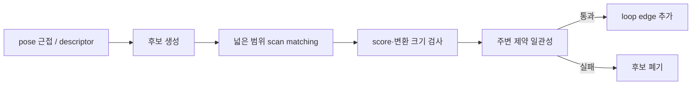

> **연재:** [목차](/posts/00-amr-series/) · 이전 → [09. Scan matching](/posts/09-amr-scan-matching/) · 다음 → [11. Costmap, inflation, A*](/posts/11-amr-costmap-astar/)

로봇이 한 바퀴를 돌아 출발점에 다시 왔는데 지도에서는 두 지점이 벌어져 있다면, 그 차이는 긴 시간 누적된 drift다. loop closure는 “지금 이곳이 과거의 그곳”이라는 제약을 추가하고 과거 pose 전체를 다시 조정한다.

## 모든 scan을 node로 만들지 않는다

scan rate가 10 Hz라면 긴 주행에서 node 수가 빠르게 늘어난다. key scan은 다음 조건 중 하나를 만족할 때만 선택할 수 있다.

- 일정 거리 이상 이동
- 일정 각도 이상 회전
- 일정 시간 경과
- 기존 submap과 matching 품질 저하

여러 key scan을 local submap으로 묶으면 매 scan을 전역 지도 전체에 맞추지 않아도 된다.

## 후보 생성과 검증을 분리한다

재방문 후보는 넓게 찾고, graph edge는 보수적으로 추가해야 한다.

잘못된 loop edge 하나는 graph 전체를 심하게 접을 수 있다. 높은 recall의 후보 생성과 높은 precision의 최종 검증을 같은 threshold 하나로 처리하지 않는다.

## pose graph의 구성

- node $\mathbf{x}_i$: key pose
- sequential edge: odometry 또는 scan matching의 상대 pose
- loop edge: 멀리 떨어진 시점 사이의 재방문 제약
- information matrix $\Omega_{ij}$: 제약의 신뢰도

edge 측정 $\mathbf{z}_{ij}$는 node $i$에서 본 node $j$의 상대 pose다. 현재 node 추정으로 예측한 상대 pose와 측정의 차이가 residual이 된다.

$$
\mathbf{e}_{ij}=
\operatorname{Log}\left(
Z_{ij}^{-1}X_i^{-1}X_j
\right)
$$

최적화 목적은 모든 edge의 가중 제곱합을 줄이는 것이다.

$$
\min_{\{\mathbf{x}_i\}}
\sum_{(i,j)}
\mathbf{e}_{ij}^T\Omega_{ij}\mathbf{e}_{ij}
$$

## 첫 node를 고정하는 이유

모든 pose를 같은 만큼 이동·회전해도 상대 제약은 변하지 않는다. 이 자유도를 gauge freedom이라 한다. 첫 node를 고정하거나 prior를 하나 두지 않으면 Hessian이 singular해질 수 있다.

## Gauss-Newton의 큰 흐름

현재 추정 주변에서 residual을 선형화한다.

$$
\mathbf{e}(\mathbf{x}+\Delta\mathbf{x})
\approx
\mathbf{e}(\mathbf{x})+J\Delta\mathbf{x}
$$

normal equation을 풀어 increment를 구하고 pose에 적용한다.

$$
H\Delta\mathbf{x}=-b
$$

SE(2) angle residual은 wrapping해야 하고, pose update를 단순 성분 덧셈으로 할지 manifold 연산으로 할지 일관되게 정해야 한다.

## 가장 작은 graph로 먼저 검증한다

실제 scan graph 전에 synthetic graph를 사용한다.

1. 정사각형을 도는 참 pose 생성
2. sequential edge에 작은 drift 추가
3. 마지막과 첫 node 사이 loop edge 추가
4. residual과 Jacobian을 수치미분과 비교
5. 최적화 전후 trajectory와 edge residual 비교
6. 잘못된 loop edge와 outlier 실험

scan matching이 틀린 상태에서 graph optimizer를 붙이면 front-end 오류와 back-end 오류를 구분하기 어렵다.

## 지도도 다시 만들어야 한다

pose graph 최적화는 trajectory만 움직인다. 기존에 누적해 둔 occupancy map은 과거의 틀린 pose로 그려졌다. 최적화된 key pose와 원본 scan을 사용해 지도를 재생성해야 loop closure 결과가 map에 반영된다.

## 현재 프로젝트 상태

key scan, loop 후보, SE(2) residual, pose graph optimizer는 구현 계획 단계다. 현재 통합 AMR이 완전한 SLAM을 수행한다고 주장하지 않는다. 이론 문서와 파일 책임, synthetic 검증 순서를 마련한 상태다.

## 참고

- [Grisetti et al. — A Tutorial on Graph-Based SLAM](https://doi.org/10.1109/MITS.2010.939925)
- [SLAM Toolbox 공식 문서](https://docs.ros.org/en/humble/p/slam_toolbox/)
- [프로젝트 SLAM 구현 계획](https://github.com/genie4youu/amr_robot_planning/blob/main/docs/stages/06_slam/02_SLAM_%EB%8B%A8%EA%B3%84%EB%B3%84_%EA%B5%AC%ED%98%84_%EB%B0%8F_%EA%B2%80%EC%A6%9D.md)

## 연재

[목차](/posts/00-amr-series/) · 이전 → [09. Scan matching](/posts/09-amr-scan-matching/) · 다음 → [11. Costmap, inflation, A*](/posts/11-amr-costmap-astar/)
