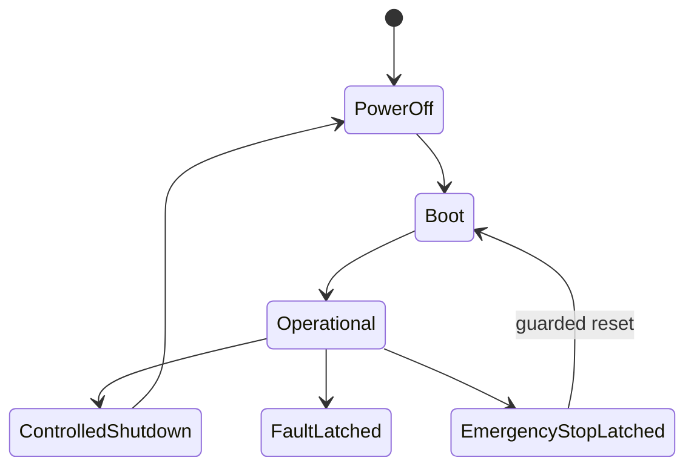

> **연재:** [목차](/posts/00-amr-series/) · 이전 → [14. DWA](/posts/14-amr-dwa/) · 다음 → [16. Safety gate와 recovery](/posts/16-amr-safety-recovery/)

planner는 경로를 만들고 controller는 속도를 계산하지만, “배터리가 부족할 때 배송을 계속할지”, “장애물 정지 뒤 언제 재계획할지”, “fault 해제만으로 자동 복귀해도 되는지”는 다른 종류의 결정이다. Stateflow supervisor가 이 이산적인 임무 흐름을 맡는다.

## 최상위 lifecycle



비상정지와 일반 fault를 Operational 내부의 한 상태로만 두지 않았다. 상위 상태로 빼면 Mission이 어느 하위 상태에 있든 공통 override를 적용할 수 있다.

## Operational 안의 병렬 영역

```text
Operational (parallel AND)
├─ Mission
│  Idle → AcceptJob → NavigatePickup → Loading
│  → NavigateDropoff → Unloading → ReturnHome
├─ Navigation
│  NavIdle → Planning → Tracking ↔ Replanning
│  → Recovery → NavFailed
├─ Energy
│  Normal → Low → Critical → Charging → Normal
├─ Safety
│  Safe → Slowdown → ProtectiveStop → Safe
└─ Health
   Healthy ↔ Degraded → HealthFault
```

Mission, Navigation, Energy, Safety, Health는 동시에 활성 상태를 가진다. 이 구조는 상태 조합을 하나의 거대한 flat state 목록으로 만드는 폭발을 피한다.

## 병렬은 독립을 뜻하지 않는다

병렬 region이 같은 출력을 쓰면 실행 순서에 따라 결과가 달라진다. 프로젝트의 설계 원칙은 다음과 같다.

- region은 자신의 mode/status만 기록
- 최종 command는 별도 arbitration이 한 번만 작성
- 공유 데이터는 single writer
- emergency/fault override는 상위 계층
- region 사이에는 event 또는 명시적 상태 계약 사용

## transition의 네 요소

각 transition에는 다음이 드러나야 한다.

1. trigger: 무엇이 발생했는가
2. guard: 지금 전이해도 되는가
3. action: 전이 순간 무엇을 한 번 실행하는가
4. timeout/retry: 끝나지 않을 때 어떻게 되는가

일회성 planner request를 `during` action에서 매 tick 생성하면 같은 요청이 반복된다. 진입 순간 한 번 내보낼 요청은 `entry` 또는 transition action에 둔다.

## temporal logic

- `after`: boot, loading, recovery timeout
- `duration`: fault condition이 일정 시간 유지됐는지 확인
- debounce: 순간 glitch 제거
- hysteresis: SOC나 sensor threshold 부근의 왕복 방지

현재 Industrial Supervisor는 boot와 작업 처리에 temporal logic을 사용한다. 복합 fault 우선순위, 일반 retry limit, debounce는 남은 확장이다.

## 단계적으로 키운 chart

첫 chart:

```text
Initializing → DriveStraight1 → TurnLeft → DriveStraight2 → Stopped
```

Scenario Lab:

```text
Initializing → Delivering → Completed
                    ├→ ObstacleStop → AvoidingObstacle
                    ├→ ReturnToCharger → Charging
                    └→ OffRouteStop → Rerouting
```

마지막으로 lifecycle과 5개 병렬 region을 가진 Industrial Supervisor를 만들었다. 작은 chart에서 command와 plant 연결을 확인한 뒤 fault와 병렬성을 추가했다.

## 검증한 상태 순서

- 장애물: `[0 1 2 3 1 8]`
- 저전압: `[0 1 4 5 1 8]`
- 경로이탈: `[0 1 6 7 1 8]`
- actuator fault: `FaultLatched` 유지
- E-stop: `EmergencyStopLatched → Boot → Operational`

nominal, obstacle, battery, health fault, E-stop 시나리오가 통과했고 chart lint와 unconnected port/line 검사도 통과했다.

## Stateflow의 경계

A*, scan matching, DWA rollout, plant dynamics는 chart 밖에 둔다. Stateflow는 이 알고리즘에 request를 보내고 status를 받아 다음 mode를 선택한다. 상태기계가 수치 알고리즘을 대체하는 것이 아니라 실패와 순서를 운영한다.

## 참고

- [MathWorks — State Hierarchy](https://www.mathworks.com/help/stateflow/ug/state-hierarchy.html)
- [MathWorks — Implement Parallel States](https://www.mathworks.com/help/stateflow/ug/utilize-parallel-state-execution.html)
- [MathWorks — Debouncing Logic](https://www.mathworks.com/help/stateflow/ug/debouncing-signals.html)
- [프로젝트 Industrial Stateflow 구조](https://github.com/genie4youu/amr_robot_planning/blob/main/docs/INDUSTRIAL_STATEFLOW_ARCHITECTURE.md)

## 연재

[목차](/posts/00-amr-series/) · 이전 → [14. DWA](/posts/14-amr-dwa/) · 다음 → [16. Safety gate와 recovery](/posts/16-amr-safety-recovery/)
