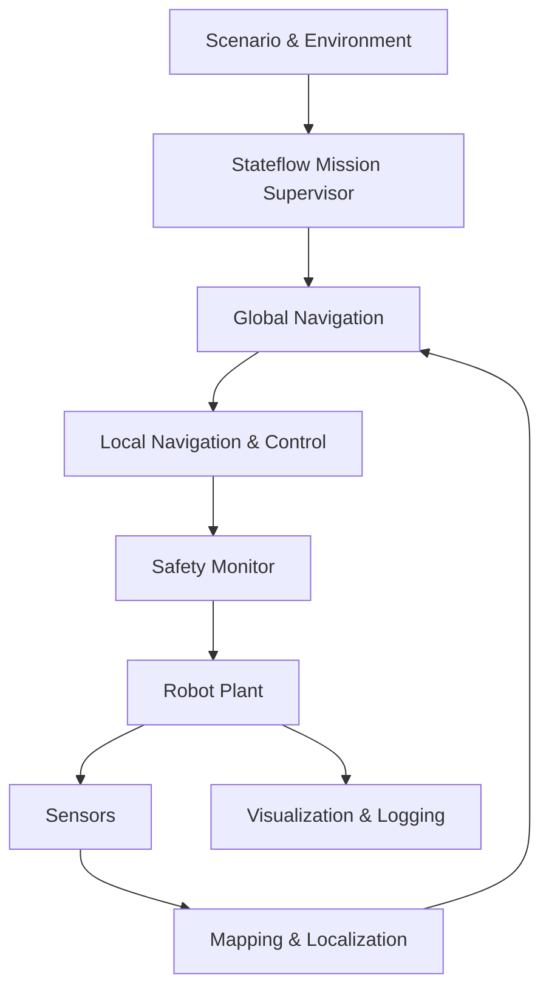

> **연재:** [목차](/posts/00-amr-series/) · 이전 → [16. Safety gate와 recovery](/posts/16-amr-safety-recovery/) · 다음 → [18. 시나리오와 회귀검증](/posts/18-amr-verification/)

개별 함수의 PASS가 통합 모델의 PASS를 보장하지 않는다. AMR 통합에서 어려운 것은 수식보다 초기화 순서, sample time, valid 전파, mode 전환과 command ownership이다.

## 최상위 subsystem



각 subsystem은 명시한 입력만 읽고 자신의 출력만 쓴다. 특히 최종 plant command의 writer는 safety arbitration 하나뿐이어야 한다.

## request/status 계약

Stateflow가 planner 내부를 직접 제어하지 않고 요청과 상태를 교환한다.

```text
NavigationRequest
  goal, requestId, cancel, valid

NavigationStatus
  state, reached, blocked, failed, reason
```

일회성 request에는 ID나 edge 의미가 필요하다. 단순 boolean을 여러 tick 유지하면 consumer가 같은 요청을 반복 실행할 수 있다.

센서와 pose도 값만 보내지 않는다.

```text
value + timestamp + frame + valid + covariance
```

`valid=false`인 값으로 planner를 실행하지 않고, 초기화되지 않은 map이나 pose에서도 command를 만들지 않는다.

## 초기화 순서

1. parameter와 map metadata
2. plant state
3. sensor queue와 timestamp
4. map/localization
5. planner/controller
6. Stateflow supervisor
7. logging

이 순서가 없으면 simulation 첫 step에 아직 준비되지 않은 pose나 map으로 nonzero command가 나갈 수 있다.

## 큰 기능은 하나씩 붙인다

프로젝트의 실제 통합 순서는 다음과 같았다.

1. Stateflow command + 차동구동 plant + logs
2. floor map + A* + collision gate
3. LiDAR + local costmap + DWA
4. Scenario Supervisor recovery
5. Industrial Supervisor의 20개 입력 adapter
6. 3개 환경 × 4개 scenario code 분리
7. playback UI와 결과 저장

새 subsystem을 붙일 때마다 이전 nominal scenario를 다시 실행했다. 실패하면 마지막으로 추가한 경계부터 확인했다.

## 만들어진 네 모델

| 모델 | 역할 |
| --- | --- |
| `amr_milestone01.slx` | Stateflow와 차동구동의 최소 수직 절편 |
| `amr_scenario_supervisor.slx` | 네 상황의 plant와 recovery |
| `amr_industrial_supervisor.slx` | lifecycle + 5개 병렬 영역 |
| `amr_integrated_delivery_system.slx` | Scenario Plant와 Industrial Supervisor 통합 |

통합 모델은 plant event를 20개의 Supervisor condition으로 바꾸고 lifecycle, Mission, Navigation, Energy, Safety, Health mode를 함께 기록한다.

## UI는 solver와 분리했다

simulation 중 GUI를 매 step 갱신하면 solver 실행과 rendering 시간이 얽힌다. 프로젝트 UI는 완료된 Simulink log를 공통 playback 구조체로 바꾸고 약 30 fps로 보간해 재생한다.

- Play/Pause/Reset
- 시간 탐색
- 0.25~4배속
- map, robot, LiDAR ray, path
- 동적 장애물, 배터리, Stateflow 상태

이 구조는 재현과 분석에 유리하지만 online co-simulation UI는 아니다.

## 모델 점검 순서

```text
load_system
→ model 구조 읽기
→ 작은 편집
→ 다시 읽기
→ model check
→ simulation
→ MATLAB assert
→ 실험 기록
```

smoke test에서는 update 성공, unconnected port, data size/type, zero command 정지, emergency zero, log 시간축을 확인했다.

## multirate의 남은 부채

현재 plant는 `0.01 s`, LiDAR는 `0.10 s` 등 서로 다른 논리 주기를 갖지만, 모든 경계에 명시적인 Rate Transition과 typed bus가 들어간 것은 아니다. scalar port adapter도 남아 있다.

다음 구조 개선은 다음과 같다.

- Supervisor adapter를 typed bus로 변경
- sensor/control 경계에 Rate Transition
- pose source variant: truth / odometry / localization
- map source variant: reference / built map
- fault injection variant

## 통합의 핵심

큰 모델은 블록 수로 완성되지 않는다. 초기화, 유효성, 시간, 책임과 실패 전파를 계약으로 만들고, 한 경계씩 연결해 이전 baseline을 계속 지키는 과정이 통합이다.

## 참고

- [MathWorks — Handle Rate Transitions](https://www.mathworks.com/help/simulink/ug/handle-rate-transitions.html)
- [프로젝트 시스템 아키텍처](https://github.com/genie4youu/amr_robot_planning/blob/main/docs/ARCHITECTURE.md)
- [프로젝트 통합 단계](https://github.com/genie4youu/amr_robot_planning/tree/main/docs/stages/11_system_integration)

## 연재

[목차](/posts/00-amr-series/) · 이전 → [16. Safety gate와 recovery](/posts/16-amr-safety-recovery/) · 다음 → [18. 시나리오와 회귀검증](/posts/18-amr-verification/)
