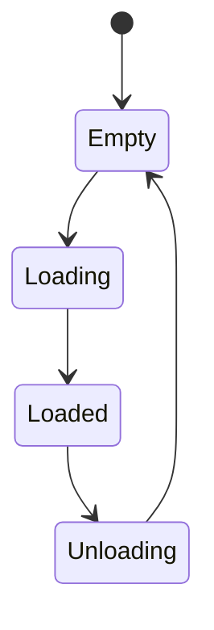

> **연재:** [목차](/posts/00-amr-series/) · 이전 → [18. 시나리오와 회귀검증](/posts/18-amr-verification/) · 다음 → [20. 프로젝트 결과](/posts/20-amr-project-results/)

목표 pose까지 가는 기능과 배송 임무를 수행하는 기능은 다르다. 배송에는 주문의 수명주기, payload, 남은 에너지, 충전과 재개 정책이 필요하다.

## 배송 데이터 계약

최소 주문 정보는 다음과 같다.

```text
orderId
pickupPose
dropoffPose
priority
payloadState
missionStatus
```

payload는 별도 상태를 가진다.



로봇이 pickup pose에 도착했다고 payload가 자동으로 실린 것은 아니다. loading 완료 event와 timeout을 분리해야 한다.

## 배터리 모델은 energy accounting부터

첫 모델은 전기화학 상세 모델보다 에너지 흐름을 명시하는 데 목적이 있다.

$$
E_{k+1}=
\operatorname{sat}\left(
E_k + (P_{charge}-P_{load})T_s
\right)
$$

load에는 다음을 넣을 수 있다.

- idle base power
- sensor/controller base load
- motion power
- acceleration 또는 wheel effort 영향

SOC는 가용 에너지로 정규화한다.

$$
\mathrm{SOC}=\frac{E-E_{\min}}{E_{\max}-E_{\min}}
$$

단순 Coulomb counting을 쓰든 energy integration을 쓰든 단위와 가정을 문서에 남겨야 한다.

## 임무 수락 전에 돌아올 수 있는가

현재 위치에서 pickup, dropoff, charger까지의 예상 비용과 안전 reserve를 비교한다.

```text
required energy
= current → pickup
+ pickup → dropoff
+ dropoff → charger
+ safety reserve
```

첫 버전은 경로 거리 기반 보수 추정으로 시작할 수 있다. 이후 회전, payload, 혼잡, 경사와 실제 소비 baseline을 반영한다.

## low와 critical에는 hysteresis가 필요하다

SOC가 threshold 부근에서 흔들리면 `Normal ↔ Low`가 반복될 수 있다. 진입과 복귀 threshold를 다르게 두거나 일정 시간 지속 조건을 둔다.

예:

```text
SOC < lowEnter     → Low
SOC > lowExit      → Normal
lowExit > lowEnter
```

critical에서는 새 임무를 받지 않고 충전을 우선하며, 이미 payload가 있다면 정책에 따라 배송 지속·안전 위치 정지·charger 복귀를 선택한다.

## docking은 두 단계다

1. global navigation으로 pre-dock pose 도착
2. dock-relative pose로 저속 정렬과 접근

전역 planner가 충전 접점까지 직접 밀어 넣게 하지 않는다. 마지막 구간은 속도와 허용 오차, 접촉 조건이 다르므로 fine docking controller로 분리한다.

Stateflow 확장 후보는 다음과 같다.

```text
AssessMission
→ ReturnToCharger
→ PreDock
→ FineDocking
→ Charging
→ MissionResume

FineDocking failure
→ DockRecovery
```

각 단계에는 timeout, retry, sensor dropout, 자세 오차와 contact 확인이 필요하다.

## 현재 프로젝트에서 한 것

Scenario Lab에는 low-battery event, charger 복귀, 90% 충전 후 배송 재개 흐름이 있다. 사무실 시나리오에서 최소 SOC `15.71%`를 지나 `74.45 s`에 임무를 완료했다. Industrial Supervisor에도 `Normal → Low → Critical → Charging → Normal` Energy region이 있다.

하지만 이것은 완성된 물리 battery/docking subsystem이 아니다.

아직 구현하지 않은 항목:

- motion power 기반 energy plant
- 거리 기반 mission acceptance
- order/payload typed contract
- pre-dock과 fine docking controller
- docking sensor noise/dropout
- docking retry와 contact 검증

즉 현재 결과는 **배터리 사건에 대한 임무 복구 흐름**을 검증한 것이며, 에너지 예측과 실제 도킹 제어는 다음 단계다.

## 이후 확장

- 다중 주문 스케줄링
- 다중 로봇 교통
- 자동문과 엘리베이터
- 사람 인식과 social navigation
- 실제 charger와 hardware interface

기본 배송 수직 절편의 회귀검증을 유지한 뒤 하나씩 추가해야 한다.

## 참고

- [프로젝트 배송 확장 설계](https://github.com/genie4youu/amr_robot_planning/tree/main/docs/stages/13_delivery_extensions)
- [프로젝트 Industrial Stateflow 구조](https://github.com/genie4youu/amr_robot_planning/blob/main/docs/INDUSTRIAL_STATEFLOW_ARCHITECTURE.md)

## 연재

[목차](/posts/00-amr-series/) · 이전 → [18. 시나리오와 회귀검증](/posts/18-amr-verification/) · 다음 → [20. 프로젝트 결과](/posts/20-amr-project-results/)
