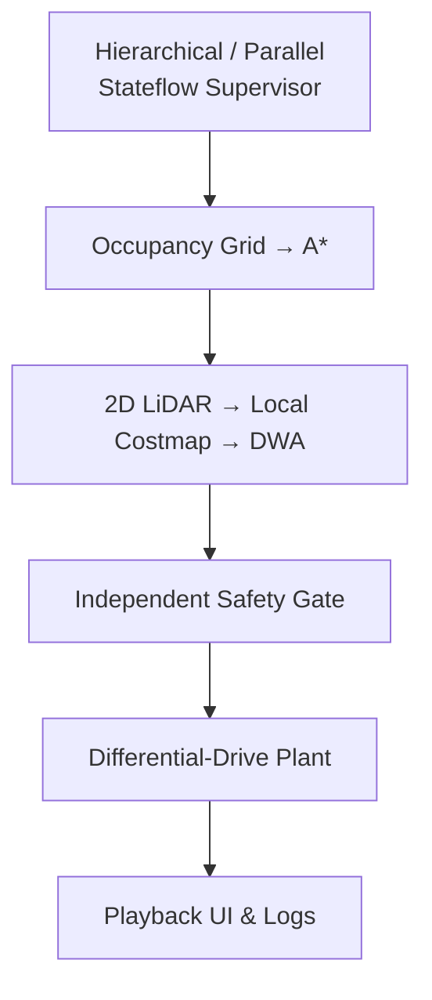

> **연재:** [목차](/posts/00-amr-series/) · 이전 → [19. 배송·배터리·도킹](/posts/19-amr-delivery-battery-docking/) · **코드:** [genie4youu/amr_robot_planning](https://github.com/genie4youu/amr_robot_planning)

이 프로젝트의 목표는 ROS 2, Robotics System Toolbox, Simulink Test 없이 기본 MATLAB, Simulink, Stateflow로 실내 배송 AMR의 핵심 수직 절편을 직접 연결하는 것이었다.

## 최종 연결 구조



## 구현한 것

- 차동구동 순·역운동학과 pose 적분
- 합성 floor map rasterization과 grid/world 변환
- 8-connected A*와 line-of-sight smoothing
- 270°, 91 beam의 2D LiDAR
- range noise, beam/frame dropout, delay, freshness watchdog
- LiDAR hit 기반 local costmap
- dynamic window, rollout, braking admissibility를 포함한 DWA
- planner 뒤의 독립 collision/safety gate
- log-odds mapping prototype
- `[x,y,theta]` pose EKF covariance/health prototype
- Stateflow lifecycle과 Mission, Navigation, Energy, Safety, Health 병렬 영역
- 환경·시나리오 선택형 MATLAB playback UI

## 검증 환경

실제 시설 도면이나 회사 자료가 아닌 자체 합성 지도 세 개를 만들었다.

- 사무실/배송 구역
- 병원 중앙 복도
- 물류 창고 랙 구역

각 환경에서 정상 배송, 돌발 장애물, 배터리 부족, 잘못된 길을 실행했다.

## 결과

| 검증 묶음 | 결과 |
| --- | --- |
| Scenario Lab 환경 행렬 | `12/12 PASS` |
| Integrated Plant/Supervisor 환경 행렬 | `12/12 PASS` |
| Industrial Supervisor | `5/5 PASS` |
| 모델 구조 검사 | healthy |
| 최종 위치 오차 | 약 `0.080 m` 이하 |

모든 주행 조합에서 `CollisionFree`, `LidarValidated`, `DwaValidated`가 true였다. 통합 lifecycle은 `[0 1 2 3 0]` 순서를 포함했고 `NavFailed` 없이 끝났다.

## 실행 방법

MATLAB에서 저장소 루트로 이동한다.

```matlab
projectRoot = setup_amr_project();
amrScenarioApp = launch_amr_scenario_ui("obstacle", "hospital");
```

단위검사:

```matlab
unitSummary = run_unit_verification();
```

3개 환경 × 4개 시나리오:

```matlab
environmentSummary = run_environment_matrix();
```

같은 12개 조합의 통합 Stateflow 모델:

```matlab
integratedSummary = run_integrated_environment_matrix();
```

## 만들며 폐기하거나 바꾼 접근

### DWA에 truth dynamic map을 직접 준 것

회피는 잘 됐지만 센서 FOV와 dropout이 무의미해졌다. local static window와 실제 LiDAR novel hit만 전달하도록 바꿨다.

### sample pose만 collision 검사한 것

sample 사이 선분이 벽을 통과할 수 있다. 모든 연속 pose 쌍의 선분까지 검사하도록 바꿨다.

### planner가 안전하다고 가정한 것

DWA collision check 뒤에도 독립 safety gate와 stale scan stop을 유지했다.

### 큰 모델을 한 번에 만든 것

오류 경계를 찾기 어려워 milestone, scenario, industrial, integrated 모델 순으로 수직 절편을 키웠다.

## 아직 하지 않은 것

- encoder/IMU bias와 slip을 포함한 폐루프 odometry
- scan matching, loop closure, pose graph 기반 완전한 SLAM
- log-odds map을 이용한 online global replan
- EKF health의 Industrial Supervisor 연결
- 일반 no-valid-candidate/oscillation recovery와 retry limit
- typed bus, data dictionary, 명시적 Rate Transition 정리
- 물리 battery model과 fine docking
- Monte Carlo, coverage, HIL, real-time deadline
- 실제 센서, 실제 로봇, 안전 인증

UI도 solver와 실시간 co-simulation하지 않고 완료된 로그를 재생한다.

## 가장 크게 배운 것

AMR의 난점은 A*나 DWA 하나의 수식보다 경계에 있었다.

- scan이 맞지만 오래됐다.
- path node는 안전하지만 선분은 벽을 지난다.
- planner는 회피하지만 정지할 거리가 부족하다.
- fault 입력은 사라졌지만 자동 재가동하면 안 된다.
- subsystem은 모두 PASS인데 초기화 순서가 틀렸다.

그래서 좌표·시간·valid·command ownership·상태 전이·회귀 기준을 알고리즘과 같은 수준의 설계 대상으로 다뤄야 했다.

## 다음 수직 절편

다음 구현 목표는 독립 prototype으로 남은 두 기능을 실제 주행 loop에 넣는 것이다.

```text
LiDAR → online log-odds costmap → global replan
wheel/IMU → pose EKF health → Stateflow Health region
```

이 두 경계를 연결하면 sensor uncertainty가 planning과 supervisor 결정까지 전달되는 더 현실적인 통합 시험을 만들 수 있다.

## 참고

- [프로젝트 README](https://github.com/genie4youu/amr_robot_planning)
- [검증 결과](https://github.com/genie4youu/amr_robot_planning/blob/main/docs/RESULTS.md)
- [시스템 아키텍처](https://github.com/genie4youu/amr_robot_planning/blob/main/docs/ARCHITECTURE.md)
- [공개 출처 목록](https://github.com/genie4youu/amr_robot_planning/blob/main/docs/references/%EA%B3%B5%EA%B0%9C_%EC%B6%9C%EC%B2%98.md)

## 연재

[목차](/posts/00-amr-series/) · 이전 → [19. 배송·배터리·도킹](/posts/19-amr-delivery-battery-docking/)
