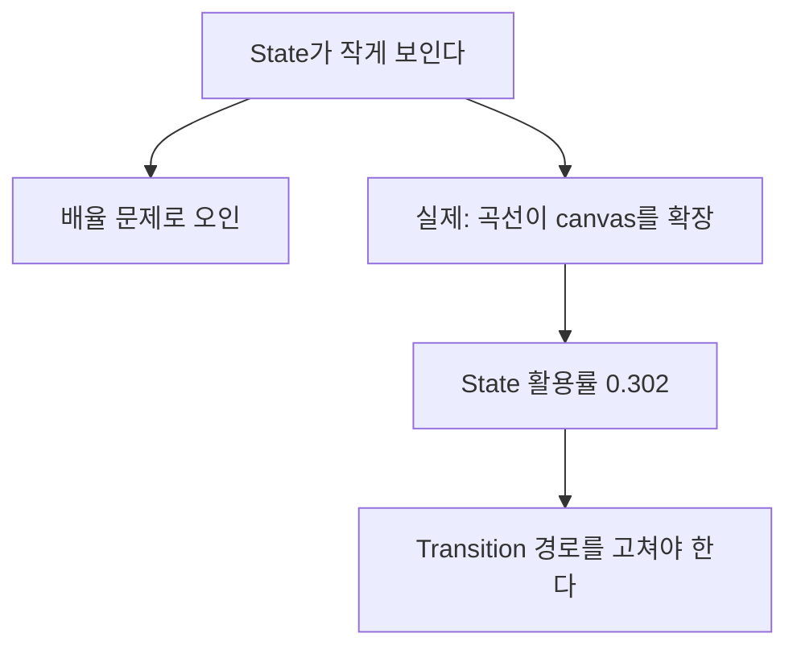
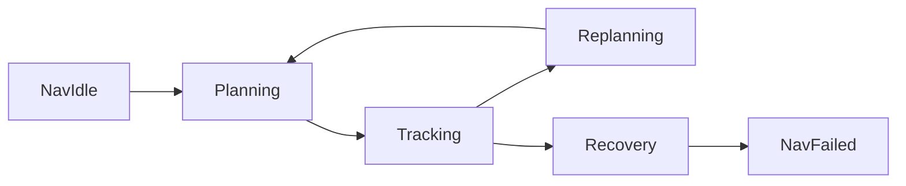

> **기준:** MATLAB R2025b 실측 · [genie4youu/amr_robot_planning](https://github.com/genie4youu/amr_robot_planning) / 확인일 2026-07-31
> **시리즈:** [목차](/posts/00-sflayout-series/) · 다음 → [02. 속성 결합](/posts/02-sflayout-api-coupling/)

---

## 1. 자동 좌표를 최종으로 보지 않는다

API로 State와 Transition을 만들면 좌표가 자동으로 붙는다. 차트는 열리고 시뮬레이션도 돈다. 그러나 그 좌표는 **논리 객체를 놓기 위한 값이지 사람이 읽기 위한 값이 아니다.**

`Auto Arrange` 도 초기 정렬 보조 수단이다. 간격과 흐름 방향, Transition 경로 기준을 대신하지 못한다.

## 2. 검사기가 잡은 위반 32건

Mission Supervisor 논리 완성 직후 검사한 결과다.

| 위반 종류 | 건수 |
| --- | ---: |
| Transition 라벨이 State를 침범 | 13 |
| Transition 라벨끼리 겹침 | 7 |
| 무관한 State를 관통하는 경로 | 11 |
| Source endpoint 간격 부족 | 1 |
| **합계** | **32** |

수정은 한 번에 되지 않았다. **32 → 12 → 7 → 5 → 0** 으로 줄었다. 한 곳을 고치면 다른 곳이 새로 걸리기 때문이다. State를 옮기면 그 State에 붙은 Transition 경로가 전부 바뀌고, 경로가 바뀌면 라벨 위치가 다시 어긋난다.

> **레이아웃은 국소 수정이 안 된다.** 한 객체를 옮기면 인접 객체의 판정이 뒤집힌다. 그래서 손으로 고치는 대신 규칙을 정의하고 전체를 다시 배치한 뒤 검사하는 편이 수렴이 빠르다.
{: .prompt-tip }

## 3. 진짜 원인은 배율이 아니라 경로 geometry

처음에는 화면 배율 문제로 보였다. 차트를 열면 State가 작게 보였기 때문이다. 실제 좌표를 측정하니 원인이 달랐다.

NavigationRegion 실측값이다.

| 항목 | 값 |
| --- | --- |
| State bounding box | 약 1490 × 540 |
| 전체 그래픽 bounding box | 약 2220 × 1200 |
| **State 활용률** | **0.302** |

방향별 확장은 왼쪽 154, 오른쪽 576, 위 363, 아래 297 px 였다.

즉 **State가 차지하는 면적은 전체의 30%뿐이고 나머지 70%는 Transition 곡선이 밀어낸 여백**이다. 화면에 맞추면 State가 작아지는 것이 당연하다. 배율을 조정해도 비율은 그대로다.

## 4. 검사기가 문제를 통과시킨 이유

기존 검사기는 외곽 lane을 **최소 40 px** 만 검사했다. 최대 이격, canvas 활용률, 좌우 균형은 보지 않았다.

| 검사 항목 | 기존 | 결과 |
| --- | --- | --- |
| 외곽 lane 최소 간격 | 40 px 이상 | 멀리 보낼수록 잘 통과 |
| 외곽 lane 최대 간격 | 없음 | 무제한 우회 허용 |
| canvas 활용률 | 없음 | 여백이 아무리 커도 통과 |
| 좌우 균형 | 없음 | 한쪽으로 쏠려도 통과 |

**최소값만 보는 검사는 과도한 우회를 오히려 권장한다.** 멀리 보낼수록 다른 객체와 안 부딪히므로 통과하기 쉬워진다. 자동화가 문제를 만들고 검사기가 그것을 통과시킨 구조였다.

추가한 검사 기준이다.

| 항목 | 임계값 |
| --- | --- |
| 외곽 lane 최대 | 180 px |
| Subviewer State bounding-box 활용률 | 최소 0.50 |
| 방향별 canvas 확장 최대 | 180 px |
| 양방향 경로 envelope 이탈 최대 | 120 px |
| detour ratio 최대 | 2.20 |

## 5. 시각 구조 규칙

배치 규칙 자체는 단순하게 잡았다.

- 주 동작 흐름은 **왼쪽에서 오른쪽**으로 읽히게 둔다.
- **정상 동작 State는 위쪽 행**에 둔다.
- **재계획, 복구, 중단, 실패 State는 아래쪽 행**에 둔다.

NavigationRegion에 적용한 결과다.

| State | 위치 |
| --- | --- |
| NavIdle | 정상 상단 왼쪽 |
| Planning | 정상 상단 중앙 |
| Tracking | 정상 상단 오른쪽 |
| NavFailed | 실패 하단 왼쪽 |
| Recovery | 복구 하단 중앙 |
| Replanning | Tracking 바로 아래 |

Replanning을 Tracking 바로 아래 둔 것은 그 둘 사이 Transition이 가장 자주 오가기 때문이다. 논리적으로 가까운 State를 물리적으로도 가깝게 두면 경로가 짧아지고 곡선이 canvas를 덜 밀어낸다.

## ⚠️ 주의

- **임계값 숫자는 이 차트에 맞춰 정한 것이다.** State가 더 크거나 Transition 밀도가 다르면 다시 잡아야 한다. 옮길 만한 것은 숫자가 아니라 "최소만 보면 우회를 권장하게 된다"는 관찰이다.
- 활용률 0.302는 NavigationRegion 실측이다. 다른 Region은 값이 다르다.
- 배치를 바꾸면 **암시적 Transition 평가 순서가 달라질 수 있다.** 개수 비교로는 안 잡힌다. 이 문제는 [05편](/posts/05-sflayout-inspector-idempotence/)에서 다룬다.

## 📌 정리

- 자동 배치 좌표는 논리를 놓기 위한 값이지 읽기 위한 값이 아니다.
- 위반 32건은 라벨 침범 13, 라벨 겹침 7, State 관통 11, 간격 1이었다.
- **State가 작게 보인 원인은 배율이 아니라 Transition 곡선이 canvas를 확장한 것**이다. 활용률 0.302.
- **최소 간격만 검사하면 과도한 우회가 통과한다.** 최대값과 활용률을 함께 봐야 한다.
- 정상 흐름은 위, 복구와 실패는 아래로 분리하는 것이 규칙의 뼈대다.

---

**시리즈:** [목차](/posts/00-sflayout-series/) · 다음 → [02. Transition 그래픽 속성은 독립이 아니다](/posts/02-sflayout-api-coupling/)

## 참고

- [Stateflow.Transition](https://www.mathworks.com/help/stateflow/api/stateflow.transition.html) · [Stateflow.State](https://www.mathworks.com/help/stateflow/api/stateflow.state.html)
- [Transition Between Operating Modes](https://www.mathworks.com/help/stateflow/ug/transitions.html)
- [MAB Modeling Guidelines](https://www.mathworks.com/help/simulink/mdl_gd/maab/maab-guidelines.html)
