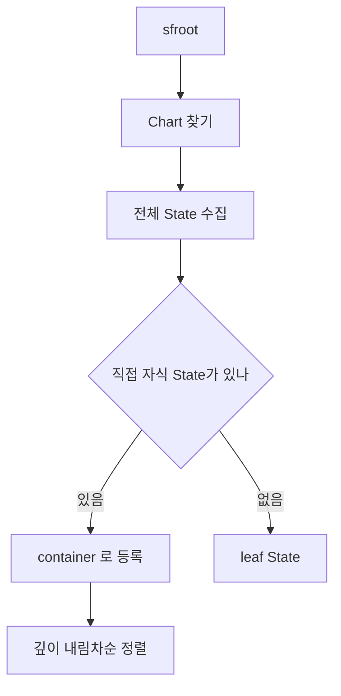
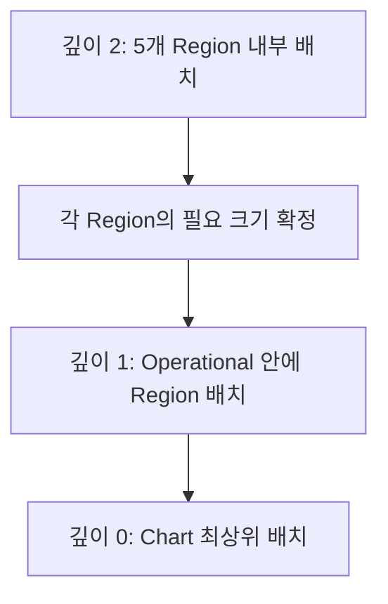

> **기준:** MATLAB R2025b 실측 · [genie4youu/amr_robot_planning](https://github.com/genie4youu/amr_robot_planning) / 확인일 2026-07-31
> **시리즈:** [목차](/posts/00-sflayout-series/) · 이전 → [02. 속성 결합](/posts/02-sflayout-api-coupling/) · 다음 → [04. 페이지와 배치 영역](/posts/04-sflayout-page-vs-layout/)

---

## 1. 하드코딩한 목록은 낡는다

첫 레이아웃 스크립트는 Region 이름을 목록으로 들고 있었다.

```matlab
regions = ["MissionRegion" "NavigationRegion" "SafetyRegion" ...];
```

이 방식의 문제는 명확하다.

| 상황 | 결과 |
| --- | --- |
| Region 추가 | 목록에 안 넣으면 배치 안 됨. 에러도 안 남 |
| Region 이름 변경 | 조용히 건너뜀 |
| 깊이 3 Subchart 생김 | 구조 자체가 대응 못 함 |

**빠뜨려도 에러가 나지 않는다는 것**이 가장 나쁘다. 새 State가 자동 좌표를 가진 채 통과한다.

## 2. 부모 관계를 재귀 탐색한다

이름 목록 대신 계층을 직접 훑는다. `sfroot` 에서 시작해 Chart를 찾고, 각 State의 부모 관계를 따라 내려간다.

```matlab
rt    = sfroot;
chart = find(rt, "-isa", "Stateflow.Chart", Name = chartName);
states = find(chart, "-isa", "Stateflow.State");
```

여기서 **container** 를 판정한다. 직접 자식 State를 가진 객체가 container다. Chart 자체, Composite State, Subchart가 여기 해당한다. State의 `IsSubchart` 속성으로 Subchart 여부를 안다.

찾아낸 결과다.

| 순서 | 경로 | 종류 | 깊이 | 직접 State | 직접 Transition |
| ---: | --- | --- | ---: | ---: | ---: |
| 1 | `MissionSupervisor/Operational/MissionRegion` | Subchart | 2 | 9 | 18 |
| 2 | `MissionSupervisor/Operational/NavigationRegion` | Subchart | 2 | 6 | 14 |
| 3 | `MissionSupervisor/Operational/SafetyRegion` | Subchart | 2 | 3 | 6 |
| 4 | `MissionSupervisor/Operational/HealthRegion` | Subchart | 2 | 3 | 6 |
| 5 | `MissionSupervisor/Operational/EnergyRegion` | Subchart | 2 | 5 | 8 |
| 6 | `MissionSupervisor/Operational` | Composite State | 1 | 5 | 0 |
| 7 | `MissionSupervisor` | Chart | 0 | 6 | 15 |

7개 container, State 37개, Transition 67개다. 이름을 하나도 적지 않고 얻었다.



## 3. 깊은 곳부터 배치한다

표의 순서가 깊이 내림차순인 것은 우연이 아니다. **가장 깊은 Subchart부터 처리한다.**

이유는 크기 때문이다. 자식 Region의 내용을 배치해야 그 Region이 실제로 얼마나 커야 하는지 정해진다. 부모를 먼저 배치하면 자식이 넘치거나 남는다.



각 scope에서 순서는 다음과 같다.

1. 직접 자식 State를 배치한다.
2. **그 scope의 Transition을 다시 라우팅한다.**

State를 옮기면 그 State에 붙은 Transition 경로가 전부 무효가 되므로, State 배치 직후에 같은 scope의 Transition을 다시 잡아야 한다. 전체 State를 다 옮긴 뒤 마지막에 한 번에 라우팅하면 중간 상태가 검사에 걸린다.

## 4. 안 옮긴 State가 있어도 정상이다

v3 결과에서 최상위 State 좌표는 전후가 동일했다.

| 경로 | 변경 전 | 변경 후 |
| --- | --- | --- |
| `MissionSupervisor/PowerOff` | `[80 306 600 300]` | `[80 306 600 300]` |
| `MissionSupervisor/Boot` | `[820 306 600 300]` | `[820 306 600 300]` |
| `MissionSupervisor/Operational` | `[1600 306 1900 1120]` | `[1600 306 1900 1120]` |
| `MissionSupervisor/FaultLatched` | `[2450 1976 1100 360]` | `[2450 1976 1100 360]` |

**검사 누락이 아니라 기존 위치가 새 품질 기준을 이미 만족한 결과다.** 배치기가 조건을 만족하는 좌표를 굳이 흔들지 않는다.

이 구분은 중요하다. 좌표가 안 바뀌었을 때 "처리가 안 된 것"인지 "처리했는데 그대로인 것"인지 구별할 수 없으면 디버깅이 안 된다. 그래서 **레이아웃 스크립트가 모든 그래픽 객체를 다뤘는지를 따로 검사**하고, 다루지 못한 객체가 있으면 실패시킨다.

## 5. 논리를 건드리지 않았음을 증명한다

배치 전에 논리 서명을 캡처하고, 배치 후 다시 비교한다.

| 객체 | 기록하는 값 |
| --- | --- |
| State | 계층 경로, 이름, LabelString과 액션, Decomposition, 부모 |
| Transition | Source, Destination, LabelString, ExecutionOrder, 화면 전이 번호 |
| Data | 이름, Scope, Type, Port, 초기값 |
| Event | 이름, Scope, Trigger |

**각 State에서 나가는 Transition의 평가 순서를 순서 있는 목록으로 저장한다.** 그래픽 포트 위치를 바꾸면 암시적 전이 순서가 달라질 수 있어서, Transition 개수가 같다는 것은 동등성 증거가 되지 않는다.

v3 결과에서 확인된 보존 항목이다.

- State/Transition SSID, 이름, LabelString
- Source/Destination, 계층, decomposition, State type
- **모든 ExecutionOrder와 outgoing 순서**
- Data/Event/Message/Function 서명

저장하고 다시 연 전후로 전부 동일했다.

## 6. 남긴 예외 하나

v3 최종 검사는 hard 0, exact routing 0, layout-quality 0, advisory 0 이다. 다만 검토 예외를 하나 고정했다.

T60과 T54 사이에 path 대 path 경고가 1건 남는다. **Stateflow spline을 두 선분으로 근사할 때만 보이는 경고**이고, Junction 없이는 제거할 수 없는 루트 장애물 연결 때문이다.

> 예외를 없애는 척하지 않고 예외로 기록했다. 검사기를 느슨하게 고쳐서 통과시키면 같은 종류의 진짜 문제도 함께 통과한다.
{: .prompt-warning }

## ⚠️ 주의

- **재귀 탐색은 container를 찾을 뿐 배치 규칙을 대신하지 않는다.** 각 scope에서 무엇을 위에 두고 무엇을 아래에 둘지는 여전히 설계 판단이다.
- 여기 표의 State 수와 Transition 수는 **직접 자식 기준**이다. 하위 Subchart 내용은 포함하지 않는다.
- Atomic Subchart는 일반 Subchart와 subviewer 취급이 다르다. 이 프로젝트 차트에는 없어서 확인하지 않았다.

## 📌 정리

- Region 이름 하드코딩은 **빠뜨려도 에러가 안 나서** 위험하다.
- 부모 관계를 재귀 탐색해 container 7개를 이름 없이 찾았다.
- **깊은 Subchart부터 배치한다.** 자식 크기가 정해져야 부모 크기가 정해진다.
- 각 scope에서 State 배치 직후 같은 scope의 Transition을 다시 라우팅한다.
- 좌표가 안 바뀐 것과 처리 안 된 것은 다르다. **전 객체를 다뤘는지 따로 검사**한다.
- 논리 보존 증명에는 **outgoing Transition 순서**가 반드시 들어간다. 개수 비교로는 부족하다.

---

**시리즈:** [목차](/posts/00-sflayout-series/) · 이전 → [02. 속성 결합](/posts/02-sflayout-api-coupling/) · 다음 → [04. `subviewS.pos` 는 배치 영역이 아니다](/posts/04-sflayout-page-vs-layout/)

## 참고

- [Stateflow.State](https://www.mathworks.com/help/stateflow/api/stateflow.state.html)
- [sfroot](https://www.mathworks.com/help/stateflow/ref/sfroot.html)
- [Overview of the Stateflow API](https://www.mathworks.com/help/stateflow/api/overview-of-the-stateflow-api.html)
- [Stateflow.AtomicSubchart](https://www.mathworks.com/help/stateflow/api/stateflow.atomicsubchart.html)
