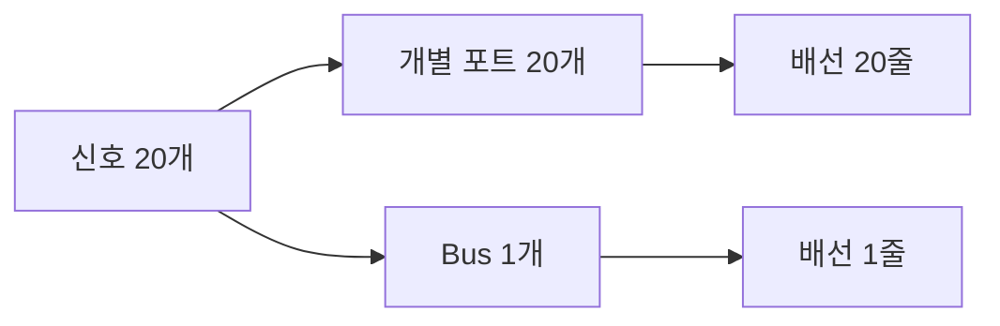
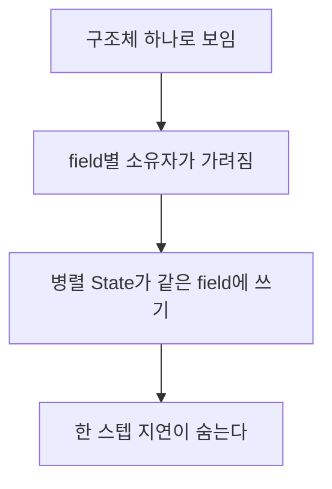

> **기준:** MathWorks 공개 문서 · R2025b / 확인일 2026-07-31
> **시리즈:** [목차](/posts/00-stateflow-series/) · 이전 → [14. Simulation Data Inspector](/posts/14-sf-data-inspector/)

---

## 1. 무엇인가

Stateflow bus는 `Simulink.Bus` 객체로 정의하는 데이터 타입이다. 문서 표현은 다음과 같다.

> *"A Stateflow bus is a data type that you define from a `Simulink.Bus` object."*

크기와 타입이 서로 다른 데이터를 하나로 묶는다. 묶인 각 항목을 **field** 라고 부른다. field는 개별 신호, mux 신호, 벡터, 그리고 다른 구조체(substructure)가 될 수 있다.

## 2. 왜 쓰나

Chart 입출력이 늘어날수록 배선이 늘고 순서 실수가 생긴다.

| | 개별 포트 | Bus |
| --- | --- | --- |
| 신호 20개 전달 | 포트 20개 | 포트 1개 |
| 항목 추가 | 포트 추가와 배선 | Bus 객체만 수정 |
| 이름으로 접근 | 불가 | dot notation |
| 순서 실수 | 생긴다 | 이름으로 쓰므로 없다 |



## 3. 만드는 순서

1. base workspace에 `Simulink.Bus` 객체를 만든다.
2. Chart에 Data를 추가한다.
3. `Scope` 를 정한다. Input, Output, Local, Parameter 등이다.
4. `Type` 을 그 Bus 객체로 지정한다.

Chart는 `inbus` 로 받고 `outbus` 로 내보내는 식으로 쓴다. 둘 다 타입을 같은 Bus 객체에서 가져온다.

## 4. 비가상 버스만 지원한다

문서에 명시돼 있다.

> *"Stateflow charts support only nonvirtual buses."*

가상 버스를 입력으로 넣으면 Stateflow가 입력 포트에서 비가상으로 변환한다. 다만 이때 조건이 붙는다. **`Type` 을 상속으로 두면 안 되고 `Bus: <객체명>` 형태로 직접 지정해야 한다.**

> 모델의 다른 블록 사이에서는 잘 흐르던 버스가 Chart 입력에서만 막힌다면 이 지점을 먼저 본다. 가상 버스는 배선 묶음일 뿐이라 실제 메모리 배치가 없고, Chart는 그것을 필요로 한다.
{: .prompt-warning }

## 5. dot notation

부모 구조체 이름으로 시작해 계층 경로를 따라 내려간다.

```
inbus.pose.x
inbus.status.fault
outbus.cmd.velocity
```

첫 부분이 부모 구조체이고 이후가 자식이다. substructure도 같은 방식으로 파고든다.

## 6. 초기화 제약

문서가 명시한 제약이다.

| 상황 | 초기화 |
| --- | --- |
| HDL 코드 생성 모델 | 불가 |
| Scope가 Input, Constant, Parameter, Data Store Memory | 불가 |
| unbounded bus | 미지원 |
| string을 포함한 bus | 미지원 |

Scope 제약은 생각해보면 자연스럽다. Input과 Parameter는 값이 밖에서 오므로 Chart가 초기값을 정할 자리가 아니다.

## 7. 실행 순서와 함께 봐야 한다

Bus는 여러 값을 한 덩어리로 옮기므로 **누가 언제 쓰는가**가 더 중요해진다.

병렬 State가 같은 구조체의 field를 쓰면 [10편](/posts/10-parallel-order/)의 실행 순서 문제가 그대로 재현된다. 그런데 묶여 있어서 **오히려 눈에 덜 띈다.** 개별 변수 20개가 보이면 누가 쓰는지 추적하게 되지만, 구조체 하나로 보이면 그 안에서 field별로 소유자가 다르다는 사실이 가려진다.



field 단위로 소유자를 하나로 좁히는 편이 안전하다. 이는 [MAB jc_0722](https://www.mathworks.com/help/simulink/mdl_gd/maab/jc_0722localdatadefinitioninparallelstates.html)의 병렬 State 지역 데이터 원칙과 같은 방향이다.

확인 방법은 [14편](/posts/14-sf-data-inspector/)과 같다. field 값의 변경 시각과 State 전이 시각을 같은 시간축에 놓고 본다.

## ⚠️ 주의

- **dot notation의 세부 규칙은 별도 문서에 있다.** 배열 인덱싱과의 조합, 대입 제약은 [Index and Assign Values to Stateflow Structures](https://www.mathworks.com/help/stateflow/ug/structure-operations.html) 에서 확인한다.
- 코드 생성 시 구조체가 C로 어떻게 나오는지는 이 글에서 확인하지 않았다. 임베디드 타깃에서는 메모리 배치와 정렬을 따로 봐야 한다.
- 초기화 제약 목록은 문서에 명시된 항목만 옮긴 것이다. 릴리스가 바뀌면 늘거나 줄 수 있다.

## 📌 정리

- Stateflow bus는 `Simulink.Bus` 로 정의하는 데이터 타입이고, 항목을 **field** 라고 부른다.
- 포트 수를 줄이고 **이름으로 접근**하게 해준다. 순서 실수가 사라진다.
- **비가상 버스만 지원한다.** 가상 버스 입력은 `Type` 을 `Bus: <객체명>` 으로 직접 지정해야 변환된다.
- 초기화는 HDL 모델, Input과 Parameter 계열 Scope, unbounded, string 포함 bus에서 안 된다.
- **묶이면 소유자가 가려진다.** field 단위로 쓰는 State를 하나로 좁힌다.

---

**시리즈:** [목차](/posts/00-stateflow-series/) · 이전 → [14. 결과 관측 — Simulation Data Inspector](/posts/14-sf-data-inspector/)

## 참고

- [Access Bus Signals Through Stateflow Structures](https://www.mathworks.com/help/stateflow/ug/about-stateflow-structures.html)
- [Bus Signals](https://www.mathworks.com/help/stateflow/bus-signals.html)
- [Index and Assign Values to Stateflow Structures](https://www.mathworks.com/help/stateflow/ug/structure-operations.html)
- [Simulink.Bus](https://www.mathworks.com/help/simulink/slref/simulink.bus.html)
- [MAB jc_0722 — Local data definition in parallel states](https://www.mathworks.com/help/simulink/mdl_gd/maab/jc_0722localdatadefinitioninparallelstates.html)
