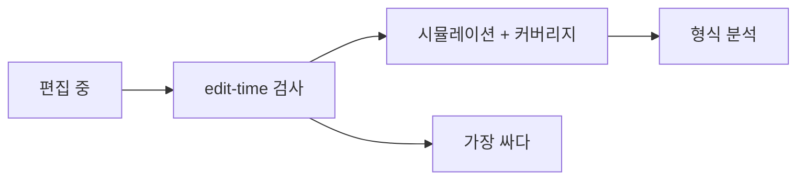
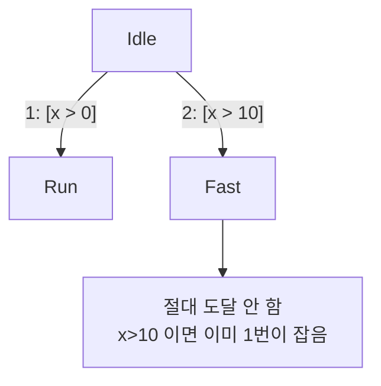

> **기준:** MathWorks 공개 문서 · R2025b / 확인일 2026-07-31
> **시리즈:** [목차](/posts/00-stateflow-series/) · 이전 → [17. History Junction](/posts/17-sf-history-junction/) · 다음 → [19. 관측 도구 나머지](/posts/19-sf-sequence-viewer/)

---

## 1. 가장 싼 검사

Stateflow 편집기는 **편집 중에** 문제를 표시한다. 시뮬레이션도 커버리지도 필요 없고 저장 전에 답이 나온다.

비용이 낮다는 것은 **자주 돌아간다**는 뜻이고, 자주 돌아가는 검사가 실제로 결함을 잡는다. 뒤로 갈수록 정확해지지만 그만큼 늦게 돈다.

## 2. 잡히는 것

문서가 예로 드는 항목이다.

| 항목 | 무엇 |
| --- | --- |
| **매달린 Transition** (dangling transition) | 도착지가 없는 Transition |
| **Transition shadowing** | 앞의 조건에 가려 **절대 평가되지 않는** 경로 |
| **도달 불가 State** | 어떤 경로로도 들어갈 수 없는 State |

가운데 항목이 실무에서 값어치가 크다. [09편](/posts/09-condition-action/)과 [05편](/posts/05-junction/)에서 본 대로 Transition 은 **실행 순서대로 평가**된다. 앞 경로의 조건이 뒤 경로를 완전히 덮으면 뒤는 죽은 코드다.

이런 것은 시뮬레이션으로 잘 안 드러난다. **에러가 안 나고 그냥 그 State 에 안 갈 뿐**이다.

## 3. 진단 수준을 조절할 수 있다

각 검사는 설정 파라미터로 수준을 정한다.

| 수준 | 동작 |
| --- | --- |
| `error` | 오류로 처리 |
| `warning` | 경고 |
| `none` | 표시하지 않음 |

예를 들어 `Unreachable execution path` 를 `none` 으로 두면 편집기가 **매달린 Transition, Transition shadowing, 도달 불가 State 를 강조하지 않는다.** 세 가지가 한 파라미터에 묶여 있다.

> **끄지 않는 편이 낫다.** 경고가 시끄러워서 끄고 싶어지는 순간이 오는데, 그 셋은 전부 설계 실수의 신호다. 시끄럽다면 검사를 끌 것이 아니라 그 경고들을 없애는 쪽이 맞다.
{: .prompt-danger }

이것은 [05편](/posts/05-sflayout-inspector-idempotence/)에서 레이아웃 검사기를 완화하지 않고 예외로 기록한 것과 같은 판단이다. 검사를 느슨하게 하면 그 항목 전체가 무력해진다.

## 4. 어디까지 답하는가

edit-time 검사는 **구조**를 본다. 의미는 안 본다.

| 묻는 것 | edit-time |
| --- | --- |
| 도착지 없는 Transition 이 있나 | 답한다 |
| 절대 평가 안 되는 경로가 있나 | 답한다 |
| 조건식이 요구사항과 맞나 | **답 못 한다** |
| 실제 입력 범위에서 도달 가능한가 | **답 못 한다** |

세 번째는 사람이, 네 번째는 [22편](/posts/22-sf-formal-verification/)에서 다룰 형식 분석이 답한다. edit-time 이 통과했다는 것은 **문법적으로 죽은 곳이 없다**는 뜻이지 로직이 옳다는 뜻이 아니다.

모델 전체 규칙 준수는 Model Advisor 가 따로 본다. edit-time 과 층이 다르다.

## ⚠️ 주의

- **검사 항목의 전체 목록과 파라미터 이름은 릴리스마다 다르다.** 이 글은 문서가 예로 든 항목만 옮겼다. 실제 프로젝트에서는 설정 창을 열어 전수 확인한다.
- 편집기 강조는 **열려 있는 Chart** 기준이다. 안 열어본 Chart 는 표시되지 않으므로, 모델 전체 점검은 Model Advisor 나 스크립트로 따로 돌린다.
- `none` 으로 꺼둔 항목은 나중에 켜면 한꺼번에 쏟아진다. **처음부터 켜두는 편이 싸다.**

## 📌 정리

- edit-time 검사는 **시뮬레이션 전에** 도는 가장 싼 검사다.
- 매달린 Transition, **Transition shadowing**, 도달 불가 State 를 잡는다.
- shadowing 은 **에러 없이 그냥 그 State 에 안 가는** 형태라 시뮬레이션으로 잘 안 드러난다.
- 진단 수준은 `error` · `warning` · `none` 이고, `Unreachable execution path` 하나에 세 항목이 묶여 있다.
- **끄지 말고 경고를 없앤다.** 검사를 완화하면 그 항목 전체가 무력해진다.
- 구조는 보지만 **의미는 못 본다.** 조건식이 요구사항과 맞는지는 다른 층이 답한다.

---

**시리즈:** [목차](/posts/00-stateflow-series/) · 이전 → [17. History Junction](/posts/17-sf-history-junction/) · 다음 → [19. Sequence Viewer와 애니메이션](/posts/19-sf-sequence-viewer/)

## 참고

- [Detect Modeling Errors During Edit Time](https://www.mathworks.com/help/stateflow/ug/stateflow-edit-time-checks.html)
- [How Stateflow Objects Interact During Execution](https://www.mathworks.com/help/stateflow/ug/how-chart-constructs-interact-during-execution.html)
- [Simulink Model Advisor](https://www.mathworks.com/help/simulink/slref/simulink-model-advisor.html)
- [MAB Modeling Guidelines](https://www.mathworks.com/help/simulink/mdl_gd/maab/maab-guidelines.html)
