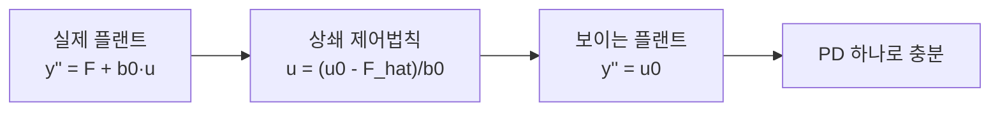
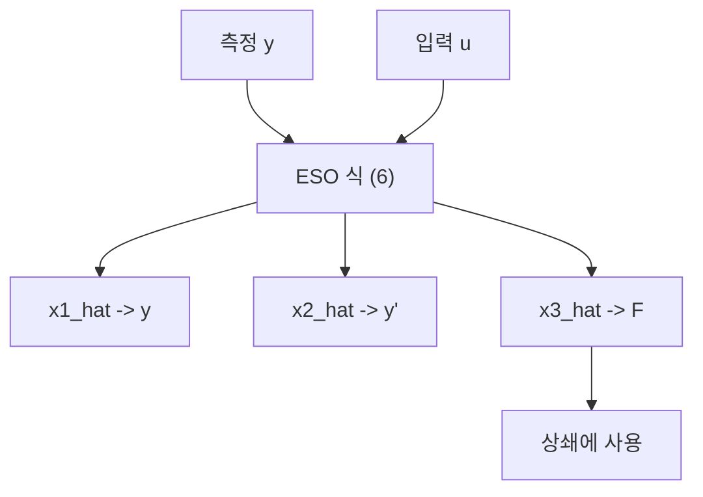

> **기준 출처:** Han, *From PID to ADRC*, IEEE TIE 2009 · Herbst & Madoński, *ADRC: From Principles to Practice* (Birkhäuser, CC BY 4.0) / 확인일 2026-07-31
> **시리즈:** [목차](/posts/00-adrc-series/) · 이전 → [18. 검증](/posts/18-verification/) · 다음 → [20. 부록 B](/posts/20-adrc-derivation-bandwidth-gains/)

---

## 0. 이 글이 채우는 자리

[02편](/posts/02-total-disturbance/)부터 [10편](/posts/10-adrc-vs-pid/)까지는 결과 공식을 쓰고 거동을 설명했다. 유도는 건너뛰었다. 이 부록 3편은 그 자리를 채운다. 필요한 배경은 고등 미적분과 라플라스 변환 기초뿐이다.

| 부록 | 다루는 것 |
| --- | --- |
| **19편 (이 글)** | 총외란 상쇄가 왜 적분기를 만드나 · ESO가 왜 맞히나 |
| [20편](/posts/20-adrc-derivation-bandwidth-gains/) | $3\omega_o,\ 3\omega_o^2,\ \omega_o^3$ 와 $\omega_c^2,\ 2\omega_c$ 는 어디서 나오나 |
| [21편](/posts/21-adrc-derivation-worked-example/) | 숫자 예제 · fal 유한시간 수렴 · PI + 필터 등가 |

## 1. 정직하게 쓴 플랜트

2차 관성체를 뉴턴으로 쓰면 위치 $y$ 에 대해 다음이 된다.

$$\ddot y = f(y,\dot y,\ \text{외란},\ t) + b\,u \tag{1}$$

| 기호 | 뜻 | 아는가 |
| --- | --- | --- |
| $u$ | 입력 (전류·토크 지령) | 안다 |
| $b$ | 참 입력이득 | 대략만 안다 |
| $f(\cdot)$ | 마찰, 중력, 비선형, 외란 | **모른다** |

## 2. 아는 $b_0$ 로 쪼갠다

$b$ 를 근삿값 $b_0$ 로 바꾸고 차이를 $f$ 쪽으로 넘긴다.

$$\ddot y = \underbrace{\big[f(\cdot) + (b-b_0)u\big]}_{F\ (\text{총외란})} + b_0 u \tag{2}$$

$$\ddot y = F + b_0 u$$

**항등식이므로 아무것도 근사하지 않았다.** $b$ 의 오차 $(b-b_0)u$ 마저 $F$ 안으로 들어갔다는 점이 핵심이다. $b_0$ 가 틀려도 ADRC가 도는 이유가 여기 있다.

> 모르는 것을 하나로 묶은 것이지 없앤 것이 아니다. 묶었기 때문에 하나의 관측기로 통째로 추정할 수 있게 됐다.
{: .prompt-info }

## 3. 상쇄 제어법칙을 대입한다

총외란 추정값 $\hat F$ 를 안다고 가정하고 입력을 이렇게 설계한다.

$$u = \frac{u_0 - \hat F}{b_0} \tag{3}$$

이것을 (2)에 그대로 넣는다.

$$\ddot y = F + b_0\cdot\frac{u_0-\hat F}{b_0} = F + (u_0 - \hat F) = u_0 + \underbrace{(F - \hat F)}_{\text{추정오차}} \tag{4}$$

ESO가 $\hat F \approx F$ 를 주면 추정오차가 사라진다.

$$\ddot y \approx u_0$$

마찰, 중력, 비선형이 전부 빠지고 2중 적분기만 남는다. 어떤 플랜트든 ADRC를 씌우면 "입력을 넣으면 두 번 적분되어 나오는 시스템"으로 바뀐다.

남는 질문은 하나다. $\hat F$ 를 어떻게 만드는가.

## 4. 총외란을 상태로 승격한다

(2)에서 상태를 셋으로 잡는다. **세 번째가 총외란 자신이다.**

$$x_1 = y,\qquad x_2 = \dot y,\qquad x_3 = F$$

그러면 1계 연립이 된다.

$$
\begin{aligned}
\dot x_1 &= x_2\\
\dot x_2 &= x_3 + b_0 u\\
\dot x_3 &= \dot F =: h(t)
\end{aligned}\tag{5}
$$

$h(t)$ 가 무엇인지 몰라도 된다. **총외란이 무한히 빨리 뛰지는 않는다**($\lvert h\rvert$ 유계)는 가정 하나면 충분하다.

## 5. ESO — 확장 플랜트에 붙인 관측기

측정되는 것은 $y = x_1$ 뿐이다. 표준 관측기를 씌운다.

$$
\begin{aligned}
\dot{\hat x}_1 &= \hat x_2 + \beta_1(y-\hat x_1)\\
\dot{\hat x}_2 &= \hat x_3 + b_0 u + \beta_2(y-\hat x_1)\\
\dot{\hat x}_3 &= \beta_3(y-\hat x_1)
\end{aligned}\tag{6}
$$

$\hat x_3$ 가 (3)에서 쓸 $\hat F$ 다. 이것이 정말 $F$ 로 수렴하는지가 남은 문제다.

## 6. 오차 동역학 유도

오차를 $e_i = x_i - \hat x_i$ 로 두고 (5)에서 (6)을 뺀다. 측정오차 항은 $y-\hat x_1 = e_1$ 이다.

$$
\begin{aligned}
\dot e_1 &= x_2 - (\hat x_2 + \beta_1 e_1) = e_2 - \beta_1 e_1\\
\dot e_2 &= (x_3 + b_0u) - (\hat x_3 + b_0u + \beta_2 e_1) = e_3 - \beta_2 e_1\\
\dot e_3 &= h(t) - \beta_3 e_1
\end{aligned}
$$

**$b_0 u$ 가 정확히 소거된다.** 입력 $u$ 는 오차 동역학에서 사라진다. 관측기 수렴이 제어 입력과 무관하다는 뜻이고, 이 덕분에 관측기와 제어기를 따로 설계할 수 있다.

행렬로 모으면 다음과 같다.

$$
\dot{\mathbf e} = \underbrace{\begin{bmatrix} -\beta_1 & 1 & 0\\ -\beta_2 & 0 & 1\\ -\beta_3 & 0 & 0\end{bmatrix}}_{A_e} \mathbf e + \begin{bmatrix}0\\0\\1\end{bmatrix}h(t)\tag{7}
$$

## 7. 특성다항식 전개

$h(t)=0$ 이면 (7)은 $\dot{\mathbf e}=A_e\mathbf e$ 다. $A_e$ 의 고유값이 전부 좌반평면이면 $\mathbf e\to 0$ 이다.

$$
sI-A_e=\begin{bmatrix} s+\beta_1 & -1 & 0\\ \beta_2 & s & -1\\ \beta_3 & 0 & s\end{bmatrix}
$$

1행 여인수전개로 계산한다.

$$
\det = (s+\beta_1)\underbrace{\det\!\begin{bmatrix}s&-1\\0&s\end{bmatrix}}_{s^2} + \underbrace{\det\!\begin{bmatrix}\beta_2&-1\\\beta_3&s\end{bmatrix}}_{\beta_2 s+\beta_3}
$$

$$
= (s+\beta_1)s^2 + \beta_2 s+\beta_3 = s^3 + \beta_1 s^2 + \beta_2 s + \beta_3 \tag{8}
$$

즉 **관측기 이득 $\beta_1,\beta_2,\beta_3$ 가 오차 동역학의 극을 정한다.** 극을 왼쪽으로 멀리 둘수록 오차가 빨리 죽는다. 그 "얼마나 멀리"를 하나의 노브로 접는 것이 [20편](/posts/20-adrc-derivation-bandwidth-gains/)이다.

## 8. $h(t)\neq 0$ 이면 어떻게 되나

실제로는 $\dot F = h(t)\neq 0$ 이라 오차가 정확히 0에 닿지 않는다. (7)의 정상상태를 보면 정상상태 외란추정오차의 크기는 대략 다음에 비례한다.

$$\lvert e_3\rvert_{ss} \sim \frac{\lvert h\rvert_{\max}}{\omega_o^{\,k}}$$

$\omega_o$ 를 키우면 추정오차 유계가 줄고, $F$ 가 천천히 변할수록 추정이 정확하다. [14편](/posts/14-stability-robustness/)에서 말한 "유계 수렴"이 이 뜻이다. 완벽히 0이 아니라 충분히 작게라는 의미다.

## ⚠️ 주의

- **$\lvert h\rvert$ 유계 가정이 깨지면 보장도 깨진다.** 총외란이 스텝처럼 튀는 순간에는 추정이 한 박자 늦는다. 충돌·급정지처럼 불연속 사건이 있는 시스템은 이 지점을 따로 봐야 한다.
- **(4)의 근사는 ESO가 수렴한 뒤에만 성립한다.** 기동 직후 과도구간에서는 $\ddot y \approx u_0$ 가 아니다. 초기값 설정과 입력 포화가 이 구간을 좌우한다.
- $\lvert e_3\rvert_{ss}$ 식의 지수는 시스템 차수와 $h$ 의 형태에 따라 달라진다. 여기서는 경향만 쓴다. 정확한 차수별 유계는 R2 원문을 확인한다.

## 📌 정리

- **총외란 $F$ 는 모르는 것을 묶은 이름이다.** $b$ 의 오차까지 포함하므로 $b_0$ 가 틀려도 흡수된다.
- 상쇄 제어법칙 $u = (u_0-\hat F)/b_0$ 를 대입하면 플랜트가 $\ddot y = u_0$ 로 보인다.
- ESO는 $F$ 를 세 번째 상태로 승격시킨 확장 플랜트에 붙인 관측기다.
- 오차 동역학에서 **$b_0 u$ 가 소거된다.** 관측기 수렴은 제어 입력과 무관하다.
- 오차 특성다항식은 $s^3 + \beta_1 s^2 + \beta_2 s + \beta_3$ 다. 극 배치가 곧 이득 설계다.

---

**시리즈:** [목차](/posts/00-adrc-series/) · 이전 → [18. 검증](/posts/18-verification/) · 다음 → [20. 부록 B — 대역폭 게인 유도](/posts/20-adrc-derivation-bandwidth-gains/)

## 참고

- Han, J. *From PID to Active Disturbance Rejection Control*, IEEE Trans. Industrial Electronics, 2009 — [IEEE Xplore](https://ieeexplore.ieee.org/document/4796887)
- Herbst, G. & Madoński, R. *ADRC: From Principles to Practice*, Birkhäuser, CC BY 4.0 — [Springer](https://link.springer.com/book/10.1007/978-3-031-72687-3)
- Gao, Z. *Scaling and Bandwidth-Parameterization Based Controller Tuning*, ACC 2003 — [IEEE Xplore](https://ieeexplore.ieee.org/document/1242516)
- [MathWorks — Active Disturbance Rejection Control](https://www.mathworks.com/help/slcontrol/ug/active-disturbance-rejection-control.html)
