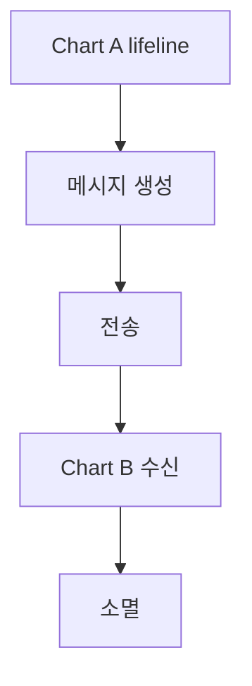
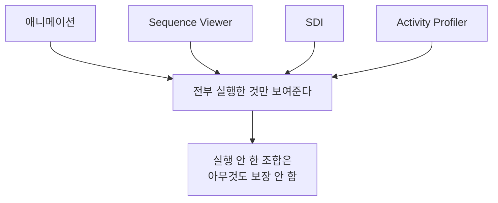

> **기준:** MathWorks 공개 문서 · R2025b / 확인일 2026-07-31
> **시리즈:** [목차](/posts/00-stateflow-series/) · 이전 → [18. edit-time 검사](/posts/18-sf-edit-time-checks/) · 다음 → [20. Stateflow API](/posts/20-sf-api-basics/)

---

## 1. 하나로는 안 된다

[14편](/posts/14-sf-data-inspector/)에서 SDI 를 다뤘다. 그것만으로는 부족한 이유가 있다. **도구마다 답하는 질문이 다르다.**

| 도구 | 답하는 질문 | 시간축 |
| --- | --- | --- |
| **애니메이션** | 지금 어디가 활성인가 | 실행 중 |
| **Sequence Viewer** | 누가 누구에게 무엇을 언제 보냈나 | 세로 |
| **SDI** | 값이 시간에 따라 어떻게 변했나 | 가로 |
| **Activity Profiler** | 무엇이 얼마나 자주 실행됐나 | 누적 |

**"어느 State 인가"** 를 묻는 도구와 **"무엇을 주고받았나"** 를 묻는 도구는 다르다.

## 2. 애니메이션

- **기본으로 켜져 있다.** 실행 중 활성 State 와 Transition 을 강조한다.
- 끄려면 Debug 탭의 `Remove animation highlighting` 을 선택한다.

한계는 두 가지다. 모드는 보여주고 **값은 안 보여준다.** 그리고 **지나간 것을 다시 못 본다.** 눈을 뗀 사이에 일어난 전이는 사라진다.

## 3. Sequence Viewer

메시지, 이벤트, 함수 호출을 **시간 순서로** 보여준다.

- 각 블록을 **세로 lifeline** 으로 그리고 시간이 아래로 흐른다.
- 메시지·이벤트·함수 호출을 **보낸 쪽에서 받는 쪽으로 가는 화살표**로 표시한다.
- 메시지가 생성·전송·전달·수신·소멸되는 시점을 각각 표시한다.
- **State 활동과 Transition** 도 함께 보여준다.
- 함수 호출은 Stateflow graphical function, Simulink function, MATLAB function 전부 해당한다.

Chart 가 여러 개이고 서로 메시지를 주고받을 때 값어치가 크다. SDI 로는 값이 바뀐 것은 보이는데 **누가 보냈는지가 안 보인다.** [06편](/posts/06-parallel-and-events/)의 이벤트 흐름을 추적할 때 이 도구가 맞다.

## 4. Activity Profiler

Debug 탭에서 `Activity Profiler` 를 누르면 편집기 아래에 창이 열린다. `Run` 을 누르면 **각 State·Transition·함수의 실행 정도**를 보여준다.

앞의 셋이 **한 번의 실행을 따라가는** 도구라면 이것은 **전체에서 어디가 뜨거운가**를 본다.

| 관측 | 의미 |
| --- | --- |
| 한 번도 실행 안 된 곳 | 테스트가 안 닿았거나 **도달 불가 로직** |
| 지나치게 자주 실행되는 곳 | 실행 순서나 조건 설계를 의심 |

첫 줄이 [21편](/posts/21-sf-coverage/)의 커버리지와 이어지는 지점이다. 다만 Activity Profiler 는 **얼마나 실행됐나**를 보여주는 것이고, 커버리지처럼 **판정 기준**을 주지는 않는다.

## 5. 멈춰서 값을 바꾼다

Breakpoint 로 멈춘 상태에서 데이터와 메시지를 **확인하고 수정**할 수 있다. [03편](/posts/03-logging-and-debug/)에서 다룬 breakpoint 의 연장이다.

재현이 어려운 조건을 만드는 가장 빠른 방법일 때가 있다. 특정 fault 조합을 입력으로 만들어내기 어려우면 멈춰서 변수를 직접 넣어본다.

## 6. 네 도구의 공통 한계

> **이 도구들은 실행한 시나리오에서 관측된 동작만 보여준다.** 실행하지 않은 입력이나 조건 조합의 동작은 보장하지 않는다.
{: .prompt-danger }

그래서 [21편](/posts/21-sf-coverage/)의 커버리지와 [22편](/posts/22-sf-formal-verification/)의 형식 증명이 따로 필요하다.

## ⚠️ 주의

- Sequence Viewer 는 **블록 형태와 도구 형태**가 둘 다 있다. 둘의 차이는 확인하지 않았다.
- Activity Profiler 가 시뮬레이션 속도에 주는 영향은 확인하지 않았다. 긴 시나리오에서는 재보는 편이 낫다.
- 메뉴 위치와 항목 이름은 릴리스마다 바뀐다. 문서 표기 기준으로 적었다.

## 📌 정리

- 도구마다 **답하는 질문이 다르다.** 하나로 다 안 된다.
- **애니메이션** — 기본 켜짐, 모드만 보이고 지나간 것은 못 본다.
- **Sequence Viewer** — 세로 lifeline, 메시지의 생성부터 소멸까지. **누가 보냈나**에 답한다.
- **Activity Profiler** — 누적 실행량. 한 번도 실행 안 된 곳이 드러난다.
- **Breakpoint 로 멈춰 값을 바꿀 수 있다.** 재현 어려운 조건을 만들 때 쓴다.
- 넷 다 **실행한 것만** 보여준다. 이것이 커버리지와 형식 증명이 필요한 이유다.

---

**시리즈:** [목차](/posts/00-stateflow-series/) · 이전 → [18. edit-time 검사](/posts/18-sf-edit-time-checks/) · 다음 → [20. Stateflow API 기초](/posts/20-sf-api-basics/)

## 참고

- [Use the Sequence Viewer to Visualize Messages, Events, and Entities](https://www.mathworks.com/help/stateflow/ug/use-sequence-viewer-block.html)
- [Sequence Viewer](https://www.mathworks.com/help/stateflow/ref/sequenceviewer.html)
- [Animate Stateflow Charts](https://www.mathworks.com/help/stateflow/ug/animate-stateflow-charts.html)
- [Visualize Chart Execution with the Activity Profiler](https://www.mathworks.com/help/stateflow/ug/use-heat-maps-to-visualize-content-implementation.html)
- [Inspect and Modify Data and Messages While Debugging](https://www.mathworks.com/help/stateflow/ug/watching-data-values-during-simulation.html)
