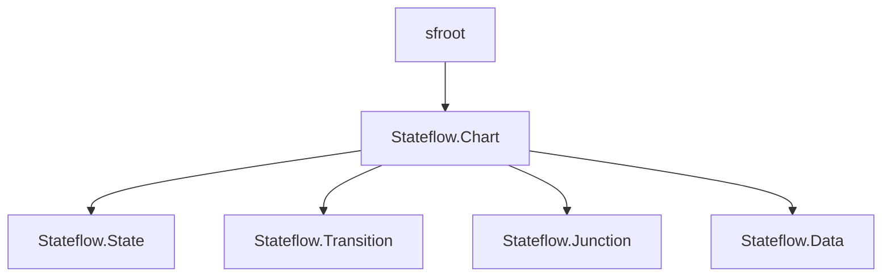
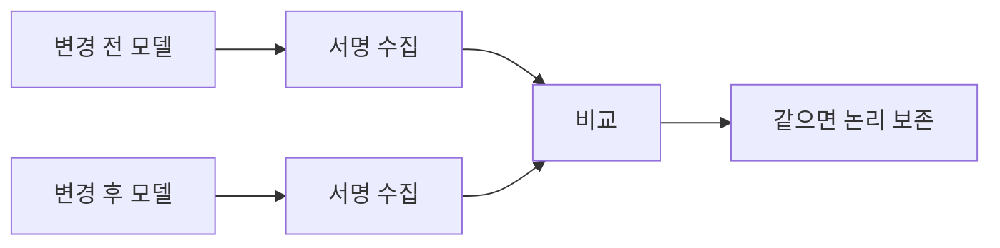

> **기준:** MathWorks 공개 문서 · R2025b / 확인일 2026-07-31
> **시리즈:** [목차](/posts/00-stateflow-series/) · 이전 → [19. Sequence Viewer](/posts/19-sf-sequence-viewer/) · 다음 → [21. 관찰과 증명](/posts/21-sf-coverage/)

---

## 1. 손으로 읽히는 크기가 아니다

State 가 서른 개를 넘고 Transition 이 예순 개를 넘어가면 화면으로 검토가 안 된다. 스크롤하며 세는 순간 빠뜨린다.

이때 필요한 것은 그림이 아니라 **표**다.

| 알고 싶은 것 | GUI | API |
| --- | --- | --- |
| State 가 몇 개인가 | 세어야 한다 | 즉시 |
| 어느 State 가 나가는 Transition 이 5개 이상인가 | 불가능에 가깝다 | 필터 한 줄 |
| 모든 Transition 의 실행 순서 표 | 하나씩 클릭 | 한 번에 |
| 두 버전이 논리적으로 같은가 | 눈으로 대조 | 서명 비교 |

## 2. sfroot 에서 시작한다

`sfroot` 는 Stateflow 객체 계층의 최상위 Root 객체를 돌려준다. 여기서 모든 API 객체로 내려간다.

```matlab
rt = sfroot;
chart = find(rt, "-isa", "Stateflow.Chart", Name = "MissionSupervisor");
```

`find` 의 `-isa` 로 타입을 지정하고 속성으로 좁힌다. 이름으로 State 를 찾는 것도 같다.

```matlab
st = find(sfroot, "-isa", "Stateflow.State", Name = "Idle");
```



## 3. 표를 뽑는다

Chart 안의 State 를 전부 모아 필요한 속성만 꺼낸다.

```matlab
states = find(chart, "-isa", "Stateflow.State");
for k = 1:numel(states)
    s = states(k);
    fprintf("%-40s  자식=%d  subchart=%d\n", ...
        s.Path, numel(s.getChildren), s.IsSubchart);
end
```

Transition 은 출발지와 도착지, 라벨, 실행 순서를 본다.

```matlab
trans = find(chart, "-isa", "Stateflow.Transition");
for k = 1:numel(trans)
    t = trans(k);
    src = ""; if ~isempty(t.Source), src = t.Source.Name; end
    dst = ""; if ~isempty(t.Destination), dst = t.Destination.Name; end
    fprintf("%-12s -> %-12s  EO=%d  %s\n", ...
        src, dst, t.ExecutionOrder, t.LabelString);
end
```

**`ExecutionOrder` 를 뽑는 것이 핵심이다.** [09편](/posts/09-condition-action/)과 [10편](/posts/10-parallel-order/)에서 본 대로 평가 순서가 곧 동작이다. 그림으로는 번호가 작게 보여서 놓친다.

## 4. 주요 속성

| 클래스 | 자주 쓰는 속성 |
| --- | --- |
| `Stateflow.State` | `Name` · `Path` · `Position` · `IsSubchart` · `Decomposition` · `LabelString` |
| `Stateflow.Transition` | `Source` · `Destination` · `LabelString` · `ExecutionOrder` |
| `Stateflow.Data` | `Name` · `Scope` · `DataType` · `Port` |

`Position` 은 `[left top width height]` 형태의 4요소 벡터다. `Decomposition` 이 OR 인지 AND 인지가 [06편](/posts/06-parallel-and-events/)의 병렬 여부를 말해준다.

## 5. 논리 서명 비교

API 가 가장 값어치 있는 용도다. **두 모델이 논리적으로 같은지**를 증명한다.



수집할 항목이다.

- State 의 경로, 이름, LabelString, Decomposition
- Transition 의 Source, Destination, LabelString, **ExecutionOrder**
- Data 와 Event 의 이름, Scope, 타입

> **개수 비교는 증거가 아니다.** State 37개, Transition 67개가 그대로여도 실행 순서가 바뀌면 다른 모델이다. **각 State 에서 나가는 Transition 의 순서를 순서 있는 목록으로** 저장해야 한다.
{: .prompt-warning }

레이아웃만 바꾸는 작업에서 이 비교가 필수다. 그래픽 포트 위치를 옮기면 암시적 평가 순서가 달라질 수 있기 때문이다. 실제 사례는 [Stateflow 레이아웃 자동화 연재](/posts/00-sflayout-series/)에서 다뤘다.

## 6. 만들 수도 있다

API 는 읽기 전용이 아니다. Chart 를 스크립트로 생성할 수 있다. 반복되는 구조를 손으로 그리는 대신 코드로 만들면 규칙이 일관되고 재생성이 된다.

다만 **논리 객체를 만든 직후의 자동 좌표를 최종 레이아웃으로 보면 안 된다.** 실행은 되지만 사람이 읽을 수 없는 배치가 나온다.

## ⚠️ 주의

- **속성 이름과 동작은 릴리스마다 다를 수 있다.** 특히 그래픽 속성은 서로 영향을 주고받아서, 설정 후 다시 읽어 확인하는 편이 안전하다.
- 위 코드는 개념을 보이기 위한 것이다. 실제로는 `Source` 나 `Destination` 이 비어 있는 경우(default transition)를 처리해야 한다.
- 모델이 열려 있어야 `sfroot` 로 접근된다. 닫힌 모델은 먼저 `load_system` 한다.

## 📌 정리

- State 수십 개를 넘어가면 **그림이 아니라 표**로 봐야 한다.
- `sfroot` 에서 시작해 `find` 의 `-isa` 로 타입을 지정하고 속성으로 좁힌다.
- **`ExecutionOrder` 를 반드시 뽑는다.** 평가 순서가 곧 동작인데 그림에서는 놓치기 쉽다.
- 가장 값어치 있는 용도는 **논리 서명 비교**다. 변경이 실행 의미를 안 건드렸음을 증명한다.
- **개수가 같다는 것은 증거가 아니다.** outgoing Transition 순서까지 봐야 한다.
- 생성도 되지만 **자동 좌표는 최종 레이아웃이 아니다.**

---

**시리즈:** [목차](/posts/00-stateflow-series/) · 이전 → [19. Sequence Viewer와 애니메이션](/posts/19-sf-sequence-viewer/) · 다음 → [21. 관찰과 증명 — 커버리지](/posts/21-sf-coverage/)

## 참고

- [Overview of the Stateflow API](https://www.mathworks.com/help/stateflow/api/overview-of-the-stateflow-api.html)
- [sfroot](https://www.mathworks.com/help/stateflow/ref/sfroot.html)
- [Stateflow.State](https://www.mathworks.com/help/stateflow/api/stateflow.state.html) · [Stateflow.Transition](https://www.mathworks.com/help/stateflow/api/stateflow.transition.html)
- [Create Charts by Using the Stateflow API](https://www.mathworks.com/help/stateflow/api/quick-start-for-the-stateflow-api.html)
