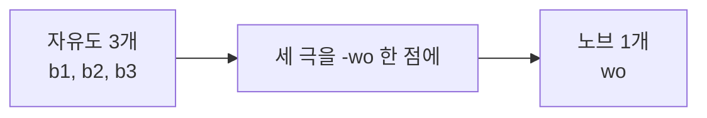
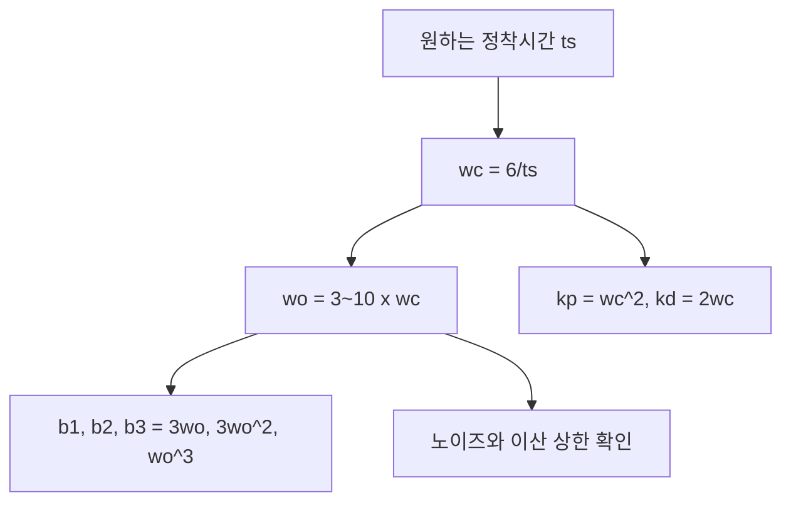

> **기준 출처:** Gao, *Scaling and Bandwidth-Parameterization Based Controller Tuning*, ACC 2003 · Herbst & Madoński, *ADRC: From Principles to Practice* (Birkhäuser, CC BY 4.0) / 확인일 2026-07-31
> **시리즈:** [목차](/posts/00-adrc-series/) · 이전 → [19. 부록 A](/posts/19-adrc-derivation-cancellation-eso/) · 다음 → [21. 부록 C](/posts/21-adrc-derivation-worked-example/)

---

## 0. 이 글의 결론

[06편](/posts/06-observer-bandwidth/)과 [07편](/posts/07-controller-bandwidth/)에서 공식으로만 제시한 이득이 어디서 나오는지 계산한다. 답은 짧다. **극을 한 점에 몰고 이항전개한 뒤 계수를 비교한 것**이 전부다.

| 이득 | 값 | 출처 |
| --- | --- | --- |
| 관측기 $\beta_1,\beta_2,\beta_3$ | $3\omega_o,\ 3\omega_o^2,\ \omega_o^3$ | $(s+\omega_o)^3$ 전개 |
| 제어기 $k_p,\ k_d$ | $\omega_c^2,\ 2\omega_c$ | $(s+\omega_c)^2$ 전개 |

## 1. 극을 한 점에 몰기

[19편](/posts/19-adrc-derivation-cancellation-eso/) (8)에서 오차 특성다항식은 $s^3 + \beta_1 s^2 + \beta_2 s + \beta_3$ 였다. 극 위치는 설계자가 정한다.

Gao(2003)의 처방은 **세 극을 전부 한 점 $-\omega_o$ 에 두는 것**이다. 그러면 자유도 3개가 노브 1개로 접힌다.

$$s^3 + \beta_1 s^2 + \beta_2 s + \beta_3 = (s+\omega_o)^3 \tag{1}$$

이 선택이 ADRC 튜닝을 쉽게 만든 이유다. 극을 흩어 두면 더 좋은 응답을 얻을 수도 있지만, 손으로 잡을 숫자가 다시 셋이 된다.

## 2. 우변 이항전개

이항정리 $(s+\omega_o)^3 = \sum_{i=0}^{3}\binom{3}{i}s^{3-i}\omega_o^{i}$ 를 한 항씩 쓴다.

$$
\begin{aligned}
(s+\omega_o)^3 &= \binom30 s^3 + \binom31 s^2\omega_o + \binom32 s\,\omega_o^2 + \binom33\omega_o^3\\
&= s^3 + 3\omega_o s^2 + 3\omega_o^2 s + \omega_o^3
\end{aligned}
$$

## 3. 계수 비교

(1)의 좌우에서 같은 차수 계수를 맞춘다.

| 차수 | 좌변 | 우변 | 결론 |
| --- | --- | --- | --- |
| $s^2$ | $\beta_1$ | $3\omega_o$ | $\beta_1 = 3\omega_o$ |
| $s^1$ | $\beta_2$ | $3\omega_o^2$ | $\beta_2 = 3\omega_o^2$ |
| $s^0$ | $\beta_3$ | $\omega_o^3$ | $\beta_3 = \omega_o^3$ |

$$\beta_1 = 3\omega_o,\quad \beta_2 = 3\omega_o^2,\quad \beta_3 = \omega_o^3$$

[06편](/posts/06-observer-bandwidth/)에서 제시한 공식과 일치한다. 유도는 여기서 끝난다.

## 4. $\beta_3=\omega_o^3$ 가 노이즈에 위험한 이유

$\beta_3$ 는 3제곱이다. $\omega_o$ 를 2배로 올리면 다음이 된다.

$$\beta_3:\ \omega_o^3 \to (2\omega_o)^3 = 8\omega_o^3$$

관측기는 위치 노이즈 $n$ 을 $\beta_3$ 로 곱해 $\hat x_3$ 에 싣는다. [19편](/posts/19-adrc-derivation-cancellation-eso/) (6)의 $\beta_3 e_1$ 항이 그 경로다. 따라서 **$\omega_o$ 를 2배 하면 추정외란의 노이즈가 8배**로 거칠어진다.

> [13편](/posts/13-bandwidth-limits/)의 "노이즈 벽"이 이 계산이다. 대역폭을 올리면 응답이 빨라지는 대신 노이즈가 3제곱으로 따라 올라온다. 어디서 멈출지는 센서 분해능이 정한다.
{: .prompt-warning }

## 5. 일반화 — $N$차 플랜트

$(N{+}1)$차 ESO면 극 $(N{+}1)$개를 $-\omega_o$ 에 몬다.

$$(s+\omega_o)^{N+1}=\sum_{i=0}^{N+1}\binom{N+1}{i}s^{N+1-i}\omega_o^i
\;\Rightarrow\; \beta_i=\binom{N+1}{i}\omega_o^{\,i}$$

| 플랜트 차수 | ESO 차수 | 이득 |
| --- | --- | --- |
| 1차 | 2차 | $\beta_1=2\omega_o,\ \beta_2=\omega_o^2$ |
| 2차 | 3차 | $\beta_1=3\omega_o,\ \beta_2=3\omega_o^2,\ \beta_3=\omega_o^3$ |

이항계수 표를 그대로 읽으면 된다. [09편](/posts/09-adrc-order/)에서 차수를 1차와 2차로 나눠 다룬 근거가 이것이다.

## 6. 제어기 이득 $\omega_c^2,\ 2\omega_c$

[19편](/posts/19-adrc-derivation-cancellation-eso/) (4)에서 플랜트가 $\ddot y = u_0$ 가 됐다. 목표 $r$(상수)로 보내는 PD를 씌운다.

$$u_0 = k_p(r-\hat x_1) + k_d(0-\hat x_2)$$

관측기가 정확하면 $\hat x_1\approx y,\ \hat x_2\approx \dot y$ 이므로 닫힌 루프 동역학은 다음이 된다.

$$\ddot y + k_d\dot y + k_p y = k_p r \tag{2}$$

특성다항식 $s^2 + k_d s + k_p$ 를 한 점 $-\omega_c$ 에 몬다.

$$s^2 + k_d s + k_p = (s+\omega_c)^2 = s^2 + 2\omega_c s + \omega_c^2$$

계수를 비교하면 다음을 얻는다.

$$k_p = \omega_c^2,\qquad k_d = 2\omega_c$$

1차 플랜트면 $\dot y = k_p(r-y)$ 이고 $s+k_p = s+\omega_c$ 이므로 $k_p=\omega_c$ 다.

## 7. $\omega_c$ 가 곧 응답 속도인 이유

(2)는 극이 $-\omega_c$ 중근인 임계감쇠 2차계다. 시간응답이 $e^{-\omega_c t}$ 로 붙으므로 2% 정착시간은 근사적으로 다음이다.

$$t_s \approx \frac{6}{\omega_c}$$

역산이 가능하다는 것이 ADRC 튜닝의 실질적 장점이다.

| 원하는 정착시간 | $\omega_c$ |
| --- | --- |
| 0.6 s | 10 rad/s |
| 0.3 s | 20 rad/s |
| 0.1 s | 60 rad/s |

관측기는 제어기보다 빨라야 하므로 통상 $\omega_o = 3\!\sim\!10\,\omega_c$ 로 잡는다. 두 숫자를 정하면 나머지 다섯 이득이 공식으로 나온다.

## ⚠️ 주의

- **$t_s \approx 6/\omega_c$ 는 임계감쇠 근사다.** 포화, 지연, 필터가 붙으면 실제 정착시간은 더 길어진다. 설계 출발점으로 쓰고 실측으로 고친다.
- **$\omega_o$ 상한은 노이즈만 정하지 않는다.** 이산 구현에서는 $\omega_o T_s$ 가 함께 걸린다. [21편](/posts/21-adrc-derivation-worked-example/)에서 숫자로 확인한다.
- 극을 한 점에 모으는 것은 **설계 선택이지 최적해가 아니다.** 특정 주파수의 외란을 노려야 하면 극을 흩어 두는 편이 나을 수 있다.

## 📌 정리

- 관측기 이득은 $(s+\omega_o)^3$ 이항전개의 계수 그대로다. $\beta_i=\binom{3}{i}\omega_o^{\,i}$.
- 제어기 이득은 $(s+\omega_c)^2$ 전개에서 나온다. $k_p=\omega_c^2,\ k_d=2\omega_c$.
- **$\beta_3$ 가 3제곱이라 $\omega_o$ 2배는 외란추정 노이즈 8배다.** 대역폭 상한의 정량적 근거다.
- $t_s \approx 6/\omega_c$ 로 원하는 응답에서 노브를 역산한다.
- 손으로 잡는 숫자는 $\omega_c$ 와 $\omega_o$ 둘뿐이다. 나머지는 공식이 만든다.

---

**시리즈:** [목차](/posts/00-adrc-series/) · 이전 → [19. 부록 A — 상쇄와 ESO 수렴](/posts/19-adrc-derivation-cancellation-eso/) · 다음 → [21. 부록 C — 숫자 예제와 PID 등가](/posts/21-adrc-derivation-worked-example/)

## 참고

- Gao, Z. *Scaling and Bandwidth-Parameterization Based Controller Tuning*, ACC 2003 — [IEEE Xplore](https://ieeexplore.ieee.org/document/1242516)
- Herbst, G. & Madoński, R. *ADRC: From Principles to Practice*, Birkhäuser, CC BY 4.0 — [Springer](https://link.springer.com/book/10.1007/978-3-031-72687-3)
- Han, J. *From PID to Active Disturbance Rejection Control*, IEEE TIE 2009 — [IEEE Xplore](https://ieeexplore.ieee.org/document/4796887)
- [MathWorks — Active Disturbance Rejection Control](https://www.mathworks.com/help/slcontrol/ug/active-disturbance-rejection-control.html)
