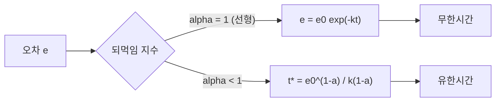
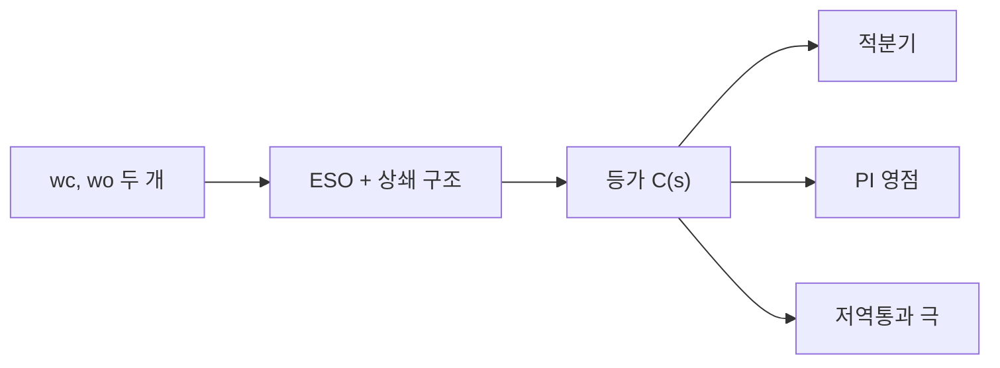

> **기준 출처:** Herbst & Madoński, *ADRC: From Principles to Practice* (Birkhäuser, CC BY 4.0) / Han, IEEE TIE 2009 / 확인일 2026-07-31
> **시리즈:** [목차](/posts/00-adrc-series/) | 이전 → [20. 부록 B](/posts/20-adrc-derivation-bandwidth-gains/)

---

## 0. 이 글이 하는 것

부록 3편의 마지막이다. [19편](/posts/19-adrc-derivation-cancellation-eso/)과 [20편](/posts/20-adrc-derivation-bandwidth-gains/)의 결과를 숫자로 돌려보고, 남은 두 주장을 증명한다.

| 절 | 내용 |
| --- | --- |
| 1~5 | 워크드 예제 — 게인 계산부터 ESO 한 스텝 손계산까지 |
| 6 | fal이 유한시간에 수렴하는 이유 |
| 7~9 | ADRC가 PI 곱하기 저역통과와 같다는 전달함수 유도 |

## 1. 설정

일부러 $b_0$ 를 틀리게 잡는다. $b_0$ 오차가 흡수되는지 확인하기 위해서다.

| 항목 | 값 |
| --- | --- |
| 플랜트 | $\ddot y = F + b_0 u$ |
| 참 이득 $b$ | 120 |
| 쓰는 $b_0$ | **100 (20% 틀림)** |
| 목표 정착시간 | 0.3 s |
| 관측기 배율 | 5배 |
| 이산 주기 $T_s$ | 0.001 s (1 kHz) |

$\omega_c = 6/0.3 = 20$ rad/s, $\omega_o = 5\times 20 = 100$ rad/s.

## 2. 게인 계산

[20편](/posts/20-adrc-derivation-bandwidth-gains/) 공식을 그대로 쓴다.

$$
\begin{aligned}
&k_p = \omega_c^2 = 400,\qquad k_d = 2\omega_c = 40\\
&\beta_1 = 3\omega_o = 300,\quad \beta_2 = 3\omega_o^2 = 30{,}000,\quad \beta_3 = \omega_o^3 = 1{,}000{,}000
\end{aligned}
$$

**손으로 잡은 게인이 하나도 없다.** $\omega_c$ 와 $\omega_o$ 두 숫자에서 전부 나왔다.

## 3. 이산 안정성부터 확인

$$\omega_o\cdot T_s = 100\times 0.001 = 0.1$$

전진 Euler로도 안전한 영역이다. 만약 $\omega_o = 1000$ 을 원했다면 $\omega_o T_s = 1$ 이 되어 불안정해진다. 그때는 $T_s$ 를 줄여야 한다. [11편](/posts/11-discretization/)에서 다룬 상한이 이것이다.

> **게인을 계산하기 전에 이 곱부터 본다.** 연속시간에서 아무리 잘 설계해도 $\omega_o T_s$ 가 크면 이산 구현에서 발산한다.
{: .prompt-danger }

## 4. $b_0$ 오차가 총외란으로 흡수되는지 확인

참 플랜트는 $\ddot y = f + 120u$ 이고 쓰는 모델은 $b_0=100$ 이다. [19편](/posts/19-adrc-derivation-cancellation-eso/) (2)의 총외란은 다음이 된다.

$$F = f + (b-b_0)u = f + (120-100)u = f + 20u$$

20% 틀린 $b_0$ 때문에 **$20u$ 라는 가짜 외란이 하나 더 생겼을 뿐**이고, ESO가 이것을 $F$ 의 일부로 함께 추정해 상쇄한다. $b_0$ 가 틀려도 도는 이유다. 다만 ESO가 그만큼 더 일하므로 대역폭 여유를 소모한다.

## 5. 이산 ESO 한 스텝 손계산

전진 Euler 이산 ESO는 다음과 같다. 측정오차는 $\varepsilon = y-\hat x_1$ 다.

$$
\begin{aligned}
\hat x_1 &\leftarrow \hat x_1 + T_s(\hat x_2 + \beta_1\varepsilon)\\
\hat x_2 &\leftarrow \hat x_2 + T_s(\hat x_3 + b_0 u + \beta_2\varepsilon)\\
\hat x_3 &\leftarrow \hat x_3 + T_s(\beta_3\varepsilon)
\end{aligned}
$$

초기 $\hat x=(0,0,0)$, 입력 $u=0$, 측정 $y=0.01$ 이면 $\varepsilon = 0.01$ 이다.

$$
\begin{aligned}
\hat x_1 &\leftarrow 0 + 0.001(0 + 300\cdot0.01) = 0.003\\
\hat x_2 &\leftarrow 0 + 0.001(0 + 0 + 30000\cdot0.01) = 0.3\\
\hat x_3 &\leftarrow 0 + 0.001(1{,}000{,}000\cdot0.01) = 10
\end{aligned}
$$

한 스텝 만에 총외란 추정이 10만큼 움직였다. 관측기가 외란의 존재를 빠르게 감지한다는 뜻이다. 동시에 **$\beta_3=10^6$ 이 $\varepsilon$ 의 노이즈까지 그대로 증폭한다**는 것도 보인다. [20편](/posts/20-adrc-derivation-bandwidth-gains/) 4절의 노이즈 문제가 숫자로 드러나는 지점이다.

같은 스텝에서 목표 $r=0.05$ 라면 제어입력은 다음이다.

$$u_0 = k_p(r-\hat x_1) + k_d(0-\hat x_2) = 400(0.05-0.003) + 40(-0.3) = 18.8 - 12 = 6.8$$

$$u = \frac{u_0 - \hat x_3}{b_0} = \frac{6.8 - 10}{100} = -0.032$$

추정외란이 $u_0$ 보다 커서 입력이 음수로 나왔다. **외란을 상쇄하는 방향으로 자동 계산된 것**이다.

## 6. fal이 유한시간에 수렴하는 이유

Han(2009)의 비선형 되먹임 $f_{al}(e,\alpha,\delta)=\lvert e\rvert^\alpha\mathrm{sign}(e)$ 가 유한시간에 오차를 0으로 보낸다는 주장을 직접 푼다.

**선형이면 무한시간이다.** $\dot e = -k e$ 의 해는 $e(t) = e_0 e^{-kt}$ 이고, $e^{-kt}$ 는 $t\to\infty$ 에서만 0이다.

**$\alpha<1$ 이면 유한시간이다.** $\dot e = -k e^\alpha$ ($e>0$) 를 변수분리로 푼다.

$$\frac{de}{e^\alpha} = -k\,dt \;\Rightarrow\; \int_{e_0}^{e} e^{-\alpha}de = -k\int_0^t dt$$

$$\frac{e^{1-\alpha}-e_0^{1-\alpha}}{1-\alpha} = -kt$$

$e=0$ 이 되는 시각을 풀면 다음을 얻는다.

$$t^\ast = \frac{e_0^{\,1-\alpha}}{k(1-\alpha)} < \infty$$

**유한시간에 정확히 0에 닿는다.** $\alpha=1$(선형)이면 분모가 0이 되어 발산하는데, 이것이 곧 무한시간이라는 뜻이다.

직관은 간단하다. $\lvert e\rvert^\alpha$ 에서 유효 게인은 $\lvert e\rvert^{\alpha-1}$ 이고 $\alpha<1$ 이면 지수가 음수다. **오차가 작아질수록 게인이 커진다.** 원점 근처에서 세게 밀어 넣고, 큰 오차에는 완만해 포화를 피한다. $\delta$ 는 원점 근처를 선형으로 눕혀 채터링을 막는 완충 구간이다.

## 7. PI 등가 유도 — 설정

1차 ADRC로 전달함수를 직접 유도한다. 2차도 방식은 같고 계산만 길다.

플랜트 $\dot y = F + b_0 u$, 상태 $x_1=y,\ x_2=F$. ESO는 2차이고 이득은 $l_1=2\omega_o,\ l_2=\omega_o^2$ 다.

$$\dot{\hat x}_1 = \hat x_2 + b_0 u + l_1(y-\hat x_1),\qquad \dot{\hat x}_2 = l_2(y-\hat x_1)$$

제어는 $u = (u_0-\hat x_2)/b_0$, $u_0 = k_p(r-\hat x_1)$, $k_p=\omega_c$ 다.

## 8. 관측기 오차 소거

영초기조건에서 $\varepsilon := Y-\hat X_1$ 로 둔다. ESO 두 식을 라플라스로 옮긴다.

$$s\hat X_1 = \hat X_2 + b_0U + l_1\varepsilon,\qquad s\hat X_2 = l_2\varepsilon$$

아래 식에서 $\hat X_2 = \frac{l_2}{s}\varepsilon$ 이다. $\hat X_1 = Y-\varepsilon$ 를 위 식에 넣는다.

$$s(Y-\varepsilon) = \tfrac{l_2}{s}\varepsilon + b_0U + l_1\varepsilon$$

$\varepsilon$ 로 정리하면 다음이다.

$$\varepsilon = \frac{s(sY-b_0U)}{s^2+l_1 s+l_2}$$

분모를 $D:=s^2+l_1 s+l_2$ 로 두면 $\hat X_2 = \frac{l_2(sY-b_0U)}{D}$ 다.

제어법칙 $b_0U = \omega_c(R-\hat X_1) - \hat X_2$ 에 대입하고 $b_0U$ 를 한쪽으로 모으면 2자유도 구조가 드러난다.

$$U = \frac{\omega_c\,D}{b_0\,s(s+l_1+\omega_c)}\,R \;-\; \underbrace{\frac{(\omega_c l_1+l_2)s + \omega_c l_2}{b_0\,s(s+l_1+\omega_c)}}_{C(s)}\,Y$$

## 9. $C(s)$ 를 읽는다

$$C(s) = \frac{(\omega_c l_1+l_2)\,s + \omega_c l_2}{b_0\,s\,(s+l_1+\omega_c)}$$

구조를 항별로 본다.

| 항 | 정체 |
| --- | --- |
| 분모의 $s$ | **적분기.** I 작용이 여기서 나온다 |
| 분자 $(\omega_c l_1+l_2)s + \omega_c l_2$ | PI의 영점 (비례 더하기 적분) |
| 분모의 $(s+l_1+\omega_c)$ | 저역통과 필터 극 (측정 노이즈를 거른다) |

$$C(s) = \underbrace{\frac{K_p s + K_i}{s}}_{\text{PI}}\times\underbrace{\frac{1}{\,s+p\,}}_{\text{lowpass}},\quad p = l_1+\omega_c$$

**1차 ADRC는 PI 제어기에 저역통과 필터를 곱한 것과 같다.** 게다가 $R$ 과 $Y$ 의 전달이 달라 2자유도다.

> ADRC 설계에는 명시적인 I 항이 없다. 그런데 등가 전달함수에는 적분기가 있다. **ESO가 적분 작용을 만들어낸 것**이다. [10편](/posts/10-adrc-vs-pid/)에서 말한 등가성의 정체가 이것이다.
{: .prompt-tip }

1절 값으로 확인한다. $l_1=2\omega_o=200,\ l_2=\omega_o^2=10000,\ \omega_c=20,\ b_0=100$.

$$C(s) = \frac{(20\cdot200+10000)s + 20\cdot10000}{100\,s(s+220)} = \frac{140s+2000}{s(s+220)}$$

| 요소 | 값 |
| --- | --- |
| 적분기 | $1/s$ |
| PI 영점 | $s \approx -14.3$ |
| 필터 극 | $s = -220$ |

손으로 잡는 PID로 이 셋을 동시에 정합시키기는 어렵다. ADRC는 $\omega_c$ 와 $\omega_o$ 두 노브로 자동으로 한다.

## ⚠️ 주의

- **8절 유도는 1차 ADRC 한정이다.** 2차는 같은 절차로 되지만 $D$ 가 3차가 되어 $C(s)$ 항이 늘어난다. 결론(PID 더하기 필터 등가)은 유지된다.
- **등가라는 말이 성능이 같다는 뜻은 아니다.** 구조가 같은 족에 속한다는 의미이고, 그 족 안에서 어느 지점에 자동으로 놓이느냐가 ADRC의 값어치다.
- 5절 손계산은 **한 스텝만** 본 것이다. 수렴 거동은 여러 스텝을 돌려야 보인다. 실제 확인은 [18편](/posts/18-verification/)의 시뮬레이션으로 한다.
- fal 유도는 $e>0$ 영역에서 한 것이다. $\mathrm{sign}(e)$ 때문에 $e<0$ 도 대칭으로 같다.

## 📌 정리

- $\omega_c=20$, $\omega_o=100$ 두 숫자에서 다섯 이득이 전부 나온다. 손으로 잡은 것은 없다.
- **게인보다 $\omega_o T_s$ 를 먼저 본다.** 이 예제는 0.1로 안전하다.
- 20% 틀린 $b_0$ 는 $20u$ 라는 추가 외란으로 나타나고 ESO가 함께 추정한다.
- $\alpha<1$ 이면 $t^\ast = e_0^{1-\alpha}/[k(1-\alpha)]$ 로 **유한시간에 0에 닿는다.**
- 1차 ADRC의 등가 제어기는 $C(s) = \text{PI} \times \text{저역통과}$ 다. **적분기는 ESO가 만든다.**

---

**시리즈:** [목차](/posts/00-adrc-series/) | 이전 → [20. 부록 B — 대역폭 게인 유도](/posts/20-adrc-derivation-bandwidth-gains/)

## 참고

- Herbst, G. & Madoński, R. *ADRC: From Principles to Practice*, Birkhäuser, CC BY 4.0 — [Springer](https://link.springer.com/book/10.1007/978-3-031-72687-3)
- Han, J. *From PID to Active Disturbance Rejection Control*, IEEE TIE 2009 — [IEEE Xplore](https://ieeexplore.ieee.org/document/4796887)
- *On the equivalence of ADRC and PID* — [arXiv 2501.11374](https://arxiv.org/pdf/2501.11374)
- [MathWorks — Active Disturbance Rejection Control](https://www.mathworks.com/help/slcontrol/ug/active-disturbance-rejection-control.html)
