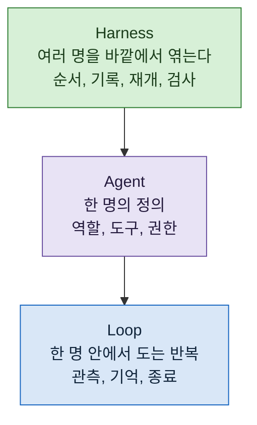

> **기준 출처:** 이 연재 전체의 지도이고 개별 근거는 각 편의 출처를 따른다. 인용은 [Anthropic 엔지니어링 글](https://www.anthropic.com/engineering/building-effective-agents)과 [Claude Code 공식 문서](https://code.claude.com/docs/en/overview)에 건다. / 확인일 2026-08-24

## 이 연재가 답하는 질문

에이전트 시스템이 뜻대로 안 될 때 **어디를 고쳐야 하는가.**

## 세 층

**각 층이 아래층의 못 푸는 문제를 푼다.** 그래서 아래층 문제를 위층에서 고치려 하면 복잡해지기만 하고 안 낫는다.

## 먼저 말해두는 것

Anthropic 의 공개 글이 이렇게 권한다.

> 가장 단순한 해법을 찾고, 필요할 때만 복잡도를 올린다. **에이전트 시스템을 아예 안 만드는 것**이 답일 수도 있다.

이 연재는 층을 늘리는 방법을 다루지만, **늘리는 것이 목표는 아니다.** 많은 경우 단일 호출로 충분하고, 그게 맞을 때는 그게 맞다.

## 읽는 순서

### 1부. 무엇을 만드는가

| # | 글 | 무엇을 얻나 |
| --- | --- | --- |
| 01 | [워크플로와 에이전트, 무엇이 다른가](/posts/01-workflow-vs-agent/) | 경로를 누가 정하는가로 갈린다. 그리고 이 구분이 진단을 바꾼다 |

### 2부. Loop 층

| # | 글 | 무엇을 얻나 |
| --- | --- | --- |
| 02 | [에이전트 루프란 무엇인가](/posts/02-what-is-agent-loop/) | 도구 반환값이 루프의 한계를 정한다 |
| 03 | [컨텍스트에 무엇을 넣고 무엇을 빼나](/posts/03-context-engineering/) | 넣을 것보다 **뺄 것**이 어렵다. 실패 기록은 남긴다 |
| 04 | [언제 멈출까, 종료 조건과 예산](/posts/04-when-to-stop/) | 왜 멈췄는지를 구분하지 않으면 미완을 완료로 읽는다 |

### 3부. Agent 층과 Harness 층

| # | 글 | 무엇을 얻나 |
| --- | --- | --- |
| 05 | [에이전트 한 명을 정의한다는 것](/posts/05-defining-an-agent/) | 역할, 도구, 권한. 나누는 기준은 "서로 안 보는 게 나은가" |
| 06 | [하네스라는 층](/posts/06-harness-layer/) | 기록이 원본이다. 그리고 결정적이지 않은 값을 흐름 밖으로 |

### 4부. 쓰는 법

| # | 글 | 무엇을 얻나 |
| --- | --- | --- |
| 07 | [세 층이 어긋날 때](/posts/07-when-layers-mismatch/) | 🔴 **증상별 진단표.** 흔한 오진 넷 |
| 08 | [같은 개념, 다른 제품](/posts/08-same-concept-different-product/) | 이름이 같아도 동작은 갈린다. 확인한 만큼만 쓴다 |

## 30초 사전

| 나오는 말 | 한 줄로 |
| --- | --- |
| **워크플로** | LLM 과 도구가 미리 정해진 코드 경로로 엮인 시스템 |
| **에이전트** | LLM 이 스스로 자기 과정과 도구 사용을 지시하는 시스템 |
| **Loop** | 관측하고 판단하고 도구를 부르고 결과를 보는 한 바퀴 |
| **컨텍스트 엔지니어링** | 그 관측에 무엇을 넣고 뺄지를 다루는 일 |
| **Harness** | 모델이 아니라 모델을 감싸는 바깥. 순서, 기록, 검사, 저장소 |
| **종료 사유** | 성공인지 실패인지 **예산 소진**인지. 구분해야 한다 |

## 이 연재의 성격

이 연재는 정리한 것이지 발명한 것이 아니다. Loop, Agent, Harness 라는 세 층 구분은 여러 자료에서 쓰이는 틀이고, 여기서는 그것을 **공개된 근거로 다시 세우고 내가 겪은 진단 경험을 07편에 붙였다.**

각 편의 사실 서술은 전부 출처를 달았다. 출처가 없는 것은 내 판단이고, 그렇다고 표시했다.

## 이어지는 것

- 여러 에이전트를 실제로 어떻게 배선하는가 → [에이전트 오케스트레이션 연재](/posts/00-orch-series/)
- 이 개념들을 도구에 어떻게 붙였는가 → [Claude Code 세팅 연재](/posts/00-ccsetup-series/)
