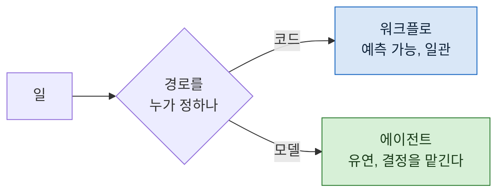

> **기준 출처:** [Anthropic Engineering, Building Effective AI Agents](https://www.anthropic.com/engineering/building-effective-agents) · [Claude Blog, Common workflow patterns for AI agents](https://claude.com/blog/common-workflow-patterns-for-ai-agents-and-when-to-use-them) / 확인일 2026-08-24
> **시리즈:** [목차](/posts/00-agentic-series/) | 다음 → [02. 에이전트 루프란 무엇인가](/posts/02-what-is-agent-loop/)

같은 말을 서로 다른 뜻으로 쓰면 논의가 안 된다. 첫 편은 용어를 가르는 데 쓴다.

## 1. Anthropic 의 구분

공개된 엔지니어링 글이 이 둘을 분명히 가른다.

| | 정의 |
| --- | --- |
| **워크플로** | LLM 과 도구가 **미리 정해진 코드 경로**로 엮인 시스템 |
| **에이전트** | LLM 이 **스스로 자기 과정과 도구 사용을 지시**하고, 어떻게 해낼지에 대한 통제를 쥐는 시스템 |

경계는 하나다. **경로를 누가 정하는가.**



## 2. 어느 쪽이 나은가는 잘못된 질문

원문의 권고가 분명하다. **워크플로는 잘 정의된 작업에서 예측 가능성과 일관성을 주고**, 에이전트는 **유연성과 모델 주도 결정이 규모 있게 필요할 때** 낫다.

에이전트가 맞는 자리도 명시돼 있다. 필요한 단계 수를 예측하기 어렵거나 불가능한 열린 문제, 고정된 경로를 하드코딩할 수 없는 경우다. 그리고 조건이 붙는다. **모델이 여러 회차를 돌게 되므로 그 판단을 어느 정도 신뢰할 수 있어야 한다.**

## 3. 그런데 먼저 물어야 할 것

같은 글이 그 앞에 더 중요한 말을 둔다.

> 가장 단순한 해법을 찾고, 필요할 때만 복잡도를 올린다. **에이전트 시스템을 아예 안 만드는 것**이 답일 수도 있다.

그리고 이유를 붙인다. 에이전트 시스템은 **더 나은 작업 성능을 얻는 대가로 지연과 비용을 지불한다.** 많은 응용에서는 검색과 예시를 붙인 단일 호출 최적화로 충분하다.

이 문장이 이 연재 전체의 전제다. **층을 늘리는 것이 목표가 아니다.**

## 4. 왜 이 구분이 실무에서 중요한가

용어 문제로 보이지만 아니다. **무엇이 잘못됐을 때 어디를 고쳐야 하는지**가 이 구분에서 갈린다.

| 증상 | 워크플로라면 | 에이전트라면 |
| --- | --- | --- |
| 매번 다르게 돈다 | 코드가 분기를 잘못 탄다 | **정상이다.** 그게 에이전트다 |
| 엉뚱한 단계를 건너뛴다 | 조건이 틀렸다 | 프롬프트나 도구가 부족하다 |
| 너무 오래 돈다 | 단계가 많다 | **종료 조건이 없다** |

같은 증상에 진단이 다르다. 자기 시스템이 어느 쪽인지 모르면 엉뚱한 데를 고친다.

## 5. 실제로는 섞인다

현실의 시스템은 대개 둘이 섞여 있다. 바깥은 워크플로이고 각 단계 안이 에이전트인 구성이 흔하다.

```
[워크플로] 조사 → 작성 → 검증 → 배치     ← 순서는 코드가 정한다
             ↑
        각 단계 안에서는 에이전트가 스스로 판단한다
```

이 구성이 흔한 이유가 있다. **절차는 알지만 각 절차 안에서 무엇을 할지는 모르는** 일이 많기 때문이다. 조사한다는 것은 정해져 있지만 무엇을 어떻게 조사할지는 그때 정해진다.

## 6. 그래서 세 층으로 본다

위 그림에서 바깥과 안이 서로 다른 문제를 갖는다. 이 연재는 그것을 세 층으로 나눠 본다.

| 층 | 무엇을 다루나 |
| --- | --- |
| **Loop** | 에이전트 한 명 안에서 도는 반복. 무엇을 보고 무엇을 기억하고 언제 멈추나 |
| **Agent** | 그 한 명의 정의. 역할, 도구, 권한 |
| **Harness** | 여러 명을 바깥에서 엮는 구조 |

다음 편부터 아래에서 위로 올라간다.

## 참고

- [Anthropic Engineering: Building Effective AI Agents](https://www.anthropic.com/engineering/building-effective-agents)
- [Claude Blog: Common workflow patterns for AI agents](https://claude.com/blog/common-workflow-patterns-for-ai-agents-and-when-to-use-them)
