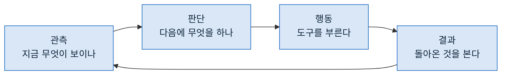

> **기준 출처:** [Anthropic Engineering, Building Effective AI Agents](https://www.anthropic.com/engineering/building-effective-agents) · [Writing effective tools for AI agents](https://www.anthropic.com/engineering/writing-tools-for-agents) / 확인일 2026-08-24
> **시리즈:** [목차](/posts/00-agentic-series/) | 이전 → [01. 워크플로와 에이전트](/posts/01-workflow-vs-agent/) | 다음 → [03. 컨텍스트에 무엇을 넣고 무엇을 빼나](/posts/03-context-engineering/)

가장 아래 층부터 본다. 에이전트 한 명 안에서 무슨 일이 도는가.

## 1. 한 바퀴



이게 전부다. 제어 쪽에서 보면 낯설지 않다. 센서를 읽고, 제어량을 계산하고, 구동기에 내보내고, 다시 읽는다. 구조가 같다.

다른 점은 하나다. **판단이 결정적이지 않다.** 같은 관측에 같은 행동이 나온다는 보장이 없다.

## 2. 무엇이 관측인가

제어 루프에서는 관측이 분명하다. 센서 값이다. 에이전트에서는 흐릿하다. **관측이 곧 컨텍스트**인데, 그 컨텍스트에 무엇이 들어 있는지가 매 바퀴 달라진다.

한 바퀴가 지나면 컨텍스트에 이런 것들이 쌓인다.

| 쌓이는 것 | 다음 바퀴에 필요한가 |
| --- | --- |
| 내가 한 판단 | 대개 필요하다 |
| 부른 도구와 그 인자 | 대개 필요하다 |
| **도구가 돌려준 것 전부** | **대개 필요 없다** |

세 번째가 문제의 시작이다. 검색 결과 200줄, 로그 500줄이 그대로 남는다. 다음 판단에 필요한 것은 그중 두 줄인데 전부 남는다.

## 3. 도구가 무엇을 돌려주느냐가 루프를 정한다

Anthropic 의 도구 설계 글이 이 지점을 다룬다. 도구의 반환값이 그대로 에이전트의 관측이 되므로, **도구를 어떻게 만드느냐가 루프의 품질을 정한다.**

같은 일을 하는 두 도구가 있다고 하자.

```
도구 A: 파일 전체를 돌려준다        → 관측이 500줄
도구 B: 물어본 부분만 돌려준다      → 관측이 5줄
```

B 를 쓰면 같은 컨텍스트로 백 바퀴를 돌 수 있고, A 를 쓰면 세 바퀴에서 넘친다. **모델을 바꾸지 않고 도구만 바꿔서** 루프의 한계가 달라진다.

## 4. 바퀴가 쌓이면 어긋나는 세 가지

한 바퀴는 단순한데 백 바퀴가 되면 다르다.

**앞을 잊는다.** 컨텍스트가 차면 앞쪽이 밀려난다. 처음에 정한 목표가 흐려지고, 중간에 정한 것을 다시 정한다.

**같은 자리를 돈다.** 시도했다가 실패한 것을 기억 못 하면 다시 시도한다. 두 방법 사이를 왕복하기도 한다.

**끝날 줄 모른다.** 종료 조건이 없으면 "이 정도면 됐다" 를 스스로 정해야 하는데, 그 판단이 매번 다르다.

셋 다 다음 두 편의 주제다. 03편이 첫 번째, 04편이 나머지 둘을 다룬다.

## 5. 루프를 밖에서 보는 방법

루프 안에서 무슨 일이 도는지는 밖에서 잘 안 보인다. 결과만 오기 때문이다.

그래서 봐야 하는 것을 정해두면 도움이 된다.

| 볼 것 | 무엇을 알 수 있나 |
| --- | --- |
| **바퀴 수** | 예상보다 많으면 헤매고 있다 |
| **도구 호출 목록** | 같은 도구를 반복하면 결과를 못 쓰고 있다 |
| **컨텍스트 크기 변화** | 급히 늘면 도구 반환값이 크다 |

세 번째가 특히 유용하다. 어느 바퀴에서 갑자기 늘었는지 보면 어떤 도구가 범인인지 바로 나온다.

## 6. 루프를 고치는 방법은 셋뿐이다

문제가 루프에 있다고 판단했으면 손댈 곳은 셋이다.

- **관측을 줄인다.** 도구가 덜 돌려주게 하거나, 중간에 요약한다
- **행동을 제한한다.** 쓸 수 있는 도구를 줄이면 헤맬 여지가 준다
- **종료를 정한다.** 언제 그만둘지를 밖에서 정한다

셋 다 모델을 안 건드린다. **루프 엔지니어링이라는 말이 가리키는 것이 이 셋**이다.

## 참고

- [Anthropic Engineering: Building Effective AI Agents](https://www.anthropic.com/engineering/building-effective-agents)
- [Anthropic Engineering: Writing effective tools for AI agents](https://www.anthropic.com/engineering/writing-tools-for-agents)
