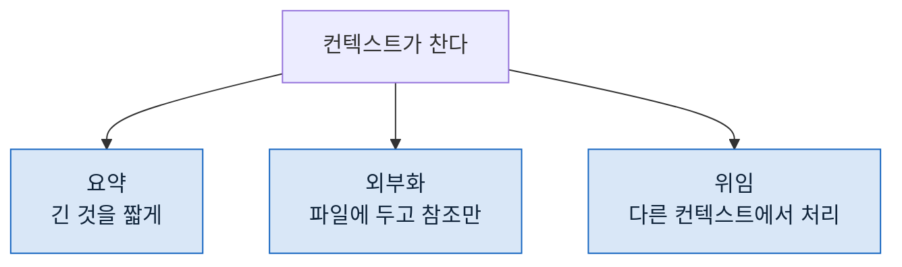

> **기준 출처:** [Anthropic Engineering, Effective context engineering for AI agents](https://www.anthropic.com/engineering/effective-context-engineering-for-ai-agents) · [Building Effective AI Agents](https://www.anthropic.com/engineering/building-effective-agents) / 확인일 2026-08-24
> **시리즈:** [목차](/posts/00-agentic-series/) | 이전 → [02. 에이전트 루프란 무엇인가](/posts/02-what-is-agent-loop/) | 다음 → [04. 언제 멈출까](/posts/04-when-to-stop/)

앞 편에서 관측이 곧 컨텍스트라고 했다. 그럼 그 컨텍스트를 어떻게 다루나.

## 1. 한정된 자원이다

컨텍스트를 "넣을 수 있는 만큼 넣는 곳" 으로 보면 틀린다. 창이 커져도 같은 문제가 반복되기 때문이다.

이유가 둘이다.

**창이 커지면 넣는 양도 커진다.** 여유가 생기면 "혹시 필요할까 봐" 넣게 되고, 결국 다시 찬다.

**차 있는 것과 유용한 것은 다르다.** 관련 없는 내용이 많으면 필요한 것을 찾기가 어려워진다. 사람이 자료를 찾을 때와 같다.

## 2. 그래서 무엇을 빼나

넣을 것을 고르는 것보다 **뺄 것을 고르는 것**이 어렵다. 넣을 것은 명확하고 뺄 것은 애매하기 때문이다.

한 바퀴가 끝났을 때 남은 것들을 이렇게 가른다.

| | 남길까 | 왜 |
| --- | --- | --- |
| 목표와 제약 | ✅ 항상 | 잊으면 방향이 흔들린다 |
| 지금까지의 결정 | ✅ 항상 | 다시 정하지 않으려면 |
| 실패한 시도 | ✅ **특히** | 안 남기면 같은 것을 또 한다 |
| 도구가 돌려준 원문 | ❌ 대개 | 필요한 것은 그중 몇 줄이다 |
| 중간 탐색 과정 | ❌ 대개 | 결론만 있으면 된다 |

세 번째가 자주 빠진다. 성공한 것만 남기면 실패를 반복한다.

## 3. 줄이는 세 가지 방법

**요약.** 긴 결과를 짧게 만들어 남긴다. 손실이 있으므로 무엇을 잃는지 알고 해야 한다.

**외부화.** 결과를 파일에 쓰고 컨텍스트에는 경로만 남긴다. 나중에 필요하면 다시 읽는다. 손실이 없고, 대신 다시 읽는 비용이 든다.

**위임.** 그 작업을 별도 컨텍스트에서 돌리고 요약만 받는다. 장황한 출력이 아예 이쪽으로 안 온다.

셋 중 **외부화가 가장 저평가**된다. 파일에 쓰는 것이 상태를 남기는 가장 단순한 방법이고, 부수적으로 사람이 읽을 수 있는 기록이 된다.

## 4. 무엇을 앞에 두나

컨텍스트 안에서도 자리가 중요하다. 길어지면 가운데가 흐려지는 경향이 있으므로, **바뀌지 않는 것을 앞에, 지금 필요한 것을 뒤에** 두는 배치가 무난하다.

| 자리 | 두는 것 |
| --- | --- |
| 앞 | 역할, 지켜야 할 규칙, 출력 형식 |
| 가운데 | 참고 자료 |
| 뒤 | 지금 해야 할 일, 직전 결과 |

규칙을 앞에 두는 것이 중요하다. 뒤에 두면 그때그때 일에 밀린다.

## 5. 재사용되는 부분을 안정시킨다

한 가지 실용적인 이유가 더 있다. 컨텍스트의 앞부분을 자주 바꾸지 않으면 **같은 앞부분을 반복해서 처리하는 비용**을 줄일 수 있다.

그래서 앞쪽에 매번 달라지는 값(현재 시각, 임시 경로, 진행 번호)을 넣으면 손해다. 그런 것은 뒤쪽에 둔다.

이건 성능 문제이기도 하지만 **재현성 문제**이기도 하다. 앞부분이 매번 같으면 무엇이 결과를 바꿨는지 좁히기 쉽다.

## 6. 언제 정리하나

정리 시점을 정해두지 않으면 항상 늦는다. 찼을 때 정리하면 이미 앞부분을 잃은 뒤다.

쓸 만한 시점 셋.

- **한 단계가 끝났을 때.** 그 단계의 중간 산출물은 대개 필요 없다
- **도구가 큰 것을 돌려줬을 때.** 그 자리에서 필요한 부분만 남긴다
- **방향을 바꿀 때.** 앞의 시도가 실패해 다른 길로 갈 때, 실패했다는 사실만 남기고 과정은 지운다

## 7. 이 층에서 안 풀리는 것

컨텍스트를 아무리 잘 다뤄도 안 풀리는 것이 있다.

**자기가 만든 것을 자기가 검사하는 문제.** 이건 컨텍스트를 정리해서 될 일이 아니라 **다른 컨텍스트**가 필요한 일이다. Agent 층의 이야기이고 05편에서 다룬다.

## 참고

- [Anthropic Engineering: Effective context engineering for AI agents](https://www.anthropic.com/engineering/effective-context-engineering-for-ai-agents)
- [Anthropic Engineering: Building Effective AI Agents](https://www.anthropic.com/engineering/building-effective-agents)
