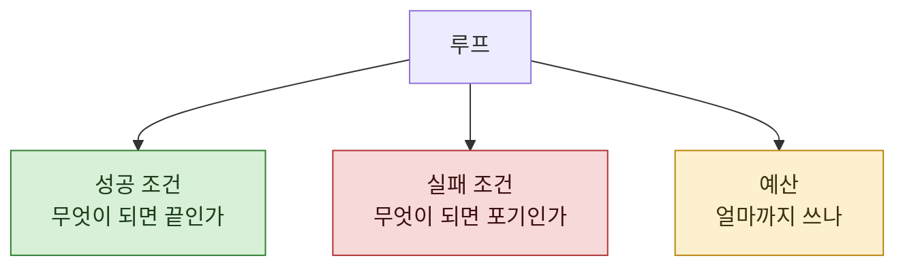

> **기준 출처:** [Anthropic Engineering, Building Effective AI Agents](https://www.anthropic.com/engineering/building-effective-agents) · [Effective harnesses for long-running agents](https://www.anthropic.com/engineering/effective-harnesses-for-long-running-agents) / 확인일 2026-08-24
> **시리즈:** [목차](/posts/00-agentic-series/) | 이전 → [03. 컨텍스트](/posts/03-context-engineering/) | 다음 → [05. 에이전트 한 명을 정의한다는 것](/posts/05-defining-an-agent/)

02편에서 남긴 두 문제, 같은 자리를 도는 것과 끝날 줄 모르는 것을 여기서 다룬다.

## 1. 스스로 멈추는 것에 기대면

"충분히 했으면 멈춰라" 는 판단이다. 판단은 매번 다르다.

같은 일에 어떤 회차는 세 바퀴에서 끝나고 어떤 회차는 서른 바퀴를 돈다. 둘 다 모델이 "이 정도면 됐다" 고 판단한 결과다. 어느 쪽도 틀린 판단은 아닌데 **결과가 다르다.**

원문이 지적하는 대로, 에이전트는 여러 회차를 돌게 되고 그 결정에 어느 정도 신뢰가 필요하다. 신뢰한다는 것은 **무한히 맡긴다는 뜻이 아니다.**

## 2. 밖에서 정해야 하는 셋



**성공 조건.** "테스트가 통과하면", "파일이 생기면" 처럼 확인 가능한 것으로 쓴다. "좋아지면" 은 조건이 아니다.

**실패 조건.** 이게 자주 빠진다. 성공만 정해두면 실패했을 때 계속 시도한다. "같은 오류가 두 번 나면 멈춘다" 같은 것이 필요하다.

**예산.** 위 둘이 다 안 걸렸을 때 걸리는 마지막 선이다. 바퀴 수, 시간, 비용 중 무엇이든 된다.

## 3. 🔴 왜 멈췄는지를 구분한다

셋을 정했으면 그다음이 더 중요하다. **어느 조건에 걸려 끝났는지를 구분해서 남겨야 한다.**

| 종료 사유 | 뜻 | 다음 행동 |
| --- | --- | --- |
| 성공 조건 | 됐다 | 다음으로 |
| 실패 조건 | 이 방법으로는 안 된다 | 방법을 바꾼다 |
| **예산 소진** | **아직 하는 중인데 멈췄다** | 예산을 늘리거나 범위를 줄인다 |

세 번째를 첫 번째와 구분하지 않으면 **미완을 완료로 읽는다.** 이건 실제로 흔한 사고다. 결과물이 있고 오류도 없으니 됐다고 넘어가는데, 사실은 중간에 끊긴 것이다.

## 4. 같은 자리를 도는 문제

02편의 다른 문제다. 시도했다 실패한 것을 다시 시도한다.

원인은 대개 컨텍스트다. 실패 기록이 밀려나면 그 시도가 없었던 일이 된다. 03편에서 **실패한 시도를 특히 남기라**고 한 이유가 이것이다.

그런데 컨텍스트에 남겨도 도는 경우가 있다. 두 방법 사이를 왕복하는 형태다.

```
A 를 시도 → 안 됨 → B 를 시도 → 안 됨 → A 가 나아 보인다 → A 를 시도 → …
```

이건 실패 조건으로 잡는다. **같은 행동이 N번 반복되면 멈춘다.** 판단에 맡기면 안 되는 것을 밖에서 세는 것이다.

## 5. 오래 도는 경우

Anthropic 은 오래 도는 에이전트를 위한 하네스 설계를 따로 다룬다. 긴 작업에서는 위의 셋만으로 부족해지기 때문이다.

긴 흐름에서 추가로 생기는 문제들.

- **중간에 끊긴다.** 예산이 아니라 외부 요인으로. 이어 붙일 수 있어야 한다
- **진행 상황이 안 보인다.** 몇 시간 도는데 밖에서는 아무것도 모른다
- **초반의 잘못이 끝까지 간다.** 방향이 틀렸는데 계속 판다

셋 다 Loop 층에서는 안 풀린다. Harness 층의 일이고 06편에서 다룬다.

## 6. 정리하면

루프에서 밖으로 빼야 하는 것은 결국 이 목록이다.

| 무엇 | 왜 밖에서 정하나 |
| --- | --- |
| 성공 조건 | 판단에 맡기면 매번 다르다 |
| 실패 조건 | 안 정하면 계속 시도한다 |
| 예산 | 마지막 선 |
| 반복 감지 | 세는 일은 코드가 잘한다 |
| 종료 사유 기록 | 안 남기면 미완을 완료로 읽는다 |

다섯 중 마지막이 제일 자주 빠지고, 빠졌을 때 제일 오래 모른다.

## 참고

- [Anthropic Engineering: Building Effective AI Agents](https://www.anthropic.com/engineering/building-effective-agents)
- [Anthropic Engineering: Effective harnesses for long-running agents](https://www.anthropic.com/engineering/effective-harnesses-for-long-running-agents)
