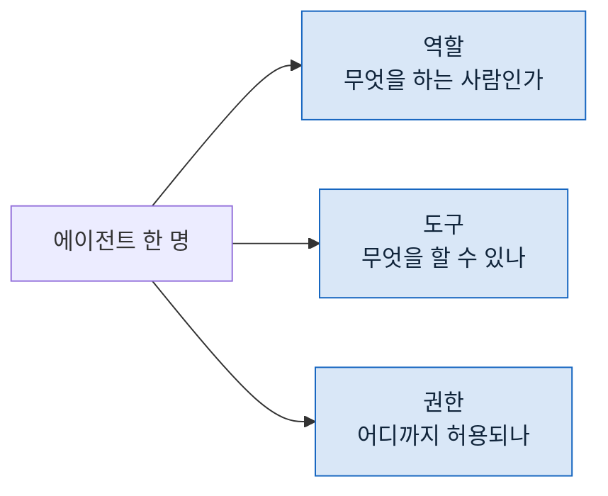

> **기준 출처:** [Anthropic Engineering, Writing effective tools for AI agents](https://www.anthropic.com/engineering/writing-tools-for-agents) · [Building Effective AI Agents](https://www.anthropic.com/engineering/building-effective-agents) / 확인일 2026-08-24
> **시리즈:** [목차](/posts/00-agentic-series/) | 이전 → [04. 언제 멈출까](/posts/04-when-to-stop/) | 다음 → [06. 하네스라는 층](/posts/06-harness-layer/)

가운데 층으로 올라간다. 루프 하나를 "누구" 로 만드는 일이다.

## 1. 정하는 것 셋



셋이 독립이 아니다. 역할이 정해지면 필요한 도구가 정해지고, 도구가 정해지면 권한의 범위가 정해진다.

거꾸로도 된다. **도구를 줄이면 역할이 좁아진다.** 읽기만 주면 그 에이전트는 조사밖에 못 한다. 이게 나중에 통제 수단이 된다.

## 2. 역할을 좁히는 이유

한 에이전트에게 다 시키면 안 되나. 되기는 된다. 그런데 두 가지를 잃는다.

**컨텍스트를 잃는다.** 조사하고 쓰고 검증하는 것을 한 컨텍스트에서 하면 조사 로그가 검증할 때까지 남는다. 03편의 문제다.

**독립성을 잃는다.** 자기가 쓴 것을 자기가 검증하면 통과시킨다. 이건 컨텍스트를 정리해서 안 풀린다. **다른 컨텍스트**여야 풀린다.

그래서 역할을 나눈다. 나누는 기준은 "일의 종류" 가 아니라 **"서로 안 보는 게 나은가"** 다.

| 나누는 게 나은 경우 | 왜 |
| --- | --- |
| 만드는 쪽과 검사하는 쪽 | 독립성 |
| 출력이 큰 작업과 그 결과를 쓰는 작업 | 컨텍스트 |
| 서로 다른 관점으로 같은 것을 볼 때 | 앞사람에게 안 끌리려고 |

## 3. 도구가 능력을 정한다

Anthropic 의 도구 설계 글이 강조하는 것이 있다. **도구는 에이전트가 세상을 보는 창이자 손**이므로, 도구의 설계가 곧 에이전트의 능력이다.

같은 모델에 같은 프롬프트를 줘도 도구가 다르면 다른 일을 한다.

```
읽기 + 검색           → 조사만 할 수 있다
읽기 + 검색 + 쓰기    → 산출물을 만들 수 있다
+ 외부 시스템         → 바깥을 볼 수 있다
```

그래서 "이 에이전트가 무엇을 할 수 있나" 는 프롬프트가 아니라 **도구 목록을 보면 안다.** 정의 파일의 위쪽 몇 줄이 그 답이다.

## 4. 좋은 도구의 조건

같은 글에서 실용적인 지침이 나온다. 요약하면 이렇다.

**필요한 것만 돌려준다.** 02편에서 본 문제다. 전부 돌려주는 도구는 컨텍스트를 태운다.

**이름과 설명이 분명하다.** 모델이 언제 쓸지를 그것만 보고 정한다. 애매하면 안 쓰거나 잘못 쓴다.

**오류가 무엇인지 말한다.** "실패했습니다" 만 돌려주면 다음 판단을 못 한다. 무엇이 왜 안 됐는지가 있어야 고친다.

**부작용이 예측 가능하다.** 같은 인자로 부르면 같은 일이 일어나야 한다.

세 번째가 실무에서 값이 크다. 오류 메시지가 좋으면 에이전트가 스스로 고치고, 나쁘면 같은 것을 반복한다. 04편의 "같은 자리를 도는" 문제가 여기서도 온다.

## 5. 권한은 별개다

도구를 줬다고 아무 데나 써도 되는 것은 아니다. 도구는 **할 수 있는 동작의 종류**를 정하고, 권한은 **그 동작의 범위**를 정한다.

| | 정하는 것 | 어떻게 |
| --- | --- | --- |
| 도구 | 쓰기를 할 수 있는가 | 도구 목록 |
| 권한 | 어디에 쓸 수 있는가 | 지시, 설정, 사후 검사 |

이 둘을 섞으면 헛다리를 짚는다. "쓰기를 뺐으니 안전하다" 는 맞지만, "쓰기를 줬는데 여기만 쓰라고 했으니 안전하다" 는 다르다. 뒤쪽은 약속이다.

## 6. 안 나누는 편이 나은 경우

역할을 나누는 데도 비용이 든다.

**부르는 비용.** 별도 컨텍스트를 띄우는 것 자체가 시간이다. 한 번 읽고 끝날 일에는 손해다.

**설명하는 비용.** 격리된 에이전트는 아무 배경도 모른다. 필요한 것을 다 적어줘야 하고, 그게 길어진다.

**합치는 비용.** 여러 명의 결과를 모아 정리하는 일이 새로 생긴다.

기준을 하나로 하면 이렇다. **그 일이 한 사람이 끝까지 들고 가도 되는 일이면 안 나눈다.** 나눠야 하는 이유가 위 2절의 셋 중 하나여야 한다.

## 참고

- [Anthropic Engineering: Writing effective tools for AI agents](https://www.anthropic.com/engineering/writing-tools-for-agents)
- [Anthropic Engineering: Building Effective AI Agents](https://www.anthropic.com/engineering/building-effective-agents)
