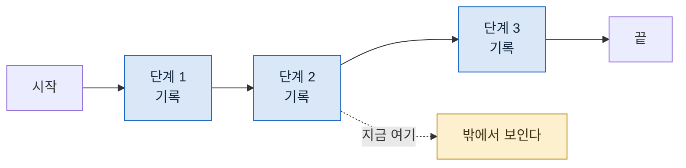

> **기준 출처:** [Anthropic Engineering, Effective harnesses for long-running agents](https://www.anthropic.com/engineering/effective-harnesses-for-long-running-agents) · [Building Effective AI Agents](https://www.anthropic.com/engineering/building-effective-agents) / 확인일 2026-08-24
> **시리즈:** [목차](/posts/00-agentic-series/) | 이전 → [05. 에이전트 한 명을 정의한다는 것](/posts/05-defining-an-agent/) | 다음 → [07. 세 층이 어긋날 때](/posts/07-when-layers-mismatch/)

맨 위 층이다. 루프와 에이전트를 아무리 잘 만들어도 안 풀리는 것들이 여기 모인다.

## 1. 짧은 일과 긴 일은 다른 문제를 갖는다

몇 분 도는 일에서는 결과만 보면 된다. 몇 시간 도는 일에서는 다르다.

| 짧은 일 | 긴 일 |
| --- | --- |
| 결과를 보면 된다 | **도는 동안 아무것도 안 보인다** |
| 실패하면 다시 한다 | 다시 하기에 너무 비싸다 |
| 방향이 틀리면 금방 안다 | **끝까지 가서야 안다** |

오른쪽 셋이 하네스가 푸는 문제다.

## 2. 기록이 원본이다

Anthropic 의 장기 실행 하네스 글이 강조하는 축이 이것이다. **에이전트의 작업 결과가 대화가 아니라 저장소에 남아야 한다.**

대화에만 있으면 잃는 것이 셋이다.

- 세션이 끝나면 없어진다
- 사람이 나중에 읽을 수 없다
- 다음 회차가 이어받을 수 없다

파일로 남기면 셋 다 풀린다. 그리고 부수 효과가 있다. **파일이 되면 검토 대상이 된다.** 대화 안에 있는 판단은 지적할 자리가 없는데, 파일이 되면 그 줄을 가리킬 수 있다.

## 3. 진행이 보여야 한다



단계마다 기록이 남으면 도는 중에도 어디까지 갔는지 보인다. 이게 없으면 두 시간 동안 아무것도 모르고 기다린다.

그리고 더 중요한 것. **방향이 틀렸을 때 일찍 안다.** 세 번째 단계에서 이상한 결론이 나온 것이 보이면 끝까지 안 기다리고 끊을 수 있다.

## 4. 끊기면 이어져야 한다

긴 일은 반드시 중간에 끊긴다. 이어 붙이려면 두 가지가 필요하다.

**어디까지 갔는지.** 단계 기록이 그 답이다.

**그 단계의 입력이 무엇이었는지.** 이게 자주 빠진다. 입력을 안 남기면 재사용해도 되는지 판단할 수 없다. 입력이 바뀌었으면 그 단계부터 다시 돌아야 한다.

규칙은 하나다. **바뀌지 않은 앞부분까지만 재사용하고, 처음 바뀐 지점부터 끝까지 다시 돈다.** 중간만 갈아끼우면 뒤 결과들이 옛 앞부분을 보고 만든 것이라 근거가 어긋난다.

## 5. 결정적이지 않은 값을 흐름 밖으로

이어 붙이기를 깨뜨리는 원인이 거의 하나다.

🔴 **현재 시각, 난수, 매번 달라지는 임시 경로가 단계의 입력에 섞일 때.**

이러면 "같은 입력" 판정이 절대 성립하지 않는다. 재개할 때마다 전부 새로 돈다.

```
❌ 각 단계가 실행 시각을 스스로 읽는다
✅ 시작할 때 한 번 읽어 매개변수로 넘긴다
```

흐름 자체는 순수하게 두고, 변하는 값은 바깥이 책임진다. 제어 쪽 말로 하면 상태를 외부에서 주입하는 것이다.

## 6. 검사를 어디에 두나

하네스가 하는 다른 일이 검사다. 단계 사이에 검사를 끼워 넣으면 잘못된 결과가 다음으로 안 흘러간다.

검사는 성격이 둘로 갈린다.

| | 무엇 | 누가 |
| --- | --- | --- |
| **형식** | 모양이 맞는가, 필드가 있는가 | 코드 |
| **내용** | 사실이 맞는가, 읽히는가 | 다른 에이전트 |

앞은 스키마로 하고 뒤는 검증자를 붙인다. 둘을 섞으면 안 된다. 형식 검사를 모델에게 시키면 느리고 흔들리고, 내용 검사를 코드로 하려 하면 못 한다.

## 7. 세 층이 각각 무엇을 푸는가

여기까지 오면 정리가 된다.

| 층 | 푸는 문제 | 못 푸는 문제 |
| --- | --- | --- |
| **Loop** | 무엇을 보고 무엇을 기억하나 | 자기 검증 |
| **Agent** | 누가 무엇을 할 수 있나 | 여러 명의 순서 |
| **Harness** | 순서, 기록, 재개, 검사 | 각 단계 안의 판단 |

각 층이 아래층의 못 푸는 문제를 푼다. 그래서 아래층 문제를 위층에서 고치려 하거나 그 반대로 하면 안 된다. 다음 편이 그 이야기다.

## 참고

- [Anthropic Engineering: Effective harnesses for long-running agents](https://www.anthropic.com/engineering/effective-harnesses-for-long-running-agents)
- [Anthropic Engineering: Building Effective AI Agents](https://www.anthropic.com/engineering/building-effective-agents)
