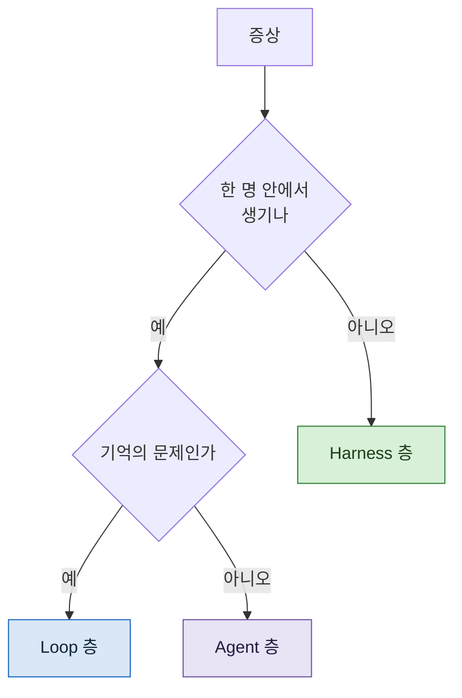

> **기준 출처:** 이 연재 02~06편의 종합이고 개별 근거는 각 편의 출처를 따른다. 증상과 층의 대응은 이 연재가 정리한 것이며 외부 문헌의 분류를 옮긴 것이 아니다. / 확인일 2026-08-24
> **시리즈:** [목차](/posts/00-agentic-series/) | 이전 → [06. 하네스라는 층](/posts/06-harness-layer/) | 다음 → [08. 같은 개념, 다른 제품](/posts/08-same-concept-different-product/)

층을 나눈 값은 여기서 나온다. **증상을 보고 어디를 고칠지 좁히는 것.**

## 1. 왜 층을 잘못 짚나

무엇이 잘못됐을 때 반사적으로 손대는 자리가 정해져 있다. 대개 프롬프트다. 프롬프트가 제일 만만하기 때문이다.

그런데 프롬프트는 Loop 층의 도구다. Harness 층 문제를 프롬프트로 고치려 하면 이렇게 된다.

```
증상: 검증이 통과만 시킨다
❌ 프롬프트에 "엄격하게 봐라" 를 추가
❌ 안 되니까 "정말 엄격하게" 로 강화
❌ 안 되니까 규칙을 열 줄 추가
✅ 검증자를 다른 컨텍스트로 뺀다  ← Agent 층
```

위 셋은 확률을 조금 올리고 끝난다. 구조가 그대로이기 때문이다.

## 2. 진단표



## 3. 증상별로

### Loop 층 문제

| 증상 | 무엇을 고치나 |
| --- | --- |
| 앞에서 정한 것을 잊는다 | 컨텍스트 배치. 규칙을 앞에 |
| 컨텍스트가 금방 찬다 | 도구 반환값. 필요한 것만 돌려주게 |
| 같은 시도를 반복한다 | 실패 기록을 남긴다 |
| 안 끝난다 | 종료 조건과 예산을 밖에서 정한다 |
| 왜 멈췄는지 모른다 | 종료 사유를 구분해 기록한다 |

### Agent 층 문제

| 증상 | 무엇을 고치나 |
| --- | --- |
| 자기가 만든 것을 통과시킨다 | 검증자를 **다른 컨텍스트**로 |
| 하지 말라는 것을 한다 | 부탁이 아니라 **도구를 뺀다** |
| 엉뚱한 도구를 쓴다 | 도구 이름과 설명을 고친다 |
| 오류가 나면 헤맨다 | 도구의 오류 메시지를 고친다 |
| 배경을 몰라 엉뚱한 답을 한다 | 프롬프트에 적어준다. 격리는 배경도 막는다 |

### Harness 층 문제

| 증상 | 무엇을 고치나 |
| --- | --- |
| 매번 다른 순서로 돈다 | 순서를 코드로 뺀다 |
| 도는 동안 아무것도 안 보인다 | 단계마다 기록을 남긴다 |
| 끊기면 처음부터 다시 | 단계 기록에 **입력도** 남긴다 |
| 재개했는데 결과가 어긋난다 | 결정적이지 않은 값을 흐름 밖으로 |
| 잘못된 결과가 끝까지 간다 | 단계 사이에 검사를 넣는다 |

## 4. 흔한 오진 넷

**오진 1. 컨텍스트 문제를 모델 문제로 본다.**
"모델이 앞을 잊는다" 는 대개 모델 문제가 아니라 배치 문제다. 규칙이 뒤에 있으면 밀린다.

**오진 2. 독립성 문제를 프롬프트로 푼다.**
1절의 예다. 같은 컨텍스트 안에서는 아무리 세게 써도 통과시킨다.

**오진 3. 재현성 문제를 온도로 푼다.**
출력의 흔들림을 줄이는 것과 실행 순서를 고정하는 것은 다른 문제다. 순서는 코드로 빼야 한다.

**오진 4. 층을 늘려서 푼다.**
가장 비싼 오진이다. 한 명으로 되는 일에 세 명을 붙이면 느려지고 비싸지고 합치는 문제가 새로 생긴다. 01편의 전제로 돌아가면, **가장 단순한 해법을 먼저 찾는다.**

## 5. 순서

여러 증상이 겹칠 때는 아래층부터 본다.

```
Loop → Agent → Harness
```

이유가 있다. **아래층 문제는 위층에서 안 풀리는데, 위층 문제는 아래층을 고쳐도 남는다.** 그리고 아래층이 고쳐지면 위층 증상이 같이 사라지는 경우가 꽤 있다.

예를 들어 "여러 에이전트를 붙였는데 여전히 느리다" 는 Harness 문제로 보이지만, 각 에이전트의 도구가 전부 돌려주고 있어서 컨텍스트가 터지는 Loop 문제일 때가 많다.

## 6. 층을 안 나눠도 되는 경우

마지막으로 반대쪽. 이 진단표가 필요 없는 경우가 있다.

**한 번 시켜서 되는 일.** 층을 나누는 것 자체가 비용이다.

**결과를 바로 확인하는 일.** 사람이 옆에서 보고 있으면 대부분의 문제가 그 자리에서 잡힌다.

**아직 방법을 찾는 중인 일.** 무엇이 잘못됐는지 모르는 상태에서 구조를 고정하면 잘못된 구조가 굳는다.

## 참고

이 편의 개별 근거는 [02](/posts/02-what-is-agent-loop/), [03](/posts/03-context-engineering/), [04](/posts/04-when-to-stop/), [05](/posts/05-defining-an-agent/), [06](/posts/06-harness-layer/)편의 출처 블록에 있다.
