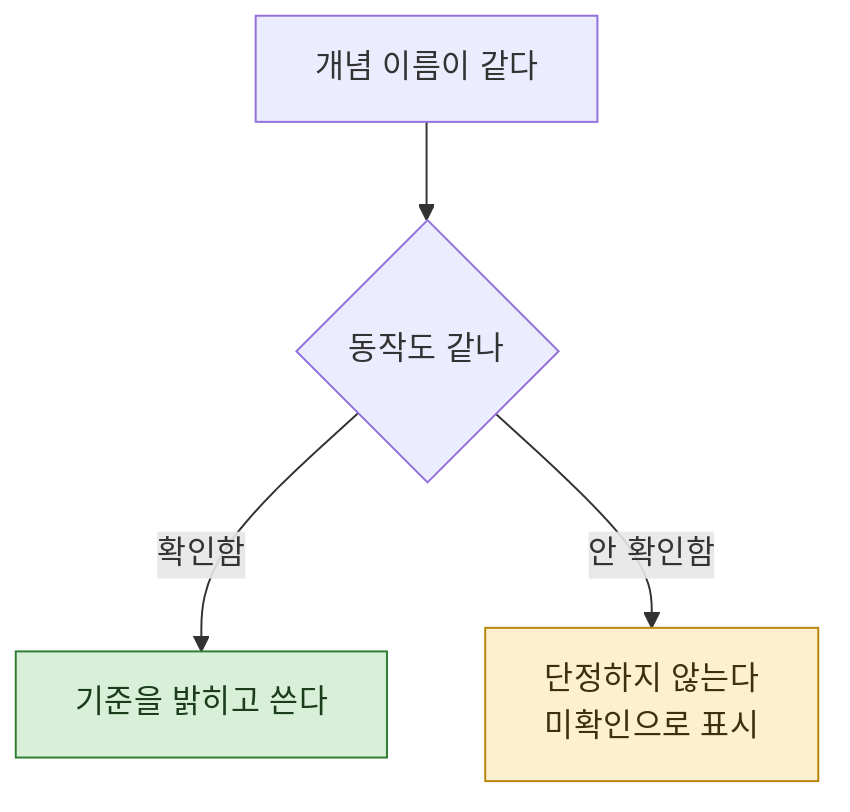

> **기준 출처:** [Claude Code Docs, Hooks reference](https://code.claude.com/docs/en/hooks) / 확인일 2026-08-24. 이 편에서 실제로 확인한 것은 Claude Code 쪽 동작뿐이고, 다른 제품의 현행 동작은 이번에 열어보지 않았다.
> **시리즈:** [목차](/posts/00-agentic-series/) | 이전 → [07. 세 층이 어긋날 때](/posts/07-when-layers-mismatch/)

에이전트 도구가 여럿이고 개념 이름이 겹친다. 그래서 한쪽에서 배운 것을 다른 쪽에 그대로 옮기게 된다.

## 1. 겹치는 이름들

| 개념 | 대개 이런 뜻으로 쓰인다 |
| --- | --- |
| **Hook** | 생명주기 지점에서 도는 것 |
| **서브에이전트** | 별도 컨텍스트에서 도는 역할 |
| **도구** | 모델이 부를 수 있는 함수 |
| **Skill** 또는 유사한 것 | 재사용 가능한 지식과 절차 묶음 |

이름이 같으니 개념도 같다. 여기까지는 맞다. 문제는 **세부 동작**이다.

## 2. 실제로 겪은 것

에이전트 관련 자료를 정리하다가 이런 서술을 만났다.

> Stop hook 은 에이전트가 회차를 끝내려 할 때 돈다. 검증이 안 끝났으면 실패를 반환한다. 즉 **"에이전트가 끝났다고 생각함"** 과 **"하네스가 종료를 허용함"** 을 분리할 수 있다.

이 분리가 강력해 보였다. 완료를 스스로 선언하는 문제를 구조적으로 막는 유일한 결정론적 수단이기 때문이다.

그래서 확인해봤다. **막을 수 있는지가 이 서술의 전부**인데, 막을 수 있느냐는 제품마다 다를 수 있다.

## 3. 확인한 것

Claude Code 쪽은 문서에 분명히 있다.

exit code 2 가 "멈춰, 하지 마" 라는 신호이고, 그 효과는 이벤트마다 다르다. 막을 수 있는 동작이 있고 이미 일어나 막을 수 없는 것도 있다. 차단 사유는 JSON 의 blocking decision 에 있는 `reason` 이 쓰이고, 없으면 stderr 텍스트가 쓰인다.

그리고 `Stop` 이벤트는 최상위 `decision` 과 `reason` 형식을 쓴다고 명시돼 있다.

즉 **Claude Code 에서는 그 분리가 성립한다.**

## 4. 확인하지 않은 것

여기서 멈추는 것이 중요하다.

🔴 **다른 제품의 현행 동작은 이번에 열어보지 않았다.** 그러니 "저쪽은 안 된다" 고 쓸 수 없다.

🔴 **원본 서술이 언제 기준이었는지도 모른다.** 문서가 움직였을 수도 있고 원본이 부정확했을 수도 있다. 둘 중 어느 쪽인지는 미확인이다.

이 두 줄을 안 쓰고 "A 는 되고 B 는 안 된다" 라고 단정하면 그 글이 틀릴 위험을 안는다. **확인한 만큼만 쓰는 편**이 낫다.

## 5. 그래서 무엇을 얻었나

결론은 단순하다.

> **어느 제품 기준인지 밝히면 그 서술은 옳다. 안 밝히면 틀릴 수 있다.**

같은 개념이 제품마다 갈리는 지점이 있고, 그 지점이 하필 **설계를 바꾸는 자리**일 수 있다. 막을 수 있느냐 없느냐는 "완료 선언을 구조적으로 막을 수 있는가" 를 정하므로, 이 하나로 하네스 설계가 달라진다.

## 6. 옮길 때 확인할 것

다른 도구의 자료를 자기 환경에 옮길 때 봐야 할 것들.

| 확인할 것 | 왜 |
| --- | --- |
| **차단 가능 여부** | 되는 줄 알고 설계했는데 안 되면 통째로 무너진다 |
| **실행 시점** | 같은 이름이라도 전인지 후인지가 다를 수 있다 |
| **전달되는 정보** | 차단 사유가 모델에게 가는지, 그냥 막히는지 |
| **범위** | 프로젝트 단위인지 전역인지 |
| **문서 날짜** | 빠르게 바뀌는 영역이다 |

마지막 줄이 실용적으로 제일 크다. **확인일을 함께 적어두면** 나중에 그 서술을 다시 볼지 판단할 수 있다.

## 7. 연재를 닫으며

세 층으로 나눠 봤다. Loop 는 무엇을 보고 기억하고 언제 멈추나, Agent 는 누가 무엇을 할 수 있나, Harness 는 그것들을 어떻게 엮나.

나누는 값은 07편에 있다. **증상을 보고 어디를 고칠지 좁히는 것.** 층을 몰라도 시스템은 돌지만, 문제가 생겼을 때 어디를 봐야 할지 모른다.

그리고 01편의 전제를 다시 적어둔다. 원문의 권고대로 **가장 단순한 해법을 먼저 찾고, 필요할 때만 복잡도를 올린다.** 층을 늘리는 것이 목표였던 적은 없다.

여러 에이전트를 실제로 엮는 배선은 [따로 정리했다](/posts/00-orch-series/). 이 도구를 어떻게 세팅했는지는 [여기](/posts/00-ccsetup-series/)에 있다.

## 참고

- [Claude Code Docs: Hooks reference](https://code.claude.com/docs/en/hooks)
