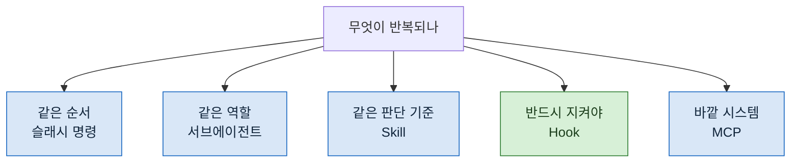

> **기준 출처:** 이 연재 전체의 지도이고 개별 근거는 각 편의 출처를 따른다. 인용은 전부 [Claude Code 공식 문서](https://code.claude.com/docs/en/overview)에 건다. / 확인일 2026-08-24

## 이 연재가 답하는 질문

같은 지시를 세 번째 반복해서 쓰고 있다면 무엇을 만들어야 하는가.

## 다섯 갈래

넷은 모델이 잘 하도록 돕고, **Hook 하나만 모델을 안 거친다.** 그 차이가 이 연재에서 반복해서 나온다.

## 읽는 순서

### 1부. 왜와 무엇

| # | 글 | 무엇을 얻나 |
| --- | --- | --- |
| 01 | [왜 프롬프트만으로는 안 되나](/posts/01-why-prompt-is-not-enough/) | 잊는다, 틀린다, 재현이 안 된다. 셋 다 양이 늘면 나빠진다 |
| 02 | [슬래시 명령, 절차를 파일로 굳히기](/posts/02-slash-commands/) | 값은 자동화가 아니라 절차가 검토 대상이 되는 것 |
| 03 | [서브에이전트, 컨텍스트를 격리한다](/posts/03-subagents/) | 격리가 주는 것 둘, 뺏는 것 하나 |

### 2부. 통제

| # | 글 | 무엇을 얻나 |
| --- | --- | --- |
| 04 | [도구를 안 주는 것으로 막는다](/posts/04-tools-not-requests/) | 부탁은 확률적이고 권한은 구조적이다. 그리고 **경로는 못 묶는다** |
| 05 | [검증은 쓴 쪽이 하지 않는다](/posts/05-independent-verification/) | "실패 0건" 과 "0건을 검사했다" 를 가르는 법 |
| 06 | [Hook, 모델 판단을 우회하는 층](/posts/06-hooks/) | 🔴 **오탐률을 먼저 재고 건다.** 안 그러면 방어선을 죽인다 |

### 3부. 확장과 운영

| # | 글 | 무엇을 얻나 |
| --- | --- | --- |
| 07 | [Skill, 절차를 대화 앞에 세우기](/posts/07-skills/) | 무엇을 할지가 아니라 어떻게 생각할지를 담는다 |
| 08 | [MCP, 로컬 도구를 붙인다](/posts/08-mcp/) | 붙는 순간 그 내용이 세션을 통과한다는 것 |
| 09 | [예약 실행과 무인 운영](/posts/09-scheduled-runs/) | 실패보다 **중단**을 알아채는 것이 어렵다 |
| 10 | [다섯 갈래를 언제 쓰나](/posts/10-choosing-a-layer/) | 고르는 기준과 만들지 않기로 한 것들 |

## 30초 사전

| 나오는 말 | 한 줄로 |
| --- | --- |
| **슬래시 명령** | 마크다운 파일 하나가 `/이름` 명령이 된다. 절차를 담는다 |
| **서브에이전트** | 별도 컨텍스트에서 도는 역할. 부모의 대화 이력을 못 본다 |
| **Skill** | 지식과 작업 방식을 담은 파일. 관련될 때 자동으로 걸릴 수도 있다 |
| **Hook** | 생명주기 지점에서 강제로 도는 명령. 모델이 부를지 판단하지 않는다 |
| **MCP** | 외부 시스템에 붙는 열린 표준. 붙이면 도구가 늘어난다 |
| **허용 목록** | 쓸 수 있는 도구를 열거하는 방식. 차단 목록보다 안전하다 |

## 이 연재가 안 다루는 것

**여러 에이전트를 어떻게 엮을 것인가.** 그건 층이 하나 위라서 [따로 정리했다](/posts/00-orch-series/).

**개념 자체의 정리.** Loop, Agent, Harness 세 층 구분은 [에이전틱 엔지니어링 연재](/posts/00-agentic-series/)에 있다. 이 연재는 그것을 도구에 붙이는 쪽이다.

**설정 파일의 모든 항목.** 공식 문서가 이미 있고 그쪽이 정확하다. 여기서는 무엇을 왜 골랐는지만 쓴다.

## 미리 말해두는 것

이 연재의 예시는 **성격이 다른 것만 골라** 실었다. 내 명령 목록 전체나 설정 파일 원문은 싣지 않는다.

02편에서 다루지만, 그런 목록은 **그 자체가 정보**다. 무슨 일을 하고 있는지가 그대로 드러난다. 설명에 필요한 만큼만 보이는 편이 낫고, 실제로 그만큼이면 충분했다.
