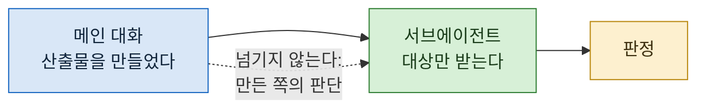

> **기준 출처:** [Claude Code Docs, Create custom subagents](https://code.claude.com/docs/en/sub-agents) · [Claude Agent SDK, Subagents](https://platform.claude.com/docs/en/agent-sdk/subagents) / 확인일 2026-08-24
> **시리즈:** [목차](/posts/00-ccsetup-series/) | 이전 → [02. 슬래시 명령](/posts/02-slash-commands/) | 다음 → [04. 도구를 안 주는 것으로 막는다](/posts/04-tools-not-requests/)

명령이 절차를 고정한다면, 서브에이전트는 **누가 그 일을 하는지**를 고정한다.

## 1. 정의 파일

`.claude/agents/` 에 마크다운 파일을 둔다. YAML 머리말로 설정하고 그 아래에 시스템 프롬프트를 쓴다.

```yaml
---
name: safe-researcher
description: Research agent with restricted capabilities
tools: Read, Grep, Glob, Bash
---
```

문서에 따르면 저장 위치는 범위에 따라 갈린다. `.claude/agents/` 는 현재 프로젝트, `~/.claude/agents/` 는 모든 프로젝트다.

## 2. 문서가 말하는 성질

공식 문서의 서술을 그대로 옮기면 이렇다.

> 각 서브에이전트는 자기 컨텍스트 창, 자기 시스템 프롬프트, 지정된 도구 접근 권한, 독립된 권한을 갖는다.

그리고 더 중요한 문장이 이어진다.

> 각 서브에이전트는 **새로 격리된 컨텍스트 창에서 시작한다.** 당신의 대화 이력, 이미 호출한 skill, Claude 가 이미 읽은 파일을 보지 못한다.

## 3. 이 성질이 하는 일 두 가지

문서가 첫 번째 쓸모로 드는 것은 **컨텍스트 절약**이다. 테스트 실행, 문서 조회, 로그 처리처럼 출력이 많은 작업을 서브에이전트에 맡기면 그 장황한 출력은 서브에이전트 쪽에 남고 본 대화에는 요약만 돌아온다.

이건 분명한 값이지만, 실제로 써보니 두 번째가 더 컸다.

**앞사람의 결론에 끌려가지 않는다.**

같은 대화 안에서 "방금 만든 것 검토해 줘" 라고 하면 통과시킨다. 판단의 근거가 눈앞에 있고 의심할 재료가 없기 때문이다. 새 컨텍스트는 그 근거를 안 갖고 시작한다.



점선이 요점이다. **무엇을 안 넘기느냐가 무엇을 넘기느냐보다 중요하다.**

## 4. 양날이다

격리는 필요한 배경도 막는다.

프롬프트에 안 적은 것은 그 서브에이전트에게 **존재하지 않는다.** "아까 그 파일" 이라고 쓰면 아무 뜻이 없고, "우리가 정한 규칙대로" 도 마찬가지다.

그래서 위임할 때 프롬프트가 길어진다. 길어지는 것이 정상이고, 그걸 줄이려고 "본 대화를 참고해서" 같은 말을 쓰면 격리의 값이 사라진다.

## 5. 역할을 나누는 기준

몇 개 만들어보면 이렇게 갈린다.

| 역할 | 하는 일 | 특징 |
| --- | --- | --- |
| **탐색자** | "이게 어디 있나", "몇 개인가" 를 확인해 온다 | 탐색 로그가 본 대화를 어지럽히지 않는다 |
| **검증자** | 방금 만든 것이 맞는지 독립적으로 본다 | 앞선 작업의 완료 보고를 근거로 삼지 않는다 |
| **관점 대역** | 특정 시점으로 문서를 읽는다 | 처음 보는 사람, 특정 독자 |
| **작업자** | 배정받은 산출물 하나를 만든다 | 병렬로 여러 명이 돈다 |

앞의 셋이 읽기만 하고 마지막만 쓴다. 이 구분이 다음 편의 주제다.

## 6. 실패하는 경우

**너무 잘게 나눈다.** 서브에이전트를 부르는 비용이 그 일보다 크면 손해다. 한 번 읽고 끝날 일은 그냥 읽으면 된다.

**결과를 안 믿는다.** 격리했는데 돌아온 답을 메인이 다시 전부 확인하면 격리한 의미가 없다. 믿을 만한 형태로 돌려받도록 반환 형식을 정해두는 편이 낫다.

**맥락을 안 주고 시킨다.** 4번의 반대다. 필요한 것을 안 적으면 엉뚱한 답이 온다. 그리고 그 답이 그럴듯하다.

## 참고

- [Claude Code Docs: Create custom subagents](https://code.claude.com/docs/en/sub-agents)
- [Claude Agent SDK: Subagents](https://platform.claude.com/docs/en/agent-sdk/subagents)
