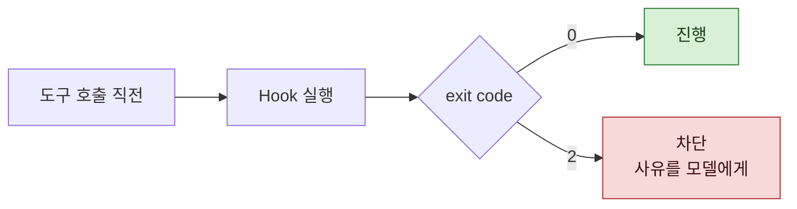

> **기준 출처:** [Claude Code Docs, Hooks reference](https://code.claude.com/docs/en/hooks) · [Automate actions with hooks](https://code.claude.com/docs/en/hooks-guide) / 확인일 2026-08-24
> **시리즈:** [목차](/posts/00-ccsetup-series/) | 이전 → [05. 검증은 쓴 쪽이 하지 않는다](/posts/05-independent-verification/) | 다음 → [07. Skill, 절차를 대화 앞에 세우기](/posts/07-skills/)

여기서 성격이 바뀐다. 앞의 넷은 모델이 잘 하도록 돕는 층이었다. Hook 은 다르다.

## 1. 모델을 안 거친다

Hook 은 도구 실행 전후 같은 생명주기 지점에서 **정해진 명령을 실행한다.** 모델이 그걸 부를지 말지 판단하지 않는다.

이 차이가 전부다.

| | 앞의 넷 | Hook |
| --- | --- | --- |
| 실행 주체 | 모델이 판단해서 | 하네스가 강제로 |
| 잊을 수 있나 | 있다 | 없다 |
| 맥락이 길어지면 | 약해진다 | 그대로 |

프롬프트에 "파일 쓸 때마다 이름 규칙을 확인해라" 라고 쓰면 대개 확인한다. Hook 으로 걸면 **반드시** 확인한다.

## 2. 막을 수 있다

문서에 따르면 exit code 2 가 "멈춰, 하지 마" 라는 신호다. 그 효과는 이벤트마다 다르다. 아직 일어나지 않은 도구 호출처럼 막을 수 있는 동작이 있고, 이미 일어났거나 막을 수 없는 것도 있다.

차단 사유는 JSON 의 blocking decision 에 있는 `reason` 이 쓰이고, 없으면 stderr 텍스트가 쓰인다.

차단 사유가 모델에게 전달된다는 점이 중요하다. 그냥 막히는 게 아니라 **왜 막혔는지 알고 고칠 수 있다.**

## 3. 무엇을 걸 것인가

무엇이든 걸 수 있으니 오히려 기준이 필요하다. 내가 쓴 기준은 하나다.

> **"판단이 아니라 사실"인 것만 건다.**

파일명에 공백이 있는지는 사실이다. 보면 안다. 반면 "이 문장이 적절한가" 는 판단이다. Hook 으로 걸면 안 된다.

실제로 건 것들.

| 시점 | 검사 | 왜 사실인가 |
| --- | --- | --- |
| 쓰기 직전 | 파일명에 공백이 있으면 차단 | 있거나 없거나다 |
| 쓰기 직전 | 특정 폴더에 금지 문자가 있으면 차단, 몇 행인지 함께 | 문자열 매칭이다 |
| 쓴 직후 | 스크립트 파일에 인코딩 표식이 없으면 자동으로 붙인다 | 바이트를 보면 안다 |

세 번째는 차단이 아니라 **자동 보정**이다. 사람이 고칠 필요가 없는 것은 고쳐주는 편이 낫다.

## 4. 🔴 오탐률을 먼저 재고 건다

이게 이 편에서 제일 하고 싶은 말이다.

Hook 은 반드시 돌기 때문에, **오탐도 반드시 뜬다.** 그리고 경고가 잦으면 사람이 무시하게 된다. 무시하기 시작하면 진짜 경고도 함께 묻힌다.

즉 **오탐은 미탐만큼 위험하다.** 검사기를 켠 것이 오히려 방어선을 깎는다.

그래서 걸기 전에 기존 파일 전체에 그 검사를 돌려본다. 몇 건이 걸리는지 세고, 걸린 것을 하나씩 읽는다. 이 과정에서 실제로 벌어진 일.

- 제안했던 검사 하나는 **폐기**했다. 정당하게 그 형태를 쓰는 경우가 이미 많았다
- 다른 하나는 **범위를 좁혔다.** 특정 폴더에서만 문제가 되는 규칙이었고, 다른 폴더에서는 정상 용법이었다

세 개 제안 중 둘이 이렇게 줄었다. 그냥 걸었으면 매번 시끄러웠을 것이다.

## 5. 이미 있는 것에 대한 기준선

새로 거는 검사가 기존 파일에서 걸릴 때가 있다. 두 선택지가 있다.

| | 결과 |
| --- | --- |
| 항목을 뺀다 | 노이즈는 없어지지만 **진짜 위반도 못 잡는다** |
| 기준선을 기록한다 | 항목은 살고, 알려진 것만 통과한다 |

두 번째가 낫다. 검사 목록에 "이 파일들의 이 항목은 확인된 것" 이라고 적어두면, 새로 생기는 위반만 눈에 띈다.

지우는 것과 통과시키는 것은 다르다. **지우면 방어가 없어지고, 기준선은 방어를 남긴다.**

## 6. Hook 이 못 하는 것

🔴 **판단이 필요한 검사는 못 한다.** 문맥을 봐야 아는 것, 정도의 문제인 것은 Hook 으로 안 된다. 그건 05편의 검증자 자리다.

🔴 **되돌릴 수 없는 동작 앞의 사람 게이트를 대신 못 한다.** Hook 은 규칙을 강제할 뿐 승인을 대신하지 않는다. 발행이나 배포처럼 한 번 나가면 못 되돌리는 것 앞에는 사람이 서야 한다. 그 자리는 자동화하지 않는 것으로만 지켜진다.

## 참고

- [Claude Code Docs: Hooks reference](https://code.claude.com/docs/en/hooks)
- [Claude Code Docs: Automate actions with hooks](https://code.claude.com/docs/en/hooks-guide)
