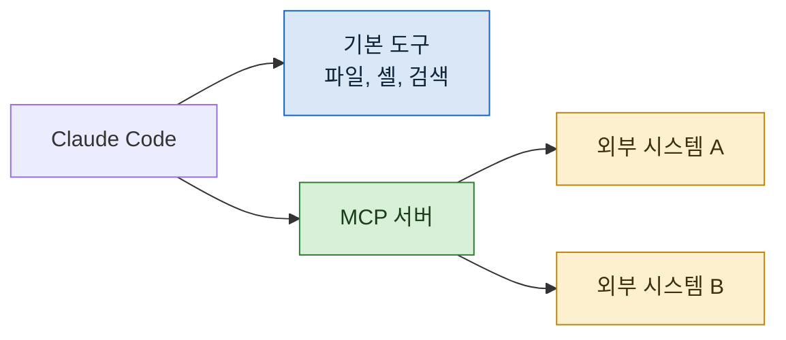

> **기준 출처:** [Claude Code Docs, MCP](https://code.claude.com/docs/en/mcp) · [MCP quickstart](https://code.claude.com/docs/en/mcp-quickstart) · [Slash commands](https://code.claude.com/docs/en/commands) / 확인일 2026-08-24
> **시리즈:** [목차](/posts/00-ccsetup-series/) | 이전 → [07. Skill](/posts/07-skills/) | 다음 → [09. 예약 실행과 무인 운영](/posts/09-scheduled-runs/)

앞의 다섯은 안쪽을 다듬는 층이었다. MCP 는 바깥으로 나가는 통로다.

## 1. 무엇인가

문서의 설명대로 MCP(Model Context Protocol)는 AI 도구를 외부 데이터 소스에 연결하는 열린 표준이다. 이걸 붙이면 파일과 셸 너머의 것을 읽고 쓸 수 있다.

기본 도구만으로는 저장소 안이 전부다. MCP 서버를 붙이면 그 경계가 넓어진다.

## 2. 명령으로도 나타난다

문서에 따르면 MCP 서버가 노출하는 프롬프트는 `/mcp__<서버>__<프롬프트>` 형태의 명령으로 나타나고, 연결된 서버에서 **동적으로 발견된다.**

즉 서버를 붙이면 명령 목록이 늘어난다. 02편에서 말한 "무엇이 있는지 모른다" 가 여기서도 온다.

## 3. 붙이는 건 쉽다

설정에 서버를 등록하면 끝이다. 문서의 빠른 시작을 따라가면 몇 줄이다.

어려운 것은 다음이다.

> **무엇을 붙일 것인가.**

## 4. 🔴 붙는 순간 내용이 세션을 통과한다

이게 이 편에서 제일 중요한 부분이다.

MCP 서버를 붙이면 그 시스템의 내용을 **읽을 수 있게** 된다. 읽을 수 있다는 것은 그 내용이 세션을 통과한다는 뜻이다.

대부분의 경우 이건 문제가 아니다. 공개 문서, 오픈소스 저장소, 내가 만든 데이터. 그런데 아닌 경우가 있다.

| 붙일 때 생각할 것 | 왜 |
| --- | --- |
| 그 시스템에 **남의 것**이 있나 | 내 판단으로 흘려보낼 수 없는 것이 섞인다 |
| 그 시스템이 **넓게 열리나** | 메일이나 드라이브처럼 범위가 큰 것은 필요한 만큼만 여는 방법이 없을 때가 있다 |
| 붙인 사실을 **잊게 되나** | 한 번 붙이면 계속 붙어 있다. 나중 세션에서 무심코 쓴다 |

세 번째가 실제로 위험하다. 붙일 때는 목적이 분명했는데, 몇 주 뒤에는 그냥 있는 도구가 된다.

## 5. 그래서 정한 규칙

내가 쓰는 기준 셋.

**필요한 범위만 연다.** 저장소 전체를 붙일 수 있어도 그 안의 한 폴더만 필요하면 그 폴더만 붙인다. "연결해두고 안 읽게 한다" 는 강제력이 없어서 방어가 아니다.

**붙인 목록을 문서로 관리한다.** 무엇이 왜 붙어 있는지 적어둔다. 안 적으면 몇 개가 붙어 있는지도 잊는다.

**넓게 열리는 것은 붙일 때 한 번 더 생각한다.** 특히 통신 계열은 범위를 좁히기 어렵다.

## 6. 로컬 도구를 붙이는 쪽이 값이 크다

경험상 값이 큰 것은 **외부 서비스보다 로컬 도구**였다.

이미 컴퓨터에 있는 프로그램을 붙이면, 그 프로그램을 열고 결과를 복사해 붙여넣는 왕복이 없어진다. 왕복이 없어지는 게 단순히 편한 정도가 아니다.

**복붙에서 출력이 잘리면 잘린 줄에 무엇이 있었는지 아무도 모른다.** 직접 붙어 있으면 전체가 그대로 온다. 이건 편의가 아니라 정확성 문제다.

## 7. 붙였을 때 생기는 순서 문제

로컬 프로그램을 붙일 때 한 가지 함정이 있다. **띄우는 순서가 중요할 수 있다.**

대상 프로그램이 먼저 떠 있어야 붙는 경우가 있고, 반대로 하면 조용히 안 붙는다. 안 붙었다는 것이 에러로 안 나오고 그냥 도구가 없는 것처럼 보이기도 한다.

이건 문서보다 실제로 해보면서 알게 된다. 붙인 뒤에 **연결을 확인하는 절차**를 한 번 만들어두면 매번 헤매지 않는다.

## 참고

- [Claude Code Docs: MCP](https://code.claude.com/docs/en/mcp)
- [Claude Code Docs: MCP quickstart](https://code.claude.com/docs/en/mcp-quickstart)
- [Claude Code Docs: Slash commands](https://code.claude.com/docs/en/commands)
