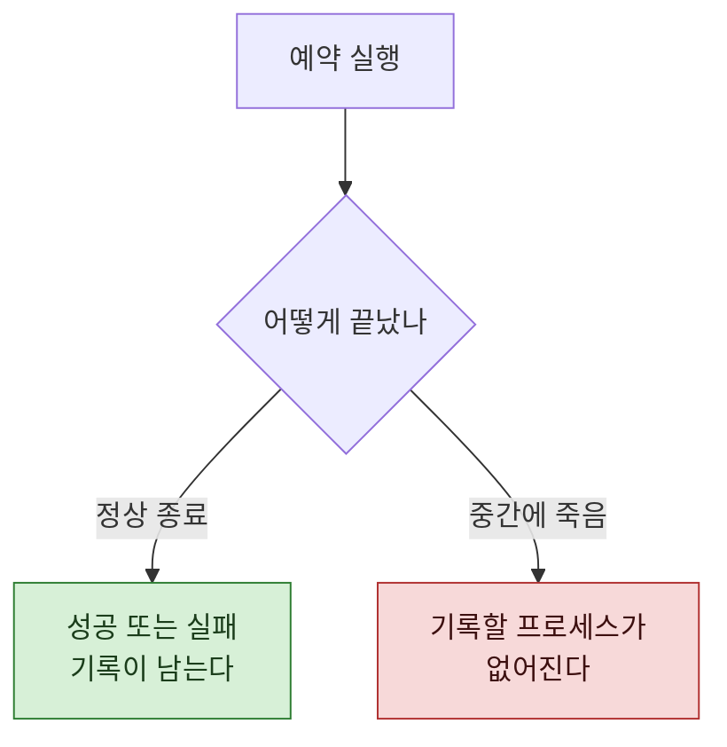

> **기준 출처:** [Claude Code Docs, Run Claude Code programmatically](https://code.claude.com/docs/en/headless) · [CLI reference](https://code.claude.com/docs/en/cli-reference) / 확인일 2026-08-24
> **시리즈:** [목차](/posts/00-ccsetup-series/) | 이전 → [08. MCP](/posts/08-mcp/) | 다음 → [10. 다섯 갈래를 언제 쓰나](/posts/10-choosing-a-layer/)

여기까지 만든 것들은 내가 앉아 있을 때 돈다. 안 앉아 있어도 돌게 만드는 것이 이 편이다.

## 1. 비대화형으로 돌린다

문서에 따르면 `-p`(또는 `--print`) 플래그가 명령을 비대화형으로 돌린다. 프롬프트 하나를 실행하고 대화형 입력 없이 끝난다. CI, 스크립트, 파이프에 쓰라고 있는 것이다.

```
claude -p "프롬프트" --allowedTools "Read,Edit,Bash"
```

출력 형식을 정할 수 있어서 결과를 프로그램으로 파싱할 수 있고, 성공하면 exit code 0, 실패하면 0이 아닌 값으로 끝나므로 스크립트가 분기할 수 있다.

여기에 운영체제의 스케줄러를 얹으면 정해진 시각에 도는 작업이 된다.

## 2. 무엇을 예약할 만한가

전부 예약할 수 있다고 전부 예약하면 안 된다. 걸어본 것들의 성격이 비슷했다.

| 성격 | 예 |
| --- | --- |
| **매일 같은 시각에 같은 것** | 정기 요약, 브리핑 |
| **주기가 길어 잊기 쉬운 것** | 주간, 월간 정리 |
| **놓치면 되돌리기 어려운 것** | 그날 안 하면 재료가 사라지는 기록 |

세 번째가 예약의 진짜 값이다. 시간이 지나면 못 만드는 것들이 있다.

## 3. 🔴 실패를 어떻게 아나

무인 운영의 실제 문제는 여기다. 사람이 안 보고 있으므로 **실패해도 아무도 모른다.**

그리고 실패 방식이 두 가지인데 성질이 아주 다르다.



정상적으로 실패하면 실패를 기록할 수 있다. 문제는 **중간에 죽는 경우**다. 창을 닫거나 프로세스가 강제로 끝나면 "실패했다" 를 쓸 주체 자체가 없어진다.

## 4. 그래서 실패 파일만 보면 안 된다

처음에는 "실패하면 실패 파일을 남긴다" 로 만들었다. 그리고 실패 파일이 없으니 다 잘 되는 줄 알았다.

실제로는 중단된 회차가 여럿이었다. 중단은 실패 파일을 안 남긴다. **아무것도 안 남기는 것이 중단의 정의**이기 때문이다.

고친 방식이 둘이다.

**실행 이력을 한 줄씩 쌓는다.** 회차마다 한 줄. 완료, 실패, 건너뜀, 중단을 구분해서 남긴다. 이 파일을 보면 회차가 몇 번 돌았는지 자체가 보인다.

**시작할 때 표식을 만들고 끝날 때 지운다.** 표식이 남아 있으면 그 회차는 끝나지 않은 것이다. 중단을 사후에 검출하는 유일한 방법이다.

| 방식 | 잡히는 것 | 못 잡는 것 |
| --- | --- | --- |
| 실패 파일만 | 정상적으로 실패한 것 | **중단** |
| 실행 이력 | 돈 회차와 안 돈 회차 | |
| 시작 표식 | 중단된 회차 | |

## 5. 놓치면 다음이 언제인가

주기가 길수록 한 번 놓치는 비용이 크다. 매일 도는 것은 내일 다시 돌지만, 주간 작업은 **다음 시도가 일주일 뒤**다.

그래서 주기가 긴 작업에는 보조 시도를 하나 더 붙였다. 오전에 실패하면 오후에 한 번 더 시도한다. 이미 결과물이 있으면 건너뛰도록 만들어두면 중복 실행이 문제가 안 된다.

## 6. 자동화하면 안 되는 자리

마지막으로 선 하나.

**되돌릴 수 없는 동작은 예약하지 않는다.** 발행, 배포, 외부로 보내기. 이런 것은 무인으로 돌리면 안 된다.

예약 작업이 여기까지 밀고 가서 **초안까지만 만들고 멈추게** 하는 편이 낫다. 사람이 나중에 보고 마지막 한 걸음을 누른다.

자동화의 목적은 사람을 없애는 것이 아니라 **사람이 확인할 것만 남기는 것**이다. 앞의 아홉 단계를 자동으로 해두고 열 번째를 사람에게 주면, 그 열 번째에 집중할 수 있다.

## 참고

- [Claude Code Docs: Run Claude Code programmatically](https://code.claude.com/docs/en/headless)
- [Claude Code Docs: CLI reference](https://code.claude.com/docs/en/cli-reference)
