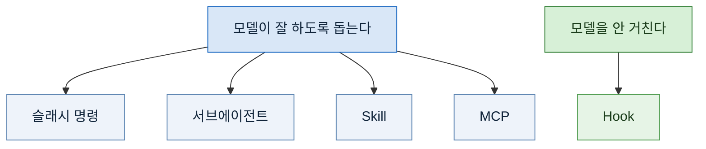

> **기준 출처:** [Claude Code Docs, Extend Claude Code](https://code.claude.com/docs/en/features-overview) · [Slash commands](https://code.claude.com/docs/en/commands) · [Skills](https://code.claude.com/docs/en/skills) · [Create custom subagents](https://code.claude.com/docs/en/sub-agents) · [Hooks reference](https://code.claude.com/docs/en/hooks) · [MCP](https://code.claude.com/docs/en/mcp) / 확인일 2026-08-24
> **시리즈:** [목차](/posts/00-ccsetup-series/) | 이전 → [09. 예약 실행과 무인 운영](/posts/09-scheduled-runs/)

연재를 닫으면서 고르는 기준만 남긴다.

## 1. 무엇이 반복되는가로 고른다

```
같은 순서를 반복한다        → 슬래시 명령
같은 역할을 반복한다        → 서브에이전트
같은 판단 기준을 반복한다   → Skill
반드시 지켜져야 한다        → Hook
바깥 시스템을 봐야 한다     → MCP
```

이게 전부다. 나머지는 각 편의 세부다.

## 2. 한 축이 더 있다

다섯을 다른 축으로 자르면 이렇게 갈린다.



왼쪽 넷은 확률을 높인다. 오른쪽 하나는 확률을 없앤다.

**그래서 "반드시" 가 붙는 것만 Hook 이다.** 대부분은 반드시가 아니고, 반드시가 아닌 것을 Hook 으로 걸면 06편의 오탐 문제가 온다.

## 3. 겹칠 때는 아래쪽을 고른다

같은 일을 두 갈래로 만들 수 있을 때가 있다. 그럴 때 기준.

| 상황 | 고르는 쪽 | 왜 |
| --- | --- | --- |
| 명령이냐 Skill 이냐 | **명령** | 절차가 분명하면 명령이 읽기 쉽다. Skill 은 자동으로 걸릴 필요가 있을 때만 |
| 프롬프트 지시냐 도구 제한이냐 | **도구 제한** | 구조적인 쪽이 새지 않는다 |
| 검증자냐 Hook 이냐 | **판단이면 검증자, 사실이면 Hook** | 06편의 기준 |

## 4. 만들지 않는 것도 결정이다

세팅을 하다 보면 만드는 쪽으로 기운다. 만들면 뭔가 한 것 같기 때문이다.

실제로는 안 만든 것이 더 많다. 안 만든 이유들.

**아직 절차가 안 굳었다.** 잘못된 절차를 고정하면 바꾸기가 더 어렵다. 세 번쯤 해보고 만든다.

**한 번만 할 일이다.** 만드는 시간이 하는 시간보다 길다.

**오탐이 많을 것 같다.** 06편. 걸기 전에 기존 파일로 재보고 폐기한 검사가 있었다.

**목록이 정보가 된다.** 02편. 명령이 늘면 그 목록 자체가 내가 무슨 일을 하는지 드러낸다. 필요한 것만 만들면 이 문제도 작아진다.

## 5. 이 세팅이 실제로 바꾼 것

돌아보면 값이 컸던 순서가 이렇다.

**1위, 검증을 따로 뗀 것.** 05편. "실패 0건" 과 "0건을 검사했다" 를 구분하게 된 뒤로 결과를 훨씬 덜 의심하게 됐다. 역설적으로 의심하는 장치를 붙이니 덜 의심하게 됐다.

**2위, 도구를 안 준 것.** 04편. 부탁을 권한으로 바꾼 것만으로 걱정할 일이 줄었다.

**3위, Hook.** 06편. 개수는 적지만 잊을 수 없다는 성질이 크다.

**4위, 예약 실행.** 09편. 값은 분명한데 실패를 알아채는 장치를 만드는 데 시간이 더 들었다.

명령과 Skill 은 값이 낮아서가 아니라 **당연해져서** 순위에 안 들었다. 없으면 불편한데 있으면 안 보인다.

## 6. 다음에 할 것

아직 안 한 것도 적어둔다.

- **묶음으로 배포되는 것들을 어디까지 받을지.** 편하지만 매 세션 자리를 차지하고, 전제가 다르면 엉뚱하게 걸린다
- **검사 항목의 오탐률을 정기적으로 다시 재는 것.** 한 번 재고 건 것도 시간이 지나면 상황이 바뀐다
- **여러 에이전트를 어떻게 엮을 것인가.** 이건 따로 [연재 하나](/posts/00-orch-series/)로 정리했다

## 참고

- [Claude Code Docs: Extend Claude Code](https://code.claude.com/docs/en/features-overview)
- [Claude Code Docs: Slash commands](https://code.claude.com/docs/en/commands)
- [Claude Code Docs: Extend Claude with skills](https://code.claude.com/docs/en/skills)
- [Claude Code Docs: Create custom subagents](https://code.claude.com/docs/en/sub-agents)
- [Claude Code Docs: Hooks reference](https://code.claude.com/docs/en/hooks)
- [Claude Code Docs: MCP](https://code.claude.com/docs/en/mcp)
