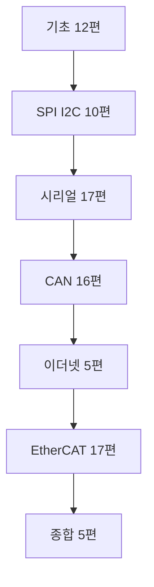

프로토콜을 하나씩 따로 외우면 규칙이 끝없이 나온다. CAN 의 SJW, I²C 의 클럭 스트레칭, EtherCAT 의 WKC, Modbus 의 3.5 문자 침묵. 그런데 이 규칙들은 전부 **같은 여섯 개 문제에 대한 서로 다른 답**이다. 그래서 이 연재는 프로토콜을 배우기 전에 문제 목록을 먼저 확정하고, 이후 모든 프로토콜을 그 칸을 채우는 것으로 읽는다.

> ① 도달 · ② 동기 · ③ 경계 · ④ 무결 · ⑤ 조정 · ⑥ 시간

## 이 연재로 얻으려는 것

1. 오실로스코프에 잡힌 파형을 보고 지금 어느 계층이 깨졌는지 짚는다.
2. 데이터시트의 타이밍 표와 규격서의 프레임 그림을 읽고 드라이버를 직접 쓴다.
3. "이 축은 EtherCAT, 저 센서는 SPI" 같은 선택을 근거를 대고 한다.

## 읽는 순서

거리와 시간 제약이 커지는 순서로 간다. spi-i2c 는 cm 와 µs, serial 은 m 와 ms, can 과 ethercat 은 수십 m 에 µs 결정성이다. 물리적 제약이 커질수록 프로토콜이 복잡해지는 이유가 순서대로 보인다.

| 폴더 | 편수 | 무엇 | 상태 |
| --- | --- | --- | --- |
| 기초 | 12 | 모든 통신에 겹치는 공통 개념 | 공개 |
| SPI / I²C | 10 | 보드 안, 엔코더와 ADC 와 IMU | 공개 |
| 시리얼 | 17 | RS-232/422/485, Modbus, 엔코더 프로토콜 | 공개 |
| CAN | 16 | CAN, CANopen, CiA 402 | 공개 |
| 이더넷 | 5 | EtherCAT 를 위한 디딤돌 | 공개 |
| EtherCAT | 17 | 다축 로봇 제어의 표준 | 준비 중 |
| 종합 | 5 | 비교표, 선택 기준, 반복 패턴 | 준비 중 |

## 1부. 기초 — 문제를 정의한다

| # | 글 |
| --- | --- |
| 01 | [통신은 무엇을 해결하는가](/posts/01-basics-what-comm-solves/) |
| 02 | [계층으로 나누기: OSI와 필드버스](/posts/02-basics-layers-osi-fieldbus/) |

## 2부. 기초 — 전기

| # | 글 |
| --- | --- |
| 03 | [물리계층: 전압과 차동신호](/posts/03-basics-physical-differential/) |
| 04 | [전송선로: 임피던스, 종단, 반사](/posts/04-basics-transmission-line/) |
| 11 | [노이즈, 접지, 절연](/posts/11-basics-noise-ground-isolation/) |

## 3부. 기초 — 비트에서 메시지로

| # | 글 |
| --- | --- |
| 05 | [비트를 읽는 법: 동기와 비동기](/posts/05-basics-sync-async/) |
| 06 | [프레이밍: 바이트에서 메시지로](/posts/06-basics-framing/) |
| 07 | [오류 검출: 패리티, 체크섬, CRC](/posts/07-basics-error-detection/) |
| 08 | [흐름제어와 재전송](/posts/08-basics-flow-control/) |

## 4부. 기초 — 소프트웨어가 실수하는 곳

| # | 글 |
| --- | --- |
| 09 | [바이트 순서, 정렬, 패킹](/posts/09-basics-endian-alignment/) |
| 10 | [실시간성: 주기, 지연, 지터](/posts/10-basics-realtime-jitter/) |

## 5부. 기초 — 예제

| # | 글 |
| --- | --- |
| 12 | [공통 모듈 만들기](/posts/12-basics-comm-core/) |

## SPI 와 I²C — 보드 안 (10편)

조인트 안에서 가장 안쪽이다. 엔코더와 ADC 와 IMU 와 게이트 드라이버가 여기 붙는다. 이 폴더의 결론은 오류 검출이 사실상 없다는 것이고, 그 전제가 언제 깨지는지가 핵심이다.

| # | 글 |
| --- | --- |
| 01 | [보드 안 통신이 따로 있는 이유](/posts/01-spi-i2c-why-onboard/) |
| 02 | [I²C: 두 선으로 주소를 부른다](/posts/02-i2c-two-wires-addressing/) |
| 03 | [I²C 타이밍: 클럭 스트레칭과 풀업 저항](/posts/03-i2c-timing-stretching-pullup/) |
| 04 | [I²C 실패 모드와 복구](/posts/04-i2c-failure-modes-recovery/) |
| 05 | [SPI: 클럭을 주는 쪽이 주인이다](/posts/05-spi-clock-master/) |
| 06 | [SPI 모드 CPOL, CPHA와 타이밍 여유](/posts/06-spi-modes-cpol-cpha/) |
| 07 | [멀티 슬레이브: CS 관리와 데이지 체인](/posts/07-spi-multislave-cs-daisy/) |
| 08 | [DMA와 인터럽트: 전송 비용](/posts/08-spi-dma-interrupt-cost/) |
| 09 | [SPI 와 I²C: 무엇을 언제 고르나](/posts/09-spi-vs-i2c-selection/) |
| 10 | [예제: 센서 드라이버 만들기](/posts/10-spi-i2c-sensor-driver/) |

## 시리얼 — RS-232, 422, 485, Modbus, 엔코더 (17편)

네 층을 구분한다. UART 는 비트 배열이고, RS-232 와 422 와 485 는 전기 규격이고, Modbus 는 응용이고, SSI 와 BiSS-C 와 EnDat 는 엔코더 전용 동기식이다. 여기서 ④ 무결 칸이 처음 제대로 채워진다.

| # | 글 |
| --- | --- |
| 01 | [UART 원리: 비동기의 정확한 뜻](/posts/01-uart-async-meaning/) |
| 02 | [보율과 샘플링: 오차 예산](/posts/02-uart-baud-error-budget/) |
| 03 | [프레임: 시작, 데이터, 패리티, 정지](/posts/03-uart-frame-parity-stop/) |
| 04 | [RS-232 전기 규격과 신호선](/posts/04-rs232-electrical/) |
| 05 | [핸드셰이크: RTS/CTS 와 XON/XOFF](/posts/05-serial-handshake-rts-cts/) |
| 06 | [RS-422: 차동으로 멀리 보내기](/posts/06-rs422-differential/) |
| 07 | [RS-485: 반이중, 멀티드롭, 방향 전환](/posts/07-rs485-half-duplex-direction/) |
| 08 | [시리얼 오류: 프레이밍, 오버런, 패리티](/posts/08-serial-errors-framing-overrun/) |
| 09 | [Modbus RTU: 프레임과 CRC-16](/posts/09-modbus-rtu-frame-crc16/) |
| 10 | [Modbus 침묵 시간과 타임아웃 설계](/posts/10-modbus-silence-timeout/) |
| 11 | [MCU UART 드라이버: 링 버퍼와 DMA](/posts/11-mcu-uart-driver-ringbuffer-dma/) |
| 12 | [호스트 쪽 구현: termios 와 COM 포트](/posts/12-host-termios-comport/) |
| 13 | [엔코더 하나: SSI](/posts/13-encoder-ssi/) |
| 14 | [엔코더 둘: BiSS-C](/posts/14-encoder-biss-c/) |
| 15 | [엔코더 셋: EnDat](/posts/15-encoder-endat/) |
| 16 | [시리얼 디버깅: 루프백과 로직 애널라이저](/posts/16-serial-debugging-loopback/) |
| 17 | [예제: Modbus 마스터 만들기](/posts/17-modbus-master-example/) |

## CAN — 산업 표준 FSM 이 둘 (16편)

ID 가 곧 우선순위이고 중재가 비파괴다. 산업 표준으로 못박힌 FSM 이 둘 있다. 오류 상태 관리(08편)와 CiA 402 드라이브(13편)이고 Stateflow 공부와 정면으로 만난다.

| # | 글 |
| --- | --- |
| 01 | [CAN 이 푸는 문제: 멀티마스터, 방송, 우선순위](/posts/01-can-what-it-solves/) |
| 02 | [CAN 물리계층: 차동, 우세와 열세, 종단](/posts/02-can-physical-dominant-recessive/) |
| 03 | [중재: 비파괴로 우선순위를 정한다](/posts/03-can-arbitration/) |
| 04 | [CAN 프레임 포맷 다섯 가지](/posts/04-can-frame-formats/) |
| 05 | [CAN 비트 타이밍: 세그먼트와 샘플 포인트](/posts/05-can-bit-timing/) |
| 06 | [CAN 동기화: SJW 와 클럭 오차 한계](/posts/06-can-sync-sjw/) |
| 07 | [CAN 오류 검출 다섯 가지](/posts/07-can-error-detection/) |
| 08 | [CAN 오류 상태: Error Active, Passive, Bus Off](/posts/08-can-error-states-busoff/) |
| 09 | [CAN FD: 무엇이 달라졌나](/posts/09-can-fd/) |
| 10 | [CAN 대역폭과 최악 지연 계산](/posts/10-can-bandwidth-worst-case/) |
| 11 | [CANopen 하나: 객체 사전과 NMT](/posts/11-canopen-od-nmt/) |
| 12 | [CANopen 둘: SDO 와 PDO](/posts/12-canopen-sdo-pdo/) |
| 13 | [CiA 402 드라이브 FSM](/posts/13-cia402-drive-state-machine/) |
| 14 | [MCU CAN 드라이버: 메일박스, 필터, 마스크](/posts/14-mcu-can-driver-mailbox-filter/) |
| 15 | [CAN 디버깅: 버스 부하율과 오류 카운터](/posts/15-can-debugging-busload/) |
| 16 | [예제: CiA 402 시퀀서 만들기](/posts/16-cia402-sequencer-example/) |

## 이더넷 — EtherCAT 를 위한 디딤돌 (5편)

목적이 하나다. 표준 이더넷은 왜 실시간 제어에 못 쓰는가. 답은 느려서가 아니라 최악 지연의 상한이 없어서다. 지연이 어느 층에서 얼마나 나오는지 세어보고, 산업계의 네 가지 해법을 "어느 층을 건드렸나" 로 분류한다.

| # | 글 |
| --- | --- |
| 01 | [이더넷 프레임과 MAC 주소](/posts/01-ethernet-frame-mac/) |
| 02 | [스위치와 큐, 지연이 생기는 곳](/posts/02-ethernet-switch-queue-delay/) |
| 03 | [IP, TCP, UDP는 각각 무엇을 보장하나](/posts/03-ip-tcp-udp-guarantees/) |
| 04 | [표준 이더넷이 실시간에 안 맞는 이유](/posts/04-why-ethernet-not-realtime/) |
| 05 | [소켓 프로그래밍 기초 (C++)](/posts/05-socket-programming-basics/) |

## 기초를 끝내면 대답할 수 있어야 하는 질문

1. 왜 CAN 과 RS-485 는 종단저항이 120 Ω 두 개인데 RS-422 는 수신단 하나면 되는가?
2. UART 는 클럭선이 없는데 어떻게 상대의 비트 경계를 아는가? 보율이 몇 % 틀리면 깨지는가?
3. 패리티 대신 CRC 를 쓰면 정확히 무엇이 좋아지는가?
4. 제어 주기 1 kHz 에서 "평균 지연 200 µs, 최악 3 ms" 와 "항상 400 µs" 중 어느 쪽이 좋은가? 왜?
5. `struct` 를 그대로 `memcpy` 해서 보내면 왜 위험한가?

## 예제 코드 방침

각 폴더의 마지막 편이 그 통신의 예제다. C++17 로 쓰고 ROS 2 패키지 구조를 따른다. 핵심 원칙은 **프로토콜 로직과 I/O 를 분리**하는 것이다. 하드웨어를 인터페이스와 fake 구현으로 나누면 실물 없이 CI 에서 검증된다.

| 원칙 | 이유 |
| --- | --- |
| C++17, ROS 2 패키지 구조 | 그대로 노드로 올릴 수 있다 |
| 프로토콜 로직과 I/O 분리 | 하드웨어 없이 검증된다 |
| 하드웨어는 인터페이스와 fake 구현 | `hardware_interface` 설계 연습이 된다 |
| 실시간 경로에 동적 할당, 로깅, 락 금지 | 지터가 곧 제어 성능이다 |

## 참고

- [NXP UM10204 — I²C-bus specification](https://www.nxp.com/docs/en/user-guide/UM10204.pdf)
- [Modbus over Serial Line V1.02](https://www.modbus.org/docs/Modbus_over_serial_line_V1_02.pdf)
- [Modbus Application Protocol V1.1b3](https://www.modbus.org/docs/Modbus_Application_Protocol_V1_1b3.pdf)
- [Bosch CAN Specification 2.0](https://www.bosch-semiconductors.com/media/ip_modules/pdf_2/can2spec.pdf)
- [ETG — EtherCAT Technology](https://www.ethercat.org/en/technology.html)
- [TI SLLA272 — RS-485 Design Guide](https://www.ti.com/lit/an/slla272d/slla272d.pdf)
- [BiSS Interface (iC-Haus)](https://www.biss-interface.com/)
- [SOEM — Simple Open EtherCAT Master](https://github.com/OpenEtherCATsociety/SOEM)
- [Linux SocketCAN](https://www.kernel.org/doc/html/latest/networking/can.html)
