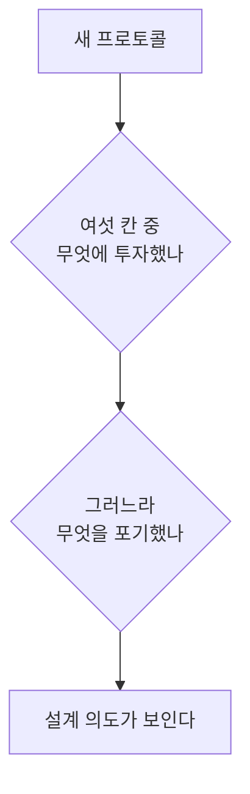

> **기준 출처:** ISO/IEC 7498-1(OSI 기본 참조 모델) 개요, Bosch CAN Spec 2.0, NXP UM10204, Modbus over Serial Line V1.02, ETG EtherCAT Technology / 확인일 2026-08-03
> **시리즈:** [목차](/posts/00-comm-series/) | 다음 → [02. 계층으로 나누기](/posts/02-basics-layers-osi-fieldbus/)

---

## 1. 통신 공부가 어려운 이유

프로토콜을 하나씩 배우면 규칙이 끝없이 나온다. CAN 의 SJW, I²C 의 클럭 스트레칭, EtherCAT 의 WKC, Modbus 의 3.5 문자 침묵. 외울 게 많아 보이지만 이 모든 규칙은 여섯 개의 같은 문제에 대한 서로 다른 답이다.

그래서 이 연재는 프로토콜을 배우기 전에 문제 목록을 먼저 확정한다. 앞으로 새 프로토콜을 만나면 이 여섯 칸을 채우는 것으로 읽는다.

## 2. 다섯 개의 문제

두 장치를 선으로 이었다고 하자. A 가 숫자 `1000` 을 B 에게 보내려 한다. 무엇이 필요한가.

### 문제 ① 도달 — 신호가 전기적으로 상대에게 닿는가

전압을 흔들면 저쪽에서 읽힌다는 보장이 있어야 한다. 선이 길면 신호가 줄고, 반사되고, 주변 모터가 잡음을 얹는다.

답의 예는 단선 전압(RS-232, ±3~15 V), 차동 전압(RS-422/485, CAN), 광 절연, 종단저항이다. [03편](/posts/03-basics-physical-differential/)과 [04편](/posts/04-basics-transmission-line/)에서 다룬다.

### 문제 ② 동기 — 비트가 언제 시작하고 끝나는가

전압이 `HIGH-HIGH-LOW-LOW` 로 보였다고 하자. 이게 `1,1,0,0` 인가 `1,0` 인가. 비트 경계를 모르면 전압을 읽어도 의미가 없다.

답은 두 갈래로 갈린다. 클럭선을 따로 주거나(SPI 의 SCLK, I²C 의 SCL, 엔코더 SSI 와 BiSS) 데이터에서 뽑아내거나(UART 는 시작 비트로 매번 재정렬, CAN 은 비트 스터핑으로 강제 전이 삽입)다. [05편](/posts/05-basics-sync-async/)에서 다룬다.

### 문제 ③ 경계 — 어디부터 어디까지가 한 메시지인가

비트를 다 읽어도 `10001000` 이 한 덩어리인지 두 덩어리인지 모른다.

답의 예는 길이 필드(이더넷과 CAN 의 DLC), 시작과 끝 표식(I²C 의 START/STOP), 침묵 시간(Modbus RTU 의 3.5 문자), 바이트 스터핑이다. [06편](/posts/06-basics-framing/)에서 다룬다.

### 문제 ④ 무결 — 도중에 바뀌지 않았는가

노이즈 한 번에 비트가 뒤집힌다. 그걸 모르면 모터에 엉뚱한 토크 명령이 들어간다.

답의 예는 패리티(1비트, 약하다), 체크섬, CRC, 그리고 CAN 처럼 여러 겹으로 겹치는 방식이다. [07편](/posts/07-basics-error-detection/)에서 다룬다.

### 문제 ⑤ 조정 — 여럿이 있을 때 누가 언제 말하나

선 하나에 장치가 셋 이상 붙으면 동시에 말할 수 있다. 그리고 받는 쪽이 소화를 못 하면 흘러넘친다.

매체 접근 쪽 답은 마스터 독점(SPI, EtherCAT), 주소 지명(I²C, Modbus), 비파괴 중재(CAN)다. 흐름 제어 쪽 답은 RTS/CTS, XON/XOFF, ACK 와 재전송, 클럭 스트레칭이다. [08편](/posts/08-basics-flow-control/)에서 다룬다.

## 3. 제어가 붙으면 문제가 하나 더 생긴다

위 다섯은 결국 도착하는가를 묻는다. 파일 전송이면 이걸로 충분하다. 그런데 로봇 제어 루프는 다른 걸 묻는다.

### 문제 ⑥ 시간 — 언제까지 도착하는가

1 kHz 제어 루프는 매 1 ms 마다 새 센서 값이 필요하다. 값이 2 ms 걸려 도착하면 그건 틀린 값이다. 늦게 온 정답은 오답이다.

| | 일반 통신 | 실시간 제어 통신 |
| --- | --- | --- |
| 좋은 것 | 평균 처리량이 크다 | 최악 지연이 작고 흔들리지 않는다 |
| 오류가 나면 | 재전송한다 | 재전송할 시간이 없다. 버리고 다음 주기 |
| 재는 값 | Mbps | 지터(µs), 사이클 시간 |

재전송이 오히려 해가 되는 이유가 여기 있다. TCP 는 패킷이 빠지면 재전송하고 그동안 뒤에 온 데이터를 붙잡아 둔다(head-of-line blocking). 제어 루프 입장에서는 낡은 값 하나를 살리려고 새 값들을 막아버리는 셈이다. 차라리 그 주기를 건너뛰고 다음 값을 받는 게 낫다. [10편](/posts/10-basics-realtime-jitter/)에서 다룬다.

## 4. 여섯 칸으로 본 네 프로토콜

앞으로 배울 것들을 미리 이 표에 넣어둔다. 지금 이해가 안 돼도 된다. 각 폴더를 끝낼 때마다 여기로 돌아와 그 열이 읽히는지 확인하면 된다.

| | I²C | UART / RS-485 | CAN | EtherCAT |
| --- | --- | --- | --- | --- |
| ① 도달 | 오픈 드레인과 풀업, cm | 차동 ±200 mV, ~1200 m | 차동 우세/열세, ~40 m @1 Mbps | 100BASE-TX, 세그먼트당 100 m |
| ② 동기 | SCL 클럭선 | 시작 비트로 재정렬 | 비트 스터핑과 SJW 재동기 | 이더넷 PHY 가 처리 |
| ③ 경계 | START / STOP 조건 | 침묵 시간 또는 길이 필드 | SOF, DLC, EOF | 이더넷 프레임과 Datagram 길이 |
| ④ 무결 | 거의 없음 (ACK 는 수신 확인일 뿐) | 패리티 1비트 | CRC-15 와 4중 검사 | CRC-32 와 WKC |
| ⑤ 조정 | 마스터가 주소 호출 | 마스터-슬레이브 폴링 | 비파괴 중재 (ID 우선순위) | 마스터가 전부 스케줄 |
| ⑥ 시간 | 보장 없음 | 보장 없음 | 우선순위 높은 것만 준보장 | DC 로 µs 급 동기 |

이 표를 세로로 읽으면 프로토콜의 성격이 보이고, 가로로 읽으면 같은 문제의 해법 진화가 보인다.

④ 열을 보면 방향이 뚜렷하다. I²C 는 오류 검출이 사실상 없고, UART 는 패리티 한 비트뿐이고, CAN 은 다섯 겹이다. 거리가 멀고 노이즈가 심하고 안전이 걸릴수록 ④에 돈을 쓴다. 엔코더 인터페이스가 SPI 대신 CRC 가 붙은 BiSS-C 를 쓰는 이유도 같은 줄에 있다.

## 5. 이 연재를 읽는 법

새 프로토콜을 만날 때마다 두 가지를 묻는다.

CAN 은 ⑤ 다중 노드 조정과 ④ 무결성에 극단적으로 투자하고 속도를 포기했다. 최대 1 Mbps 에 데이터 8바이트다. EtherCAT 는 ⑥ 시간에 전부 걸고 토폴로지 자유도를 포기했다. 마스터 하나에 정해진 순서다. 완벽한 프로토콜은 없고 맞교환만 있다.

## 정리

- 통신 문제는 다섯 개다. 도달, 동기, 경계, 무결, 조정.
- 제어가 붙으면 여섯 번째가 생긴다. 시간, 곧 언제까지다. 늦은 정답은 오답이다.
- 프로토콜의 규칙들은 이 여섯 문제에 대한 서로 다른 답일 뿐이다.
- 새 프로토콜을 읽는 법은 무엇을 중요하게 여겼고 그러느라 무엇을 포기했나를 묻는 것이다.
- 오류 검출에 얼마나 투자했는지가 그 프로토콜이 어디에 쓰이는지를 말해준다.

## 참고

- [Bosch CAN Specification 2.0](https://www.bosch-semiconductors.com/media/ip_modules/pdf_2/can2spec.pdf)
- [NXP UM10204 — I²C-bus specification](https://www.nxp.com/docs/en/user-guide/UM10204.pdf)
- [Modbus over Serial Line V1.02](https://www.modbus.org/docs/Modbus_over_serial_line_V1_02.pdf)
- [ETG — EtherCAT Technology](https://www.ethercat.org/en/technology.html)
