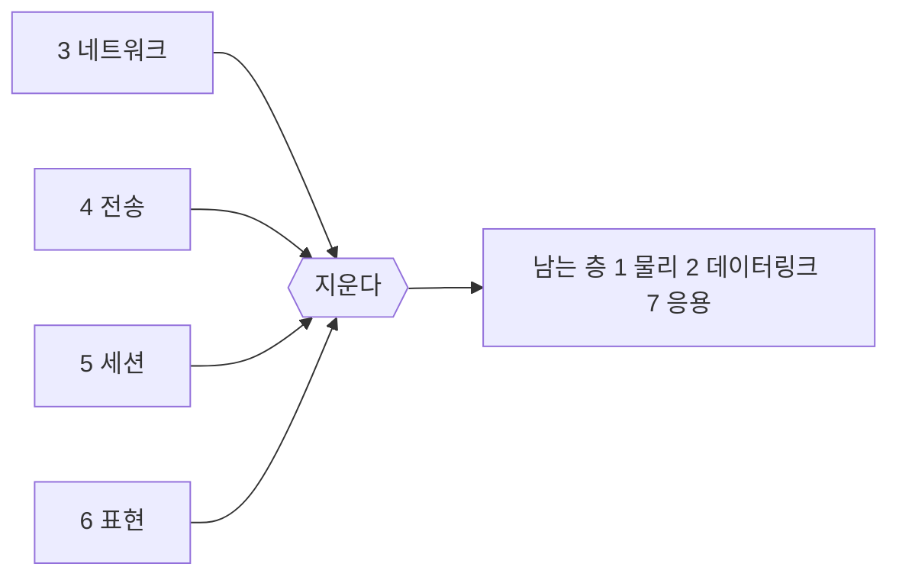

> **기준 출처:** ISO/IEC 7498-1(OSI 기본 참조 모델), IEC 61158 / 61784 계열, IEEE 802.3, RFC 791, RFC 793, Bosch CAN Spec 2.0, ETG EtherCAT Technology / 확인일 2026-08-03
> **시리즈:** [목차](/posts/00-comm-series/) | 이전 → [01. 통신은 무엇을 해결하는가](/posts/01-basics-what-comm-solves/) | 다음 → [03. 물리계층](/posts/03-basics-physical-differential/)

---

## 1. 왜 나누는가

[01편](/posts/01-basics-what-comm-solves/)의 여섯 문제는 성격이 다르다. 전압을 얼마로 흔들까와 이 값이 관절 3번의 위치인가는 같은 사람이 같은 코드에서 고민할 일이 아니다. 그래서 층으로 나눈다.

계층화의 이득은 교체 가능성이다. Modbus RTU 로 짠 코드는 RS-232 로도, RS-485 로도, 프레이밍만 바꾸면 TCP 로도 돈다. 전기 규격이 바뀌어도 함수 코드 03(홀딩 레지스터 읽기)의 의미는 바뀌지 않는다.

대가는 오버헤드다. 층마다 자기 헤더를 붙이고, 자기 검사를 하고, 자기 버퍼에 복사한다. 이 대가가 실시간 제어에서 감당이 안 될 때 필드버스가 등장한다.

## 2. OSI 7계층

암기가 목적이 아니라 어느 층에서 깨졌는지를 말할 수 있는 어휘를 얻는 게 목적이다.

| # | 계층 | 무엇을 책임지나 | 01편의 문제 | 깨졌을 때 증상 |
| --- | --- | --- | --- | --- |
| 7 | 응용 | 이 값이 무슨 뜻인가 | — | 값은 오는데 해석이 이상하다 |
| 6 | 표현 | 인코딩, 압축, 암호화 | 엔디안이 여기 걸친다 | 숫자가 뒤집혀 보인다 |
| 5 | 세션 | 대화의 시작, 유지, 종료 | — | 연결이 끊겼는데 모른다 |
| 4 | 전송 | 끝단 간 신뢰성, 순서, 흐름 | ⑤ 조정 | 순서가 뒤바뀌거나 유실 |
| 3 | 네트워크 | 다른 망까지 길 찾기 | — | 다른 서브넷에 안 닿는다 |
| 2 | 데이터링크 | 프레임, 오류검출, 매체 접근 | ③ 경계 ④ 무결 ⑤ 조정 | CRC 에러, 충돌, 프레임 깨짐 |
| 1 | 물리 | 전압, 비트, 커넥터, 타이밍 | ① 도달 ② 동기 | 아예 아무것도 안 온다 |

디버깅은 항상 아래에서 위로 올라간다. 1층이 안 되면 위층은 전부 무의미하다.

### 이 연재가 실제로 다루는 층

| 폴더 | 주로 다루는 층 |
| --- | --- |
| SPI / I²C | 1, 2 (7은 칩 데이터시트가 정한다) |
| 시리얼 | 1(RS-232/422/485), 2(UART 프레임), 7(Modbus) |
| CAN | 1, 2(CAN 자체), 7(CANopen) |
| 이더넷 | 1, 2, 3, 4 (여기서만 3과 4를 본다) |
| EtherCAT | 1, 2, 7(CoE). 3, 4, 5, 6이 없다 |

이더넷 폴더가 예외적으로 3과 4 계층을 다루는 이유는 EtherCAT 가 그걸 안 쓰는 까닭을 알기 위해서다.

## 3. 필드버스는 층을 지운다

산업용 통신 규격(IEC 61158)은 OSI 를 그대로 쓰지 않는다. 1, 2, 7 만 남기고 3, 4, 5, 6 을 지운다.

### 왜 지워도 되는가

지운 게 아니라 필요 없어진 것이다. 하나씩 보면 명확하다.

| 지운 층 | 원래 역할 | 필드버스에서 필요 없는 이유 |
| --- | --- | --- |
| 3 네트워크 | 라우팅, 다른 망까지 길 찾기 | 망이 하나다. 라우터가 없다. 모두가 같은 선에 있다 |
| 4 전송 | 재전송, 순서 보장, 흐름 제어 | 재전송할 시간이 없다. 순서는 마스터가 정한다 |
| 5 세션 | 대화 관리 | 노드 구성이 부팅 때 고정된다. 붙었다 떨어졌다 하지 않는다 |
| 6 표현 | 인코딩 협상 | 바이트 순서를 규격이 못박는다. CANopen 과 EtherCAT 는 little-endian |

핵심은 노드 구성이 미리 정해져 있다는 것이다. 인터넷은 누가 언제 접속할지 모르니 그 모든 유연성이 필요했다. 로봇 한 대 안의 축 6개는 설계 시점에 이미 다 안다. 알고 있으면 협상할 게 없고, 협상이 없으면 층도 없다.

## 4. 숫자로 보는 대가 — 8바이트를 보내는 비용

관절 하나의 위치(4바이트)와 속도(4바이트), 총 8바이트를 보낸다고 하자.

### 표준 이더넷 + IP + TCP

| 항목 | 바이트 |
| --- | --- |
| 프리앰블과 SFD | 8 |
| 이더넷 헤더 (목적지, 출발지 MAC, EtherType) | 14 |
| IP 헤더 | 20 |
| TCP 헤더 | 20 |
| 페이로드 | 8 |
| 패딩 (최소 프레임 64바이트를 맞추려고) | 6 |
| FCS (CRC-32) | 4 |
| 프레임 간 간격 (IFG) | 12 |
| 합계 | 92 |

8바이트를 보내려고 92바이트를 쓴다. 효율 8.7% 다. 게다가 TCP 는 ACK 를 별도 프레임으로 보내니 실제로는 더 나쁘다.

### CAN (표준 프레임, 11비트 ID)

CAN 은 비트 단위로 센다. 8바이트 데이터를 실은 표준 데이터 프레임은 스터핑 없이 44비트(헤더, CRC, ACK, EOF) + 64비트(데이터) + 3비트(IFS) 로 111비트다. 스터핑이 최대로 들어가면 약 135비트다.

효율은 64/111 로 약 58% 다. 1 Mbps 에서 프레임 하나가 111 µs 걸린다.

### EtherCAT

여기가 반전이다. EtherCAT 는 한 프레임에 모든 슬레이브 몫을 다 넣는다.

| 항목 | 바이트 |
| --- | --- |
| 프리앰블, IFG, 이더넷 헤더, FCS | 38 |
| EtherCAT 헤더 | 2 |
| Datagram 헤더와 WKC | 12 |
| 슬레이브 1 데이터 | 8 |
| 슬레이브 2 데이터 | 8 |
| 슬레이브 N 데이터 | 8N |

슬레이브 1개면 60바이트 중 8바이트로 13% 라 이더넷과 비슷하다. 그런데 슬레이브가 10개면 52 + 80 = 132바이트 중 80바이트로 효율 61%, 30개면 77% 로 계속 올라간다.

이게 on-the-fly 처리의 경제학이다. 노드를 늘려도 프레임 개수가 늘지 않고 프레임 길이만 는다. 고정 오버헤드 38바이트를 모두가 나눠 쓴다.

## 5. 층을 지운 대가

| 잃은 것 | 무슨 뜻인가 |
| --- | --- |
| 라우팅 (3계층) | 다른 망으로 못 나간다. EtherCAT 프레임은 일반 스위치를 못 넘는다. 원격 접속하려면 별도 터널(EoE)이 필요하다 |
| 재전송 (4계층) | 깨진 프레임은 그냥 없어진다. 애플리케이션이 감시해야 한다 (WKC, 오류 카운터) |
| 유연성 (5계층) | 구성이 바뀌면 다시 설정해야 한다. 슬레이브를 하나 꽂았다고 자동으로 되지 않는다 |

실무에서 이게 이렇게 나타난다. EtherCAT 네트워크에 노트북을 물려서 패킷을 보겠다는 게 안 된다. 일반 NIC 는 EtherType `0x88A4` 프레임을 그냥 버리고, 스위치를 끼우면 타이밍이 깨진다. 층이 없다는 건 층이 주던 편의도 없다는 뜻이다.

## 정리

- 계층화의 이득은 교체 가능성이고 대가는 오버헤드다.
- OSI 7계층은 암기 대상이 아니라 어디가 깨졌나를 말하는 어휘다. 디버깅은 항상 1층부터 위로.
- 필드버스는 1, 2, 7 만 남기고 3, 4, 5, 6 을 지운다 (IEC 61158 축약 구조).
- 지울 수 있는 이유는 노드 구성이 설계 시점에 확정되어 협상할 게 없기 때문이다.
- 8바이트 전송 비용은 TCP/IP 92바이트(8.7%), CAN 111비트(58%), EtherCAT 는 슬레이브가 늘수록 좋아진다.
- 대가는 라우팅 없음, 재전송 없음, 구성 유연성 없음이다.

## 참고

- [IEEE 802.3 — Ethernet](https://standards.ieee.org/ieee/802.3/)
- [RFC 791 — Internet Protocol](https://www.rfc-editor.org/rfc/rfc791)
- [RFC 793 — Transmission Control Protocol](https://www.rfc-editor.org/rfc/rfc793)
- [Bosch CAN Specification 2.0](https://www.bosch-semiconductors.com/media/ip_modules/pdf_2/can2spec.pdf)
- [ETG — EtherCAT Technology](https://www.ethercat.org/en/technology.html)
