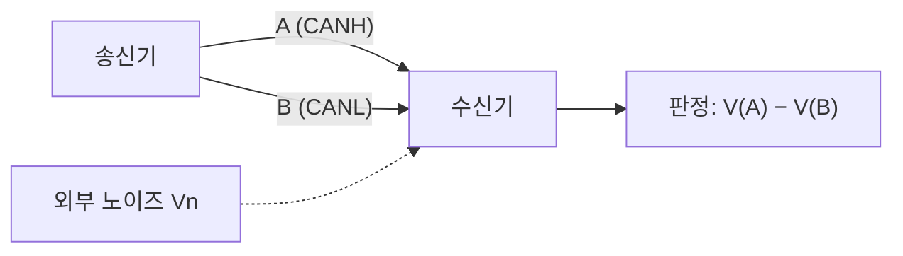

> **기준 출처:** TIA/EIA-232-F, TIA/EIA-422-B, TIA/EIA-485-A, TI SLLA272, Analog Devices RS-485 Basics, ISO 11898-2 개요, NXP UM10204 §3.1.1 / 확인일 2026-08-03
> **시리즈:** [목차](/posts/00-comm-series/) | 이전 → [02. 계층으로 나누기](/posts/02-basics-layers-osi-fieldbus/) | 다음 → [04. 전송선로](/posts/04-basics-transmission-line/)

---

## 1. 0과 1은 물리적으로 무엇인가

디지털이라고 부르지만 선을 흐르는 건 아날로그 전압이다. 수신기는 이 전압이 임계값보다 높은가 낮은가를 볼 뿐이다. 그러니 문제는 하나로 좁혀진다. 송신기가 의도한 전압이 노이즈와 손실을 뚫고 수신기의 임계값 판단을 바꾸지 않은 채 도착하는가.

여기 실패하는 방법이 세 가지 있다.

1. 감쇠. 선이 길어 신호가 줄었다.
2. 노이즈 유입. 옆의 모터 케이블이 전자기적으로 얹혔다.
3. 기준점 불일치. 송신 쪽 GND 와 수신 쪽 GND 의 전위가 다르다.

3번이 가장 안 보이고 가장 자주 사고를 낸다.

## 2. 단선 방식 — 기준은 그라운드

RS-232, 그리고 대부분의 보드 안 신호(SPI, I²C, UART TTL)가 이 방식이다. 수신기가 실제로 재는 값은 이렇다.

$$V_{\text{수신}} = V_{\text{신호}} - V_{\text{GND}_B}$$

송신기는 $V_{\text{신호}}$ 를 $\text{GND}_A$ 기준으로 만들었다. 두 그라운드가 같아야만 이 식이 맞는다.

### 실패 사례 — 그라운드 전위차

제어 캐비닛과 3 m 떨어진 로봇 베이스가 각자 접지돼 있다. 옆에서 서보 드라이브가 스위칭하면서 접지에 전류를 흘리면 두 접지 사이에 1~2 V 의 전위차가 생긴다. 드물지 않다.

| | 3.3 V TTL UART | RS-232 |
| --- | --- | --- |
| 논리 1 전압 | 3.3 V | −5 ~ −15 V |
| 논리 0 전압 | 0 V | +5 ~ +15 V |
| 수신 임계값 | 약 1.65 V | ±3 V |
| 노이즈 마진 | 약 1.65 V | 약 2~12 V |
| GND 가 2 V 뜨면 | 논리 0 이 1 로 읽힌다 | 아직 버틴다 |

TTL UART 를 보드 밖으로 길게 뽑으면 안 되는 이유가 이것이다. 마진이 1.65 V 밖에 없다. RS-232 가 굳이 ±12 V 같은 큰 전압을 쓰는 것도 마진을 사려는 것이다.

RS-232 에서 논리 1(mark)이 음전압인 건 전신 시절 전류 루프의 관습이 남은 것이다.

전압을 키우는 데는 한계가 있다. 소비 전력이 늘고, 슬루 레이트가 느려져 속도가 안 나오고, 그라운드 전위차가 10 V 를 넘으면 그것도 진다. 근본 해법이 아니다.

## 3. 차동 방식 — 기준을 그라운드에서 떼어낸다

RS-422, RS-485, CAN, 그리고 이더넷이 전부 이 방식이다. 수신기는 두 선의 차이만 본다. 그라운드를 보지 않는다.

### 왜 노이즈가 사라지는가

두 선을 꼬아두면 외부 노이즈 $V_n$ 이 두 선에 거의 똑같이 실린다. 그래서 공통모드라 부른다.

$$V_{\text{수신}} = (V_A + V_n) - (V_B + V_n) = V_A - V_B$$

$V_n$ 이 뺄셈에서 사라진다. 이게 차동 전송의 원리다. 그라운드 전위차도 마찬가지로 두 선에 공통으로 실리니 같이 사라진다.

꼬는 것이 중요한 이유는 두 선이 나란히 붙어 있어야 노이즈를 똑같이 받기 때문이다. 떨어져 있으면 서로 다른 양을 받고 그 차이는 지워지지 않는다. 또 꼬면 루프 면적이 작아져서 자기장 유도 자체가 준다. 평행 케이블 말고 트위스트 페어를 쓰라는 말이 여기서 나온다.

### 얼마나 버티나

$V_n$ 이 무한정 상쇄되지는 않는다. 수신기 IC 가 견디는 전압 범위가 있다.

| 규격 | 공통모드 입력 범위 | 수신 임계값 |
| --- | --- | --- |
| RS-422 | −7 ~ +7 V | ±200 mV |
| RS-485 | −7 ~ +12 V | ±200 mV |
| CAN (ISO 11898-2) | 대략 −2 ~ +7 V (트랜시버마다 다르고 확장형은 더 넓다) | dominant 판정 > 0.9 V |

수신 감도 ±200 mV 가 뜻하는 것을 계산해 보면 이렇다. 송신기는 최소 1.5 V 차동을 만든다. 케이블 1200 m 를 지나며 신호가 1/7 로 줄어도 200 mV 는 남는다. 감쇠를 버틸 여유가 7배 이상 있다는 뜻이고, 이게 RS-485 의 1200 m 라는 숫자가 나오는 배경이다.

### 차동이어도 그라운드는 필요하다

흔한 오해다. 차동이니 GND 선은 안 이어도 된다고 생각하면 안 된다. 공통모드 범위(−7~+12 V)를 벗어나면 수신기가 판단을 못 한다. 그래서 RS-485 는 A 와 B 두 신호선에 기준 GND 를 더한 3선을 권장한다(TI SLLA272). GND 를 안 이으면 두 노드의 전위가 얼마나 벌어질지 아무도 모른다.

## 4. 세 번째 방식 — 오픈 드레인

I²C 는 단선인데 방식이 다르다. 드라이버가 LOW 로만 당길 수 있고 HIGH 는 풀업 저항이 만든다. 각 장치는 당기거나(LOW) 놓거나(개방) 둘 중 하나만 한다.

결과가 흥미롭다. 한 명이라도 당기면 LOW 이고 전부 놓아야 HIGH 다. 곧 와이어드 AND 다.

이 성질이 두 가지를 공짜로 준다.

1. 충돌해도 회로가 타지 않는다. 밀고 당기는(push-pull) 드라이버 둘이 반대로 출력하면 전류가 쏟아지지만 오픈 드레인은 그럴 일이 없다.
2. 그 자체가 중재가 된다. 0 을 낸 쪽이 이긴다.

CAN 의 우세와 열세(dominant/recessive)가 정확히 같은 발상이다. CAN 은 차동 방식이지만 논리적으로는 와이어드 AND 로 동작한다. 누구든 dominant(0)를 내면 버스가 0 이 된다. 이 성질 위에 CAN 의 비파괴 중재가 세워진다.

대가는 속도다. HIGH 로 올라가는 건 풀업 저항과 버스 커패시턴스가 만드는 RC 시상수라 느리다. I²C 가 SPI 보다 훨씬 느린 근본 이유가 여기 있다.

## 5. CAN 의 전압을 실제 숫자로

ISO 11898-2 고속 CAN 의 버스 상태는 이렇다.

| 상태 | CANH | CANL | 차동 $V_{diff}$ | 논리값 |
| --- | --- | --- | --- | --- |
| recessive (열세) | 약 2.5 V | 약 2.5 V | 약 0 V | 1 |
| dominant (우세) | 약 3.5 V | 약 1.5 V | 약 2 V | 0 |

수신기 판정은 $V_{diff} > 0.9\,\text{V}$ 면 dominant, $< 0.5\,\text{V}$ 면 recessive 다.

recessive 가 0 V 차동이라는 게 핵심이다. 아무도 안 밀면 종단저항이 두 선을 2.5 V 로 같게 만들고 그게 자동으로 1 이 된다. 누구도 능동적으로 1 을 만들지 않는다. 그래서 dominant 를 내는 노드가 항상 이긴다.

### 이걸 알면 진단이 된다

멀티미터로 정지 상태의 CAN 버스를 재봤을 때 판정표는 이렇다.

| 측정값 | 해석 |
| --- | --- |
| CANH ≈ CANL ≈ 2.5 V | 정상. recessive 유지 중 |
| CANH ≈ 3.5 V, CANL ≈ 1.5 V 로 고정 | 누군가 dominant 를 계속 내고 있다. stuck-dominant 노드이고 버스 전체가 멎는다 |
| 둘 다 0 V | 트랜시버 전원 없음 또는 배선 끊김 |
| CANH-CANL 간 저항 60 Ω (전원 끈 상태) | 종단저항 120 Ω 두 개가 정상 병렬 |
| 같은 저항이 120 Ω | 종단저항이 하나뿐이다. 반사가 발생한다 |

마지막 두 줄이 [04편](/posts/04-basics-transmission-line/)의 주제다.

## 6. 언제 무엇을 쓰나

| | 단선(TTL) | 단선(RS-232) | 오픈 드레인(I²C) | 차동(RS-485/CAN) |
| --- | --- | --- | --- | --- |
| 노이즈 내성 | 낮음 | 중간 | 낮음 | 높음 |
| GND 전위차 | 취약 | ±수 V | 취약 | −7~+12 V |
| 거리 | ~30 cm | ~15 m | ~1 m | ~1200 m |
| 속도 | 높음 | 낮음 (~115 kbps) | 낮음 (~1 Mbps) | 높음 |
| 선 수 (신호당) | 1 | 1 | 1 (양방향) | 2 |
| 충돌 안전성 | 없음 | 없음 | 있음 | 있음 (CAN) |

기준을 하나로 줄이면 보드 안은 단선이나 오픈 드레인, 보드 밖은 차동이다.

## 정리

- 물리계층의 문제는 하나다. 송신 전압이 수신 임계 판단을 바꾸지 않고 도착하는가.
- 실패 원인은 셋이다. 감쇠, 노이즈, 그라운드 전위차. 마지막이 가장 안 보인다.
- 단선 방식은 GND 를 기준으로 삼아서 두 그라운드가 다르면 진다. TTL 마진은 1.65 V 뿐이다.
- 차동 방식은 두 선의 차이만 보므로 공통모드 노이즈가 뺄셈에서 사라진다. 단 공통모드 범위 안에서만이다.
- 차동이어도 GND 선은 이어야 한다. RS-485 는 3선이다.
- 꼬아야 두 선이 노이즈를 똑같이 받는다.
- 오픈 드레인은 와이어드 AND 라서 충돌 안전과 중재를 공짜로 준다. 대가는 RC 상승 시간이다.
- CAN 의 dominant 와 recessive 는 차동 위에 올린 같은 발상이다. 아무도 안 밀면 recessive(1)다.

## 참고

- [TI SLLA272 — The RS-485 Design Guide](https://www.ti.com/lit/an/slla272d/slla272d.pdf)
- [Analog Devices — RS-485 Basics](https://www.analog.com/en/resources/technical-articles/rs485-basics.html)
- [Bosch CAN Specification 2.0](https://www.bosch-semiconductors.com/media/ip_modules/pdf_2/can2spec.pdf)
- [NXP UM10204 — I²C-bus specification](https://www.nxp.com/docs/en/user-guide/UM10204.pdf)
