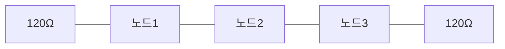

> **기준 출처:** TI SLLA272, TI SLLA270, CiA CAN physical layer, ISO 11898-2 개요 / 확인일 2026-08-03
> **시리즈:** [목차](/posts/00-comm-series/) | 이전 → [03. 물리계층](/posts/03-basics-physical-differential/) | 다음 → [05. 비트를 읽는 법](/posts/05-basics-sync-async/)

---

## 1. 선이 선이 아니게 되는 순간

전기 회로를 배울 때는 선을 저항 0 의 이상적인 연결로 본다. 한쪽 끝 전압을 바꾸면 반대쪽이 즉시 바뀐다고 가정한다.

이 가정이 깨지는 순간이 있다. 신호가 선을 지나가는 데 걸리는 시간이 신호가 변하는 시간에 비해 무시할 수 없어질 때다.

### 신호는 얼마나 빨리 가나

전기 신호는 빛의 속도로 가지 않는다. 유전체 때문에 느려진다.

| 매질 | 전파 속도 | 지연 |
| --- | --- | --- |
| 진공, 공기 | $3\times10^8$ m/s | 3.3 ns/m |
| 트위스트 페어 (PVC) | 약 $2\times10^8$ m/s (0.66c) | 약 5 ns/m |
| FR-4 PCB 마이크로스트립 | 약 $1.5\times10^8$ m/s | 약 6.7 ns/m |

트위스트 페어는 1 m 당 5 ns 다. 이 숫자 하나만 외우면 대부분의 계산이 된다.

### 언제부터 전송선로인가

경험칙은 이렇다.

$$l_{\text{임계}} \approx \frac{t_{\text{rise}} \times v}{6}$$

$t_{rise}$ 는 비트 주기가 아니라 신호의 상승 시간이다. 이게 중요하다.

**예제 1. 빠른 CMOS 출력($t_{rise}$ = 5 ns), PCB 위**

$$l = \frac{5\,\text{ns} \times 1.5\times10^8\,\text{m/s}}{6} \approx 0.125\,\text{m}$$

보드 위 12.5 cm 만 넘어도 전송선로다. 데이터 레이트가 낮아도 상관없다. 100 kHz SPI 라도 엣지가 빠르면 반사가 생긴다. 느린 통신이니 신경 안 써도 된다는 판단은 틀렸다.

**예제 2. CAN 트랜시버($t_{rise}$ ≈ 50 ns), 케이블**

$$l = \frac{50\,\text{ns} \times 2\times10^8\,\text{m/s}}{6} \approx 1.7\,\text{m}$$

CAN 버스가 1.7 m 만 넘어도 종단이 필요하다는 뜻이다. 실제로 CAN 은 길이와 무관하게 항상 종단하라고 안내한다.

## 2. 특성 임피던스

전송선로에서 신호는 앞을 보지 못한다. 자기 바로 앞의 아주 짧은 구간만 보고 전류를 결정한다. 그 구간이 보여주는 비율이 특성 임피던스 $Z_0$ 다.

$$Z_0 = \sqrt{\frac{L}{C}}$$

여기서 $L$ 과 $C$ 는 단위 길이당 인덕턴스와 커패시턴스다.

| 케이블 | $Z_0$ |
| --- | --- |
| CAN, RS-485 트위스트 페어 | 120 Ω |
| 이더넷 (Cat5e 이상) | 100 Ω |
| 동축 (RG-58) | 50 Ω |
| 동축 (TV) | 75 Ω |

$Z_0$ 는 길이와 무관하다. 1 m 든 1000 m 든 120 Ω 케이블은 120 Ω 이다. 저항이 아니라 비율이기 때문이다. 멀티미터로 재면 나오지 않는다. 멀티미터는 DC 저항을 잰다.

## 3. 반사

신호가 케이블 끝에 도착했는데 그 끝의 임피던스 $Z_L$ 이 $Z_0$ 와 다르면 에너지의 일부가 돌아온다.

$$\Gamma = \frac{Z_L - Z_0}{Z_L + Z_0}$$

| 끝단 상태 | $Z_L$ | $\Gamma$ | 무슨 일이 | 파형 |
| --- | --- | --- | --- | --- |
| 개방 (종단 없음) | ∞ | +1 | 같은 부호로 전부 반사 | 전압이 2배로 튄다 (오버슈트, 링잉) |
| 단락 | 0 | −1 | 반대 부호로 전부 반사 | 신호가 상쇄되어 사라진다 |
| 정합 (종단 = $Z_0$) | 120 Ω | 0 | 반사 없음 | 깨끗하다 |
| 절반만 맞춤 | 240 Ω | +0.33 | 33% 반사 | 링잉이 남는다 |

오실로스코프에서는 이렇게 보인다. 종단이 없으면 비트 엣지마다 계단 모양의 링잉이 붙는다. 왕복 시간(2 × 전파 지연)마다 한 계단씩 줄어든다. 이 링잉이 수신기 임계값을 가로지르면 한 비트를 두 비트로 읽는다. 종단 저항을 안 달았을 때 나는 전형적인 증상이다.

### 왜 노이즈보다 반사가 까다로운가

노이즈는 무작위라 평균이 0 이지만 반사는 내 신호가 되돌아온 것이라 신호와 상관관계가 있다. 하필 샘플링 시점에 정확히 얹히는 일이 반복적으로 일어난다. 그래서 가끔 되고 가끔 안 되는, 재현이 어려운 문제가 된다.

## 4. 종단 — 어디에 몇 개를 다는가

규칙은 하나다. 신호가 진행해서 도달하는 모든 끝에 $Z_0$ 를 달아준다. 그러면 왜 프로토콜마다 개수가 다른지가 저절로 나온다.

### CAN 과 RS-485는 양 끝에 하나씩, 총 2개

아무 노드나 송신할 수 있고 신호는 양쪽으로 퍼진다. 그러니 양 끝을 다 막아야 한다.

검증법은 간단하다. 전원을 끄고 CANH 와 CANL 사이 저항을 재면 60 Ω 이 나와야 한다. 120 Ω 두 개의 병렬이다.

| 측정 저항 | 해석 |
| --- | --- |
| 60 Ω | 정상 |
| 120 Ω | 종단이 하나뿐 |
| 40 Ω | 종단이 3개. 중간 노드에 내장 종단이 켜져 있다 |
| 무한대 | 종단이 없거나 배선이 끊김 |

이 한 번의 측정이 실무에서 가장 자주 문제를 잡아낸다.

### RS-422는 수신단 한쪽만

RS-422 는 송신기가 하나뿐인 점대점이거나 1대N 단방향이다. 신호가 한 방향으로만 간다. 송신기 쪽은 신호가 출발하는 곳이라 되돌아올 게 없다. 단다고 나쁠 건 없지만 전류만 더 쓰고 필요는 없다.

RS-485 를 반이중 멀티드롭으로 쓰면 아무나 송신하므로 다시 양 끝 2개다. RS-422 처럼 생각하면 안 된다.

### 스터브도 전송선로다

버스 본선에서 노드로 뻗은 짧은 가지를 스터브(stub)라 한다. 스터브 끝은 종단이 안 되어 있으니 반사가 생긴다. 그래서 짧아야 한다.

| 비트레이트 | 권장 최대 스터브 |
| --- | --- |
| 1 Mbps | 0.3 m 이하 |
| 500 kbps | 약 1 m |
| 125 kbps | 약 3 m |

실무 증상은 이렇다. 이 노드만 빼면 잘 되는데 꽂으면 에러가 난다면 그 노드의 스터브가 길다.

### 분할 종단

CAN 에서 흔히 쓰는 변형이다. 120 Ω 하나 대신 60 Ω 두 개를 직렬로 놓고 그 가운데를 커패시터(보통 4.7 nF ~ 100 nF)로 GND 에 떨군다.

차동 신호에는 여전히 120 Ω 이지만 공통모드 노이즈는 커패시터로 빠져나간다. [03편](/posts/03-basics-physical-differential/)에서 본 공통모드 문제를 물리적으로 한 번 더 잡는 장치다.

## 5. 속도 곱하기 거리가 일정한 이유

CAN 은 비트레이트가 올라가면 버스가 짧아져야 한다. 왜 그런지가 중재 방식에서 나온다.

중재 중에는 모든 노드가 같은 비트 시간 안에 서로의 신호를 봐야 한다. 노드 A 가 dominant 를 냈으면 버스 반대편 노드 Z 가 그 비트를 샘플링하기 전에 그 신호가 도착해야 한다. 그리고 Z 의 반응도 A 에게 돌아와야 한다. 곧 왕복 시간이 한 비트 안에 들어가야 한다.

$$t_{\text{prop}} \geq 2 \times (t_{\text{케이블}} + t_{\text{트랜시버}})$$

1 Mbps CAN 으로 계산해 보면 이렇다.

| 항목 | 값 |
| --- | --- |
| 비트 시간 | 1 µs = 1000 ns |
| 전파 세그먼트에 쓸 수 있는 몫 | 대략 절반 이하, 약 400 ns |
| 트랜시버 지연 왕복 | 약 200 ns (칩마다 다름) |
| 케이블 왕복에 남는 몫 | 약 200 ns, 편도 100 ns |
| 케이블 길이 | 100 ns ÷ 5 ns/m = 20 m |

여유를 보태 규격은 40 m 를 말한다. CiA 가 안내하는 표가 이 계산의 결과다.

| 비트레이트 | 최대 버스 길이 (대략) |
| --- | --- |
| 1 Mbps | 40 m |
| 500 kbps | 100 m |
| 250 kbps | 250 m |
| 125 kbps | 500 m |
| 50 kbps | 1000 m |

거의 반비례한다. 비트레이트를 절반으로 낮추면 길이가 두 배다. 속도 곱하기 거리가 대략 일정한 것이 물리가 정한 상한이고, 이건 프로토콜을 잘 짠다고 넘을 수 없다. CAN FD 가 데이터 구간만 빠르게 하고 중재 구간은 그대로 두는 이유가 정확히 이것이다. 중재는 왕복이 필요해서 빠르게 할 수 없다.

## 6. 페일세이프

RS-485 반이중 버스에서 모든 송신기가 꺼져 있으면 A 와 B 가 떠 있다(floating). 차동 전압이 0 근처라 수신기가 무작위로 판단하고, 그 잡음이 시작 비트처럼 보여 가짜 바이트가 쏟아진다.

해법은 바이어스 저항이다. A 를 VCC 쪽으로, B 를 GND 쪽으로 약하게 당겨서 idle 일 때 확실한 논리 1(mark) 상태를 만든다.

증상은 이렇다. 장비를 안 켰는데 수신 버퍼에 쓰레기가 쌓인다면 페일세이프 바이어스가 없다. 요즘 트랜시버는 내부에 넣은 것도 많다. 수신 임계를 −200 mV 대신 −50 mV 쪽으로 옮기는 방식이다. 데이터시트에서 fail-safe 항목을 확인한다.

CAN 은 이 문제가 없다. [03편](/posts/03-basics-physical-differential/)에서 봤듯 아무도 안 밀면 종단저항이 두 선을 같은 전압으로 만들어 recessive(1)가 된다. 물리 구조 자체가 페일세이프다.

## 정리

- 트위스트 페어의 전파 지연은 약 5 ns/m 다. 이 숫자 하나로 대부분 계산된다.
- 전송선로가 되는 기준은 데이터 속도가 아니라 신호 상승 시간이다. 빠른 엣지면 12 cm 도 전송선로다.
- 특성 임피던스 $Z_0=\sqrt{L/C}$ 는 길이와 무관한 비율이다. CAN 과 RS-485 는 120 Ω 이다.
- 반사 계수 $\Gamma = (Z_L-Z_0)/(Z_L+Z_0)$ 는 개방이면 +1(전압 2배 링잉), 정합이면 0 이다.
- 종단 규칙은 신호가 도달하는 모든 끝에 $Z_0$ 다. CAN 과 RS-485 는 양 끝 2개, RS-422 는 수신단 1개다.
- CANH 와 CANL 사이 저항 60 Ω 측정이 가장 값싼 진단이다.
- 스터브도 전송선로다. 1 Mbps 에서 0.3 m 이하로 둔다.
- 속도 곱하기 거리가 일정한 것은 중재의 왕복 요구가 만든 물리적 상한이다.
- RS-485 는 idle 상태를 위해 페일세이프 바이어스가 필요하고 CAN 은 구조상 필요 없다.

## 참고

- [TI SLLA272 — The RS-485 Design Guide](https://www.ti.com/lit/an/slla272d/slla272d.pdf)
- [TI SLLA270 — Termination for CAN](https://www.ti.com/lit/an/slla270/slla270.pdf)
- [CiA — CAN Knowledge](https://www.can-cia.org/can-knowledge)
