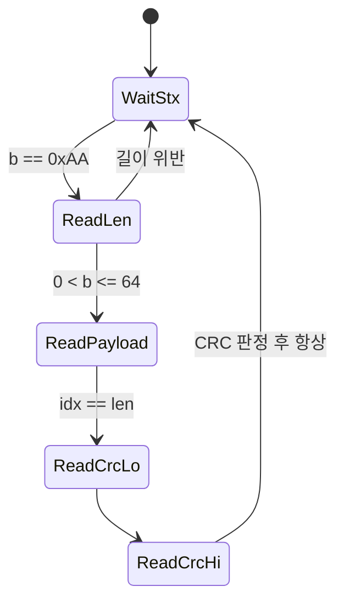

> **기준 출처:** Modbus over Serial Line V1.02 §2.5.1.1, NXP UM10204 §3.1.4, RFC 1055(SLIP), Cheshire & Baker "Consistent Overhead Byte Stuffing"(IEEE/ACM ToN 1999), Bosch CAN Spec 2.0 §3 / 확인일 2026-08-03
> **시리즈:** [목차](/posts/00-comm-series/) | 이전 → [05. 비트를 읽는 법](/posts/05-basics-sync-async/) | 다음 → [07. 오류 검출](/posts/07-basics-error-detection/)

---

## 1. 바이트 흐름에는 경계가 없다

[05편](/posts/05-basics-sync-async/) 덕에 이제 비트를 읽을 수 있다. UART 수신 버퍼에 이런 게 쌓였다고 하자.

```text
03 06 00 2A 01 F4 8B 91 03 06 00 2B 01 F5 ...
```

어디부터 어디까지가 한 메시지인가. 바이트만 봐서는 모른다. 게다가 더 나쁜 상황이 있다.

- 노이즈로 바이트 하나가 사라지면 그 뒤 모든 메시지의 경계가 밀린다.
- 통신 도중에 전원을 켜면 메시지 중간부터 받기 시작한다.
- 상대가 보내는 도중에 멎으면 반쪽 메시지가 남는다.

그래서 프레이밍은 두 가지를 해야 한다. 정상일 때 경계를 표시하고, 어긋났을 때 다시 맞출 수 있어야 한다. 두 번째를 잊는 게 실무의 흔한 실수다. 한 번 어긋나면 영원히 돌아오지 못하는 파서를 짜놓고 가끔 통신이 멎는다고 말하게 된다.

## 2. 방법 다섯 가지

### 고정 길이

가장 단순하고 재동기가 불가능하다. 한 바이트만 밀려도 영원히 어긋난다. 다른 방법과 섞어 쓸 때만 쓸모 있다. SPI 로 엔코더를 읽을 때처럼 CS 신호가 경계를 대신 정해주는 경우가 그렇다.

### 길이 필드

```text
[헤더][길이 = N][데이터 N바이트][CRC]
```

데이터에 어떤 값이 들어와도 안전하고 버퍼를 미리 잡을 수 있다. 문제는 길이 필드가 깨졌을 때다. `05` 가 `F5` 로 읽히면 245 바이트를 기다리며 멈춘다. 재동기하려면 별도 장치가 필요하다.

그래서 실무에서는 항상 세 가지를 같이 쓴다. 시작 표식(magic byte), 길이 상한 검사, CRC 다. 길이가 상한을 넘으면 즉시 버리고 시작 표식부터 다시 찾는다. 이더넷의 EtherType, CAN 의 DLC, EtherCAT Datagram 이 길이 필드 계열이다.

### 구분자와 이스케이핑

`0x7E` 같은 특별한 바이트로 끊는다. 데이터 안에 `0x7E` 가 나오면 이스케이프한다.

| 원본 | 전송 |
| --- | --- |
| `7E` | `7D 5E` |
| `7D` | `7D 5D` |

재동기가 쉽다. 구분자를 만나면 무조건 프레임 시작이다. 길이를 미리 몰라도 된다. 대신 전송 길이가 데이터에 따라 달라지고 최악에는 2배가 된다. 이스케이프 처리 코드에서 버그가 잘 난다. SLIP(RFC 1055), PPP, 많은 시리얼 프로토콜이 이 방식이다.

최악 2배가 싫으면 COBS(Consistent Overhead Byte Stuffing)를 쓴다. 데이터에서 `0x00` 을 전부 없애는 인코딩이라 `0x00` 을 순수한 프레임 구분자로 쓸 수 있다. 오버헤드가 254바이트당 최대 1바이트로 고정된다. 최악이 예측 가능하니 실시간 시스템에 유리하고 구현도 20줄 남짓이다.

### 대역 밖 표식

데이터로는 절대 만들 수 없는 신호를 경계로 쓰면 충돌 자체가 없다. I²C 의 START 와 STOP 조건이 그 예다.

| 신호 | 조건 |
| --- | --- |
| 데이터 비트 | SCL 이 HIGH 인 동안 SDA 는 반드시 안정 |
| START | SCL 이 HIGH 인데 SDA 가 HIGH에서 LOW 로. 규칙 위반이라 데이터일 수 없다 |
| STOP | SCL 이 HIGH 인데 SDA 가 LOW에서 HIGH 로 |

CAN 의 프레임 경계도 같은 발상이다. EOF 는 recessive 7비트인데 비트 스터핑 규칙(5비트 연속 금지) 때문에 데이터 구간에서는 절대 나올 수 없는 패턴이다.

충돌이 없고 이스케이핑이 필요 없고 재동기가 확실하다. 대신 물리계층의 도움이 필요하다. 순수 소프트웨어로는 못 한다.

### 침묵 시간

Modbus RTU 가 이걸 쓴다. 프레임 사이에 3.5 문자 시간 이상의 침묵이 있어야 하고, 프레임 안에서는 1.5 문자 시간 이상 쉬면 안 된다.

길이 필드도 구분자도 이스케이핑도 필요 없다. 어떤 바이트 값이든 데이터로 쓸 수 있다. 대신 시간에 의존하므로 OS 스케줄링과 버퍼링에 취약하고 침묵만큼 대역폭을 쓴다.

8N1 이면 1 문자는 시작 1비트, 데이터 8비트, 패리티 1비트, 정지 1비트로 11 비트다.

| 보율 | 1 문자 | t1.5 (프레임 내 최대 간격) | t3.5 (프레임 간 최소 침묵) |
| --- | --- | --- | --- |
| 9600 | 1.146 ms | 1.719 ms | 4.010 ms |
| 19200 | 0.573 ms | 0.859 ms | 2.005 ms |
| 38400 | 0.286 ms | 750 µs (고정) | 1.750 ms (고정) |
| 115200 | 0.095 ms | 750 µs (고정) | 1.750 ms (고정) |

규격은 19200 보다 빠르면 t1.5 를 750 µs, t3.5 를 1.750 ms 로 고정하라고 정한다. 계산값이 너무 짧아져 현실적으로 지킬 수 없기 때문이다.

실패 사례가 하나 있다. USB-UART 변환기는 바이트를 모아서 한 번에 넘긴다. 기본 latency timer 가 16 ms 다. 그러면 호스트가 보는 바이트 도착 시각이 실제와 다르다. 3.5 문자 침묵이 뭉개지고 두 프레임이 하나로 붙어 보인다. 대응은 어댑터의 latency timer 를 1~2 ms 로 낮추거나, 시간 대신 길이와 CRC 로 프레임을 판단하는 것이다. 후자가 더 튼튼하다.

## 3. 비교표

| 방법 | 재동기 | 데이터 투명성 | 길이 예측 | 시간 의존 | 대표 |
| --- | --- | --- | --- | --- | --- |
| 고정 길이 | 불가 | 가능 | 가능 | 없음 | SPI + CS |
| 길이 필드 | 보조 필요 | 가능 | 가능 | 없음 | 이더넷, CAN DLC |
| 구분자와 이스케이프 | 쉬움 | 가능 | 최악 2배 | 없음 | SLIP, PPP |
| COBS | 쉬움 | 가능 | 254바이트당 +1 | 없음 | 임베디드 로깅 |
| 대역 밖 표식 | 확실 | 가능 | 가능 | 없음 | I²C, CAN |
| 침묵 시간 | 쉬움 | 가능 | 가능 | 의존 | Modbus RTU |

대역 밖 표식이 가장 좋지만 물리계층이 도와줘야 하고, 소프트웨어만으로 하려면 COBS 가 현실적으로 가장 낫다.

## 4. 재동기가 되는 파서

프레이밍 파서는 FSM 이다. 그리고 바이트가 몇 개씩 쪼개져 도착하므로(UART 인터럽트, 소켓 read) 중간에 멈췄다가 이어갈 수 있어야 한다. 상태를 명시적으로 두는 게 정답이다.

프레임 형식은 `[STX=0xAA][LEN][PAYLOAD × LEN][CRC16_LO][CRC16_HI]` 로 잡는다.



```cpp
// comm_core/framing.hpp — 재동기가 되는 스트리밍 프레임 파서
#pragma once
#include <cstdint>
#include <array>
#include <optional>
#include <span>

class FrameParser {
public:
    static constexpr std::uint8_t kStx    = 0xAA;
    static constexpr std::size_t  kMaxLen = 64;   // 길이 상한. 이게 방어선이다

    // 바이트 하나를 먹인다. 완성된 프레임이 나오면 payload 를 돌려준다.
    std::optional<std::span<const std::uint8_t>> feed(std::uint8_t b);

    // 진단용. 왜 프레임을 버렸는지 세어둔다
    struct Stats { std::uint32_t bad_len{}, bad_crc{}, resync{}; };
    const Stats& stats() const { return stats_; }

private:
    enum class State { WaitStx, ReadLen, ReadPayload, ReadCrcLo, ReadCrcHi };

    State state_{State::WaitStx};
    std::array<std::uint8_t, kMaxLen> buf_{};
    std::size_t   len_{}, idx_{};
    std::uint16_t rx_crc_{};
    Stats stats_{};

    void reset(bool counts_as_resync) {
        if (counts_as_resync) ++stats_.resync;
        state_ = State::WaitStx;
        idx_ = 0;
    }
};

inline std::optional<std::span<const std::uint8_t>> FrameParser::feed(std::uint8_t b) {
    switch (state_) {
    case State::WaitStx:
        // 재동기 지점. STX 가 아니면 그냥 버린다. 절대 멈추지 않는다
        if (b == kStx) state_ = State::ReadLen;
        return std::nullopt;

    case State::ReadLen:
        if (b == 0 || b > kMaxLen) {           // 길이 검사가 무한 대기를 막는다
            ++stats_.bad_len;
            reset(true);
            return std::nullopt;
        }
        len_ = b; idx_ = 0;
        state_ = State::ReadPayload;
        return std::nullopt;

    case State::ReadPayload:
        buf_[idx_++] = b;
        if (idx_ == len_) state_ = State::ReadCrcLo;
        return std::nullopt;

    case State::ReadCrcLo:
        rx_crc_ = b;
        state_ = State::ReadCrcHi;
        return std::nullopt;

    case State::ReadCrcHi:
        rx_crc_ |= static_cast<std::uint16_t>(b) << 8;
        state_ = State::WaitStx;
        if (crc16_modbus({buf_.data(), len_}) != rx_crc_) {   // 07편에서 구현
            ++stats_.bad_crc;
            return std::nullopt;
        }
        return std::span<const std::uint8_t>{buf_.data(), len_};
    }
    return std::nullopt;
}
```

이 코드에서 눈여겨볼 세 곳은 이렇다.

| 지점 | 왜 중요한가 |
| --- | --- |
| `WaitStx` 에서 아무 바이트나 버림 | 이렇게 해야 재동기가 된다. 어긋나도 다음 STX 에서 복구된다 |
| `b > kMaxLen` 검사 | 길이 필드가 깨져도 영원히 기다리지 않는다 |
| `Stats` 카운터 | `resync` 가 늘고 있으면 물리계층이 나쁘다는 신호다. 이게 없으면 가끔 이상하다로만 남는다 |

`0xAA` 가 데이터 안에 나오면 어떻게 되는가. 이 설계는 이스케이핑을 하지 않으므로 재동기 중에 데이터의 `0xAA` 를 STX 로 착각할 수 있다. CRC 가 그걸 걸러낸다. 잘못 잡은 프레임은 CRC 에서 떨어진다. 곧 STX 와 길이 상한과 CRC 세 겹이 합쳐져야 안전하고, 하나라도 빼면 구멍이 생긴다. 완전한 투명성이 필요하면 COBS 로 간다.

이 파서를 Stateflow 로 그려보면 좋은 연습이 된다. State 가 5개이고 전이 조건이 명확하며, 어느 State 에서든 오류면 `WaitStx` 로 돌아가는 기본 Transition 이 있다.

## 5. 프레이밍은 한 겹이 아니다

실제 시스템은 프레이밍이 여러 층으로 겹쳐 있다. Modbus RTU over RS-485 를 예로 보면 이렇다.

| 층 | 내용 |
| --- | --- |
| 비트 레벨 | 시작 비트, 8비트, 정지 비트 (UART 프레임) |
| 바이트 흐름 | 3.5 문자 침묵으로 끊기 (Modbus RTU 프레임) |
| 메시지 레벨 | 주소, 함수코드, 데이터, CRC16 (Modbus PDU) |
| 트랜잭션 | 요청 하나에 응답 하나 (Modbus 대화) |

디버깅할 때 프레임이 깨졌다는 말이 애매한 이유가 이것이다. 어느 층인지 말해야 한다. 비트 레벨이면 보율이나 노이즈 문제라 오실로스코프를 봐야 하고, 바이트 흐름이면 타이밍과 버퍼링 문제라 latency timer 를 봐야 하고, 메시지 레벨이면 CRC 불일치라 노이즈나 구현 버그이고, 트랜잭션이면 타임아웃과 재시도 로직 문제다.

## 정리

- 프레이밍은 경계 표시와 재동기 둘 다를 해야 한다. 두 번째를 잊는 게 흔한 실수다.
- 다섯 방법은 고정 길이, 길이 필드, 구분자와 이스케이프, 대역 밖 표식, 침묵 시간이다.
- 길이 필드는 빠르지만 길이가 깨지면 멈춘다. 반드시 상한 검사와 시작 표식과 CRC 를 같이 쓴다.
- 이스케이핑은 최악 2배이고 COBS 는 254바이트당 1바이트로 고정된다. 실시간에 유리하다.
- 대역 밖 표식(I²C START/STOP, CAN EOF)이 가장 확실하지만 물리계층이 도와야 한다.
- Modbus RTU 침묵은 9600 에서 t3.5 가 4.01 ms 이고 19200 초과면 1.750 ms 로 고정된다.
- USB-시리얼 어댑터의 latency timer 가 침묵 기반 프레이밍을 깨뜨린다.
- 파서는 FSM 으로 짠다. 항상 대기 상태로 돌아갈 수 있어야 하고 재동기 카운터를 남긴다.
- 프레이밍은 층층이 겹친다. 깨졌다고 말할 때는 어느 층인지 말한다.

## 참고

- [Modbus over Serial Line V1.02](https://www.modbus.org/docs/Modbus_over_serial_line_V1_02.pdf)
- [NXP UM10204 — I²C-bus specification](https://www.nxp.com/docs/en/user-guide/UM10204.pdf)
- [RFC 1055 — SLIP](https://www.rfc-editor.org/rfc/rfc1055)
- [Cheshire & Baker — Consistent Overhead Byte Stuffing (PDF)](https://www.stuartcheshire.org/papers/COBSforToN.pdf)
- [Bosch CAN Specification 2.0](https://www.bosch-semiconductors.com/media/ip_modules/pdf_2/can2spec.pdf)
