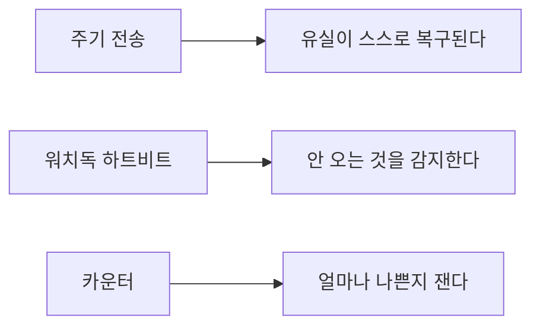

> **기준 출처:** Bosch CAN Spec 2.0 §6, NXP UM10204 §3.1.9, RFC 793, RFC 896, CiA CANopen heartbeat 공개 요약, ETG EtherCAT Technology / 확인일 2026-08-03
> **시리즈:** [목차](/posts/00-comm-series/) | 이전 → [07. 오류 검출](/posts/07-basics-error-detection/) | 다음 → [09. 바이트 순서와 정렬](/posts/09-basics-endian-alignment/)

---

## 1. 두 개의 다른 문제

자주 뭉뚱그려지는데 성격이 완전히 다르다.

| | 흐름 제어 | 재전송 (ARQ) |
| --- | --- | --- |
| 푸는 문제 | 받는 쪽이 소화를 못 한다 | 데이터가 깨지거나 없어졌다 |
| 언제 발동 | 버퍼가 차간다 | 오류를 검출했다 |
| 방향 | 송신자를 늦춘다 | 같은 걸 다시 보낸다 |
| 실시간에서 | 주기를 깨뜨린다 | 대개 독이다 |

[01편](/posts/01-basics-what-comm-solves/)의 문제 ⑤ 조정의 후반부가 이것이고, 문제 ⑥ 시간과 정면으로 충돌한다.

## 2. 흐름 제어

송신자가 초당 10000 바이트를 보내는데 수신 측 CPU 가 초당 8000 바이트만 처리하면 버퍼가 찬다. 차면 오버런이다. 새 데이터가 아직 안 읽은 데이터를 덮어쓰거나 그냥 버려진다.

UART 에서 이게 Overrun Error 플래그로 나타난다. 원인은 셋 중 하나다. 인터럽트 우선순위가 낮아 UART ISR 이 밀리거나, ISR 안에서 파싱까지 하며 일을 너무 많이 하거나, 애초에 보율이 처리 능력보다 높다.

| 방식 | 어떻게 | 쓰는 곳 | 문제 |
| --- | --- | --- | --- |
| 하드웨어 (RTS/CTS) | 별도 신호선으로 잠깐을 알린다 | RS-232 | 선이 2개 더 필요하다. 반응이 즉각적이라 가장 확실하다 |
| 소프트웨어 (XON/XOFF) | 데이터 흐름에 `0x11` 과 `0x13` 을 섞어 보낸다 | 시리얼 터미널 | 바이너리 데이터에 못 쓴다. 데이터에 `0x11` 이 나오면 무너진다. 반응도 느리다 |
| 클럭 스트레칭 | 수신 슬레이브가 SCL 을 LOW 로 붙잡아 마스터를 멈춘다 | I²C | 마스터가 지원해야 하고 무한정 붙잡으면 버스가 멎는다 |
| 윈도우, 크레딧 | N 개까지 보내도 된다를 미리 알린다 | TCP | 왕복이 필요해 지연이 있다 |
| 흐름 제어 없음 | 상위 계층이 요청과 응답으로 알아서 | Modbus, CANopen SDO | 단순하다. 대신 요청 페이스를 잘 잡아야 한다 |

### 클럭 스트레칭이 동기식에서만 가능한 이유

클럭을 마스터가 주므로 슬레이브가 그 클럭을 못 가게 붙잡으면 시간이 멈춘다. 비동기식(UART, CAN)에서는 이런 게 불가능하다. 시간이 흐르는 걸 막을 수 없기 때문이다.

실패 사례가 있다. 슬레이브 펌웨어가 인터럽트 안에서 플래시 쓰기 같은 오래 걸리는 일을 하면 SCL 을 수십 ms 붙잡는다. 마스터에 스트레칭 타임아웃이 없으면 전체 I²C 버스가 그동안 멎는다. 1 kHz 제어 루프에서는 치명적이다.

## 3. 재전송이 실시간에서 독인 이유

### ARQ 세 가지

| 방식 | 동작 | 처리량 |
| --- | --- | --- |
| Stop-and-Wait | 하나 보내고 ACK 를 기다린다 | 왕복 지연에 완전히 묶인다 |
| Go-Back-N | N 개까지 미리 보내고 하나 틀리면 그 뒤 전부 재전송 | 중간 |
| Selective Repeat | 틀린 것만 재전송 | 좋지만 수신 버퍼가 복잡하다 |

### Stop-and-Wait 이 얼마나 느린가

RS-485, 115200 bps, 편도 지연 무시, 요청 8바이트에 응답 8바이트로 계산한다.

| 항목 | 값 |
| --- | --- |
| 8바이트 전송 시간 | 8 × 11비트 / 115200 = 0.76 ms |
| 요청과 응답 | 1.53 ms |
| 슬레이브 처리와 3.5문자 침묵(1.75 ms) 포함 | 약 3.5 ms/트랜잭션 |

초당 약 285 트랜잭션이다. 슬레이브가 10대면 각 노드는 28 Hz 로만 갱신된다. 1 kHz 제어 루프에 붙일 수 없는 숫자다.

이게 Modbus RTU 를 제어 루프에 못 쓰는 이유이고 필드버스가 태어난 이유다. 요청과 응답을 노드마다 반복하는 구조 자체가 병목이다. EtherCAT 는 이걸 한 프레임이 모든 노드를 지나가는 구조로 뒤집는다.

### 제어 데이터는 상태다

| | 스트림 데이터 (파일, 로그) | 상태 데이터 (센서값, 명령) |
| --- | --- | --- |
| 각 바이트가 | 전부 필요하다 | 최신 것만 의미 있다 |
| 하나 빠지면 | 복구해야 한다 | 다음 주기 값으로 대체된다 |
| 낡은 값은 | 여전히 유효하다 | 틀린 값이다 |

1 kHz 루프에서 t=5 ms 의 센서값이 유실됐다고 하자. 재전송하면 t=7 ms 쯤 도착한다. 그런데 그때는 t=7 ms 의 실제 값이 이미 있다. 2 ms 낡은 값을 살려서 할 일이 없다.

더 나쁜 건 head-of-line blocking 이다. TCP 는 순서를 보장하려고 빠진 조각이 올 때까지 그 뒤에 도착한 새 데이터를 붙잡아 둔다. 낡은 값 하나 때문에 새 값들이 막힌다.

그래서 실시간 제어 통신의 원칙은 이렇다. 유실은 재전송하지 않고 다음 주기 값을 쓴다. 대신 유실을 세고, 연속 유실이 임계를 넘으면 안전 상태로 간다.

## 4. 유실을 다루는 세 가지 장치



### 주기 전송

같은 데이터를 매 주기 다시 보낸다. 하나 빠져도 1 주기 뒤에 최신값이 온다. 재전송보다 빠르고 단순하다. EtherCAT 의 프로세스 데이터와 CANopen 의 PDO 가 전부 이 방식이다.

### 워치독과 하트비트

주기 전송의 약점은 상대가 멎어도 조용하다는 것이다. 아무 일도 안 일어나는 게 정상과 구분되지 않는다. 그래서 안 오면 알아채는 장치를 둔다.

| 프로토콜 | 장치 |
| --- | --- |
| CANopen | Heartbeat. 노드가 주기적으로 살아있다를 방송한다. 구식은 Node Guarding |
| EtherCAT | SyncManager 워치독. 정해진 시간 안에 프로세스 데이터가 안 오면 슬레이브가 스스로 출력을 끈다 |
| 일반 | 애플리케이션 워치독 타이머와 카운터 |

워치독이 안전의 핵심이다. 케이블이 빠졌을 때 모터가 마지막 명령대로 계속 도는 걸 막는 게 이 장치다. 그리고 판단이 슬레이브 쪽에 있어야 마스터가 정지해도 동작한다.

### 카운터

| 카운터 | 무엇을 말해주나 |
| --- | --- |
| CAN TEC/REC | 송수신 오류 누적. Bus Off 판단 근거 |
| EtherCAT WKC 불일치 | 어떤 슬레이브가 처리를 못 했다 |
| EtherCAT 포트별 CRC 카운터 | 어느 케이블 구간이 나쁜지 위치를 찍는다 |
| [06편](/posts/06-basics-framing/) 파서의 `resync` | 물리계층 품질 지표 |

가끔 튄다를 포트 3의 CRC 카운터가 시간당 40개씩 는다로 바꾸는 게 카운터의 일이다. 카운터 없이 하는 통신 디버깅은 대부분 추측이다.

## 5. CAN 의 예외 — 자동 재전송이 하드웨어에 박혀 있다

CAN 은 위 원칙의 예외다. 오류를 검출하면 컨트롤러가 하드웨어 수준에서 자동으로 재전송한다. 소프트웨어는 관여하지 않는다.

장점은 명확하다. 신뢰성이 높다. 그런데 실시간 관점에서 문제가 둘 있다.

| 문제 | 무슨 일 |
| --- | --- |
| 지연이 튄다 | 재전송하면 그 메시지가 1 프레임 시간만큼 늦는다. 최악 지연 계산이 복잡해진다 |
| babbling idiot | 트랜시버가 고장 난 노드가 영원히 재전송을 반복하며 버스를 점유한다 |

두 번째를 막는 게 오류 FSM 이다. 오류가 쌓여 TEC 가 256 이상이 되면 노드가 스스로 Bus Off 로 가서 버스에서 떨어진다. 고장 난 노드를 네트워크가 스스로 격리하는 설계다.

이 설계가 CAN 을 자동차에 쓸 수 있게 만든 이유다. 그리고 이건 FSM 으로만 표현되는 안전 메커니즘이라 Stateflow 로 그려보기 좋다.

주기 데이터에는 자동 재전송이 오히려 방해라서 많은 CAN 컨트롤러가 one-shot 모드(재전송 안 함)를 제공한다. 실시간 PDO 를 보낼 때 켜는 옵션이다.

## 6. 실시간 버퍼는 막지 말고 덮어쓴다

일반 프로그래밍에서 버퍼가 차면 생산자를 막는다. 실시간 제어에서는 막으면 주기가 깨진다. 그러니 반대로 한다. 가장 낡은 것을 버리고 최신을 남긴다.

```cpp
// comm_core/latest_value.hpp
// 제어 루프용 최신값 버퍼. 생산자는 절대 막히지 않는다.
// 값이 밀리면 낡은 것을 버린다. 상태 데이터에는 이게 맞다.
#pragma once
#include <atomic>
#include <array>
#include <cstdint>

template <typename T>
class LatestValue {
public:
    // 생산자(통신 ISR 또는 수신 스레드)에서 호출한다. 대기가 없다
    void publish(const T& v) noexcept {
        const unsigned next = (write_slot_ + 1) % 3;
        slots_[next] = v;
        write_slot_ = next;
        ready_.store(next, std::memory_order_release);
        seq_.fetch_add(1, std::memory_order_relaxed);   // 갱신 횟수
    }

    // 소비자(제어 루프)에서 호출한다. 항상 최신값이다
    T read() const noexcept {
        return slots_[ready_.load(std::memory_order_acquire)];
    }

    std::uint32_t updates() const noexcept {
        return seq_.load(std::memory_order_relaxed);
    }

private:
    std::array<T, 3> slots_{};      // 3버퍼. 읽는 쪽과 쓰는 쪽이 절대 겹치지 않는다
    unsigned write_slot_{0};
    std::atomic<unsigned>      ready_{0};
    std::atomic<std::uint32_t> seq_{0};
};
```

### 왜 버퍼가 3개인가

슬롯 하나는 소비자가 지금 읽는 중이고, 하나는 방금 완성된 최신값이고, 하나는 생산자가 지금 쓰는 중이다. 2개면 소비자가 읽는 도중에 생산자가 그 슬롯을 다시 잡을 수 있다. 3개면 그럴 일이 없다.

EtherCAT SyncManager 의 buffered mode 가 정확히 이 3버퍼다. 하드웨어로 구현돼 있다는 점만 다르다. 마스터가 쓰는 동안 슬레이브가 읽어도 절대 찢어진 값을 보지 않는다.

그리고 `updates()` 카운터를 반드시 둔다. 제어 루프가 매 주기 이 값을 확인해서 안 늘고 있으면 데이터가 안 오고 있다는 뜻이다. 이게 애플리케이션 레벨 워치독이다.

## 7. 프로토콜별 선택

| | 흐름 제어 | 오류 시 | 유실 감지 |
| --- | --- | --- | --- |
| UART / RS-232 | RTS/CTS 또는 XON/XOFF | 아무것도 안 한다 | 상위 계층이 알아서 |
| I²C | 클럭 스트레칭 | NACK 를 보고 마스터가 판단 | 마스터가 타임아웃 |
| SPI | 없음 | 없음 | 없음 |
| Modbus RTU | 요청과 응답 페이스 | 마스터가 재요청 | 응답 타임아웃 |
| CAN | 중재가 대신한다 | 하드웨어 자동 재전송 | TEC/REC 로 Bus Off |
| CANopen PDO | 주기 전송 | 재전송 안 함(one-shot 권장) | Heartbeat |
| EtherCAT | 마스터가 스케줄 | 재전송 안 함 | WKC 와 SM 워치독 |

아래로 갈수록 재전송을 포기하고 감지에 투자하는 쪽으로 간다. 이게 실시간 통신의 방향이다.

## 정리

- 흐름 제어(못 따라감)와 재전송(깨짐)은 다른 문제다.
- 흐름 제어는 RTS/CTS 가 확실하고, XON/XOFF 는 바이너리에 못 쓰고, 클럭 스트레칭은 동기식에서만 가능하다.
- Stop-and-Wait Modbus 는 노드 10대에 28 Hz 라 제어 루프에 못 쓴다.
- 재전송이 제어에서 독인 이유는 제어 데이터가 상태라서 낡은 값이 곧 틀린 값이기 때문이다. TCP 의 head-of-line blocking 은 새 값까지 막는다.
- 대신 셋을 쓴다. 주기 전송(반복이 복구다), 워치독과 하트비트(안 오는 걸 감지), 카운터(얼마나 나쁜지).
- 워치독은 슬레이브 쪽에 판단이 있어야 마스터가 정지해도 동작한다.
- CAN 은 하드웨어 자동 재전송이 예외다. babbling idiot 위험을 오류 FSM(Bus Off)으로 막는다. 주기 PDO 는 one-shot 을 권장한다.
- 실시간 버퍼는 막지 말고 덮어쓴다. 3버퍼면 읽기와 쓰기가 겹치지 않고, 이는 EtherCAT SyncManager 와 같은 구조다.
- 갱신 카운터를 두면 안 오고 있다를 애플리케이션이 스스로 안다.

## 참고

- [Bosch CAN Specification 2.0](https://www.bosch-semiconductors.com/media/ip_modules/pdf_2/can2spec.pdf)
- [NXP UM10204 — I²C-bus specification](https://www.nxp.com/docs/en/user-guide/UM10204.pdf)
- [RFC 793 — Transmission Control Protocol](https://www.rfc-editor.org/rfc/rfc793)
- [RFC 896 — Nagle 알고리즘](https://www.rfc-editor.org/rfc/rfc896)
- [CiA — CAN Knowledge](https://www.can-cia.org/can-knowledge)
- [ETG — EtherCAT Technology](https://www.ethercat.org/en/technology.html)
