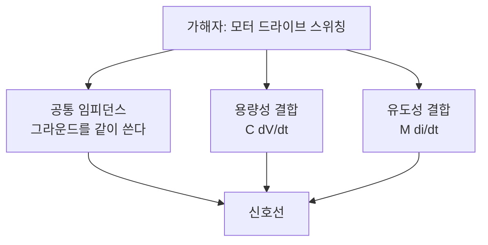

> **기준 출처:** TI SLLA272, TI SLLA271, Analog Devices Digital Isolator 기술 자료, IEC 61000 계열과 IEC 60601-1-2 는 요구사항의 존재만 참조, 전자기 결합 이론은 표준 EMC 교과서 수준의 공개 지식 / 확인일 2026-08-03
> **시리즈:** [목차](/posts/00-comm-series/) | 이전 → [10. 실시간성](/posts/10-basics-realtime-jitter/) | 다음 → [12. 공통 모듈 만들기](/posts/12-basics-comm-core/)

---

## 1. 환경이 바뀌어서 깨진다

01편부터 10편까지는 설계의 문제였다. 이 글은 현장의 문제다. 랩에서 며칠 잘 동작하던 통신이 장비에 붙이고 모터를 구동하는 순간 깨진다. 코드는 하나도 바뀌지 않았고 프로토콜도 그대로다. 바뀐 건 전자기 환경뿐이다. 그리고 이 문제는 소프트웨어 쪽에서 아무리 들여다봐도 보이지 않는다.

진단의 첫 질문은 하나다. 언제 깨지는가. 모터가 가속할 때인지, 브레이크가 풀릴 때인지, 릴레이가 붙을 때인지, 다른 장비를 켤 때인지. 깨지는 시점과 동시에 일어나는 일을 찾으면 원인의 절반이 잡힌다.

## 2. 노이즈가 들어오는 세 가지 길

### 공통 임피던스 결합

가장 흔하고 가장 안 보인다. 그라운드 선은 0 Ω 이 아니다. 드라이브가 10 A 를 스위칭하면 공유 구간에 전압이 생긴다.

$$V_{\text{noise}} = I \cdot R + L\frac{di}{dt}$$

배선 인덕턴스는 대략 1 nH/mm 다. 30 cm 그라운드 선이면 약 300 nH 다. 스위칭 전류 변화율이 $di/dt = 10\,\text{A}/100\,\text{ns} = 10^8\,\text{A/s}$ 라면 이렇게 된다.

$$V = 300\,\text{nH} \times 10^8 = 30\,\text{V}$$

30 V 다. 3.3 V 로직 기준이 이만큼 흔들리면 단선 통신은 즉시 무너진다. [03편](/posts/03-basics-physical-differential/)에서 본 그라운드 전위차의 정체가 이것이고, 저항이 아니라 인덕턴스가 주범이다.

대응은 신호 그라운드와 전력 그라운드를 한 점에서만 만나게 하는 것이다(star ground). 그리고 애초에 차동 통신을 쓴다.

### 용량성 결합

두 도체가 나란히 있으면 커패시턴스가 생긴다. 옆 선의 전압이 급변하면 전류가 밀려 들어온다.

$$I_{\text{coupled}} = C_{\text{결합}} \cdot \frac{dV}{dt}$$

IGBT 스위칭의 $dV/dt$ 는 5 kV/µs, 곧 $5\times10^9$ V/s 수준이다. 나란히 지나는 케이블 간 결합 커패시턴스가 10 pF 이라면 이렇게 된다.

$$I = 10\,\text{pF} \times 5\times10^9 = 50\,\text{mA}$$

50 mA 가 신호선으로 밀려든다. 신호 전류가 수 mA 인 걸 생각하면 압도적이다.

대응은 전력 케이블과 신호 케이블을 최소 20~30 cm 떨어뜨리는 것이다. 교차해야 하면 직각으로 한다. 그리고 차폐로 전기장을 막는다.

### 유도성 결합

전류 루프가 만드는 자기장이 옆 루프에 전압을 유도한다.

$$V_{\text{induced}} = M \cdot \frac{di}{dt}, \qquad M \propto \text{루프 면적}$$

대응은 루프 면적을 줄이는 것이다. 신호선과 귀환선을 붙이는 것, 곧 트위스트 페어다. [03편](/posts/03-basics-physical-differential/)에서 본 꼬는 이유의 두 번째 근거가 이것이다. 차폐는 자기장에는 별로 듣지 않는다. 저주파에서 특히 그렇다.

## 3. 그라운드 루프

두 장비가 각자 접지되어 있고 통신 케이블의 GND 로도 이어져 있으면 닫힌 루프가 생긴다. 두 접지점의 전위차가 루프에 전류를 흘리고, 이 루프는 큰 안테나이기도 해서 주변 자기장이 여기에 전압을 유도한다.

| 증상 | 해석 |
| --- | --- |
| 50/60 Hz 험이 신호에 섞인다 | 전원 주파수가 유도됐다 |
| 모터를 돌릴 때만 통신 에러 | 드라이브 스위칭이 루프에 실렸다 |
| 장비 하나를 다른 콘센트에 꽂으면 달라진다 | 그라운드 루프의 결정적 증거다 |

| 방법 | 설명 | 언제 |
| --- | --- | --- |
| 한 점 접지 | 장비들을 한 지점에서만 접지한다 | 장비가 가깝고 배치를 바꿀 수 있을 때 |
| 차동 통신 | 공통모드로 실려 상쇄된다 | 기본 선택 |
| 절연 | 루프를 물리적으로 끊는다 | 전위차가 크거나 안전이 걸릴 때 |

## 4. 절연

절연은 전기적 연결 없이 신호만 넘기는 것이다. 그러면 그라운드가 아예 이어지지 않으므로 루프가 성립하지 않는다.

| 방식 | 원리 | 속도 | 특징 |
| --- | --- | --- | --- |
| 옵토커플러 | LED 와 포토트랜지스터 | 느리다 (약 1 Mbps, 고속품은 더 빠르다) | 싸다. LED 열화로 수명이 있다 |
| 용량성 디지털 아이솔레이터 | 미세 커패시터로 전계 결합 | 빠르다 (100 Mbps 이상) | 수명이 길다. 요즘 표준이다 |
| 자기성 디지털 아이솔레이터 | 온칩 트랜스포머 | 빠르다 | 강한 외부 자기장에 주의한다 |
| 펄스 트랜스포머 | 권선 결합 | 매우 빠르다 | 이더넷이 필수로 쓴다 |

### 절반만 절연하면 절연이 아니다

가장 흔한 실수다. 신호선은 아이솔레이터로 끊었는데 전원을 양쪽이 같이 쓰면 그라운드가 전원 쪽으로 이어져 있다. 루프가 그대로 살아 있다.

절연하려면 전원도 절연해야 한다. 절연형 DC-DC 컨버터를 같이 쓴다. 그래서 절연 CAN 이나 RS-485 모듈은 대개 트랜시버와 아이솔레이터와 절연 DC-DC 세 종 세트다. 절연 장벽을 넘어가는 도체가 하나도 없어야 한다.

이더넷은 절연이 규격에 박혀 있다. 모든 이더넷 포트는 펄스 트랜스포머로 절연된다. 그래서 EtherCAT 는 절연 문제를 공짜로 얻는다. 슬레이브 사이가 전부 절연이다. CAN 을 절연하려면 노드마다 부품을 붙여야 하는 것과 대조적이다.

의료기기에서는 절연이 통신 품질 문제가 아니라 환자 보호 요구사항이기도 하다. 요구되는 절연 내압과 연면거리는 안전 규격이 정한다. 구체 수치는 해당 규격 문서를 확인해야 하고 여기서는 다루지 않는다.

## 5. 차폐를 한쪽에 접지할까 양쪽에 접지할까

차폐는 전기장을 막아준다. 문제는 어디에 접지하느냐이고 답이 주파수에 따라 다르다.

| 접지 방식 | 저주파(수십 kHz 이하) | 고주파 |
| --- | --- | --- |
| 한쪽 끝만 | 그라운드 루프가 없다 | 차폐가 안테나가 된다 (반파장 공진) |
| 양쪽 끝 | 그라운드 루프가 생긴다 | 차폐가 제대로 동작한다 |

산업 환경은 모터 노이즈가 고주파라서 양쪽 접지가 기본이다. 대신 그라운드 루프를 줄이려고 굵은 등전위 본딩선을 따로 깐다. 또는 한쪽은 직접 접지하고 반대쪽은 수 nF 커패시터를 통해 접지한다. DC 는 끊고 고주파만 통과시키는 방법이다.

차폐 접속은 360° 로 감싸서 한다. 꼬리처럼 한 가닥 뽑아 잇는 pigtail 방식은 그 가닥의 인덕턴스 때문에 고주파에서 차폐 효과가 크게 떨어진다. 커넥터의 금속 쉘에 차폐를 360° 로 물리는 게 왜 중요한지가 이것이고, 산업용 커넥터가 비싼 이유의 일부다.

## 6. 진단 절차

소프트웨어를 보기 전에 이 순서로 확인한다.

| # | 확인 | 알아내는 것 |
| --- | --- | --- |
| 1 | 언제 깨지나. 모터 가속, 브레이크, 릴레이, 특정 장비 전원 | 가해자를 특정한다 |
| 2 | 모터 전원을 끄면 되나 | 되면 노이즈 확정, 안 되면 배선이나 설정 문제 |
| 3 | 케이블을 옮기면 달라지나 | 달라지면 용량성이나 유도성 결합 |
| 4 | 다른 콘센트에 꽂으면 달라지나 | 달라지면 그라운드 루프 |
| 5 | 종단 저항 측정 (CAN 은 60 Ω) | 반사 여부 |
| 6 | 오실로스코프로 파형 확인 | 링잉(종단), 진폭 저하(감쇠), 스파이크(결합) |
| 7 | 오류 카운터 확인 | 얼마나 자주, 어느 구간에서 |

1번과 4번이 가장 값싸고 가장 잘 듣는다. 도구 없이 할 수 있고 답이 나오면 방향이 정해진다.

### 파형으로 원인 구분하기

| 오실로스코프에서 보이는 것 | 원인 |
| --- | --- |
| 엣지마다 계단형 링잉 | 종단이 없거나 불일치다 |
| 진폭이 전반적으로 낮다 | 감쇠이거나 종단이 3개 이상이다 |
| 무작위 좁은 스파이크 | 용량성 결합이다 |
| 신호 전체가 위아래로 출렁인다 | 공통모드 노이즈나 그라운드 전위차다 |
| 50/60 Hz 사인파가 섞인다 | 그라운드 루프다 |
| idle 인데 무작위 비트가 들어온다 | RS-485 페일세이프 바이어스가 없다 |

## 7. 배선 원칙 요약

1. 전력선과 신호선을 20~30 cm 이상 떨어뜨린다. 교차는 직각으로 한다.
2. 차동과 트위스트 페어를 쓴다. 꼬임이 풀린 구간을 최소화한다. 커넥터 근처가 특히 그렇다.
3. 스터브를 짧게 한다.
4. 종단을 정확히 한다. 양 끝 하나씩이고 저항값을 실측으로 확인한다.
5. 차동이어도 GND 를 잇는다. RS-485 는 3선이다.
6. 장비 간 전위차가 크면 절연한다. 절연할 거면 전원까지 절연한다.
7. 차폐는 360° 접속으로 하고 산업 환경은 양쪽 접지에 등전위 본딩을 더한다.
8. 모터 케이블을 차폐하고 드라이브 쪽에서 360° 접지한다.

8번이 의외로 가장 효율적이다. 피해자 10개를 보호하는 것보다 가해자 1개를 막는 게 싸다. 노이즈 문제는 언제나 원천에서 잡는 게 낫다.

## 기초 열두 편을 마치며

여기까지 오면 어떤 프로토콜을 만나도 읽을 틀이 생긴다. [01편](/posts/01-basics-what-comm-solves/)의 여섯 칸을 다시 보면 이렇게 채워진다.

| 칸 | 어디서 다뤘나 |
| --- | --- |
| ① 도달 | 03편(차동), 04편(종단), 11편(노이즈) |
| ② 동기 | 05편(동기와 비동기, 스터핑) |
| ③ 경계 | 06편(프레이밍 다섯 방법) |
| ④ 무결 | 07편(CRC) |
| ⑤ 조정 | 08편(흐름제어와 재전송) |
| ⑥ 시간 | 10편(지연, 지터, 결정성) |
| 구현 | 02편(계층), 09편(직렬화) |

앞으로는 이 칸을 채우는 것으로 프로토콜을 읽는다. 새로 배우는 건 각 칸의 그 프로토콜만의 답뿐이다.

## 정리

- 이 글의 문제는 코드에 보이지 않는다. 환경이 바뀌어서 깨진다.
- 진단의 첫 질문은 언제 깨지는가다. 동시에 일어나는 일이 가해자다.
- 결합 경로는 셋이다. 공통 임피던스(그라운드 공유), 용량성($C\,dV/dt$), 유도성($M\,di/dt$).
- 그라운드 선 인덕턴스가 1 nH/mm 이므로 30 cm 에 $10^8$ A/s 면 30 V 가 생긴다. 저항이 아니라 인덕턴스가 주범이다.
- IGBT 의 5 kV/µs 에 결합 10 pF 이면 50 mA 가 신호선으로 밀려든다.
- 그라운드 루프는 두 접지점과 통신 GND 가 만드는 닫힌 회로다. 콘센트를 바꿔서 달라지면 확정이다.
- 해법은 한 점 접지, 차동, 절연이다.
- 절연은 전원까지 해야 절연이다. 신호만 끊고 전원을 공유하면 루프가 살아 있다.
- 이더넷은 트랜스포머 절연이 규격이라 EtherCAT 는 절연을 공짜로 얻는다.
- 차폐 접지는 저주파에서 한쪽, 고주파에서 양쪽이다. 산업 환경은 양쪽에 등전위 본딩을 더하고 360° 로 접속한다.
- 가장 효율적인 대책은 가해자인 모터 케이블 쪽을 막는 것이다.

## 참고

- [TI SLLA272 — The RS-485 Design Guide](https://www.ti.com/lit/an/slla272d/slla272d.pdf)
- [TI SLLA271 — Isolated CAN and RS-485 설계 자료](https://www.ti.com/lit/an/slla271/slla271.pdf)
- [Analog Devices — Digital Isolators](https://www.analog.com/en/product-category/digital-isolators.html)
