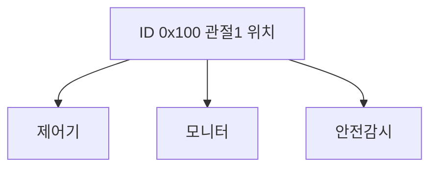

> **기준 출처:** Bosch CAN Specification 2.0 Part A/B §1, ISO 11898-1 과 -2 와 -3 개요, CiA CAN Knowledge 공개 요약 / 확인일 2026-08-03
> **시리즈:** [목차](/posts/00-comm-series/) | 다음 → [02. CAN 물리계층](/posts/02-can-physical-dominant-recessive/)

---

## 1. RS-485 가 남긴 숙제

[시리얼 07편](/posts/07-rs485-half-duplex-direction/)의 결론을 다시 보자. RS-485 는 충돌을 전기적으로 풀지 못한다. 푸시풀 드라이버 둘이 반대 값을 내면 큰 전류가 흐르고 통신이 깨진다. 그래서 프로토콜이 마스터와 슬레이브 규율로 막는다.

그 대가가 컸다.

| RS-485 마스터-슬레이브의 대가 | |
| --- | --- |
| 마스터가 물어봐야만 답한다 | 센서에 이상이 생겨도 마스터가 물어볼 때까지 말하지 못한다 |
| 폴링이 시간을 소비한다 | 9600 에서 노드 10대 순회에 520 ms 다 |
| 마스터가 정지하면 전부 멎는다 | 단일 장애점이다 |
| 우선순위가 없다 | 급한 메시지도 순서를 기다린다 |

1980년대 중반 자동차 업계가 정확히 이 문제에 부딪혔다. ECU 수십 개가 서로 데이터를 주고받아야 하는데 폴링으로는 감당이 안 되고 배선은 이미 수 km 였다. Bosch 가 1986년에 내놓은 답이 CAN 이다.

## 2. 첫 번째 발상은 주소가 아니라 내용에 ID 를 붙이는 것이다

이게 CAN 의 가장 근본적인 결정이고 다른 모든 성질이 여기서 파생된다.

| | 일반적인 방식 (RS-485, 이더넷) | CAN |
| --- | --- | --- |
| 프레임의 식별자 | 누구에게 보내나. 목적지 주소다 | 무엇에 관한 데이터인가. 메시지 ID 다 |
| 예 | 슬레이브 3번에게 | 엔진 회전수 |
| 수신자 | 지정된 하나 | 원하는 모두 |
| 노드 추가 | 주소 배정과 마스터 설정 변경이 필요하다 | 그냥 붙이면 된다 |

셋 다 같은 프레임을 듣는다. 송신자는 누가 듣는지 모른다.

| 이득 | 설명 |
| --- | --- |
| 다중 수신 | 같은 데이터를 여러 노드가 동시에 쓴다. 중복 전송이 없다 |
| 노드 추가가 쉽다 | 새 노드가 기존 ID 를 그냥 들으면 된다. 기존 노드는 아무것도 바뀌지 않는다 |
| 송신자 독립 | 어느 노드가 그 데이터를 만드는지 수신자는 몰라도 된다 |
| 하드웨어 필터링 | 관심 없는 ID 는 컨트롤러가 걸러서 CPU 를 깨우지 않는다 |

노드 추가가 쉽다는 점이 자동차에서 결정적이었다. 상위 트림에만 있는 옵션 모듈을 버스에 붙였다 뗐다 해야 하는데 주소 기반이면 그때마다 전체 설정을 바꿔야 한다.

이 발상이 나중에 발행과 구독 패턴으로 이어진다. ROS 2 의 토픽도 같은 구조다. 토픽 이름으로 데이터를 식별하고 누가 구독하는지 발행자는 모른다. CAN 이 1986년에 하드웨어로 한 일이다.

대가도 있다. 프레임에 송신자 정보가 없어 누가 보냈는지 모르므로 필요하면 데이터에 넣어야 한다. ID 를 시스템 전체가 합의해야 하고 ID 충돌은 치명적이라 설계 문서로 관리한다. 점대점 통신이 어색해서 이 노드에게만이라는 표현을 하려면 ID 규약을 따로 만들어야 한다. CANopen 이 그걸 한다. 그리고 8바이트 제한이 있어 큰 데이터는 쪼개야 한다.

## 3. 두 번째 발상은 ID 가 곧 우선순위라는 것이다

내용 ID 를 도입하니 부수적으로 큰 게 따라왔다. ID 값이 작을수록 우선순위가 높고 이 우선순위가 전기적으로 자동 해결된다.

노드 A 가 ID `0x100` 으로, 노드 B 가 ID `0x200` 으로 동시에 송신을 시작하면 중재 과정에서 A 가 이긴다. B 는 조용히 물러나고 A 의 프레임이 끝나면 다시 시도한다. A 의 프레임은 단 1비트도 지연되지 않는다. 이걸 비파괴라 한다.

| | 이더넷 (CSMA/CD) | CAN (CSMA/CD+AMP) |
| --- | --- | --- |
| 충돌하면 | 둘 다 버리고 무작위 시간 뒤 재시도한다 | 높은 우선순위가 그대로 진행한다 |
| 대역폭 | 충돌한 만큼 낭비된다 | 낭비가 0 이다 |
| 예측 가능성 | 무작위 백오프라 불가능하다 | 최악 지연을 계산할 수 있다 |

최악 지연을 계산할 수 있다는 점이 실시간 제어에서 결정적이다. 급한 메시지에 낮은 ID 를 주면 그 메시지의 최악 지연에 상한이 생긴다. 원리는 [기초 03편](/posts/03-basics-physical-differential/)의 와이어드 AND 다.

## 4. 세 번째 발상은 오류를 네트워크가 스스로 다루는 것이다

CAN 은 자동차용이라 한 노드가 고장 나도 나머지가 살아야 했다. 그래서 오류 처리를 하드웨어에 박았다.

| 장치 | 하는 일 |
| --- | --- |
| 5중 오류 검출 | 서로 다른 방식이 겹쳐 미검출 확률이 $4.7\times10^{-11}$ 미만이다 |
| 자동 재전송 | 오류가 검출되면 하드웨어가 다시 보낸다. 소프트웨어 개입이 없다 |
| 오류 FSM | 고장 난 노드가 스스로 버스에서 빠진다 |
| 오류 프레임 | 오류를 발견한 노드가 모두에게 즉시 알린다 |

고장 난 노드가 스스로 빠진다는 게 CAN 을 안전 시스템에 쓸 수 있게 만든 설계다. 트랜시버가 고장 나 계속 dominant 를 내는 노드가 버스를 영원히 점유하는 것을 막는다. 그리고 이건 FSM 으로만 표현되는 안전 메커니즘이라 Stateflow 공부와 정면으로 만난다.

## 5. CAN 이 정하는 것과 안 정하는 것

CAN 은 데이터링크와 물리 두 층만 정한다. 프레임과 중재와 오류가 ISO 11898-1 이고 전압과 트랜시버가 ISO 11898-2 나 -3 이다. 그 위의 응용 계층은 CAN 이 정하지 않는다.

CAN 통신을 한다는 말만으로는 대화가 되지 않는다. 프레임은 주고받지만 `ID 0x180` 이 무슨 뜻인지 약속이 없다. 그래서 응용 계층이 필요하다.

| 응용 계층 | 어디에 쓰나 |
| --- | --- |
| CANopen (CiA 301, 402) | 산업 자동화와 로봇과 모터 드라이브다 |
| J1939 | 상용차인 트럭과 건설기계다 |
| UDS, OBD-II | 차량 진단이다 |
| 자체 개발 프로토콜 | 소규모 시스템에서 흔하다 |

## 6. CAN 의 스펙

| 항목 | Classic CAN | CAN FD |
| --- | --- | --- |
| 최대 비트레이트 | 1 Mbps | 중재 1 Mbps 에 데이터 최대 8 Mbps |
| 데이터 길이 | 0~8 바이트 | 0~64 바이트 |
| ID 길이 | 11비트 표준이나 29비트 확장 | 같다 |
| 최대 노드 | 트랜시버에 따라 약 32~110 | 같다 |
| 거리 | 1 Mbps 에 40 m, 50 kbps 에 1000 m | 짧아진다. 고속 데이터 구간 때문이다 |
| CRC | 15비트 | 17 또는 21비트 |
| 재전송 | 자동이다 | 자동이다 |

8바이트 제한이 CAN 의 성격을 규정한다. [기초 02편](/posts/02-basics-layers-osi-fieldbus/)에서 계산했듯 8바이트 프레임은 111~135비트다. 오버헤드 비율은 나쁘지만 효율이 58% 이고, 프레임이 짧아서 한 프레임이 버스를 점유하는 시간이 작다. 그게 우선순위 기반 실시간성에 유리하다.

낮은 우선순위 메시지의 최악 지연은 지금 진행 중인 프레임이 끝날 때까지의 시간에 나보다 높은 것들을 더한 값이다. 프레임이 짧으면 첫 항이 작아진다. CAN 이 일부러 짧게 만든 것이다.

## 7. 로봇 제어에서 CAN 의 자리

| 용도 | 적합한가 |
| --- | --- |
| 1 kHz 관절 제어 루프 | 가능하지만 빠듯하다. 축이 많으면 대역폭이 모자란다 |
| 저속 축과 그리퍼 제어 | 적합하다 |
| 센서 네트워크 (힘과 토크, IMU, 온도) | 매우 적합하다 |
| 안전 신호 (E-stop 상태 방송) | 우선순위 최상위로 두면 적합하다 |
| 설정과 진단 | CANopen SDO 로 한다 |
| µs 급 다축 동기 | EtherCAT 가 필요하다. 분산 클록 때문이다 |

CAN 과 EtherCAT 는 경쟁이 아니라 역할 분담인 경우가 많다. 고속 동기 축은 EtherCAT 로 가고 주변 장치와 센서와 안전 신호는 CAN 으로 간다. 실제로 EtherCAT 위에 CANopen 을 얹은 CoE 가 있다. 그래서 CANopen 을 배우면 EtherCAT 의 절반을 이미 아는 셈이 된다.

## 정리

- CAN 은 RS-485 마스터-슬레이브의 한계인 폴링과 단일 장애점과 우선순위 없음을 정면으로 푼 설계다.
- 첫 발상은 주소가 아니라 내용에 ID 를 붙이는 것이다. 다중 수신과 자유로운 노드 추가와 하드웨어 필터링을 얻는다.
- 이건 발행과 구독 패턴을 1986년에 하드웨어로 구현한 것이다. ROS 2 토픽과 같은 발상이다.
- 대가는 송신자를 모르고 ID 를 시스템 전체가 합의해야 하고 8바이트 제한이 있다는 것이다.
- 둘째 발상은 ID 가 곧 우선순위이고 비파괴 중재라는 것이다. 이긴 프레임은 1비트도 늦지 않는다.
- 이더넷 CSMA/CD 는 충돌 시 둘 다 버리지만 CAN 은 낭비가 0 이고 최악 지연을 계산할 수 있다.
- 셋째 발상은 오류를 하드웨어가 다룬다는 것이다. 5중 검출과 자동 재전송과 고장 노드 자가 격리다.
- CAN 은 1계층과 2계층만 정한다. 대화의 의미는 CANopen 이나 J1939 같은 응용 계층이 정한다.
- 8바이트 제한은 결함이 아니라 선택이다. 프레임이 짧아야 낮은 우선순위의 최악 지연이 작아진다.
- 로봇에서는 센서와 저속 축과 안전 신호에 적합하고 µs 급 다축 동기는 EtherCAT 를 쓴다.
- CANopen 을 배우면 EtherCAT 의 CoE 를 이미 아는 셈이다.

## 참고

- [Bosch CAN Specification 2.0](https://www.bosch-semiconductors.com/media/ip_modules/pdf_2/can2spec.pdf)
- [CiA — CAN Knowledge](https://www.can-cia.org/can-knowledge)
