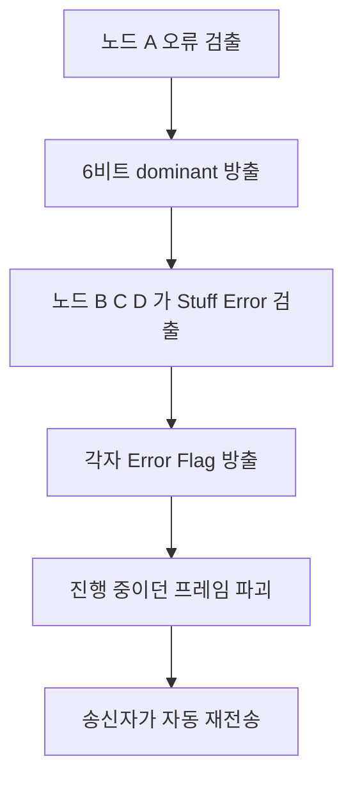

> **기준 출처:** Bosch CAN Specification 2.0 §3.1, Part A(표준 11비트), Part B(확장 29비트), §3.1.5, §3.1.6, ISO 11898-1 / 확인일 2026-08-03
> **시리즈:** [목차](/posts/00-comm-series/) | 이전 → [03. 비파괴 중재](/posts/03-can-arbitration/) | 다음 → [05. 비트 타이밍](/posts/05-can-bit-timing/)

---

## 1. 다섯 종류

| 프레임 | 누가 보내나 | 언제 |
| --- | --- | --- |
| Data Frame | 송신 노드 | 데이터를 보낸다. 99% 는 이것이다 |
| Remote Frame | 요청 노드 | 그 데이터를 보내달라고 요청한다. 요즘 거의 쓰지 않는다 |
| Error Frame | 오류를 발견한 아무 노드 | 오류 검출 즉시 보낸다 |
| Overload Frame | 수신 노드 | 처리가 늦어 시간을 벌 때 쓴다. 거의 쓰이지 않는다 |
| Interframe Space | — | 프레임 사이의 최소 간격이다 |

## 2. 표준 데이터 프레임

| 필드 | 비트 | 값 | 뜻 |
| --- | --- | --- | --- |
| SOF (Start of Frame) | 1 | dominant | 프레임 시작이다. 모든 노드가 여기서 하드 동기화한다 |
| ID | 11 | | 메시지 식별자이자 우선순위다 |
| RTR (Remote Transmission Request) | 1 | 0 은 데이터, 1 은 원격 | 데이터 프레임이 이긴다. 0 이 dominant 다 |
| IDE (Identifier Extension) | 1 | 0 은 표준, 1 은 확장 | 표준이 이긴다 |
| r0 | 1 | 0 | 예약이다 |
| DLC (Data Length Code) | 4 | 0~8 | 데이터 바이트 수다 |
| 데이터 | 0~64 | | 0~8 바이트다 |
| CRC | 15 | | 다항식이 `0x4599` 다 |
| CRC Delimiter | 1 | recessive | |
| ACK Slot | 1 | 송신자는 recessive | 수신자들이 dominant 로 덮어쓴다 |
| ACK Delimiter | 1 | recessive | |
| EOF | 7 | recessive | 프레임 끝이다 |
| IFS | 3 | recessive | 다음 프레임까지 최소 간격이다 |

### ACK 슬롯이 가장 영리한 부분이다

송신자는 ACK 슬롯에 recessive 를 낸다. 그리고 프레임을 제대로 받은 모든 노드가 여기에 dominant 를 낸다. 송신자가 그 자리에서 0 을 읽으면 누군가 받았다는 뜻이고, 1 이 읽히면 ACK Error 로 아무도 못 받았다는 뜻이다.

몇 명이 받았는지는 모른다. 최소 한 명은 받았다는 것만 안다. 와이어드 AND 라 여러 노드가 동시에 dominant 를 내도 구분되지 않는다.

그래서 CAN 노드가 버스에 혼자 있으면 통신이 되지 않는다. 아무도 ACK 을 주지 않으니 ACK Error 가 나고 재전송이 무한 반복되며 오류 카운터가 올라가 Error Passive 가 된다.

개발 초기의 전형적 증상이 있다. 보드 하나만 연결했는데 오류가 계속 난다면 정상이다. CAN 분석기나 다른 노드를 하나 더 붙여야 한다. 일부 컨트롤러의 self-test 나 loopback 모드를 쓰면 혼자서도 테스트할 수 있다.

Classic CAN 에서 DLC 가 9~15 이면 규격상 8바이트를 뜻한다. CAN FD 는 이 값들을 12, 16, 20, 24, 32, 48, 64 로 재정의했다.

## 3. 확장 데이터 프레임

29비트 ID 를 쓰는 형태다. 표준 프레임의 RTR 자리에 SRR(Substitute Remote Request)이 들어가는데 항상 recessive 다. 그리고 IDE 가 recessive 인 1 이면 확장이다. 중재 필드가 총 32비트가 된다.

같은 상위 11비트를 가진 표준 프레임과 확장 프레임이 동시에 나가면 표준이 이긴다. 표준은 그 자리에 RTR 로 dominant 를 내고 확장은 SRR 로 recessive 를 내기 때문이다.

의도된 설계다. 확장 프레임은 나중에 추가된 것이라 기존 표준 프레임의 실시간성을 해치지 않게 했다.

확장 프레임의 대가는 중재 필드가 11비트에서 32비트로 21비트 늘어난다는 것이다. 8바이트 프레임 기준 111비트에서 132비트로 약 19% 길어진다. 대역폭이 빠듯하면 표준 ID 를 쓴다. 로봇과 산업에서는 대개 표준 11비트로 충분하고 CANopen 도 11비트를 쓴다. 확장은 주로 상용차용 J1939 에서 쓴다.

## 4. Remote Frame 은 쓰지 않는 게 낫다

RTR 이 recessive 인 프레임으로 이 ID 의 데이터를 보내달라는 요청이다. 데이터 필드가 없다. 요즘 거의 쓰지 않는데 이유가 여럿이다.

| 문제 | 내용 |
| --- | --- |
| DLC 의 의미가 모호하다 | 요청 프레임의 DLC 가 기대하는 길이인데 해석이 갈린다 |
| 응답 시점이 불확실하다 | 슬레이브가 언제 답할지 규격에 없다 |
| CAN FD 에서 삭제됐다 | CAN FD 에는 Remote Frame 이 아예 없다 |
| 주기 전송으로 대체할 수 있다 | 주기 전송이 더 단순하고 예측 가능하다 |

대신 데이터를 주기적으로 방송하거나(CANopen PDO) 요청용 ID 를 따로 만들어 일반 데이터 프레임으로 주고받는다(CANopen SDO). 둘 다 Remote Frame 보다 명확하다.

## 5. Error Frame 은 오류를 즉시 모두에게 알린다

오류를 발견한 노드가 송신자든 수신자든 즉시 내보낸다. Error Flag 6비트에 Error Delimiter 8비트 recessive 로 이뤄진다.

| 종류 | Error Flag |
| --- | --- |
| Active Error Flag | 6비트 dominant 다. Error Active 상태의 노드가 낸다 |
| Passive Error Flag | 6비트 recessive 다. Error Passive 상태의 노드가 낸다 |

왜 6비트 dominant 인가. [기초 05편](/posts/05-basics-sync-async/)의 비트 스터핑 규칙을 떠올린다. 정상 프레임에서는 같은 값이 5비트 연속되면 반대 비트가 삽입된다. 그러니 6비트 연속은 절대 나올 수 없다.

Active Error Flag 는 일부러 이 규칙을 어긴다. 그러면 이걸 본 모든 노드가 Stuff Error 를 검출하고 자기도 Error Flag 를 내보낸다. 연쇄적으로 퍼져서 버스 전체가 즉시 오류를 인지한다.



이게 오류를 네트워크가 다룬다는 말의 실체다. 소프트웨어는 아무것도 하지 않는다. 하드웨어가 오류를 퍼뜨리고 프레임을 무효화하고 재전송한다.

동시에 이게 위험 요소이기도 하다. 고장 난 노드가 정상 프레임마다 Error Flag 를 쏘면 버스 전체가 마비된다. 그걸 막는 게 오류 FSM 이다.

Passive Error Flag 가 recessive 인 이유도 있다. Error Passive 노드는 이미 문제가 있는 노드다. 그런 노드가 dominant 로 버스를 파괴하면 안 된다. recessive 6비트는 다른 노드에게 아무 영향을 주지 않는다. 조용한 항의인 셈이다. 의심스러운 노드의 영향력을 단계적으로 줄인다는 설계 철학이 여기 보인다.

## 6. Overload Frame

Error Frame 과 같은 모양인 6비트 dominant 에 8비트 delimiter 인데 수신 노드가 잠깐 기다리라고 할 때 쓴다. 현대 CAN 컨트롤러는 거의 쓰지 않는다. 하드웨어가 충분히 빨라져 프레임 사이에 시간을 벌 필요가 없어졌다. Overload Frame 이 자주 보이면 수신 컨트롤러가 못 따라가고 있다는 이상 신호다.

## 7. 프레임 길이는 대역폭 계산의 기초다

표준 프레임에 데이터 $n$ 바이트면 이렇게 된다.

| | 비트 |
| --- | --- |
| 고정 오버헤드 | 44 |
| 데이터 | 8n |
| Interframe Space | 3 |
| 스터핑 없이 합계 | 47 + 8n |
| 최악 (스터핑 최대) | 약 55 + 10n |

$n$ 이 8 이면 최소 111비트에 최악 135비트다. 확장 프레임은 고정 오버헤드가 64비트라 최악이 약 80 + 10n 이고, $n$ 이 8 이면 최악 160비트다.

스터핑 때문에 프레임 길이가 데이터 값에 따라 달라진다. `0x00` 8바이트처럼 같은 값이 이어지면 스터프 비트가 많이 들어간다. 최악 지연 계산에는 반드시 스터핑 최대를 가정한다.

## 8. 프레임을 표현하는 타입

```cpp
// comm_can/can_frame.hpp
#pragma once
#include <cstdint>
#include <array>
#include <span>

struct CanFrame {
    std::uint32_t id{};              // 11 또는 29비트다
    bool          extended{false};   // IDE
    bool          remote{false};     // RTR. 쓰지 않는 게 좋다
    std::uint8_t  dlc{};             // Classic 은 0..8 이다
    std::array<std::uint8_t, 8> data{};

    std::span<const std::uint8_t> payload() const {
        return {data.data(), std::min<std::uint8_t>(dlc, 8)};
    }
};

// 스터핑을 포함한 최악 프레임 길이다. 대역폭과 최악지연 계산에 쓴다
constexpr std::uint32_t worst_case_bits(const CanFrame& f) noexcept {
    const std::uint32_t n = std::min<std::uint8_t>(f.dlc, 8);
    return f.extended ? (80 + 10 * n) : (55 + 10 * n);
}

// 스터핑 없는 최소 길이다. 평균 부하 추정용이다
constexpr std::uint32_t min_bits(const CanFrame& f) noexcept {
    const std::uint32_t n = std::min<std::uint8_t>(f.dlc, 8);
    return f.extended ? (67 + 8 * n) : (47 + 8 * n);
}

static_assert(worst_case_bits(CanFrame{.dlc = 8}) == 135);
static_assert(min_bits(CanFrame{.dlc = 8}) == 111);
```

## 정리

- 프레임은 Data, Remote, Error, Overload, Interframe Space 다섯이다.
- SOF 에서 모든 노드가 하드 동기화한다.
- ACK 슬롯은 송신자가 recessive 를 내고 수신자들이 dominant 로 덮어쓴다. 몇 명이 받았는지는 모르고 최소 한 명만 안다.
- 노드가 혼자면 통신이 안 된다. 개발 초기의 전형적 함정이고 loopback 모드를 쓴다.
- Classic CAN 의 DLC 9~15 는 전부 8 이다. CAN FD 가 이 값을 재정의했다.
- 확장 프레임은 중재 필드가 32비트이고 표준이 확장을 이긴다. 8바이트 기준 19% 길어지므로 산업과 로봇은 대개 표준 11비트를 쓴다.
- Remote Frame 은 쓰지 않는 게 낫다. 의미가 모호하고 CAN FD 에서 삭제됐다.
- Error Frame 은 6비트 dominant 로 비트 스터핑 규칙을 일부러 어겨 모든 노드가 연쇄적으로 오류를 인지하게 만든다.
- Passive Error Flag 는 recessive 다. 의심스러운 노드의 영향력을 단계적으로 줄인다는 철학이다.
- 표준 8바이트 프레임은 최소 111비트에 최악 135비트다. 최악 지연 계산에는 스터핑 최대를 가정한다.

## 참고

- [Bosch CAN Specification 2.0](https://www.bosch-semiconductors.com/media/ip_modules/pdf_2/can2spec.pdf)
- [CiA — CAN Knowledge](https://www.can-cia.org/can-knowledge)
