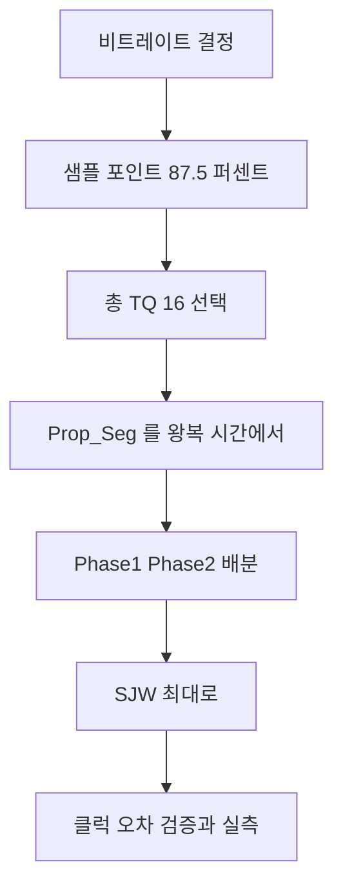

> **기준 출처:** Bosch CAN Specification 2.0 §8(Bit Timing Requirements), ISO 11898-1 §11, CiA 의 bit timing 권고, CAN 컨트롤러 데이터시트의 비트 타이밍 레지스터 절 / 확인일 2026-08-03
> **시리즈:** [목차](/posts/00-comm-series/) | 이전 → [04. 프레임 포맷](/posts/04-can-frame-formats/) | 다음 → [06. 동기화와 SJW](/posts/06-can-sync-sjw/)

---

## 1. 한 비트가 네 조각으로 나뉜다

CAN 은 UART 처럼 16배 오버샘플링을 하지 않는다. 비트 하나를 명시적인 네 구간으로 나누고 각 구간의 길이를 설계자가 정한다.

| 세그먼트 | 길이 | 역할 |
| --- | --- | --- |
| Sync_Seg | 1 TQ 고정 | 엣지가 여기 오기를 기대한다. 동기의 기준이다 |
| Prop_Seg | 1~8 TQ | 신호가 버스를 왕복하는 시간을 흡수한다 |
| Phase_Seg1 | 1~8 TQ | 위상 오차 보정 여유다. 늘어날 수 있다 |
| Phase_Seg2 | 1~8 TQ | 위상 오차 보정 여유다. 줄어들 수 있다 |

샘플 포인트는 Phase_Seg1 이 끝나는 지점이다. TQ(Time Quantum)는 비트 타이밍의 최소 단위다.

$$\text{TQ} = \frac{\text{BRP}}{f_{\text{CAN clock}}}$$

$$\text{비트 시간} = \text{TQ} \times (1 + \text{Prop Seg} + \text{Phase Seg1} + \text{Phase Seg2})$$

BRP(Baud Rate Prescaler)는 분주값이다.

## 2. 샘플 포인트는 무엇을 맞교환하나

$$\text{샘플 포인트} = \frac{1 + \text{Prop Seg} + \text{Phase Seg1}}{\text{총 TQ}} \times 100\%$$

| 샘플 포인트 | 얻는 것 | 잃는 것 |
| --- | --- | --- |
| 높다 (87.5%) | Prop_Seg 를 크게 잡을 수 있어 긴 버스가 가능하다 | Phase_Seg2 가 작아져 SJW 여유가 준다. 클럭 정확도 요구가 는다 |
| 낮다 (75%) | Phase_Seg2 가 커서 재동기 여유가 크다 | 버스 길이가 제한된다 |

CiA 는 CANopen 에 87.5% 를 권고한다. 산업 환경은 버스가 길고 크리스탈을 쓰는 게 당연하니 거리 쪽에 여유를 주는 선택이다.

모든 노드의 샘플 포인트가 같아야 한다. 비트레이트만 맞고 샘플 포인트가 다르면 짧은 버스에서는 동작하다가 길어지면 깨진다. 재현이 어려운 문제의 단골이다. CAN 분석기가 샘플 포인트 불일치를 잡아주기도 하니 새 노드를 붙일 때 확인한다.

## 3. 실제로 계산해 본다

조건은 CAN 클럭 40 MHz, 목표 500 kbps, 버스 길이 100 m, 샘플 포인트 87.5% 다.

먼저 비트 시간은 500 kbps 의 역수인 2 µs 다. 총 TQ 개수는 8에서 25 사이에서 고르는데 16 TQ 로 하면 87.5% 가 정확히 정수로 떨어진다. 16 곱하기 0.875 가 14 다.

TQ 길이는 2 µs 를 16 으로 나눈 125 ns 이고 BRP 는 40 MHz 곱하기 125 ns 로 5 다.

Prop_Seg 는 왕복 시간을 흡수해야 한다.

$$\text{Prop Seg} \geq 2 \times \left(t_{\text{케이블}} + t_{\text{트랜시버 out}} + t_{\text{트랜시버 in}}\right)$$

| 항목 | 값 |
| --- | --- |
| 케이블 100 m 곱하기 5 ns/m | 500 ns |
| 트랜시버 송신 지연 | 약 50 ns |
| 트랜시버 수신 지연 | 약 50 ns |
| 편도 | 600 ns |
| 왕복 | 1200 ns |
| TQ 단위 | 1200 을 125 로 나눈 9.6 이므로 10 TQ |

나머지를 배분한다. Sync 1 에 Prop 10 을 더하고 Phase1 과 Phase2 를 더해 16 이 되어야 한다. 샘플 포인트가 14 TQ 위치여야 하므로 1 더하기 10 더하기 Phase1 이 14 이고 Phase_Seg1 은 3, Phase_Seg2 는 2 다.

SJW 는 Phase_Seg1 과 Phase_Seg2 와 4 중 최솟값이니 2 다.

| 파라미터 | 값 |
| --- | --- |
| BRP | 5 |
| Sync_Seg | 1 TQ (고정) |
| Prop_Seg | 10 TQ |
| Phase_Seg1 | 3 TQ |
| Phase_Seg2 | 2 TQ |
| 샘플 포인트 | 14/16 이므로 87.5% |
| SJW | 2 TQ |

검산하면 16 TQ 곱하기 125 ns 가 2 µs 이고 500 kbps 다.

Prop_Seg 가 10 TQ 로 전체의 62% 를 먹었다. 100 m 는 500 kbps 의 한계 거리라서 그렇다. 버스가 짧으면 Prop_Seg 를 줄이고 그만큼 Phase 세그먼트에 줘서 클럭 여유를 늘릴 수 있다.

## 4. 레지스터에 넣을 때 이름이 다르다

대부분의 CAN 컨트롤러는 Prop_Seg 와 Phase_Seg1 을 구분하지 않고 합쳐서 받는다.

| 규격 용어 | 레지스터 필드의 흔한 이름 |
| --- | --- |
| Prop_Seg 와 Phase_Seg1 | TSEG1. `PROPSEG` 와 `PSEG1` 로 분리된 것도 있다 |
| Phase_Seg2 | TSEG2 |
| SJW | SJW |
| BRP | BRP |

그리고 대부분 값에서 1 을 뺀 수를 넣는다.

```cpp
// 위 예제를 STM32 bxCAN 스타일 레지스터로 옮긴다
// TSEG1 은 Prop_Seg 와 Phase_Seg1 을 더한 13 이다
// TSEG2 는 Phase_Seg2 인 2 다
// SJW 는 2 이고 BRP 는 5 다
CAN->BTR = ((5 - 1) << 0)      // BRP 는 실제값에서 1 을 뺀다
         | ((13 - 1) << 16)    // TS1
         | ((2  - 1) << 20)    // TS2
         | ((2  - 1) << 24);   // SJW
```

1 을 빼는 걸 잊는 게 가장 흔한 실수다. 그러면 비트레이트가 미묘하게 틀려서 짧은 버스에서는 동작하다가 노드가 늘면 깨진다. 반드시 실측한다. 알려진 값을 반복 전송하고 오실로스코프로 비트 폭을 잰다. 500 kbps 면 2.00 µs 여야 한다.

```cpp
// comm_core/bit_timing.hpp
// CAN 비트 타이밍을 컴파일 타임에 계산하고 제약을 검증한다.
#pragma once
#include <cstdint>

struct CanBitTiming {
    std::uint32_t brp;          // prescaler 의 실제값이다
    std::uint8_t  prop_seg;
    std::uint8_t  phase_seg1;
    std::uint8_t  phase_seg2;
    std::uint8_t  sjw;

    constexpr std::uint32_t total_tq() const {
        return 1u + prop_seg + phase_seg1 + phase_seg2;
    }
    constexpr double sample_point_pct() const {
        return 100.0 * (1.0 + prop_seg + phase_seg1) / total_tq();
    }
    constexpr std::uint32_t bitrate(std::uint32_t f_can) const {
        return f_can / (brp * total_tq());
    }
    // 규격 제약을 검사한다
    constexpr bool valid() const {
        return total_tq() >= 8 && total_tq() <= 25
            && prop_seg   >= 1 && prop_seg   <= 8
            && phase_seg1 >= 1 && phase_seg1 <= 8
            && phase_seg2 >= 1 && phase_seg2 <= 8
            && sjw >= 1 && sjw <= 4
            && sjw <= phase_seg1 && sjw <= phase_seg2;   // SJW 제약이다
    }
};

inline constexpr CanBitTiming k500k{.brp = 5, .prop_seg = 10,
                                    .phase_seg1 = 3, .phase_seg2 = 2, .sjw = 2};
static_assert(k500k.valid());
static_assert(k500k.total_tq() == 16);
static_assert(k500k.bitrate(40'000'000) == 500'000);
static_assert(k500k.sample_point_pct() > 87.4 && k500k.sample_point_pct() < 87.6);
```

`static_assert` 가 클럭을 바꿨을 때 빌드를 막아준다. [시리얼 02편](/posts/02-uart-baud-error-budget/)의 보율 계산과 같은 방식이다. CAN 은 특히 이게 중요한데 비트 타이밍이 틀려도 짧은 버스에서는 동작하기 때문이다.

## 5. 실무에서 정하는 순서



| 비트레이트 | 총 TQ | 샘플 포인트 | 비고 |
| --- | --- | --- | --- |
| 1 Mbps | 8~16 | 75~87.5% | TQ 가 짧아 선택지가 준다 |
| 500 kbps | 16 | 87.5% | 산업에서 가장 흔하다 |
| 250 kbps | 16 | 87.5% | |
| 125 kbps | 16 | 87.5% | 긴 버스에 쓴다 |

온라인 CAN 비트 타이밍 계산기들이 있지만 자기 시스템의 Prop_Seg 요구를 넣어야 제대로 나온다. 계산기가 기본으로 주는 값은 버스 길이를 모른다.

## 6. 비트 타이밍이 틀렸을 때의 증상

| 증상 | 원인 |
| --- | --- |
| 아무것도 통신되지 않는다 | 비트레이트가 완전히 다르다 |
| 짧은 버스에서는 되는데 길면 안 된다 | Prop_Seg 가 부족하다 |
| 노드를 추가하면 깨진다 | 샘플 포인트 불일치이거나 Prop_Seg 문제다 |
| 특정 노드와만 통신이 안 된다 | 그 노드의 타이밍 설정이 다르다 |
| 온도가 오르면 오류가 는다 | 클럭 여유가 부족하다. 세라믹 발진자를 의심한다 |
| Stuff Error 가 많다 | 샘플 포인트가 엣지에 너무 가깝다 |
| Bit Error 가 많다 | 위와 같거나 물리계층 문제다 |

짧을 때는 되는데 길면 안 된다는 증상은 Prop_Seg 를 가장 먼저 의심한다. 이 증상 하나로 원인이 거의 특정된다.

## 정리

- CAN 은 한 비트를 Sync(1 TQ 고정)와 Prop_Seg 와 Phase_Seg1 과 Phase_Seg2 네 구간으로 나눈다.
- 샘플 포인트는 Phase_Seg1 이 끝나는 지점이고 총 TQ 는 8에서 25 사이다.
- 샘플 포인트가 높으면 버스가 길어지고 낮으면 클럭 여유가 커진다.
- CiA 와 CANopen 권고는 87.5% 이고 모든 노드가 같아야 한다.
- 계산 순서는 비트 시간, 총 TQ, TQ 길이와 BRP, 왕복 시간에서 구한 Prop_Seg, Phase 배분, SJW 다.
- 40 MHz 에 500 kbps 와 100 m 와 87.5% 예제는 BRP 5, Prop 10, Ph1 3, Ph2 2, SJW 2, 총 16 TQ 다.
- Prop_Seg 가 62% 를 먹은 건 한계 거리라서다. 버스가 짧으면 Phase 쪽에 여유를 준다.
- 레지스터는 대개 TSEG1 이 Prop 과 Phase1 의 합이고 값에서 1 을 뺀 수를 넣는다. 빼먹는 게 최다 실수다.
- 비트 타이밍이 틀려도 짧은 버스에서는 동작하므로 늦게 발견된다. `static_assert` 와 오실로스코프 실측을 함께 쓴다.
- 짧을 때는 되는데 길면 안 된다면 Prop_Seg 부족이다.

## 참고

- [Bosch CAN Specification 2.0](https://www.bosch-semiconductors.com/media/ip_modules/pdf_2/can2spec.pdf)
- [CiA — CAN Knowledge](https://www.can-cia.org/can-knowledge)
