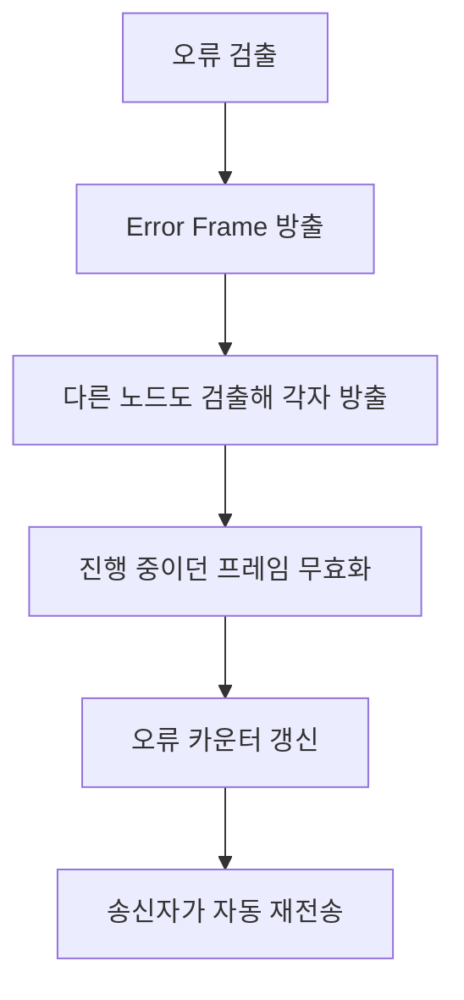

> **기준 출처:** Bosch CAN Specification 2.0 §6(Error Handling)의 다섯 오류 유형과 잔류 오류 확률, ISO 11898-1 §10 / 확인일 2026-08-03
> **시리즈:** [목차](/posts/00-comm-series/) | 이전 → [06. 동기화와 SJW](/posts/06-can-sync-sjw/) | 다음 → [08. 오류 상태와 Bus Off](/posts/08-can-error-states-busoff/)

---

## 1. 왜 다섯 겹인가

[기초 07편](/posts/07-basics-error-detection/)에서 각각이 놓치는 오류가 다르다고 했다. 구체적으로 본다.

| 검사 | 누가 검출하나 | 어느 층의 문제를 잡나 |
| --- | --- | --- |
| Bit Error | 송신자만 | 전기적 문제다. 내가 낸 값이 버스에 안 실린다 |
| Stuff Error | 모두 | 비트 레벨이다. 인코딩 규칙 위반이다 |
| CRC Error | 수신자 | 내용이다. 데이터가 바뀌었다 |
| Form Error | 모두 | 구조다. 고정 필드가 이상하다 |
| ACK Error | 송신자만 | 연결이다. 아무도 못 받았다 |

송신자와 수신자가 서로 다른 것을 본다. 송신자는 내 신호가 제대로 나갔나를 보고 수신자는 받은 게 온전한가를 본다. 양쪽에서 조여야 빈틈이 생기지 않는다.

## 2. Bit Error 는 쓴 값과 읽은 값이 다른 것이다

[03편](/posts/03-can-arbitration/)에서 본 것이다. 송신 중에 매 비트를 되읽어 비교하고 내가 낸 값과 버스에서 읽은 값이 다르면 Bit Error 다.

| 구간 | 1 을 냈는데 0 이 읽히면 |
| --- | --- |
| 중재 필드 | 정상이다. 중재에서 진 것이다 |
| ACK 슬롯 | 정상이다. 수신자가 ACK 을 낸 것이다 |
| 그 외 전부 | Bit Error 다 |

같은 전기적 현상이 문맥에 따라 다르게 해석된다. 컨트롤러가 지금 어느 필드인지 알아야 판정이 된다.

| 상황 | 검출 |
| --- | --- |
| 내 트랜시버가 고장 났다 | dominant 를 못 내면 즉시 잡힌다 |
| stuck-dominant 노드가 버스에 있다 | 내가 recessive 를 못 내니 잡힌다 |
| ID 가 중복됐다 | 데이터가 갈리는 순간 잡힌다 |
| 배선이 단락됐다 | 잡힌다 |

Bit Error 가 많다는 건 물리계층에 문제가 있다는 뜻이다. CRC Error 와 달리 내가 보낸 것이 안 나간다는 뜻이라 내 쪽 트랜시버와 배선과 버스 상태를 의심한다. [시리얼 16편](/posts/16-serial-debugging-loopback/)에서 RS-485 로 흉내 냈던 송신하며 되읽기를 CAN 은 하드웨어가 자동으로 한다.

## 3. Stuff Error 는 6비트 연속이다

[기초 05편](/posts/05-basics-sync-async/)의 비트 스터핑 규칙 위반이다. 정상이면 최대 5비트 연속이고 6번째는 반대 값이 삽입된다. 6비트 연속을 봤다면 Stuff Error 다.

SOF 부터 CRC 필드까지만 스터핑한다. CRC Delimiter 이후인 ACK 와 EOF 는 고정 형식이라 스터핑하지 않는다. 그래서 EOF 의 7비트 recessive 가 가능하다. 스터핑 구간이었다면 6비트에서 걸렸을 것이다. 그리고 Error Frame 의 6비트 dominant 가 스터핑 구간에서 나오면 모두가 Stuff Error 를 검출해 오류가 전파된다.

Stuff Error 가 많다면 [06편](/posts/06-can-sync-sjw/)의 동기 문제를 의심한다. 비트 타이밍과 발진자와 샘플 포인트를 본다.

## 4. CRC Error 는 CRC-15 가 잡는다

| 항목 | 값 |
| --- | --- |
| 다항식 | $x^{15}+x^{14}+x^{10}+x^8+x^7+x^4+x^3+1$ 로 `0x4599` 다 |
| 차수 | 15 |
| 초기값 | 0 |
| 대상 | SOF 부터 데이터 필드 끝까지다. 스터프 비트를 제외한 원본 비트열이다 |
| 해밍 거리 | 프레임 길이 범위에서 6 이다 |

| 오류 | 검출 |
| --- | --- |
| 1비트 오류 | 전부 잡는다 |
| 길이 15 이하 버스트 | 전부 잡는다 |
| 5비트 이하의 무작위 오류 | 전부 잡는다. 해밍 거리가 6 이기 때문이다 |
| 무작위 미검출 확률 | 약 $2^{-15}$ 다 |

해밍 거리 6 이 중요하다. 임의의 5비트까지는 어떻게 뒤집혀도 검출된다는 뜻이다. 이건 버스트가 아니라 흩어진 오류까지 포함한다.

CRC 는 스터프 비트를 뺀 원본에 대해 계산한다. 송신자는 스터핑 전의 비트열로 CRC 를 계산하고 수신자는 디스터핑 후의 비트열로 검증한다. 스터프 비트 자체는 CRC 대상이 아니다.

소프트웨어로 CAN 을 구현할 일은 거의 없지만 CAN FD 에서 이 규칙이 바뀐다. 스터프 비트를 CRC 에 포함시키고 스터프 비트 카운터를 추가했다. Classic CAN 에서 발견된 취약점을 고친 것이다.

## 5. Form Error 는 고정 필드를 본다

값이 정해진 자리에 다른 값이 온 것이다.

| 필드 | 정상값 |
| --- | --- |
| CRC Delimiter | recessive |
| ACK Delimiter | recessive |
| EOF | recessive 7비트 |
| Error Delimiter | recessive 8비트 |

CRC 가 못 보는 곳을 본다. CRC 필드는 데이터 끝까지만 보호하므로 그 뒤인 delimiter 와 EOF 는 Form Error 가 담당한다. 이게 겹치는 검사의 실제 모습이다. [시리얼 15편](/posts/15-encoder-endat/)의 EnDat 모드 명령 반전 중복과 같은 발상이다. 구조 자체가 검사이고 계산 없이 지연 없이 하드웨어로 즉시 판정된다.

## 6. ACK Error 는 아무도 못 받았다는 뜻이다

[04편](/posts/04-can-frame-formats/)에서 본 것이다. 송신자가 ACK 슬롯에서 recessive 를 읽으면 오류다.

| 원인 | 설명 |
| --- | --- |
| 버스에 나 혼자 있다 | 개발 초기의 전형이다 |
| 다른 노드들이 전부 이 프레임을 오류로 판정했다 | 물리계층이나 타이밍 문제다 |
| 다른 노드들의 비트레이트가 다르다 | 설정 문제다 |
| 배선이 끊겨 다른 노드에 닿지 않는다 | 배선 문제다 |

ACK Error 만 계속 나오고 다른 오류가 없다면 나는 정상인데 상대가 없다는 뜻이다. 배선과 전원과 다른 노드의 비트레이트를 본다.

## 7. 잔류 오류 확률

다섯 겹을 다 통과해서 틀린 데이터가 정상인 척 지나갈 확률을 Bosch 규격이 제시한다.

$$P_{\text{미검출}} < 4.7 \times 10^{-11} \times P_{\text{프레임 오류율}}$$

500 kbps 로 8바이트 프레임 111비트를 계속 보낸다고 하자. 초당 프레임은 500000 을 111 로 나눈 약 4500 이다. 프레임 오류율을 꽤 나쁜 환경인 $10^{-4}$ 로 잡으면 초당 미검출은 이렇게 된다.

$$4500 \times 10^{-4} \times 4.7\times10^{-11} = 2.1\times10^{-11}$$

평균 간격은 그 역수인 약 $4.7\times10^{10}$ 초, 곧 약 1500년이다. 이게 CAN 이 자동차 안전 시스템에 30년 넘게 쓰인 근거다.

하지만 이건 통신 오류에 한한 이야기다. [기초 07편](/posts/07-basics-error-detection/)의 주의가 그대로 적용된다. 소프트웨어 버그로 틀린 값을 보내면 CRC 는 그걸 정확히 전달한다. 의도적 변조는 막지 못한다. 그리고 기능안전 요구를 대신하지 못한다. 그래서 CANopen Safety 나 FSoE 같은 안전 계층이 따로 있다.

## 8. 오류가 검출되면 무슨 일이 일어나나



전부 하드웨어에서 일어난다. 소프트웨어는 관여하지 않고 대개 알지도 못한다.

이게 좋기만 한 건 아니다. 재전송이 최악 지연을 키우고, 오류가 반복되면 버스가 오류 프레임으로 가득 차고, 고장 난 노드 하나가 전체를 마비시킬 수 있다. 오류 카운터가 그걸 막는 장치이고 [08편](/posts/08-can-error-states-busoff/)에서 다룬다.

## 9. 오류 종류로 원인을 좁힌다

어떤 오류가 많은지가 원인을 가리킨다. 컨트롤러의 진단 레지스터로 종류별 카운트를 볼 수 있다.

| 많이 나는 오류 | 1순위 의심 | 확인 |
| --- | --- | --- |
| Bit Error | 물리계층이나 내 트랜시버나 stuck-dominant 노드다 | 60 Ω 측정과 idle 전압을 본다 |
| Stuff Error | 동기 문제다 | 발진자와 비트 타이밍과 샘플 포인트를 본다 |
| CRC Error | 노이즈다 | 언제 깨지는지를 묻는다 |
| Form Error | 심한 노이즈이거나 비트레이트 불일치다 | 비트 타이밍을 본다 |
| ACK Error | 상대가 없다 | 배선과 전원과 다른 노드 설정을 본다 |
| 여러 종류가 골고루 난다 | 심한 물리계층 문제다 | 종단과 접지와 차폐를 본다 |

오류 종류별 카운터를 로그에 남기는 게 CAN 디버깅의 절반이다. CAN 에러가 난다는 말과 Stuff Error 가 분당 40건 난다는 말은 완전히 다른 정보다.

```cpp
// comm_can/error_stats.hpp
struct CanErrorStats {
    std::uint32_t bit_error{};        // 물리계층이나 내 트랜시버
    std::uint32_t stuff_error{};      // 동기 문제
    std::uint32_t crc_error{};        // 노이즈
    std::uint32_t form_error{};       // 심한 노이즈나 비트레이트
    std::uint32_t ack_error{};        // 상대가 없다
    std::uint32_t tx_error_counter{}; // TEC
    std::uint32_t rx_error_counter{}; // REC
    std::uint32_t bus_off_count{};    // 0 이 아니면 심각하다
};
```

SocketCAN 은 `CAN_ERR_FLAG` 가 붙은 오류 프레임으로 이 정보를 준다. 대부분의 MCU 컨트롤러도 마지막 오류 종류를 LEC 레지스터로 제공한다.

## 정리

- 다섯 검사가 서로 다른 층을 본다. Bit 는 전기, Stuff 는 비트, CRC 는 내용, Form 은 구조, ACK 는 연결이다.
- 송신자와 수신자가 다른 것을 본다. 송신자는 Bit 와 ACK 를, 수신자는 CRC 와 Form 과 Stuff 를 본다.
- Bit Error 는 중재 필드와 ACK 슬롯에서 예외다. 문맥에 따라 의미가 달라진다.
- Stuff 는 SOF 부터 CRC 까지만 적용된다. 그래서 EOF 7비트 recessive 가 가능하다.
- CRC-15 는 `0x4599` 이고 해밍 거리가 6 이라 흩어진 5비트 오류까지 전부 검출한다.
- CRC 는 스터프 비트를 뺀 원본에 대해 계산한다. CAN FD 에서 이 규칙이 바뀐다.
- Form Error 가 CRC 가 못 보는 뒷부분을 담당한다. 구조 자체가 검사다.
- ACK Error 만 계속 나면 나는 정상인데 상대가 없다는 뜻이다.
- 잔류 오류 확률이 $4.7\times10^{-11}$ 미만이라 500 kbps 로 계속 운용해도 평균 1500년에 한 번이다.
- 단 소프트웨어 버그와 변조와 기능안전 요구는 CRC 가 다루지 못한다.
- 오류 검출 뒤 Error Frame 전파와 프레임 무효화와 카운터 갱신과 자동 재전송이 전부 하드웨어에서 일어난다.
- 자동 재전송의 부작용은 최악 지연 증가와 오류 폭주와 고장 노드의 전체 마비다. 08편이 이걸 막는다.
- 오류 종류별 카운터가 진단의 절반이다.

## 참고

- [Bosch CAN Specification 2.0](https://www.bosch-semiconductors.com/media/ip_modules/pdf_2/can2spec.pdf)
- [Linux SocketCAN 문서](https://www.kernel.org/doc/html/latest/networking/can.html)
