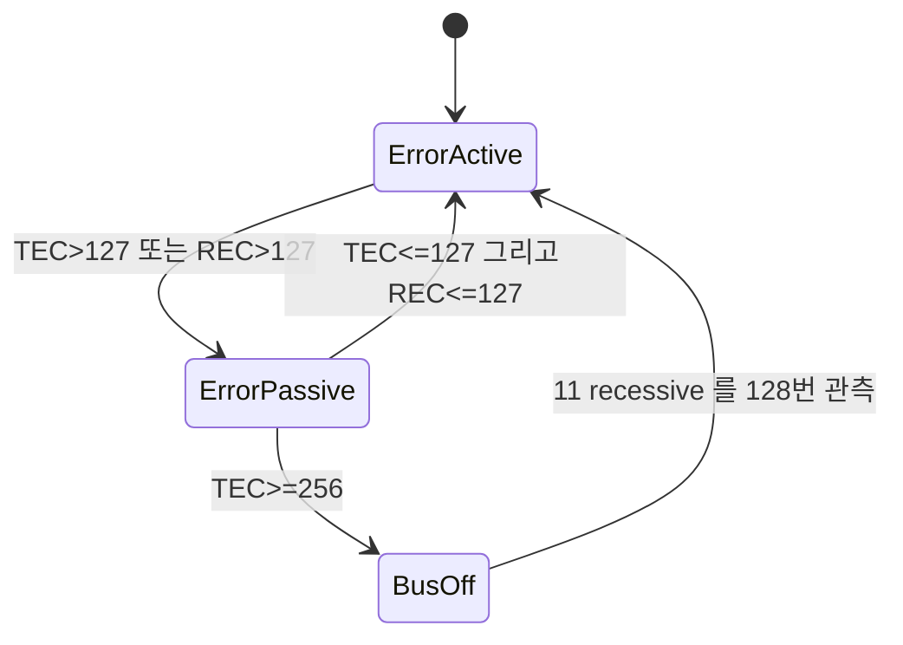

> **기준 출처:** Bosch CAN Specification 2.0 §7(Fault Confinement)의 TEC 와 REC 갱신 규칙과 상태 전이 조건, ISO 11898-1 §12 / 확인일 2026-08-03
> **시리즈:** [목차](/posts/00-comm-series/) | 이전 → [07. 오류 검출](/posts/07-can-error-detection/) | 다음 → [09. CAN FD](/posts/09-can-fd/)

---

## 1. 왜 이 FSM 이 필요한가

[07편](/posts/07-can-error-detection/)의 결론에 위험이 있었다. 오류를 검출하면 하드웨어가 Error Frame 을 쏘고 자동 재전송한다. 고장 난 노드에게 이건 재앙이다.

트랜시버가 고장 난 노드가 자기가 보낸 것을 되읽지 못하면 Bit Error 가 난다. Error Frame 6비트 dominant 를 방출하면 진행 중이던 남의 프레임이 파괴된다. 자동 재전송하면 또 Bit Error 가 나고 또 Error Frame 이 나가고 무한 반복된다. 노드 하나가 네트워크 전체를 멈춘다. 자동차에서 이건 용납되지 않는다.

CAN 의 답은 고장 난 노드가 스스로 물러나게 만드는 것이다. 그리고 이걸 중앙 관리자 없이 각 노드가 자기 상태만 보고 판단한다. 감독자가 없으니 감독자 고장을 걱정할 일도 없다. 분산 시스템 설계의 좋은 예다.

## 2. 두 개의 카운터

각 노드가 자기 안에 카운터 두 개를 유지한다. TEC 는 송신 중 오류를 만났을 때 오르고 REC 는 수신 중 오류를 만났을 때 오른다.

| 사건 | 변화 |
| --- | --- |
| 송신 중 오류로 Error Flag 를 냈다 | TEC 에 8 을 더한다 |
| 수신 중 오류를 검출했다 | REC 에 1 을 더한다 |
| 수신 중 특정 심각한 상황 | REC 에 8 을 더한다 |
| 송신에 성공했다 | TEC 에서 1 을 뺀다 |
| 수신에 성공했다 | REC 에서 1 을 뺀다 |

8 을 더하고 1 을 빼는 비대칭이 이 설계의 전부다. 오류 한 번은 성공 여덟 번으로 갚아야 한다. 곧 고장은 빠르게 잡히고 회복은 천천히 된다. 일시적 노이즈는 성공이 훨씬 많으니 카운터가 오르지 않고, 지속적 고장은 빠르게 격리된다.

제어의 적분기와 같은 발상이다. 순간값이 아니라 누적으로 판단하되 상승과 하강의 게인을 다르게 줘서 비대칭 필터를 만든 것이다.

송신 오류가 수신 오류보다 여덟 배 무거운 이유가 있다. 송신자가 오류를 봤다면 범인이 자기일 가능성이 높다. 수신자가 오류를 보는 건 누군가의 프레임이 깨졌다는 뜻이고 그 원인이 자기일 수도 남일 수도 있다. 반면 송신자가 자기 신호를 되읽지 못했다면 자기 트랜시버나 자기 배선이 유력하다. 의심의 크기에 비례해 벌점을 준다. 이 한 줄이 고장 난 노드가 스스로 빠진다는 결과를 만든다.

## 3. 세 개의 상태



**Error Active 는 정상 상태다.** TEC 가 127 이하이고 REC 도 127 이하일 때다. 송신이 정상이고 오류를 발견하면 Active Error Flag 인 6비트 dominant 로 버스에 강하게 알린다. 영향력이 최대라 남의 프레임을 무효화할 수 있다.

**Error Passive 는 의심받는 상태다.** TEC 나 REC 중 하나가 127 을 넘으면 들어간다. 송신은 가능하지만 오류를 발견해도 Passive Error Flag 인 6비트 recessive 를 내므로 다른 노드에 영향을 주지 않는다. 그리고 송신 후 8비트를 더 기다린다. Suspend Transmission 이라 부른다.

두 가지 제약이 정확히 영향력을 줄인다는 목적을 향한다. recessive Error Flag 는 조용한 항의라 오류를 알리긴 하지만 남의 프레임을 파괴하지 않는다. 송신 후 8비트 추가 대기는 정상 노드에게 버스를 먼저 양보하는 것이라 의심스러운 노드가 버스를 덜 차지한다. 그런데 여전히 통신은 한다. 회복할 기회를 주는 것이다. 성공이 쌓이면 카운터가 내려가 Error Active 로 돌아온다.

**Bus Off 는 격리 상태다.** TEC 가 256 이상일 때만 들어간다. 송신도 수신도 하지 않고 버스에 미치는 영향이 없다. 완전히 떨어져 나간 것이다.

REC 로는 Bus Off 가 되지 않는다. 수신 오류가 아무리 많아도 격리되지 않는다. 수신 오류가 많다는 건 버스가 나쁘다는 뜻이지 내가 고장 났다는 뜻이 아니기 때문이다. 버스가 나쁠 때 모든 노드가 Bus Off 로 가면 네트워크가 통째로 멎는다. 송신 실패만이 내 잘못의 증거다. 이 비대칭이 앞서 본 8 대 1 비대칭과 짝을 이룬다.

## 4. 카운터를 따라가 본다

### 노드가 버스에 혼자 있을 때

송신 시도마다 ACK Error 가 나서 TEC 가 8씩 오른다. 16번째 시도에서 TEC 가 128 이 되어 Error Passive 로 들어간다.

그다음은 규격에 예외가 있다. Error Passive 상태의 송신자가 ACK Error 때문에 Passive Error Flag 를 내고 그동안 dominant 를 보지 못하면 TEC 를 올리지 않는다. Bosch 규격 §7 의 Exception 1 이다. 그래서 혼자 있는 노드는 Error Passive 에서 멈추고 Bus Off 로는 가지 않는다.

실제 관찰과 일치한다. 보드 하나만 연결하면 Error Passive 로 뜨고 계속 재시도한다. Bus Off 는 아니다. 이 예외를 모르면 관찰이 이해되지 않는다.

### 트랜시버가 고장 났을 때

송신 시도마다 Bit Error 가 나서 TEC 가 8씩 오른다. 16번째에 128 로 Error Passive 가 되고 32번째에 256 으로 Bus Off 가 된다.

500 kbps 에서 프레임 111비트에 Error Frame 약 20비트를 더하면 131비트이고 262 µs 다.

$$32 \times 262\,\mu s \approx 8.4\ \text{ms}$$

8.4 ms 만에 고장 난 노드가 격리된다. 1 kHz 제어 루프 기준 여덟 주기다. 다른 축들은 그 뒤로 정상 동작한다. 이게 안전critical FSM 의 실제 사례다. 감독자 없이 8 ms 안에 하드웨어만으로 고장을 격리한다.

### 간헐적 노이즈일 때

1000 프레임 중 1개가 실패하면 실패로 TEC 가 8 오르고 성공 999회로 999 만큼 내려가 0 에서 멈춘다. TEC 가 0 근처를 유지한다.

125 프레임에 1개꼴로 실패해도 8 대 124 라 TEC 가 오르지 않는다. 곧 오류율 0.8% 까지는 상태가 바뀌지 않는다. 이 균형점이 설계의 묘미다. 일시적 노이즈에는 관대하고 지속적 고장에는 단호하다.

그래서 TEC 가 서서히 오르고 있다는 건 매우 나쁜 신호다. 오류율이 0.8% 를 넘었다는 뜻이다.

## 5. Bus Off 에서 돌아오기

| 방식 | 설명 |
| --- | --- |
| 규격 정의 | 연속 11개 recessive 비트를 128번 관측하면 복귀할 수 있다. 버스가 조용해졌다는 증거다 |
| 자동 복구 | 컨트롤러가 알아서 한다. STM32 의 ABOM 비트 같은 것이다 |
| 수동 복구 | 소프트웨어가 명시적으로 재시작한다 |

500 kbps 에서 128 곱하기 11 비트는 1408 비트이고 약 2.8 ms 다. 버스가 완전히 조용할 때 기준이다.

| | 자동 복구 | 수동 복구 |
| --- | --- | --- |
| 일시적 문제 | 알아서 돌아온다 | 소프트웨어가 처리해야 한다 |
| 지속적 고장 | Bus Off 와 복구를 무한 반복하며 그때마다 버스를 어지럽힌다 | 백오프와 포기 정책을 쓸 수 있다 |
| 진단 | 몇 번 났는지 모르고 지나간다 | 카운트가 남는다 |
| 안전 시스템 | 부적합하다 | 권장한다 |

안전이 걸린 시스템에서는 수동 복구를 권한다. Bus Off 는 심각한 문제가 있었다는 신호인데 자동으로 조용히 복구되면 아무도 모른 채 계속 나빠진다.

권장 정책은 이렇다. Bus Off 가 발생하면 카운트하고 로그를 남긴다. 지수 백오프로 재시도한다. 10 ms 에서 100 ms 에서 1 s 로 늘린다. N 회 이상 반복되면 포기하고 상위에 폴트를 보고해 안전 상태로 전이한다. 이 정책 자체가 또 하나의 FSM 이다.

## 6. 구현은 감시와 정책이다

컨트롤러가 FSM 을 하드웨어로 돌리므로 소프트웨어는 감시하고 정책을 얹는다.

```cpp
// comm_can/bus_health.hpp
enum class CanState { ErrorActive, ErrorPassive, BusOff };

class CanBusHealth {
public:
    // 주기적으로, 예를 들어 10 ms 마다 호출해 컨트롤러 레지스터를 읽는다
    void poll(std::uint64_t now_ms) {
        const auto st  = driver_.state();
        const auto tec = driver_.tec();
        const auto rec = driver_.rec();
        (void)rec;

        // TEC 상승 추세가 조기 경보다. 오류율이 0.8% 를 넘었다는 뜻이다
        if (tec > peak_tec_) peak_tec_ = tec;
        if (tec > kWarnTec && state_ == CanState::ErrorActive)
            log_warn("CAN TEC rising: %u", tec);

        if (st != state_) { on_state_change(state_, st, now_ms); state_ = st; }
        if (st == CanState::BusOff) handle_bus_off(now_ms);
    }

private:
    void handle_bus_off(std::uint64_t now_ms) {
        if (now_ms < next_recovery_ms_) return;          // 백오프 대기 중이다

        if (bus_off_count_ >= kMaxRecoveryAttempts) {
            // 포기하고 상위에 폴트를 보고한다. 안전 상태로 가는 건 상위 FSM 의 몫이다
            fault_sink_.raise(Fault::CanBusOffPersistent);
            return;
        }
        ++bus_off_count_;
        driver_.restart();                                // 수동 복구다
        // 지수 백오프로 10, 20, 40, 80 ms 로 늘린다
        backoff_ms_ = std::min<std::uint32_t>(backoff_ms_ * 2, kMaxBackoffMs);
        next_recovery_ms_ = now_ms + backoff_ms_;
        log_error("CAN Bus Off #%u, %u ms 뒤 복구 시도", bus_off_count_, backoff_ms_);
    }

    ICanDriver& driver_;
    IFaultSink& fault_sink_;
    CanState state_{CanState::ErrorActive};
    std::uint32_t bus_off_count_{}, peak_tec_{}, backoff_ms_{10};
    std::uint64_t next_recovery_ms_{};

    static constexpr std::uint8_t  kWarnTec = 32;
    static constexpr std::uint32_t kMaxRecoveryAttempts = 5;
    static constexpr std::uint32_t kMaxBackoffMs = 1000;
};
```

`peak_tec_` 를 남기는 게 유용하다. 지금은 0 이어도 한때 96까지 올라갔다는 정보가 있으면 장비가 나빠지고 있다는 증거가 된다.

## 7. Stateflow 로 그려보기

이 FSM 은 교과서 예제가 아니라 산업 표준으로 못박힌 실제 안전 메커니즘이라 Stateflow 연습에 좋은 소재다.

| 특징 | Stateflow 로 배우는 것 |
| --- | --- |
| State 3개에 Transition 4개 | 기본 구조다. 작아서 전수 검증이 된다 |
| Transition 조건이 Event 가 아니라 데이터인 카운터다 | Condition 기반 전이와 Event 기반 전이의 차이 |
| 전이가 비대칭이다. 진입 조건과 이탈 조건이 다르다 | 히스테리시스가 왜 필요한가 |
| Bus Off 는 REC 로 갈 수 없다 | 같은 State 로 가는 여러 경로가 서로 다른 조건을 갖는 경우 |
| Bus Off 복구가 조건과 시간의 조합이다 | 시간 조건과 데이터 조건의 조합 |
| 카운터 갱신이 State 별로 다르다 | during Action 과 State 별 로직 |

그릴 때 확인할 것이 여섯 가지다. Error Passive 진입 조건이 TEC 나 REC 중 하나가 127 을 넘는 것으로 정확한가. Error Active 복귀 조건이 둘 다 127 이하인 것으로 되어 있는가. 또는과 그리고를 구분해야 한다. Bus Off 는 TEC 가 256 이상인 경로로만 가는가. Bus Off 에서 나가는 전이가 128번의 11 recessive 관측을 표현하는가. 카운터 갱신을 어느 State 의 어느 Action 에 넣었는가. 여러 Transition 이 동시에 유효하면 어느 것이 이기는가.

네 번째가 특히 볼 만하다. Bus Off 로 가는 길이 하나뿐이라는 제약을 모델에 명시적으로 표현하는 방법을 고민하게 된다. 실제 안전 설계에서 자주 만나는 문제다.

## 정리

- 문제는 자동 재전송과 Error Frame 때문에 고장 난 노드 하나가 버스 전체를 마비시킬 수 있다는 것이다.
- 답은 고장 난 노드가 스스로 물러나는 것이다. 중앙 관리자 없이 각 노드가 자기 카운터만 보고 판단한다.
- 카운터는 송신 오류의 TEC 와 수신 오류의 REC 둘이다.
- 증감이 비대칭이다. 송신 오류는 8, 수신 오류는 1 을 더하고 성공하면 1 을 뺀다.
- 고장은 빠르게 잡히고 회복은 천천히 된다. 송신 오류가 무거운 건 범인이 자기일 가능성이 높아서다.
- Error Active 는 정상이고 dominant Error Flag 로 영향력이 최대다.
- Error Passive 는 recessive Error Flag 와 송신 후 8비트 대기로 영향력이 축소된다.
- Bus Off 는 TEC 가 256 이상일 때만 되고 완전히 격리된다.
- REC 로는 Bus Off 가 안 된다. 수신 오류는 버스가 나쁘다는 뜻이지 내가 고장 났다는 뜻이 아니다.
- 혼자 있는 노드는 Error Passive 까지만 가고 Bus Off 는 안 간다. 규격의 ACK Error 예외 때문이다.
- 트랜시버가 고장 나면 500 kbps 에서 약 8.4 ms 만에 격리된다.
- 간헐 노이즈는 오류율 0.8% 까지 상태가 바뀌지 않는다.
- TEC 가 서서히 오르는 것은 매우 나쁜 신호다.
- 안전 시스템은 자동 복구를 끄고 수동 복구와 지수 백오프와 N회 후 포기를 쓴다.
- Stateflow 연습에 최적이다. 데이터 기반 전이와 비대칭 조건과 경로가 하나뿐인 State 표현을 배운다.

## 참고

- [Bosch CAN Specification 2.0](https://www.bosch-semiconductors.com/media/ip_modules/pdf_2/can2spec.pdf)
- [CiA — CAN Knowledge](https://www.can-cia.org/can-knowledge)
