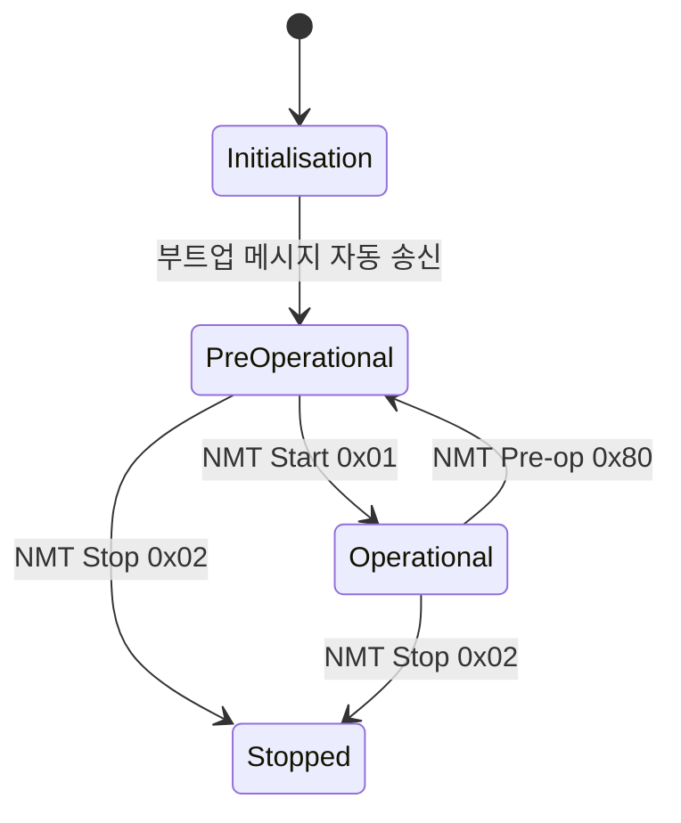
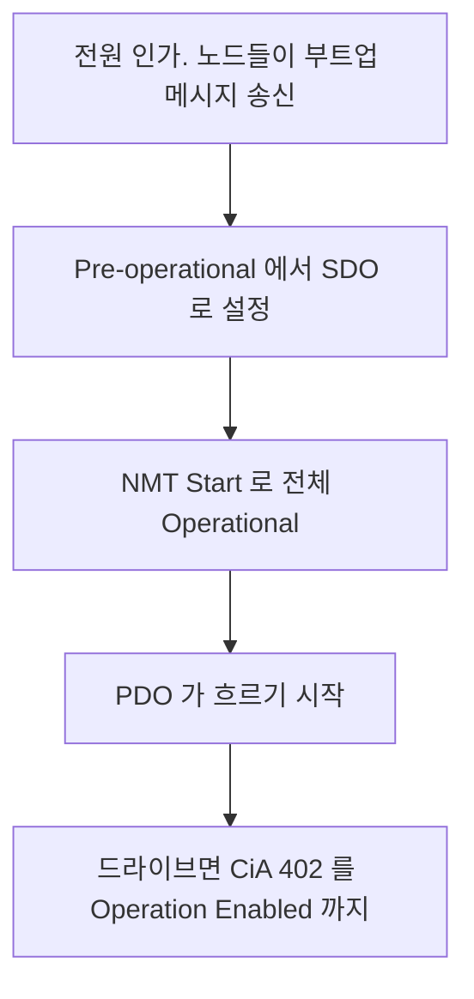

> **기준 출처:** CiA 301 은 회원 배포라 아래는 CiA 공개 요약과 다수 벤더의 공개 매뉴얼에서 교차 확인되는 내용이다. CiA 의 CANopen 개요와 오픈소스 구현 CANopenNode / 확인일 2026-08-03
> **시리즈:** [목차](/posts/00-comm-series/) | 이전 → [10. 대역폭과 최악 지연](/posts/10-can-bandwidth-worst-case/) | 다음 → [12. CANopen SDO 와 PDO](/posts/12-canopen-sdo-pdo/)

---

## 1. CANopen 이 채우는 빈칸

[01편](/posts/01-can-what-it-solves/)에서 봤듯 CAN 자체는 1계층과 2계층만 정한다. `ID 0x181` 로 8바이트가 왔는데 그게 무슨 뜻인지는 아무도 정해주지 않았다. CANopen 이 세 가지를 표준화한다.

| 표준화 대상 | 어떻게 |
| --- | --- |
| ID 배정 | predefined connection set 으로 규격이 정해준다 |
| 데이터의 의미 | 객체 사전으로 모든 값에 표준 주소를 준다 |
| 장비의 상태 관리 | NMT 로 부팅과 시작과 정지를 정한다 |

그리고 여기에 얹힌 CiA 402 드라이브 프로파일이 모터 드라이브를 어떻게 다루는가를 표준화한다. 결과적으로 제조사가 달라도 같은 코드로 드라이브를 돌릴 수 있다. 이게 CANopen 의 존재 이유다.

## 2. 객체 사전은 장비를 주소 공간으로 본다

CANopen 노드는 자신의 모든 설정과 데이터를 하나의 큰 테이블로 노출한다. 인덱스가 16비트로 항목 번호이고 서브인덱스가 8비트로 배열이나 레코드의 원소를 가리킨다.

예를 들어 인덱스 `0x6040` 의 서브인덱스 `0x00` 은 Controlword 16비트이고, `0x6064` 의 `0x00` 은 Position actual value 32비트이며, `0x1018` 의 `0x01` 은 Vendor ID 다.

| 인덱스 범위 | 내용 |
| --- | --- |
| `0x0000`~`0x0FFF` | 데이터 타입 정의다 |
| `0x1000`~`0x1FFF` | 통신 프로파일이다. CiA 301 이고 모든 CANopen 장비가 공통이다 |
| `0x2000`~`0x5FFF` | 제조사 고유 영역이라 벤더가 마음대로 쓴다 |
| `0x6000`~`0x9FFF` | 표준 장치 프로파일이다. 드라이브는 CiA 402, I/O 는 CiA 401 이다 |
| `0xA000` 이상 | 네트워크 변수 등이다 |

`0x1xxx` 와 `0x6xxx` 만 알면 어느 제조사 장비든 다룰 수 있다. `0x2xxx` 부터 `0x5xxx` 까지는 그 벤더 매뉴얼을 봐야 한다. 이식성 있는 코드를 쓰려면 제조사 고유 대역 사용을 최소화한다. 드라이브를 다른 제조사로 바꿀 때 그 부분만 다시 짜면 되게 한다.

| 인덱스 | 이름 | 용도 |
| --- | --- | --- |
| `0x1000` | Device type | 이 장비가 무엇인가. 402 드라이브면 하위 16비트가 `0x0192` 다 |
| `0x1001` | Error register | 오류 요약 비트맵이다 |
| `0x1003` | Pre-defined error field | 오류 이력이다 |
| `0x1005` | COB-ID SYNC | SYNC 메시지 ID 다 |
| `0x1017` | Producer heartbeat time | 하트비트 주기다. 0 이면 보내지 않는다 |
| `0x1016` | Consumer heartbeat time | 남의 하트비트를 감시한다 |
| `0x1018` | Identity | Vendor ID 와 Product code 와 Revision 과 Serial 이다 |
| `0x1400` 이후 | RPDO 통신 파라미터 | [12편](/posts/12-canopen-sdo-pdo/)에서 다룬다 |
| `0x1600` 이후 | RPDO 매핑 | |
| `0x1800` 이후 | TPDO 통신 파라미터 | |
| `0x1A00` 이후 | TPDO 매핑 | |

## 3. COB-ID 로 ID 배정이 표준화됐다

CANopen 은 11비트 CAN ID 를 상위 4비트의 기능 코드와 하위 7비트의 Node ID 로 쪼갠다. Node ID 는 1부터 127 까지이고 0 은 전체를 뜻하는 특수값이다.

| 통신 객체 | COB-ID | 방향 | 우선순위 관점 |
| --- | --- | --- | --- |
| NMT | `0x000` | 마스터에서 전체로 | 최우선이다. 정지 명령이 제일 급하다 |
| SYNC | `0x080` | 마스터에서 전체로 | 동기 신호다 |
| EMCY | `0x080` 에 Node ID 를 더한다 | 노드에서 전체로 | 긴급하다 |
| TIME | `0x100` | | |
| TPDO1 | `0x180` 에 Node ID | 노드에서 나간다 | 고주기 데이터다 |
| RPDO1 | `0x200` 에 Node ID | 노드로 들어간다 | |
| TPDO2, RPDO2 | `0x280`, `0x300` 에 Node ID | | |
| TPDO3, RPDO3 | `0x380`, `0x400` 에 Node ID | | |
| TPDO4, RPDO4 | `0x480`, `0x500` 에 Node ID | | |
| SDO 응답 | `0x580` 에 Node ID | 노드에서 마스터로 | 비주기 설정이다 |
| SDO 요청 | `0x600` 에 Node ID | 마스터에서 노드로 | |
| 하트비트 | `0x700` 에 Node ID | 노드에서 나간다 | 진단이다 |

[03편](/posts/03-can-arbitration/)에서 손으로 설계했던 ID 배정 원칙이 그대로 들어 있다. NMT 인 정지 명령이 최상위이고 PDO 인 고주기가 중간이고 SDO 와 하트비트인 비주기가 하위다. 규격이 이미 옳게 설계해뒀다.

T 와 R 은 노드 기준이다. TPDO 는 노드가 Transmit 하는 것이고 RPDO 는 노드가 Receive 하는 것이다. 마스터 입장에서는 반대라 헷갈리기 쉽다.

PDO 는 노드당 기본 4개뿐이다. 데이터가 더 필요하면 COB-ID 를 수동으로 배정한다. 객체 `0x1400` 이나 `0x1800` 의 서브인덱스 1 에서 한다. 그때는 충돌하지 않게 직접 관리해야 하고 03편의 ID 배정표가 다시 필요해진다.

## 4. NMT 는 네트워크 상태를 관리한다



| 상태 | SDO | PDO | 용도 |
| --- | --- | --- | --- |
| Pre-operational | 가능하다 | 불가능하다 | 설정하는 상태다. PDO 매핑과 파라미터를 SDO 로 쓴다 |
| Operational | 가능하다 | 가능하다 | 운전 상태다 |
| Stopped | 불가능하다 | 불가능하다 | 비상 정지 후 격리 상태다 |

설정은 Pre-operational 에서 하고 운전은 Operational 에서 한다는 게 CANopen 부팅의 뼈대다. PDO 매핑을 Operational 에서 바꾸면 안 되는 이유가 여기 있다. 주기 데이터가 흐르는 중에 배치를 바꾸면 수신 쪽이 잘못 해석한다. 규격이 상태로 막아준다.

EtherCAT 의 ESM 인 INIT 과 PREOP 과 SAFEOP 과 OP 도 발상이 같다. EtherCAT 는 여기에 입력만 유효한 SAFEOP 을 하나 더 넣었다.

NMT 명령은 COB-ID `0x000` 에 데이터 2바이트로 명령과 대상 Node ID 를 담는다. Node ID 가 0 이면 전체다.

| 명령 | 값 | 결과 |
| --- | --- | --- |
| Start Remote Node | `0x01` | Operational 로 간다 |
| Stop Remote Node | `0x02` | Stopped 로 간다 |
| Enter Pre-operational | `0x80` | Pre-operational 로 간다 |
| Reset Node | `0x81` | 애플리케이션까지 리셋해 Initialisation 으로 간다 |
| Reset Communication | `0x82` | 통신만 리셋한다 |

```cpp
// 모든 노드를 Operational 로 만든다
CanFrame nmt_start_all{ .id = 0x000, .dlc = 2, .data = {0x01, 0x00} };

// 노드 3번만 Pre-operational 로 만든다
CanFrame nmt_preop_node3{ .id = 0x000, .dlc = 2, .data = {0x80, 0x03} };
```

NMT 는 COB-ID 가 `0x000` 이라 최우선이다. 급정지 상황에서 다른 트래픽을 제치고 즉시 전달된다. 03편의 ID 가 곧 우선순위라는 원칙이 여기서 실제 안전 기능이 된다.

## 5. 하트비트로 생존을 확인한다

[기초 08편](/posts/08-basics-flow-control/)에서 본 원칙대로 재전송 대신 감지에 투자한다. COB-ID `0x700` 에 Node ID 를 더하고 데이터 1바이트를 보낸다. `0x00` 은 부트업이고 `0x04` 는 Stopped, `0x05` 는 Operational, `0x7F` 는 Pre-operational 이다.

생산자는 `0x1017` 에 주기를 ms 단위로 쓴다. 0 이면 보내지 않는다. 소비자는 `0x1016` 에 감시할 노드와 타임아웃을 쓴다.

소비자 타임아웃은 생산자 주기보다 커야 한다. 관례는 1.5~2배다. 너무 빠듯하면 지터 한 번에 오탐이 난다. 생산자가 100 ms 면 소비자를 200 ms 로 잡고, 그러면 최악 200 ms 안에 노드 고장을 감지한다.

200 ms 가 안전 정지에 충분한지는 따로 따져야 한다. 로봇이 1 m/s 로 움직이면 20 cm 를 더 간다. 안전 요구에 따라 하트비트 주기를 정해야 하고 그것도 부족하면 별도의 안전 통신이 필요하다.

옛 방식인 Node Guarding 은 마스터가 각 노드에 Remote Frame 을 보내 응답을 받는 방식인데 쓰지 않는다. Remote Frame 이 CAN FD 에서 삭제됐고 폴링이라 트래픽이 많고 마스터가 단일 장애점이다. 하트비트가 모든 면에서 낫다.

## 6. EMCY 는 노드가 먼저 알리는 것이다

노드가 심각한 오류를 만나면 물어볼 때까지 기다리지 않고 먼저 알린다. COB-ID 는 `0x080` 에 Node ID 를 더한 값이고 데이터는 8바이트다. 0~1바이트가 Emergency error code 이고 2바이트가 Error register 의 사본이며 3~7바이트가 제조사 고유 정보다.

[01편](/posts/01-can-what-it-solves/)에서 본 센서가 이상을 스스로 알린다는 게 여기서 실현된다. RS-485 마스터와 슬레이브 구조에서는 불가능했던 일이다. EMCY 는 COB-ID 가 `0x08x` 라 우선순위가 아주 높다. 급한 소식이 급하게 간다.

## 7. EDS 파일은 장비의 명세다

제조사가 주는 INI 형식 텍스트 파일로 그 장비가 어떤 객체를 갖는지 기술한다.

```ini
[6040]
ParameterName=Controlword
ObjectType=0x7
DataType=0x0006      ; UNSIGNED16
AccessType=rww
PDOMapping=1
```

EDS(Electronic Data Sheet)는 장비 종류의 명세로 제조사가 제공하고, DCF(Device Configuration File)는 특정 장비 인스턴스의 설정값으로 EDS 에 실제 값을 채운 것이다. EtherCAT 의 ESI XML 과 같은 역할이다. EDS 를 파싱해서 코드나 설정을 자동 생성하는 도구가 있고 규모가 커지면 손으로 관리하기 어렵다.

## 8. 부팅 순서



부트업 메시지에서 어떤 노드가 살아났는지 확인한다. Pre-operational 에서는 PDO 매핑과 하트비트 주기와 드라이브 파라미터를 설정한다.

마지막 단계가 별개라는 게 중요하다. NMT Operational 은 통신이 살아 있다는 뜻이지 모터가 돌 준비가 됐다는 뜻이 아니다. 두 개의 FSM 이 겹쳐 있다.

초보자가 가장 많이 막히는 지점이 여기다. NMT 를 Operational 로 만들고 목표 위치를 썼는데 축이 움직이지 않는 이유는 CiA 402 FSM 이 아직 Switch On Disabled 에 있어서다.

## 정리

- CANopen 은 CAN 이 정하지 않은 응용 계층을 채운다. ID 배정과 데이터 의미와 상태 관리다.
- 객체 사전은 장비를 인덱스 16비트와 서브인덱스 8비트 주소 공간으로 노출한다.
- `0x1xxx` 는 통신 프로파일, `0x2xxx` 부터 `0x5xxx` 는 제조사 고유, `0x6xxx` 는 장치 프로파일이다.
- 이식성을 원하면 제조사 고유 대역 사용을 최소화한다.
- COB-ID 는 기능 코드 4비트와 Node ID 7비트로 이뤄지고 predefined connection set 이 03편의 우선순위 원칙을 그대로 구현한다.
- T 와 R 은 노드 기준이라 마스터에서는 반대다.
- NMT 상태는 SDO 만 되는 Pre-operational 과 전부 되는 Operational 과 Stopped 다.
- 설정은 Pre-op 에서 운전은 Operational 에서 한다. PDO 매핑을 운전 중에 못 바꾸게 규격이 막는다.
- 하트비트로 노드 생존을 감시하고 소비자 타임아웃은 생산자 주기의 1.5~2배로 잡는다.
- 감지 지연이 안전 요구를 만족하는지 계산한다.
- Node Guarding 은 쓰지 않는다. Remote Frame 이 CAN FD 에서 삭제됐다.
- EMCY 로 노드가 오류를 먼저 알린다. RS-485 에서는 불가능했던 일이다.
- EDS 와 DCF 는 EtherCAT 의 ESI 와 ENI 와 같은 역할이다.
- NMT Operational 은 모터 준비 완료가 아니다. 두 FSM 이 겹쳐 있다.

## 참고

- [CiA — CANopen 개요](https://www.can-cia.org/can-knowledge/canopen)
- [CANopenNode — 오픈소스 CANopen 스택](https://github.com/CANopenNode/CANopenNode)
