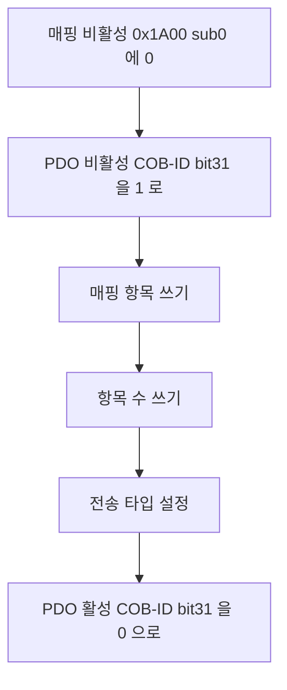

> **기준 출처:** CiA 301 은 회원 배포라 아래는 CiA 공개 요약과 벤더 공개 매뉴얼, CANopenNode 소스에서 교차 확인되는 내용이다 / 확인일 2026-08-03
> **시리즈:** [목차](/posts/00-comm-series/) | 이전 → [11. 객체 사전과 NMT](/posts/11-canopen-od-nmt/) | 다음 → [13. CiA 402 드라이브 FSM](/posts/13-cia402-drive-state-machine/)

---

## 1. 왜 둘로 나눴나

[기초 08편](/posts/08-basics-flow-control/)의 원칙이 여기서 프로토콜 설계로 나타난다.

| | SDO (Service Data Object) | PDO (Process Data Object) |
| --- | --- | --- |
| 목적 | 설정과 진단이다 | 실시간 프로세스 데이터다 |
| 모델 | 클라이언트와 서버의 1대1 이다 | 생산자와 소비자의 1대N 방송이다 |
| 확인 | 요청마다 응답이 있다 | 없다 |
| 접근 | 객체 사전 전체에 접근한다 | 미리 매핑한 것만 접근한다 |
| 오버헤드 | 크다. 프로토콜 헤더가 4바이트다 | 0 이다. 8바이트 전부가 데이터다 |
| 지연 | 왕복이 필요하다 | 단방향이다 |
| 언제 쓰나 | Pre-op 과 Operational 에서 | Operational 에서만 |

확인이 필요한 것과 제때 와야 하는 것을 분리했다. 파라미터를 쓸 때는 제대로 써졌는지 확인해야 하니 SDO 를 쓰고, 위치 명령은 다음 주기에 새 값이 오니 확인이 무의미해서 PDO 를 쓴다. 기초 08편의 재전송은 실시간에서 독이라는 결론이 프로토콜 두 개로 구현된 것이다.

## 2. SDO 는 확인이 있는 접근이다

요청은 `0x600` 에 Node ID 를 더한 COB-ID 로 나가고 응답은 `0x580` 에 Node ID 를 더한 것으로 온다. 둘 다 8바이트 고정이고 명령 1바이트에 인덱스 2바이트, 서브 1바이트, 데이터 4바이트다.

인덱스가 little-endian 이다. `0x6040` 은 `40 60` 순서로 나간다. [기초 09편](/posts/09-basics-endian-alignment/)의 원칙대로 필드버스는 little-endian 이다.

| 방식 | 데이터 크기 | 프레임 수 |
| --- | --- | --- |
| Expedited (급행) | 4바이트 이하 | 요청 1 에 응답 1 이다 |
| Segmented | 4바이트 초과 | 조각마다 요청과 응답이 있다 |
| Block | 큰 데이터 | 여러 조각을 묶어서 보낸다 |

대부분의 파라미터는 4바이트 이하라 expedited 로 끝난다. 32비트 정수와 16비트 컨트롤워드가 전부 여기 해당한다. 문자열이나 펌웨어 이미지 같은 도메인일 때만 segmented 가 필요하다.

```cpp
// comm_can/canopen_sdo.hpp
namespace canopen {

// 쓰기 요청이다. 명령 바이트는 데이터 바이트 수에 따라 다르다.
// 1바이트는 0x2F, 2바이트는 0x2B, 3바이트는 0x27, 4바이트는 0x23 이다
inline CanFrame sdo_download(std::uint8_t node, std::uint16_t index,
                             std::uint8_t sub, std::uint32_t value,
                             std::uint8_t nbytes) {
    static constexpr std::uint8_t kCmd[5] = {0, 0x2F, 0x2B, 0, 0x23};
    CanFrame f{ .id = 0x600u + node, .dlc = 8 };
    f.data[0] = (nbytes == 3) ? 0x27 : kCmd[nbytes];
    put_u16_le(&f.data[1], index);     // little-endian 이다
    f.data[3] = sub;
    put_u32_le(&f.data[4], value);
    return f;
}

inline CanFrame sdo_upload(std::uint8_t node, std::uint16_t index, std::uint8_t sub) {
    CanFrame f{ .id = 0x600u + node, .dlc = 8 };
    f.data[0] = 0x40;                  // upload request
    put_u16_le(&f.data[1], index);
    f.data[3] = sub;
    return f;
}

enum class SdoResult { Ok, Abort, Unexpected };
struct SdoResponse { SdoResult result; std::uint32_t value_or_abort_code; };

inline SdoResponse parse_sdo_response(const CanFrame& f) {
    const std::uint8_t cmd = f.data[0];
    if (cmd == 0x80) return { SdoResult::Abort, get_u32_le(&f.data[4]) };
    if ((cmd & 0xE0) == 0x40 || (cmd & 0xE0) == 0x60)
        return { SdoResult::Ok, get_u32_le(&f.data[4]) };
    return { SdoResult::Unexpected, 0 };
}

} // namespace canopen
```

명령 바이트가 `0x80` 이면 실패이고 데이터 4바이트가 이유다.

| Abort 코드 | 뜻 | 대개의 원인 |
| --- | --- | --- |
| `0x06020000` | 객체가 존재하지 않는다 | 인덱스 오타이거나 그 장비에 없는 기능이다 |
| `0x06090011` | 서브인덱스가 없다 | |
| `0x06090030` | 값이 범위를 넘었다 | |
| `0x06010002` | 읽기 전용에 쓰려 했다 | |
| `0x08000022` | 현재 상태에서 불가능하다 | NMT 나 CiA 402 상태가 안 맞다 |
| `0x05040000` | SDO 타임아웃이다 | |

`0x08000022` 가 나오면 상태를 먼저 확인한다. Operational 에서만 쓸 수 있는 객체이거나 Operation Enabled 에서 못 바꾸는 파라미터인 경우가 많다. Abort 코드를 그대로 로그에 남긴다. SDO 실패라고만 적는 것보다 훨씬 유용하다.

SDO 는 느리다. 프레임 왕복이 2개이고 500 kbps 에서 8바이트 최악 270 µs 를 두 번이면 540 µs 다. 서버 처리 시간과 다른 트래픽을 더하면 실제로는 수 ms 다.

제어 루프 안에서 SDO 를 쓰면 안 된다. 파라미터 100개를 SDO 로 설정하면 수백 ms 가 걸리니 부팅 시간에 포함해서 계산한다. 그리고 같은 노드에 대해 SDO 는 한 번에 하나씩 진행된다. 여러 개를 파이프라인으로 보내면 안 된다.

## 3. PDO 의 매핑

미리 이 PDO 의 8바이트에 무엇이 들어갈지를 약속해두고 그다음부터는 데이터만 보낸다.

Pre-operational 에서 SDO 로 TPDO1 의 바이트 0~1 은 Statusword 인 `0x6041`, 바이트 2~5 는 Position actual 인 `0x6064` 라고 설정해둔다. Operational 에서는 COB-ID `0x181` 에 데이터 6바이트만 나간다. 주소도 인덱스도 없는 순수 데이터다.

오버헤드가 0 이다. SDO 는 8바이트 중 4바이트만 데이터인데 PDO 는 8바이트 전부가 데이터다. 2배 효율이고 확인 응답이 없으니 프레임 수도 절반이다. 이 발상이 EtherCAT 의 PDO 매핑과 완전히 같다. 이름도 같다.

| 객체 | 내용 |
| --- | --- |
| `0x1400` 에 n 을 더한 것 | RPDO 통신 파라미터로 COB-ID 와 전송 타입이다 |
| `0x1600` 에 n | RPDO 매핑으로 무엇이 어디에 들어가는지다 |
| `0x1800` 에 n | TPDO 통신 파라미터다 |
| `0x1A00` 에 n | TPDO 매핑이다 |

매핑 객체의 서브인덱스 `0x00` 은 매핑된 항목 수이고 0 이면 매핑이 비활성이다. `0x01` 부터 `0x40` 까지가 매핑 항목이고 인덱스 16비트와 서브 8비트와 비트길이 8비트를 이어 붙인 32비트다. `0x6041` 인 Statusword 16비트를 매핑하려면 `0x60410010` 을 쓴다.

매핑을 바꾸는 절차는 순서가 정해져 있다.



첫 단계를 빼먹으면 대부분의 장비가 SDO abort 를 낸다. 매핑이 활성인 상태에서는 항목을 못 바꾸게 막혀 있다. 그리고 이 전 과정을 Pre-operational 에서 해야 한다. Operational 에서 시도하면 `0x08000022` abort 가 난다.

```cpp
// 매핑 설정 헬퍼다. 순서를 코드로 강제한다
struct PdoMapEntry { std::uint16_t index; std::uint8_t sub; std::uint8_t bits; };

constexpr std::uint32_t encode_map(const PdoMapEntry& e) {
    return (static_cast<std::uint32_t>(e.index) << 16)
         | (static_cast<std::uint32_t>(e.sub) << 8)
         | e.bits;
}
static_assert(encode_map({0x6041, 0x00, 16}) == 0x60410010);
static_assert(encode_map({0x6064, 0x00, 32}) == 0x60640020);

// 이 순서를 벗어나면 abort 가 나므로 함수로 묶어 실수를 막는다
bool configure_tpdo(SdoClient& sdo, std::uint8_t node, std::uint8_t pdo_num,
                    std::uint32_t cob_id, std::uint8_t transmission_type,
                    std::span<const PdoMapEntry> entries) {
    const std::uint16_t comm = 0x1800 + pdo_num;
    const std::uint16_t map  = 0x1A00 + pdo_num;

    if (!sdo.write_u8 (node, map,  0x00, 0)) return false;                     // 매핑 비활성
    if (!sdo.write_u32(node, comm, 0x01, cob_id | 0x80000000u)) return false;  // PDO 비활성
    for (std::size_t i = 0; i < entries.size(); ++i)
        if (!sdo.write_u32(node, map, static_cast<std::uint8_t>(i + 1),
                           encode_map(entries[i])))
            return false;
    if (!sdo.write_u8 (node, map,  0x00,
                       static_cast<std::uint8_t>(entries.size()))) return false;
    if (!sdo.write_u8 (node, comm, 0x02, transmission_type)) return false;
    if (!sdo.write_u32(node, comm, 0x01, cob_id)) return false;                // PDO 활성
    return true;
}
```

## 4. 전송 타입은 언제 보낼 것인가를 정한다

`0x1800` 에 n 을 더한 객체의 서브인덱스 `0x02` 에 쓰는 값이다.

| 값 | 이름 | 동작 |
| --- | --- | --- |
| 0 | 동기이면서 비주기 | SYNC 를 받고 값이 바뀌었을 때만 보낸다 |
| 1~240 | 동기이면서 주기 | N 번째 SYNC 마다 보낸다 |
| 252, 253 | 동기나 비동기 RTR | Remote Frame 응답이라 쓰지 않는다 |
| 254 | 비동기, 제조사 정의 | 이벤트가 발생할 때 보낸다 |
| 255 | 비동기, 프로파일 정의 | 이벤트가 발생할 때 보낸다 |

SYNC 는 COB-ID `0x080` 에 데이터 0바이트이거나 카운터 1바이트다. 마스터가 주기적으로 방송한다. SYNC 를 받는 순간 모든 노드가 동시에 입력을 래치해 TPDO 로 보낼 값을 확정하고, 직전에 받은 RPDO 값을 출력에 반영한다.

[SPI 07편](/posts/07-spi-multislave-cs-daisy/)의 데이지 체인이 준 동시 래치를 네트워크 규모로 한 것이다. 그리고 EtherCAT 의 분산 클록이 푸는 문제와 같은 문제를 훨씬 거친 방식으로 푼다.

| | CANopen SYNC | EtherCAT DC |
| --- | --- | --- |
| 동기 오차 | SYNC 프레임의 전파와 처리 지터로 수십에서 수백 µs 다 | 1 µs 미만이다 |
| 원인 | SYNC 도 다른 프레임과 중재를 하고 노드마다 인터럽트 지연이 다르다 | 하드웨어 클럭을 맞춘다 |

µs 급 다축 동기가 필요하면 CANopen SYNC 로는 안 된다. [10편](/posts/10-can-bandwidth-worst-case/)의 대역폭 결론과 같은 방향이다.

| 상황 | 권장 전송 타입 |
| --- | --- |
| 다축이 같이 움직여야 한다 | 1 로 두어 매 SYNC 마다 보낸다 |
| 부하를 줄이고 싶다 | N 으로 두고 축마다 다른 N 을 주면 트래픽이 분산된다 |
| 상태 변화만 알면 된다 | 255 로 두어 이벤트로 보낸다 |
| 드물게 바뀌는 디지털 입력이다 | 255 에 inhibit time 을 더한다 |

`0x1800` 에 n 을 더한 객체의 서브 3 이 inhibit time 이고 최소 전송 간격을 0.1 ms 단위로 지정한다. 이벤트 방식에서 채터링이 버스를 채우는 것을 막는다. 이벤트 PDO 를 쓸 때는 반드시 설정한다. 서브 5 는 event timer 로 ms 단위이고 값이 안 바뀌어도 주기적으로 한 번은 보내게 한다. 수신 측 워치독의 근거가 된다.

## 5. SDO 와 PDO 의 실제 차이

축 6개의 위치를 500 kbps CAN 에서 1 kHz 로 읽는다고 하자. SDO 로 하면 축마다 프레임 2개씩이라 6 곱하기 2 곱하기 270 µs 로 3240 µs 다. 1 ms 주기에 3.24 ms 가 필요하니 불가능하다.

PDO 로 하면 축마다 프레임 1개라 6 곱하기 270 µs 로 1620 µs 다. 여전히 1 ms 를 넘지만 SDO 의 절반이다. 250 Hz 로 낮추면 부하율 40.5% 로 가능해진다.

PDO 가 SDO 보다 2배 효율적이지만 그래도 CAN 의 물리적 한계는 넘지 못한다. 프로토콜 최적화로 해결되는 문제와 아닌 문제를 구분하는 게 중요하다.

## 6. 진단

| 증상 | 원인 |
| --- | --- |
| PDO 가 아예 오지 않는다 | NMT 가 Operational 이 아니다 |
| PDO 는 오는데 값이 이상하다 | 매핑 불일치다. 송신 쪽과 수신 쪽의 해석이 다르다 |
| 매핑을 쓰려는데 SDO abort 가 난다 | 매핑 비활성화를 안 했거나 Pre-op 이 아니다 |
| PDO 가 SYNC 와 무관하게 온다 | 전송 타입이 254 나 255 로 되어 있다 |
| 버스가 이벤트 PDO 로 가득 찬다 | inhibit time 을 설정하지 않았다 |
| SDO 가 `0x08000022` abort 를 낸다 | 상태가 안 맞다. NMT 나 CiA 402 를 본다 |
| SDO 응답이 오지 않는다 | 노드 ID 오류이거나 노드 미기동이거나 COB-ID 충돌이다 |

PDO 값이 이상하다는 건 거의 항상 매핑 불일치다. 부팅 시 매핑을 SDO 로 다시 읽어서 기대값과 비교하는 검증 코드를 넣으면 이 부류가 통째로 사라진다.

```cpp
// 설정한 매핑이 실제로 들어갔는지 확인해 조용한 실패를 막는다
bool verify_tpdo_mapping(SdoClient& sdo, std::uint8_t node, std::uint8_t pdo,
                         std::span<const PdoMapEntry> expected) {
    std::uint8_t count{};
    if (!sdo.read_u8(node, 0x1A00 + pdo, 0, count)) return false;
    if (count != expected.size()) return false;
    for (std::size_t i = 0; i < expected.size(); ++i) {
        std::uint32_t v{};
        if (!sdo.read_u32(node, 0x1A00 + pdo, i + 1, v)) return false;
        if (v != encode_map(expected[i])) return false;
    }
    return true;
}
```

## 정리

- SDO 와 PDO 를 나눈 것은 확인이 필요한 것과 제때 와야 하는 것을 프로토콜로 구현한 것이다.
- SDO 는 클라이언트와 서버 구조로 확인이 있고 객체 사전 전체에 접근하며 오버헤드가 4바이트다.
- Expedited 로 4바이트 이하를 보내는 게 대부분이고 인덱스는 little-endian 이다.
- Abort 코드가 실패 이유를 알려준다. `0x08000022` 는 상태가 안 맞다는 뜻이다.
- SDO 를 제어 루프 안에서 쓰지 않는다. 수 ms 가 걸리니 부팅 시간에 포함해 계산한다.
- PDO 는 생산자와 소비자 방송이고 확인이 없고 매핑한 것만 보내며 오버헤드가 0 이다.
- 매핑 변경 순서가 정해져 있다. 매핑 비활성, PDO 비활성, 항목, 개수, 활성 순이고 Pre-op 에서만 한다.
- 전송 타입은 1에서 240 이 N번째 SYNC 마다이고 255 가 이벤트다.
- 이벤트 방식에는 inhibit time 이 필수이고 event timer 는 수신 워치독의 근거다.
- SYNC 로 모든 노드가 동시에 입력을 래치하고 출력을 반영하지만 동기 오차가 수십에서 수백 µs 다.
- EtherCAT DC 의 1 µs 미만과 비교하면 거친 방식이라 µs 급 다축 동기는 안 된다.
- 6축 1 kHz 는 SDO 3240 µs, PDO 1620 µs 다. PDO 가 2배 효율이지만 CAN 의 한계는 못 넘는다.
- 부팅 시 매핑을 다시 읽어 검증하면 PDO 값이 이상하다는 부류가 통째로 사라진다.

## 참고

- [CiA — CANopen 개요](https://www.can-cia.org/can-knowledge/canopen)
- [CANopenNode — 오픈소스 CANopen 스택](https://github.com/CANopenNode/CANopenNode)
