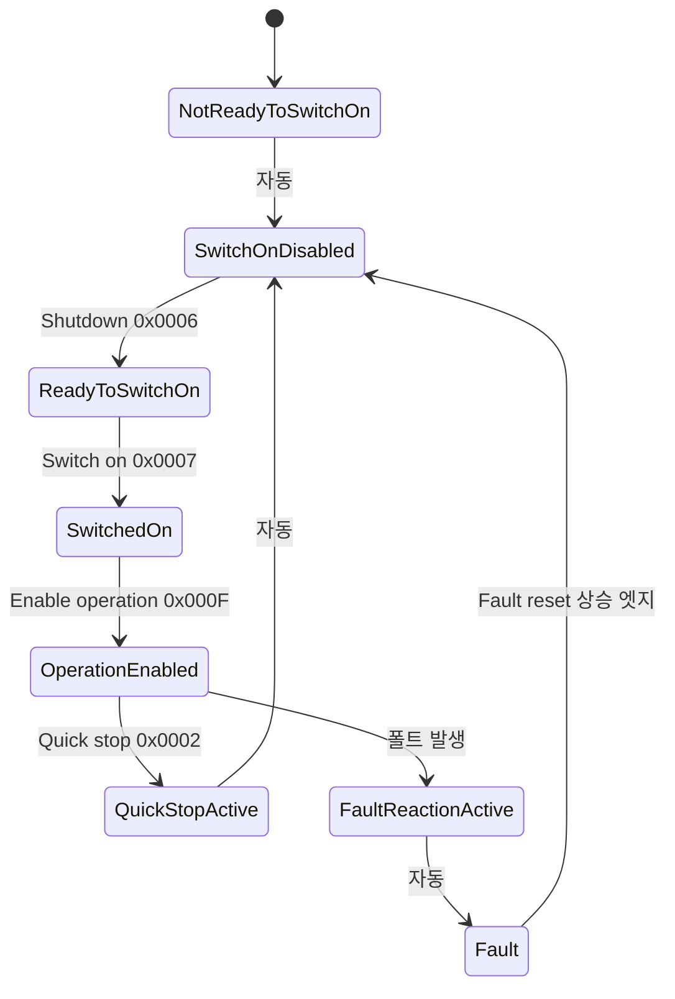
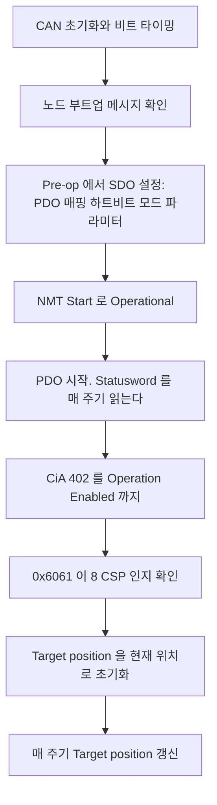

> **기준 출처:** CiA 402(= IEC 61800-7-201/301) 원문은 회원 배포이나 FSM 과 Controlword 및 Statusword 비트 정의는 거의 모든 서보 드라이브 매뉴얼에 공개되어 있어 교차 확인이 가능하다. CiA 의 CiA 402 개요와 다수 제조사의 공개 매뉴얼 / 확인일 2026-08-03
> **시리즈:** [목차](/posts/00-comm-series/) | 이전 → [12. SDO 와 PDO](/posts/12-canopen-sdo-pdo/) | 다음 → [14. MCU CAN 드라이버](/posts/14-mcu-can-driver-mailbox-filter/)

---

## 1. 왜 이 FSM 이 있나

모터를 갑자기 돌리면 안 된다. 전원이 들어오고 브레이크가 풀리고 전류 루프가 준비되고 그다음에 명령을 받아야 한다. 그리고 문제가 생기면 정해진 순서로 멈춰야 한다.

CiA 402 는 이 순서를 여덟 개 State 의 표준 FSM 으로 못박았다. 덕분에 제조사가 달라도 같은 코드로 축을 기동할 수 있다. 이게 이 프로파일의 존재 이유다. 그리고 EtherCAT 에서도 그대로 쓴다. CoE 가 이 프로파일을 얹으므로 여기서 배운 게 EtherCAT 폴더에서 그대로 나온다.

## 2. 두 개의 워드가 전부다

| 객체 | 이름 | 방향 | 크기 |
| --- | --- | --- | --- |
| `0x6040` | Controlword | 마스터에서 드라이브로 | 16비트 |
| `0x6041` | Statusword | 드라이브에서 마스터로 | 16비트 |

이 둘을 PDO 에 매핑해두면 매 주기 상태를 보고 명령을 낼 수 있다.

| Controlword 비트 | 이름 | 뜻 |
| --- | --- | --- |
| 0 | Switch on | |
| 1 | Enable voltage | |
| 2 | Quick stop | active low 다. 0 이 급정지다 |
| 3 | Enable operation | |
| 4~6 | 동작 모드별 | 모드마다 다르다 |
| 7 | Fault reset | 상승 엣지로 동작한다 |
| 8 | Halt | |
| 9~15 | 모드별이거나 제조사 정의다 | |

| Statusword 비트 | 이름 |
| --- | --- |
| 0 | Ready to switch on |
| 1 | Switched on |
| 2 | Operation enabled |
| 3 | Fault |
| 4 | Voltage enabled |
| 5 | Quick stop. 0 이 급정지 중이다 |
| 6 | Switch on disabled |
| 7 | Warning |
| 9 | Remote. 원격 제어가 가능하다 |
| 10 | Target reached. 모드별이다 |
| 11 | Internal limit active |

## 3. 상태 전이



| 상태 | 전원 | 모터 | 뜻 |
| --- | --- | --- | --- |
| Not ready to switch on | — | — | 부팅 중이다 |
| Switch on disabled | 없다 | 정지 | 정상 대기 상태다. 여기서 시작한다 |
| Ready to switch on | 없다 | 정지 | 주회로 전원 투입 준비가 됐다 |
| Switched on | 있다 | 정지 | 전원은 들어갔지만 토크가 없다 |
| Operation enabled | 있다 | 동작 | 명령을 받아 움직인다 |
| Quick stop active | 있다 | 감속 중 | 급정지를 실행 중이다 |
| Fault reaction active | — | 폴트 반응 중 | 정해진 폴트 동작을 수행한다 |
| Fault | 없다 | 정지 | 리셋해야 나간다 |

## 4. Controlword 명령표

| 명령 | Controlword | 어디서 어디로 |
| --- | --- | --- |
| Shutdown | `0x0006` | Switch on disabled 에서 Ready to switch on 으로 |
| Switch on | `0x0007` | Ready to switch on 에서 Switched on 으로 |
| Enable operation | `0x000F` | Switched on 에서 Operation enabled 로 |
| Disable operation | `0x0007` | Operation enabled 에서 Switched on 으로 |
| Disable voltage | `0x0000` | 어디서든 Switch on disabled 로 |
| Quick stop | `0x0002` | Operation enabled 에서 Quick stop active 로 |
| Fault reset | `0x0080` | bit7 상승 엣지로 Fault 에서 Switch on disabled 로 |

함정이 둘 있다.

Quick stop 비트인 bit2 는 active low 다. `0x0002` 는 `0000 0010` 이라 bit1 인 Enable voltage 가 1 이고 bit2 인 Quick stop 이 0 이라 급정지가 된다. 정상 운전 중에는 bit2 가 계속 1 이어야 한다. `0x000F` 에 bit2 가 포함된 이유다.

Fault reset 은 상승 엣지다. `0x0080` 을 계속 유지하면 안 된다. `0x0000` 에서 `0x0080` 으로 갔다가 다시 `0x0000` 으로 토글해야 리셋이 걸린다. 폴트가 안 풀린다는 증상의 1순위 원인이 이것이다.

## 5. Statusword 로 현재 상태 읽기

비트 조합으로 상태를 판별하는데 마스크가 상태마다 다르다는 게 함정이다.

| 상태 | 마스크 | 값 |
| --- | --- | --- |
| Not ready to switch on | `0x4F` | `0x00` |
| Switch on disabled | `0x4F` | `0x40` |
| Ready to switch on | `0x6F` | `0x21` |
| Switched on | `0x6F` | `0x23` |
| Operation enabled | `0x6F` | `0x27` |
| Quick stop active | `0x6F` | `0x07` |
| Fault reaction active | `0x4F` | `0x0F` |
| Fault | `0x4F` | `0x08` |

```cpp
// comm_can/cia402.hpp
enum class DriveState {
    NotReadyToSwitchOn, SwitchOnDisabled, ReadyToSwitchOn, SwitchedOn,
    OperationEnabled, QuickStopActive, FaultReactionActive, Fault
};

constexpr DriveState decode_state(std::uint16_t sw) {
    // 순서가 중요하다. 마스크가 겹치므로 먼저 걸러야 하는 것부터 본다
    if ((sw & 0x4F) == 0x0F) return DriveState::FaultReactionActive;
    if ((sw & 0x4F) == 0x08) return DriveState::Fault;
    if ((sw & 0x6F) == 0x27) return DriveState::OperationEnabled;
    if ((sw & 0x6F) == 0x07) return DriveState::QuickStopActive;
    if ((sw & 0x6F) == 0x23) return DriveState::SwitchedOn;
    if ((sw & 0x6F) == 0x21) return DriveState::ReadyToSwitchOn;
    if ((sw & 0x4F) == 0x40) return DriveState::SwitchOnDisabled;
    return DriveState::NotReadyToSwitchOn;
}

static_assert(decode_state(0x0237) == DriveState::OperationEnabled);
static_assert(decode_state(0x0008) == DriveState::Fault);
static_assert(decode_state(0x0040) == DriveState::SwitchOnDisabled);
```

판별 순서를 잘못 짜면 Fault 를 Operation enabled 로 읽는 사고가 난다. `0x0F` 를 `0x6F` 로 마스킹하면 `0x0F` 이므로 마스크가 겹친다. 테스트로 못박아둔다.

## 6. 상태 올리기 시퀀스

매 제어 주기마다 호출되는 FSM 으로 짠다. 블로킹하지 않는다.

```cpp
// comm_can/cia402_bringup.hpp
// 목표 상태까지 올리는 시퀀서다. 매 주기 호출하고 블로킹하지 않는다
class Cia402Bringup {
public:
    enum class Result { InProgress, Reached, FaultLatched, Timeout };

    Result update(std::uint16_t statusword, std::uint16_t& controlword_out,
                  std::uint64_t now_ms) {
        const auto st = decode_state(statusword);

        if (st != last_state_) {
            last_state_ = st; state_entered_ms_ = now_ms; fault_reset_pulsed_ = false;
        }
        if (now_ms - state_entered_ms_ > kStateTimeoutMs) return Result::Timeout;

        switch (st) {
        case DriveState::Fault:
            // 상승 엣지가 필요하다. 한 주기 0x0000, 다음 주기 0x0080 을 낸다
            if (!fault_reset_pulsed_) { controlword_out = 0x0000; fault_reset_pulsed_ = true; }
            else                      { controlword_out = 0x0080; }
            ++fault_count_;
            if (fault_count_ > kMaxFaultResets) return Result::FaultLatched;
            return Result::InProgress;

        case DriveState::FaultReactionActive:
            controlword_out = 0x0000;          // 드라이브가 폴트 반응을 끝낼 때까지 기다린다
            return Result::InProgress;

        case DriveState::SwitchOnDisabled:
            controlword_out = 0x0006;          // Shutdown
            return Result::InProgress;

        case DriveState::ReadyToSwitchOn:
            controlword_out = 0x0007;          // Switch on
            return Result::InProgress;

        case DriveState::SwitchedOn:
            controlword_out = 0x000F;          // Enable operation
            return Result::InProgress;

        case DriveState::OperationEnabled:
            controlword_out = 0x000F;          // 유지한다. 놓으면 내려간다
            return Result::Reached;

        case DriveState::QuickStopActive:
            controlword_out = 0x0000;          // Disable voltage 로 Switch on disabled 로 간다
            return Result::InProgress;

        default:
            controlword_out = 0x0000;
            return Result::InProgress;
        }
    }

private:
    DriveState    last_state_{DriveState::NotReadyToSwitchOn};
    std::uint64_t state_entered_ms_{};
    std::uint32_t fault_count_{};
    bool          fault_reset_pulsed_{false};
    static constexpr std::uint64_t kStateTimeoutMs = 2000;
    static constexpr std::uint32_t kMaxFaultResets = 3;
};
```

이 코드의 핵심이 셋이다. 블로킹하지 않고 매 주기 호출되며 상태를 보고 다음 명령을 낸다. `while` 루프로 짜면 제어 주기가 깨진다. 상태 타임아웃을 둬서 어느 상태에서 안 나가면 문제가 있다는 걸 알린다. 폴트 리셋 횟수를 제한한다. 무한 리셋은 위험하고 [08편](/posts/08-can-error-states-busoff/)의 Bus Off 백오프 정책과 같은 발상이다.

Operation Enabled 에서도 `0x000F` 를 계속 내야 한다. Controlword 를 `0x0000` 으로 놓으면 즉시 내려간다. PDO 로 매 주기 보내므로 값을 유지하는 게 자연스럽다.

## 7. 동작 모드

FSM 을 Operation Enabled 로 올렸으면 무슨 명령을 받을지를 `0x6060` 으로 정한다.

| 값 | 모드 | 마스터가 주는 것 | 누가 궤적을 만드나 |
| --- | --- | --- | --- |
| 1 | PP (Profile Position) | 목표 위치와 속도와 가속 | 드라이브 |
| 3 | PV (Profile Velocity) | 목표 속도 | 드라이브 |
| 4 | PT (Profile Torque) | 목표 토크 | 드라이브 |
| 6 | HM (Homing) | 호밍 방법 | 드라이브 |
| 7 | IP (Interpolated Position) | 보간점들 | 드라이브가 보간한다 |
| 8 | CSP (Cyclic Sync Position) | 매 주기 위치 | 마스터 |
| 9 | CSV (Cyclic Sync Velocity) | 매 주기 속도 | 마스터 |
| 10 | CST (Cyclic Sync Torque) | 매 주기 토크 | 마스터 |

PP 모드는 마스터가 저기로 가라고 하면 드라이브가 알아서 궤적을 만들어 간다. CSP 모드는 마스터가 매 1 ms 마다 위치를 주고 드라이브는 그 위치를 따라가기만 한다.

| | PP | CSP |
| --- | --- | --- |
| 궤적 생성 | 드라이브가 한다 | 마스터가 한다 |
| 다축 협조 | 어렵다. 축마다 따로 움직인다 | 가능하다 |
| 마스터 부하 | 낮다 | 높다. 매 주기 계산한다 |
| 통신 요구 | 낮다 | 높다. 매 주기 전송에 동기가 필요하다 |
| 쓰는 곳 | 단순 위치 결정 | 로봇과 다축 협조 |

로봇은 여러 축이 협조해서 말단 궤적을 만들어야 하므로 CSP 가 필수다. 그리고 CSP 는 매 주기 통신과 정확한 동기를 요구한다. [10편](/posts/10-can-bandwidth-worst-case/)에서 CAN 의 한계를 계산했고 [12편](/posts/12-canopen-sdo-pdo/)에서 SYNC 의 동기 오차를 봤다. CSP 와 다축의 조합이 EtherCAT 를 쓰는 이유의 완성형이다.

| 인덱스 | 이름 | 모드 |
| --- | --- | --- |
| `0x6060` 과 `0x6061` | Modes of operation 과 display | display 로 실제 적용을 확인한다 |
| `0x6064` | Position actual value | 전 모드 |
| `0x606C` | Velocity actual value | |
| `0x6077` | Torque actual value | |
| `0x607A` | Target position | PP 와 CSP |
| `0x60FF` | Target velocity | PV 와 CSV |
| `0x6071` | Target torque | PT 와 CST |
| `0x6081` 과 `0x6083` | Profile velocity 와 acceleration | PP |
| `0x6098` | Homing method | HM |
| `0x60C2` | Interpolation time period | IP 와 CSP |

설정용 `0x6060` 과 현재값 `0x6061` 을 구분한다. 모드 변경은 즉시 반영되지 않을 수 있으므로 `0x6061` 이 원하는 값이 될 때까지 기다린 뒤 명령을 준다.

## 8. 실제 부팅 순서



여덟 번째 단계가 가장 위험한 실수다. CSP 모드에서 Operation Enabled 로 올리는 순간 드라이브는 RPDO 의 Target position 값을 따라가려 한다. 그 값이 0 인데 현재 위치가 100000 카운트면 축이 최대 속도로 급이동한다.

반드시 `0x607A` 에 `0x6064` 인 현재 위치를 써서 초기화한 뒤 Enable operation 을 낸다. 그리고 첫 몇 주기는 위치를 고정해서 안정을 확인한 뒤 궤적을 시작한다.

## 9. Stateflow 로 그리기

[08편](/posts/08-can-error-states-busoff/)의 CAN 오류 FSM 과 함께 산업 표준 FSM 을 실제로 그려볼 수 있는 두 번째 소재다. 그리고 이쪽이 더 풍부하다.

| 특징 | Stateflow 로 배우는 것 |
| --- | --- |
| State 8개에 Transition 16개 | 계층 구조가 필요해진다 |
| 어느 State 에서든 Fault 로 갈 수 있다 | 상위 State 에서 나가는 Transition 하나로 16개를 대신한다 |
| Transition 조건이 Controlword 비트 패턴이다 | Condition 전이와 비트 마스크 |
| Fault reset 이 상승 엣지다 | Event 와 레벨의 차이 |
| Quick stop 이 active low 다 | 신호 극성을 모델에 어떻게 표현하나 |
| 자동 전이가 있다 | 조건 없는 Transition |
| Operation Enabled 안에 동작 모드가 또 있다 | 병렬 State 다. FSM 과 모드가 직교한다 |

계층으로 그리면 Normal 안에 SwitchOnDisabled 부터 OperationEnabled 와 QuickStopActive 가 들어가고, Faulted 안에 FaultReactionActive 와 Fault 가 들어간다. 그리고 Normal 상위에서 Faulted 로 가는 Transition 하나가 어느 State 에서든 폴트로를 표현한다.

이게 계층 State 를 쓰는 가장 대표적인 이유다. 교과서 설명보다 이 실제 사례가 훨씬 설득력 있다.

검증할 것은 일곱 가지다. 여덟 State 가 다 있는가. Fault 로 가는 Transition 이 상위 State 에서 하나로 묶였는가. Fault reset 이 레벨이 아니라 엣지로 모델링됐는가. Quick stop 의 active low 를 어떻게 표현했는가. Operation Enabled 안에서 동작 모드가 병렬로 도는가. 잘못된 전이가 막히는가. 동시에 여러 Transition 이 유효할 때 우선순위가 명시적인가.

## 정리

- CiA 402 는 모터를 켜고 끄는 순서를 여덟 State FSM 으로 표준화했다. 제조사가 달라도 같은 코드로 축을 올린다.
- EtherCAT CoE 에서도 그대로 쓰므로 여기서 배운 게 재사용된다.
- Controlword 인 `0x6040` 과 Statusword 인 `0x6041` 두 워드가 전부다. PDO 에 매핑해 매 주기 주고받는다.
- 상태 올리기는 Switch on disabled 에서 `0x0006`, `0x0007`, `0x000F` 순으로 명령해 Operation enabled 까지 간다.
- Quick stop 비트는 active low 라 0 이 급정지다.
- Fault reset 은 상승 엣지라 `0x0080` 을 유지하면 걸리지 않는다. 폴트가 안 풀린다의 1순위다.
- Statusword 판별은 마스크가 상태마다 다르고 겹치므로 순서를 잘못 짜면 Fault 를 Operation enabled 로 읽는다.
- 시퀀서는 블로킹하지 않는 FSM 으로 짜고 상태 타임아웃과 폴트 리셋 횟수 제한을 넣는다.
- Operation Enabled 에서도 `0x000F` 를 계속 내야 한다.
- 로봇은 CSP 인 8번 모드를 쓴다. 마스터가 매 주기 위치를 주고 다축 협조에 필수이며 통신 요구가 높다.
- CSP 진입 전에 Target position 을 현재 위치로 초기화한다. 안 하면 축이 최대 속도로 급이동한다.
- Stateflow 연습 소재로 최적이다. 어느 State 에서든 Fault 로를 계층 State 의 Transition 하나로 표현하는 실제 사례다.

## 참고

- [CiA — CiA 402 개요](https://www.can-cia.org/can-knowledge/canopen/cia402)
- [CANopenNode — 오픈소스 CANopen 스택](https://github.com/CANopenNode/CANopenNode)
