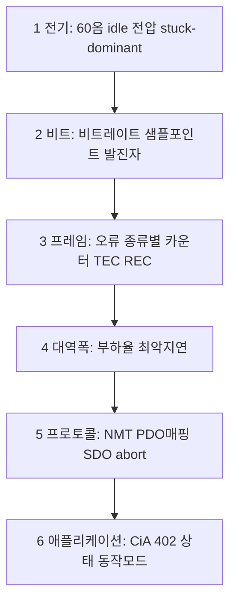
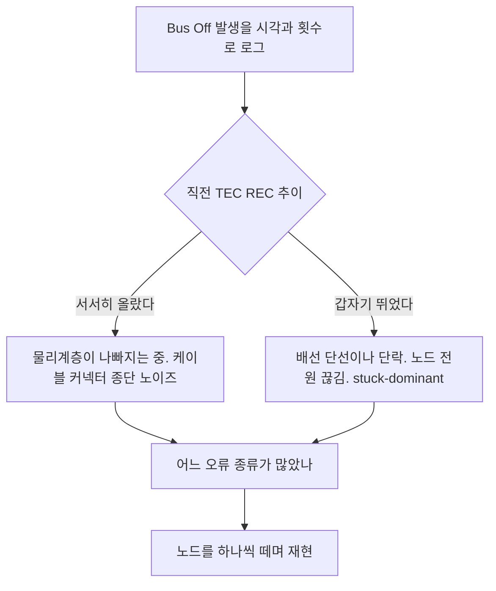

> **기준 출처:** can-utils 의 `candump`, `cansend`, `canbusload`, `cangen`, `canplayer`, Linux SocketCAN 커널 문서의 오류 프레임 정의 / 확인일 2026-08-03
> **시리즈:** [목차](/posts/00-comm-series/) | 이전 → [14. MCU CAN 드라이버](/posts/14-mcu-can-driver-mailbox-filter/) | 다음 → [16. CiA 402 시퀀서 만들기](/posts/16-cia402-sequencer-example/)

---

## 1. CAN 은 진단 순서가 명확하다

[시리얼 16편](/posts/16-serial-debugging-loopback/)의 아래층부터라는 원칙이 CAN 에서는 특히 잘 통한다. 오류 종류가 층을 직접 가리켜주기 때문이다.



## 2. 전기층은 도구 없이 한다

[02편](/posts/02-can-physical-dominant-recessive/)의 반복이지만 가장 값싸고 가장 잘 듣는다.

| # | 확인 | 정상 | 이상하면 |
| --- | --- | --- | --- |
| 1 | 전원 끄고 CAN_H 와 CAN_L 사이 저항 | 60 Ω | 120 이면 종단 1개, 40 이면 3개, 무한대면 단선이다 |
| 2 | 전원 켜고 idle 전압 | 둘 다 약 2.5 V | 3.5 와 1.5 로 고정이면 stuck-dominant 다 |
| 3 | 노드를 하나씩 떼어본다 | | 특정 노드를 떼면 정상이 되면 그 노드가 원인이다 |
| 4 | 트랜시버 VCC | 5 V 나 3.3 V | |
| 5 | 스터브 길이 | 1 Mbps 면 0.3 m 이하 | |

## 3. 오류 카운터가 CAN 디버깅의 핵심이다

[07편](/posts/07-can-error-detection/)에서 말한 대로 오류 종류가 원인을 직접 가리킨다.

```bash
# 반드시 오류 리포팅을 켠다
sudo ip link set can0 down
sudo ip link set can0 type can bitrate 500000 sample-point 0.875 berr-reporting on
sudo ip link set can0 up

# 통계로 TEC 와 REC 와 오류 카운트와 Bus Off 횟수를 본다
ip -details -statistics link show can0
```

출력에서 볼 것은 `can state ERROR-ACTIVE (berr-counter tx 0 rx 0)` 줄의 TEC 와 REC, 그다음 줄의 `bus-error`, `error-warn`, `error-pass`, `bus-off` 전이 횟수, 그리고 `restart-ms` 다.

| 필드 | 정상 | 이상하면 |
| --- | --- | --- |
| `berr-counter tx/rx` | 0 | 0 이 아니면 오류가 나고 있다 |
| `bus-error` | 0 | 증가 추세면 물리계층 문제다 |
| `error-pass` | 0 | 0 이 아니면 심각하다 |
| `bus-off` | 0 | 0 이 아니면 매우 심각하다 |
| `restart-ms` | 0 을 권장한다 | 0 이 아니면 자동 복구가 켜진 것이다 |

```bash
# 오류 프레임만 본다
candump can0,0~0,#FFFFFFFF

# 전부에 타임스탬프와 오류 해석을 붙여 본다
candump -ta -e can0
```

`candump -e` 는 오류 프레임을 사람이 읽는 형태로 해석해준다. `protocol-violation` 뒤에 중괄호로 `bit-error` 같은 세부 종류를 붙여 출력한다.

```cpp
// 07편과 08편의 카운터를 주기적으로 진단 토픽이나 로그로 내보낸다
struct CanDiagnostics {
    std::uint8_t  tec, rec;
    CanState      state;
    std::uint32_t bit_error, stuff_error, crc_error, form_error, ack_error;
    std::uint32_t bus_off_count;
    std::uint32_t rx_fifo_overrun, tx_queue_peak;
    double        bus_load_pct;
};
```

| 많이 나는 오류 | 1순위 | 확인할 것 |
| --- | --- | --- |
| Bit Error | 물리계층이나 내 트랜시버나 stuck-dominant | 전기층 1~3번 |
| Stuff Error | 동기 문제로 발진자와 비트 타이밍 | 05편과 06편 |
| CRC Error | 노이즈 | 언제 깨지는지를 묻는다 |
| Form Error | 심한 노이즈이거나 비트레이트 불일치 | 05편 |
| ACK Error | 상대가 없다 | 배선과 전원과 다른 노드 |

## 4. 버스 부하율을 실측한다

[10편](/posts/10-can-bandwidth-worst-case/)에서 계산했지만 실측이 다를 수 있다. 계산에 없던 트래픽인 재전송과 이벤트 PDO 와 진단이 있기 때문이다.

```bash
# 실시간 부하율을 본다
canbusload can0@500000 -r -t -b -c
```

| 부하율 | 판단 |
| --- | --- |
| 30% 미만 | 여유롭다 |
| 30~50% | 권장 상한이다 |
| 50~70% | 낮은 우선순위 지연이 급증한다 |
| 70% 초과 | 위험하다 |

계산값보다 실측이 훨씬 높으면 예상하지 못한 트래픽이 있다는 뜻이다. 재전송이면 오류 카운터를 보고, 이벤트 PDO 채터링이면 inhibit time 미설정을 의심하고, 진단이나 하트비트 주기가 너무 짧으면 `0x1017` 을 보고, 모르는 노드의 트래픽이면 `candump` 로 ID 별 빈도를 확인한다.

```bash
# ID 별 빈도로 누가 버스를 많이 쓰는지 본다
candump -t d can0 | awk '{print $2}' | sort | uniq -c | sort -rn | head -20
```

## 5. 프로토콜과 애플리케이션

```bash
# 전체 트래픽을 절대 시각과 함께 본다
candump -ta can0

# 특정 ID 만 본다. 노드 1의 TPDO1 이다
candump can0,181:7FF

# 프레임을 보낸다. NMT Start 로 모든 노드를 Operational 로 만든다
cansend can0 000#0100

# SDO 읽기 요청이다. 노드1의 0x6041 인 Statusword 를 읽는다
# 인덱스가 little-endian 이라 41 60 순서다
cansend can0 601#4041600000000000

# 트래픽을 기록하고 재생한다. 문제 재현에 유용하다
candump -l can0
canplayer -I candump-*.log
```

| 증상 | 확인 순서 |
| --- | --- |
| 노드가 안 보인다 | 부트업 메시지가 왔는지, 전원, Node ID 설정, 비트레이트 순으로 본다 |
| PDO 가 오지 않는다 | NMT 가 Operational 인지, PDO 활성화 비트, 전송 타입 순으로 본다 |
| PDO 값이 이상하다 | 매핑 불일치다. 매핑 검증 함수를 돌린다 |
| SDO 응답이 없다 | Node ID 와 노드 생존과 COB-ID 충돌을 본다 |
| SDO abort `0x08000022` | 상태가 안 맞다. NMT 나 CiA 402 를 본다 |
| SDO abort `0x06020000` | 인덱스가 그 장비에 없다. EDS 를 확인한다 |
| 축이 움직이지 않는다 | CiA 402 Statusword 와 동작 모드와 Target position 을 본다 |
| 폴트가 안 풀린다 | Fault reset 이 상승 엣지인지 본다 |
| 축이 갑자기 급이동한다 | CSP 진입 전 Target position 초기화가 누락됐다 |

축이 움직이지 않는다는 문제의 진단은 Statusword 한 값이면 끝난다. `0x0640` 인 Switch on disabled 인지 `0x0637` 인 Operation enabled 인지만 보면 어느 단계에서 막혔는지 즉시 안다. [13편](/posts/13-cia402-drive-state-machine/)의 `decode_state()` 를 로그에 찍어두면 이 부류가 통째로 사라진다.

## 6. Bus Off 가 났을 때

[08편](/posts/08-can-error-states-busoff/)의 정책이 실제로 필요한 순간이다.



서서히 올랐는지 갑자기 뛰었는지의 구분이 가장 유용하다. 그래서 TEC 를 주기적으로 로깅해두는 게 중요하다. Bus Off 순간의 스냅샷만으로는 알 수 없다.

```cpp
// 링 버퍼에 최근 N초의 TEC 와 REC 를 남긴다. Bus Off 시 덤프한다
struct ErrorHistory {
    struct Sample { std::uint32_t t_ms; std::uint8_t tec, rec; };
    std::array<Sample, 256> ring;    // 10 ms 주기면 2.5초 분량이다
};
```

## 7. 도구 정리

| 도구 | 용도 | 비고 |
| --- | --- | --- |
| 멀티미터 | 60 Ω 과 idle 전압 | 가장 값싸고 잘 듣는다 |
| 오실로스코프 | 파형의 링잉과 진폭과 공통모드 | 02편의 파형 표를 본다 |
| 로직 애널라이저 | CAN 디코드와 타이밍 | CAN_H 나 트랜시버의 RXD 핀에 물린다 |
| USB-CAN 어댑터 | `candump` 와 `cansend` | 필수다. 여러 종류가 SocketCAN 을 지원한다 |
| 상용 CAN 분석기 | 부하율과 오류 통계와 트리거 | 있으면 좋다 |
| `canbusload` | 실시간 부하율 | |
| `candump -l` 과 `canplayer` | 기록과 재생 | 간헐 문제 재현에 결정적이다 |
| `vcan` | 하드웨어 없이 로직 테스트 | CI 용이다 |

`candump -l` 로 기록해두는 습관이 간헐적 문제 해결의 핵심이다. 가끔 이상하다를 잡으려면 이상할 때의 기록이 있어야 한다. 운영 중에 항상 실행해두고 순환 저장하는 것도 방법이다.

## CAN 열여섯 편의 여섯 칸

[기초 01편](/posts/01-basics-what-comm-solves/)의 표를 CAN 으로 채우면 이렇다.

| | CAN (Classic) | CANopen 을 얹으면 |
| --- | --- | --- |
| ① 도달 | 차동 dominant 와 recessive 로 1 Mbps 에 40 m | 같다 |
| ② 동기 | 하드 동기에 비트 스터핑 재동기와 SJW | 같다 |
| ③ 경계 | SOF 와 DLC 와 EOF. 스터핑 규칙 위반이 오류 신호다 | 같다 |
| ④ 무결 | CRC-15 에 5중 검사로 잔류가 $4.7\times10^{-11}$ 미만이다 | 같다 |
| ⑤ 조정 | 비파괴 중재로 ID 가 우선순위다 | NMT 상태 관리가 더해진다 |
| ⑥ 시간 | 최악 지연을 계산할 수 있지만 대역폭 한계가 있다 | SYNC 가 더해지지만 동기 오차가 수십에서 수백 µs 다 |

이 폴더가 남긴 결론이 셋이다. 첫째로 ④ 칸이 처음으로 제대로 채워졌다. 5중 검사는 지금까지 본 어떤 프로토콜보다 강하다. 둘째로 ⑤ 칸을 물리계층에서 풀었다. RS-485 가 프로토콜 규율로 막던 것을 와이어드 AND 와 중재로 해결했다. 셋째로 ⑥ 칸은 여전히 부족하다. 10편에서 6축 1 kHz 가 162% 부하로 불가능함을 계산했고 12편에서 SYNC 의 동기 오차가 수십에서 수백 µs 임을 봤다.

그래서 다음이 EtherCAT 다. 이더넷 폴더에서 왜 표준 이더넷은 안 되는지를 보고 EtherCAT 폴더에서 ⑥ 칸을 어떻게 채웠는지를 본다. 그리고 여기서 배운 CANopen 이 EtherCAT 의 CoE 로 그대로 재사용된다. 헛수고가 아니다.

## 정리

- CAN 은 오류 종류가 층을 직접 가리켜서 진단 순서가 명확하다.
- 전기층은 60 Ω 측정과 idle 2.5 V 확인과 노드 하나씩 떼기로 본다. 가장 값싸고 잘 듣는다.
- 오류 카운터가 핵심이다. 리눅스는 `berr-reporting on` 을 켜야 종류별 정보가 온다.
- `berr-counter` 와 `error-pass` 와 `bus-off` 와 `restart-ms` 를 본다. `restart-ms` 는 0 을 권장한다.
- Bit 는 물리계층, Stuff 는 동기, CRC 는 노이즈, Form 은 비트레이트, ACK 는 상대 없음을 가리킨다.
- `canbusload` 로 실측한다. 계산보다 높으면 재전송이나 이벤트 PDO 채터링이나 모르는 트래픽이다.
- 축이 움직이지 않는다는 문제는 Statusword 하나로 진단된다. `decode_state()` 를 로그에 찍어둔다.
- Bus Off 진단의 핵심은 TEC 가 서서히 올랐는지 갑자기 뛰었는지다. TEC 히스토리를 링 버퍼로 남긴다.
- `candump -l` 과 `canplayer` 로 기록하고 재생하는 게 간헐 문제 해결의 결정타다.
- CAN 은 무결과 조정을 훌륭히 채웠지만 시간이 부족하다. 그래서 다음이 EtherCAT 다.
- CANopen 지식은 EtherCAT CoE 로 그대로 재사용된다.

## 참고

- [can-utils](https://github.com/linux-can/can-utils)
- [Linux SocketCAN 커널 문서](https://www.kernel.org/doc/html/latest/networking/can.html)
