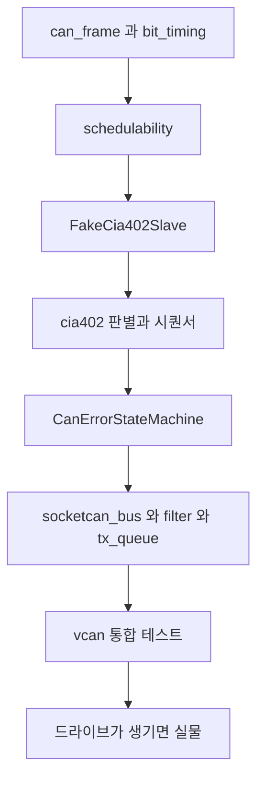

> **기준 출처:** 01편부터 15편까지를 코드로 옮긴 것이라 새 출처가 없다. Linux SocketCAN 커널 문서와 can-utils, 그리고 서보 드라이브 매뉴얼에 널리 공개된 CiA 402 FSM 과 비트 정의 / 확인일 2026-08-03
> **시리즈:** [목차](/posts/00-comm-series/) | 이전 → [15. CAN 디버깅](/posts/15-can-debugging-busload/)

---

## 1. 무엇을 만드나

이 폴더의 두 FSM 이 예제의 중심이다.

| 만들 것 | 근거 | 왜 |
| --- | --- | --- |
| `Cia402StateMachine` | [13편](/posts/13-cia402-drive-state-machine/) | 산업 표준 FSM 이고 Stateflow 와 대조할 소재다 |
| `CanErrorStateMachine` | [08편](/posts/08-can-error-states-busoff/) | 카운터 기반 FSM 이고 시뮬레이터로 검증한다 |
| `bit_timing.hpp` | [05편](/posts/05-can-bit-timing/) | 레지스터 값 계산과 제약 검증이다 |
| `schedulability.hpp` | [10편](/posts/10-can-bandwidth-worst-case/) | 부하율과 최악 응답 시간이다 |
| `CanTxQueue` | [14편](/posts/14-mcu-can-driver-mailbox-filter/) | 우선순위 역전을 막는다 |
| `CanFilter` | 14편 | 마스크 필터 설계와 검증이다 |
| SocketCAN 구현 | 14편 | 실물이다 |

`vcan` 덕에 실물 드라이브 없이도 CiA 402 시퀀스 전체를 검증할 수 있다. 이게 CAN 예제의 특별한 점이다.

## 2. 패키지 구조

```text
comm-examples/
└── comm_can/
    ├── include/comm_can/
    │   ├── can_frame.hpp          프레임과 스터핑 포함 길이
    │   ├── bit_timing.hpp         BRP 와 TSEG 와 SJW 및 제약 검증
    │   ├── schedulability.hpp     부하율과 최악 응답
    │   ├── can_bus.hpp            ICanBus 인터페이스
    │   ├── can_filter.hpp         마스크 필터
    │   ├── tx_queue.hpp           우선순위 송신 큐
    │   ├── bus_health.hpp         TEC 와 REC 감시 및 Bus Off 정책
    │   ├── canopen_sdo.hpp        SDO expedited
    │   └── cia402.hpp             상태 판별과 시퀀서
    ├── src/
    │   └── socketcan_bus.cpp      Linux SocketCAN
    └── test/
        ├── fake_can_bus.hpp
        ├── fake_cia402_slave.hpp  드라이브 대역
        ├── bit_timing_test.cpp
        ├── schedulability_test.cpp
        ├── cia402_test.cpp
        └── error_state_test.cpp
```

## 3. 가짜 드라이브가 슬레이브를 대신한다

```cpp
// test/fake_cia402_slave.hpp
// 13편의 전이 규칙대로 동작하는 가상 드라이브다.
// 폴트 주입까지 되어야 시퀀서의 예외 경로를 검증할 수 있다.
class FakeCia402Slave {
public:
    void apply_controlword(std::uint16_t cw) {
        const bool switch_on   = cw & 0x01;
        const bool en_voltage  = cw & 0x02;
        const bool quick_stop  = cw & 0x04;     // active low 다
        const bool en_op       = cw & 0x08;
        const bool fault_reset = cw & 0x80;

        // Fault reset 은 상승 엣지다. 13편의 함정을 그대로 구현한다
        const bool reset_edge = fault_reset && !prev_fault_reset_;
        prev_fault_reset_ = fault_reset;

        switch (state_) {
        case DriveState::Fault:
            if (reset_edge) state_ = DriveState::SwitchOnDisabled;
            break;
        case DriveState::SwitchOnDisabled:
            if (en_voltage && quick_stop && !switch_on)
                state_ = DriveState::ReadyToSwitchOn;
            break;
        case DriveState::ReadyToSwitchOn:
            if (switch_on && en_voltage && quick_stop) state_ = DriveState::SwitchedOn;
            else if (!en_voltage) state_ = DriveState::SwitchOnDisabled;
            break;
        case DriveState::SwitchedOn:
            if (en_op && switch_on && en_voltage && quick_stop)
                state_ = DriveState::OperationEnabled;
            else if (!switch_on)  state_ = DriveState::ReadyToSwitchOn;
            else if (!en_voltage) state_ = DriveState::SwitchOnDisabled;
            break;
        case DriveState::OperationEnabled:
            if (!quick_stop)      state_ = DriveState::QuickStopActive;
            else if (!en_op)      state_ = DriveState::SwitchedOn;
            else if (!en_voltage) state_ = DriveState::SwitchOnDisabled;
            break;
        default: break;
        }
    }

    std::uint16_t statusword() const {   // 13편의 마스크와 값 표대로 낸다
        switch (state_) {
        case DriveState::NotReadyToSwitchOn:  return 0x0000;
        case DriveState::SwitchOnDisabled:    return 0x0040;
        case DriveState::ReadyToSwitchOn:     return 0x0021;
        case DriveState::SwitchedOn:          return 0x0023;
        case DriveState::OperationEnabled:    return 0x0027;
        case DriveState::QuickStopActive:     return 0x0007;
        case DriveState::FaultReactionActive: return 0x000F;
        case DriveState::Fault:               return 0x0008;
        }
        return 0;
    }

    // 오류를 주입한다
    void inject_fault() { state_ = DriveState::Fault; }
    void set_stuck_in(DriveState s) { state_ = s; stuck_ = true; }   // 전이를 거부한다

    DriveState state() const { return state_; }

private:
    DriveState state_{DriveState::SwitchOnDisabled};
    bool prev_fault_reset_{false}, stuck_{false};
};
```

`prev_fault_reset_` 이 13편의 Fault reset 은 상승 엣지라는 규칙을 구현한다. 이게 있어야 `0x0080` 을 계속 유지하면 안 풀린다는 것을 테스트로 재현할 수 있다.

## 4. 무엇을 검증하나

### 상태 판별의 마스크가 겹치는 문제

```cpp
// 13편의 경고대로 마스크가 겹쳐 순서를 잘못 짜면 Fault 를 Operation Enabled 로 읽는다
TEST(Cia402, DecodeStateIsUnambiguous) {
    EXPECT_EQ(decode_state(0x0000), DriveState::NotReadyToSwitchOn);
    EXPECT_EQ(decode_state(0x0040), DriveState::SwitchOnDisabled);
    EXPECT_EQ(decode_state(0x0021), DriveState::ReadyToSwitchOn);
    EXPECT_EQ(decode_state(0x0023), DriveState::SwitchedOn);
    EXPECT_EQ(decode_state(0x0027), DriveState::OperationEnabled);
    EXPECT_EQ(decode_state(0x0007), DriveState::QuickStopActive);
    EXPECT_EQ(decode_state(0x000F), DriveState::FaultReactionActive);
    EXPECT_EQ(decode_state(0x0008), DriveState::Fault);
}

TEST(Cia402, FaultIsNotMistakenForOperationEnabled) {
    EXPECT_NE(decode_state(0x000F), DriveState::OperationEnabled);
    EXPECT_NE(decode_state(0x0008), DriveState::OperationEnabled);
}

TEST(Cia402, IgnoresUpperStatusBits) {
    // 상위 비트인 Warning 과 Remote 와 Target reached 가 서 있어도 판별이 같아야 한다
    EXPECT_EQ(decode_state(0x0027 | 0xFF00), DriveState::OperationEnabled);
    EXPECT_EQ(decode_state(0x0008 | 0x0600), DriveState::Fault);
}
```

### 시퀀서가 실제로 Operation Enabled 까지 올라가는가

```cpp
TEST(Cia402Bringup, ReachesOperationEnabled) {
    FakeCia402Slave slave;
    Cia402Bringup   seq;
    std::uint16_t cw = 0;
    std::uint64_t t  = 0;

    for (int cycle = 0; cycle < 50; ++cycle) {
        const auto r = seq.update(slave.statusword(), cw, t += 1);
        slave.apply_controlword(cw);
        if (r == Cia402Bringup::Result::Reached) break;
    }
    EXPECT_EQ(slave.state(), DriveState::OperationEnabled);
}

TEST(Cia402Bringup, FollowsSpecifiedTransitionOrder) {
    // 중간 상태를 건너뛰지 않는지 확인한다
    FakeCia402Slave slave;
    Cia402Bringup   seq;
    std::vector<DriveState> visited;
    std::uint16_t cw = 0; std::uint64_t t = 0;
    for (int i = 0; i < 50; ++i) {
        if (visited.empty() || visited.back() != slave.state())
            visited.push_back(slave.state());
        if (seq.update(slave.statusword(), cw, t += 1) == Cia402Bringup::Result::Reached)
            break;
        slave.apply_controlword(cw);
    }
    const std::vector<DriveState> expect{
        DriveState::SwitchOnDisabled, DriveState::ReadyToSwitchOn,
        DriveState::SwitchedOn,       DriveState::OperationEnabled};
    EXPECT_EQ(visited, expect);
}
```

### Fault reset 이 상승 엣지인가

```cpp
TEST(Cia402Bringup, FaultResetRequiresRisingEdge) {
    FakeCia402Slave slave;
    slave.inject_fault();
    ASSERT_EQ(slave.state(), DriveState::Fault);

    // 0x0080 을 계속 유지하면 안 풀린다
    for (int i = 0; i < 10; ++i) slave.apply_controlword(0x0080);
    EXPECT_EQ(slave.state(), DriveState::Fault);

    // 0x0000 다음 0x0080 으로 상승 엣지를 만든다
    slave.apply_controlword(0x0000);
    slave.apply_controlword(0x0080);
    EXPECT_EQ(slave.state(), DriveState::SwitchOnDisabled);
}

TEST(Cia402Bringup, SequencerGeneratesRisingEdge) {
    FakeCia402Slave slave;
    slave.inject_fault();
    Cia402Bringup seq;
    std::uint16_t cw = 0; std::uint64_t t = 0;
    for (int i = 0; i < 50; ++i) {
        seq.update(slave.statusword(), cw, t += 1);
        slave.apply_controlword(cw);
        if (slave.state() != DriveState::Fault) break;
    }
    EXPECT_NE(slave.state(), DriveState::Fault);      // 폴트가 풀렸다
}

TEST(Cia402Bringup, GivesUpAfterRepeatedFaults) {
    // 무한 리셋은 위험하니 N회 후 포기하는지 본다
    class AlwaysFaultSlave : public FakeCia402Slave { /* 리셋해도 다시 Fault 로 간다 */ };
    AlwaysFaultSlave slave;
    Cia402Bringup    seq;
    std::uint16_t cw = 0; std::uint64_t t = 0;
    Cia402Bringup::Result r{};
    for (int i = 0; i < 200; ++i) {
        r = seq.update(slave.statusword(), cw, t += 1);
        slave.apply_controlword(cw);
        if (r == Cia402Bringup::Result::FaultLatched) break;
    }
    EXPECT_EQ(r, Cia402Bringup::Result::FaultLatched);
}

TEST(Cia402Bringup, TimesOutIfStateNeverAdvances) {
    FakeCia402Slave slave;
    slave.set_stuck_in(DriveState::ReadyToSwitchOn);   // 전이를 거부한다
    Cia402Bringup seq;
    std::uint16_t cw = 0; std::uint64_t t = 0;
    Cia402Bringup::Result r{};
    for (int i = 0; i < 5000; ++i) {
        r = seq.update(slave.statusword(), cw, t += 1);
        if (r == Cia402Bringup::Result::Timeout) break;
    }
    EXPECT_EQ(r, Cia402Bringup::Result::Timeout);      // 진단의 근거가 된다
}
```

이 네 테스트가 13편의 함정을 전부 코드로 못박는다. 특히 뒤의 둘은 실물에서 재현하기 어려운 상황인 폴트 반복과 전이 거부를 테스트로 만든다.

### 오류 FSM

```cpp
// 08편의 8 대 1 비대칭을 시뮬레이터로 검증한다
TEST(CanErrorState, IntermittentNoiseDoesNotChangeState) {
    CanErrorStateMachine sm;
    // 오류율 0.5% 라 200 프레임에 1개다. 계산상 상태가 안 바뀌어야 한다
    for (int i = 0; i < 10'000; ++i) {
        if (i % 200 == 0) sm.on_transmit_error(); else sm.on_transmit_success();
    }
    EXPECT_EQ(sm.state(), CanState::ErrorActive);
    EXPECT_LT(sm.tec(), 32u);
}

TEST(CanErrorState, PersistentFaultReachesBusOff) {
    CanErrorStateMachine sm;
    for (int i = 0; i < 32; ++i) sm.on_transmit_error();     // 8 곱하기 32 로 256 이다
    EXPECT_EQ(sm.state(), CanState::BusOff);
}

TEST(CanErrorState, ReceiveErrorsNeverCauseBusOff) {
    // 08편에서 다룬 내용이다. REC 로는 Bus Off 가 안 된다
    CanErrorStateMachine sm;
    for (int i = 0; i < 100'000; ++i) sm.on_receive_error();
    EXPECT_EQ(sm.state(), CanState::ErrorPassive);
}

TEST(CanErrorState, LoneNodeStopsAtErrorPassive) {
    // 08편의 규격 예외다. 혼자 있는 노드는 Bus Off 로 가지 않는다
    CanErrorStateMachine sm;
    for (int i = 0; i < 100; ++i) sm.on_ack_error_while_alone();
    EXPECT_EQ(sm.state(), CanState::ErrorPassive);
}
```

### 비트 타이밍과 스케줄 가능성

```cpp
TEST(BitTiming, Example500kAt40MHz) {
    constexpr CanBitTiming t{.brp=5, .prop_seg=10, .phase_seg1=3, .phase_seg2=2, .sjw=2};
    static_assert(t.valid());
    static_assert(t.total_tq() == 16);
    static_assert(t.bitrate(40'000'000) == 500'000);
    EXPECT_NEAR(t.sample_point_pct(), 87.5, 0.1);
}

TEST(BitTiming, RejectsSjwLargerThanPhaseSegments) {
    constexpr CanBitTiming bad{.brp=5, .prop_seg=10, .phase_seg1=3, .phase_seg2=2, .sjw=4};
    EXPECT_FALSE(bad.valid());       // SJW 는 Phase1 과 Phase2 의 최솟값 이하여야 한다
}

TEST(BitTiming, CrystalMeetsToleranceButRcDoesNot) {
    constexpr CanBitTiming t{.brp=5, .prop_seg=10, .phase_seg1=3, .phase_seg2=2, .sjw=2};
    const double tol = max_clock_tolerance(t);        // 약 0.485% 다
    EXPECT_GT(tol, 50e-6);                            // 크리스탈 ±50 ppm 은 통과한다
    EXPECT_LT(tol, 0.01);                             // 내부 RC ±1% 는 통과하지 못한다
}

TEST(Schedulability, SixAxisAt1kHzExceedsCanCapacity) {
    // 10편의 결론을 코드로 못박는다. 부하율이 162% 다
    std::vector<CanMessage> msgs;
    for (int a = 0; a < 6; ++a) {
        msgs.push_back({.id=0x100u+a, .dlc=8, .extended=false, .period_us=1000});
        msgs.push_back({.id=0x180u+a, .dlc=8, .extended=false, .period_us=1000});
    }
    EXPECT_GT(bus_load(msgs, 1'000'000), 1.0);        // 100% 를 넘어 불가능하다
}

TEST(Schedulability, HighestPriorityStillSuffersBlocking) {
    // 최우선 메시지도 최대 프레임 하나를 기다린다
    std::vector<CanMessage> msgs{
        {.id=0x001, .dlc=2, .extended=false, .period_us=10000},
        {.id=0x700, .dlc=8, .extended=false, .period_us=100000},
    };
    const auto r = worst_case_response(msgs, 0, 500'000, 2.0);
    ASSERT_TRUE(r);
    EXPECT_GT(*r, 270.0);        // 블로킹 270 µs 때문에 자기 전송시간보다 훨씬 크다
}
```

## 5. vcan 으로 통합 테스트

```bash
sudo modprobe vcan
sudo ip link add dev vcan0 type vcan
sudo ip link set up vcan0
```

```cpp
// test/integration/cia402_over_vcan_test.cpp
// 실제 SocketCAN 을 통해 시퀀서와 가상 드라이브를 대화시킨다.
// 프레임 조립과 필터와 송수신까지 전부 실제 경로를 탄다.
TEST(Integration, BringsUpDriveOverVcan) {
    SocketCanBus master, slave_side;
    ASSERT_TRUE(master.open("vcan0", kMasterFilters));
    ASSERT_TRUE(slave_side.open("vcan0", kSlaveFilters));

    FakeCia402Node node{slave_side, /*node_id=*/1};   // 별도 스레드에서 응답한다
    std::thread node_thread([&]{ node.run(); });

    Cia402Driver drive{master, /*node_id=*/1};
    EXPECT_TRUE(drive.bring_up(std::chrono::seconds{2}));
    EXPECT_EQ(drive.state(), DriveState::OperationEnabled);

    node.stop(); node_thread.join();
}
```

이게 CAN 예제의 특별한 점이다. 다른 프로토콜은 fake 인터페이스까지가 한계인데 CAN 은 `vcan` 덕에 커널 스택을 포함한 전 경로를 하드웨어 없이 검증할 수 있다. CI 에서도 돈다. GitHub Actions 의 ubuntu 러너에서 `modprobe vcan` 이 가능하다.

## 6. 만드는 순서



세 번째와 네 번째가 이 예제가 노린 것이고, Stateflow 로 같은 FSM 을 그려서 같은 입력 시퀀스로 출력을 비교하면 Stateflow 공부와 직접 이어진다.

## 정리

- 이 폴더의 두 FSM 인 CiA 402 와 CAN 오류 FSM 이 예제의 중심이다.
- `FakeCia402Slave` 가 13편의 전이 규칙을 그대로 구현한다. 특히 Fault reset 상승 엣지가 중요하다.
- 상태 판별 마스크가 겹치지 않는지 검증한다. Fault 를 Operation Enabled 로 읽는 사고를 막는다.
- 시퀀서가 중간 상태를 건너뛰지 않는지 확인한다.
- Fault reset 이 상승 엣지인지, 유지하면 안 풀린다는 것을 테스트로 재현한다.
- 폴트 반복 시 포기하고 전이 거부 시 타임아웃이 나는지 본다. 실물로 만들기 어려운 상황이다.
- 오류 FSM 의 비대칭을 검증한다. 오류율 0.5% 는 통과하고 지속 고장은 Bus Off 가 되며 REC 로는 Bus Off 가 안 된다.
- 비트 타이밍 제약과 크리스탈은 되고 RC 는 안 되는 것을 확인한다.
- 6축 1 kHz 부하율 162% 를 코드로 못박는다.
- `vcan` 으로 커널 스택을 포함한 전 경로를 하드웨어 없이 검증한다. CAN 예제만의 이점이고 CI 에서도 돈다.
- 같은 FSM 을 Stateflow 로도 그려서 출력을 비교하면 Stateflow 공부와 직접 이어진다.

## 참고

- [Linux SocketCAN 커널 문서](https://www.kernel.org/doc/html/latest/networking/can.html)
- [can-utils](https://github.com/linux-can/can-utils)
- [CiA — CiA 402 개요](https://www.can-cia.org/can-knowledge/canopen/cia402)
