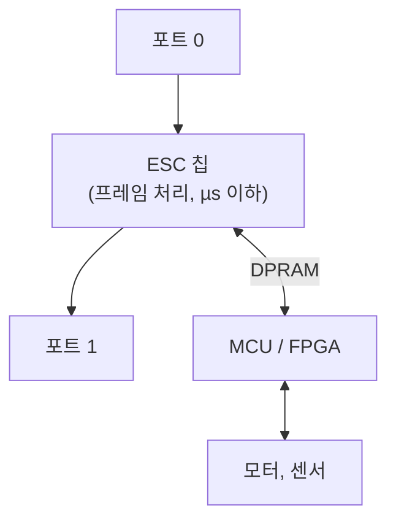

> **기준 출처:** [ETG EtherCAT Technology](https://www.ethercat.org/en/technology.html) · IEC 61158 Type 12 · ESC 데이터시트 공개 사양 · [SOEM](https://github.com/OpenEtherCATsociety/SOEM) / 확인일 2026-08-03
> **시리즈:** [목차](/posts/00-comm-series/) | 이전 → [01. 왜 이더넷 위에 필드버스인가](/posts/01-why-fieldbus-on-ethernet/) | 다음 → [03. 토폴로지와 물리계층](/posts/03-topology-mii-ebus/)

## 1. 한 문장

**프레임을 받아서 처리하고 다시 보내는 게 아니라, 프레임이 지나가는 동안 읽고 쓴다.**

기존 store-and-forward 방식은 수신 완료 → 처리 → 송신 시작 순서로 간다. 프레임 길이만큼 받고, 처리 지연이 붙고, 다시 프레임 길이만큼 보낸다.

EtherCAT는 수신이 시작되는 순간부터 송신이 진행된다. 지나가는 동안 읽고 쓰기 때문에 지연이 슬레이브 하나당 약 0.5 µs이고 프레임 길이와 무관하다.

[이더넷 02편](/posts/02-ethernet-switch-queue-delay/)의 cut-through 스위치와 발상이 같지만 한 걸음 더 간다. 스위치는 프레임을 그대로 전달하는데 EtherCAT 슬레이브는 내용을 실시간으로 고쳐 쓴다.

## 2. 실제로 무슨 일이 일어나나

프레임 안에는 Datagram들이 들어 있고 각각에 주소와 데이터가 있다. 슬레이브의 ESC 칩은 프레임이 흘러 들어오는 동안 이 순서로 동작한다.

1. 비트가 들어온다
2. Datagram 헤더를 파싱한다 (명령, 주소, 길이)
3. 이 주소가 내 것인가 판단한다
4. 내 것이면 처리한다. 읽기 명령이면 내 메모리 값을 프레임에 써 넣고(지나가는 데이터를 덮어쓴다), 쓰기 명령이면 프레임의 데이터를 내 메모리에 저장한다. 그리고 WKC를 +1 한다
5. 비트가 다음 포트로 나간다

2번부터 4번까지가 비트가 흘러가는 동안 파이프라인으로 일어난다. 프레임을 버퍼에 다 모으지 않는다.

### 왜 하드웨어여야 하나

100 Mbps에서 1비트가 10 ns, 1바이트가 80 ns다.

Datagram 헤더 10바이트를 파싱하는 데 800 ns밖에 없고 그 안에 주소 비교와 메모리 접근 준비가 끝나야 한다. 그리고 데이터 바이트가 흘러가는 80 ns마다 메모리에 읽고 써야 한다.

MCU로는 불가능하다. 168 MHz Cortex-M4에서 80 ns는 13 사이클이다. 인터럽트 진입만으로도 넘는다.

그래서 ESC(EtherCAT Slave Controller)라는 전용 칩이 있다. 대개 ASIC 또는 FPGA IP 코어다. 슬레이브의 MCU는 ESC의 DPRAM만 읽고 쓰면 되고 통신 자체에는 관여하지 않는다.

이 분리가 설계를 단순하게 만든다. 슬레이브 개발자는 EtherCAT 프로토콜을 몰라도 되고 DPRAM의 정해진 자리를 읽고 쓰기만 하면 된다. SPI로 칩을 다루는 것과 비슷한 수준의 일이 된다.

## 3. 논리적 링, 물리적 라인

프레임이 슬레이브들을 순서대로 통과하고 마지막에서 되돌아와 마스터로 돌아온다.

| 방향 | 무슨 일 |
| --- | --- |
| 가는 길 | 모든 처리가 여기서. 읽고 쓰고 WKC 증가 |
| 오는 길 | 아무것도 안 한다. 그냥 통과시킨다 |

가는 길에만 처리한다는 것이 중요하다. 그래서 슬레이브의 순서가 곧 프레임 안의 데이터 배치 순서가 되고 주소 지정이 단순해진다.

되돌아오는 지점은 자동으로 정해진다. 마지막 슬레이브의 다음 포트에 아무것도 안 꽂혀 있으면 ESC가 그 포트를 닫고 프레임을 되돌린다. 케이블을 하나 뽑으면 그 지점이 새 끝이 된다. 그래서 케이블이 끊겨도 앞쪽 절반은 계속 동작한다.

## 4. 지연 계산

| 항목 | 크기 |
| --- | --- |
| 프레임 전송 시간 | (바이트 × 8) / 100 Mbps |
| 슬레이브 통과 지연 | 슬레이브당 약 0.5 µs (칩과 포트 수에 따라 다름) |
| 케이블 전파 | 5 ns/m |
| 마스터 처리 | 소프트웨어 (15편) |

슬레이브 20개, 프로세스 데이터 총 200바이트, 케이블 총 100 m로 계산한다.

| 항목 | 계산 | 시간 |
| --- | --- | --- |
| 프레임 (38 + 2 + 12 + 200 = 252 B) | 252 × 8 / 100 Mbps | 20.2 µs |
| 슬레이브 통과 (왕복이므로 ×2) | 20 × 0.5 µs × 2 | 20 µs |
| 케이블 전파 (왕복) | 100 m × 5 ns/m × 2 | 1 µs |
| 네트워크 왕복 합계 | | 약 41 µs |

네트워크만 보면 41 µs다. 1 kHz 주기의 4%이고 10 kHz(100 µs)도 가능하다. 슬레이브를 40개로 늘리면 프레임이 길어지고(+16 µs) 통과 지연이 늘어(+20 µs) 약 77 µs다. 여전히 1 kHz는 여유롭다.

다만 실제 사이클 시간은 마스터 소프트웨어가 지배한다. 네트워크가 41 µs여도 OS 지터가 200 µs면 그게 한계다.

### 확장성 비교

슬레이브 N개, 각 10바이트일 때다.

| N | CAN 1 Mbps (프레임 N개) | EtherCAT (프레임 1개) |
| --- | --- | --- |
| 5 | 675 µs | 8.2 µs |
| 10 | 1350 µs | 12.2 µs |
| 20 | 2700 µs | 20.2 µs |
| 40 | 5400 µs | 36.2 µs |

CAN은 선형으로 폭발하고 EtherCAT는 완만하게 는다. 기울기가 다른 이유는 CAN이 노드마다 고정 오버헤드 47비트를 새로 내는 반면 EtherCAT는 한 번 낸 오버헤드를 전부가 나눠 쓰기 때문이다.

## 5. 여섯 칸의 ⑥번을 어떻게 채우나

| 문제 | 표준 이더넷 | EtherCAT |
| --- | --- | --- |
| 스위치 큐잉 | 최악 984 µs | 스위치가 없다 |
| 우선순위 경쟁 | 상한 없음 | 프레임이 하나뿐이라 경쟁이 없다 |
| TCP/IP 지연 | 최악 200 ms | IP와 TCP를 안 쓴다 |
| 프레임 개수 | 노드에 비례 | 항상 1개 |
| 최악 지연 | 계산 불가 | 계산 가능 |

"최악 지연이 계산 가능하다" 가 [기초 10편](/posts/10-basics-realtime-jitter/)에서 정의한 실시간이었다. EtherCAT가 그걸 어떻게 달성했는지는 이제 명확하다. 불확정성의 원천을 하나씩 제거했다. 남은 불확정성은 마스터 소프트웨어뿐이고 그건 15편의 RT 커널로 다룬다.

## 6. on-the-fly가 만든 새 문제들

공짜가 아니다. 이 방식 때문에 새로운 문제가 생기고 그걸 푸는 게 나머지 편들이다.

| 새 문제 | 해결책 | 편 |
| --- | --- | --- |
| 각 슬레이브가 프레임의 어느 자리가 자기 것인지 알아야 | 주소 지정 | 05 |
| 마스터가 슬레이브마다 다른 주소를 다뤄야 하는 부담 | FMMU가 논리 주소를 접는다 | 06 |
| 지나가는 순간 메모리를 바꾸면 MCU가 읽는 중일 수 있다 | SyncManager (3버퍼) | 07 |
| 모두가 제대로 처리했는지 마스터가 알아야 | WKC | 04 |
| 데이터가 도착해도 반영 시점이 다르다 | 분산 클록(DC) | 09 |
| 설정 중에 프로세스 데이터가 흐르면 위험 | ESM | 08 |
| 비주기 데이터(파라미터)를 어떻게 | 메일박스 | 07·11 |

### 특히 중요한 것, 도착과 반영은 다르다

프레임이 슬레이브 1을 지나 슬레이브 20에 도착하기까지 약 20 µs 차이가 난다. 슬레이브 1이 t=0에 받으면 슬레이브 10은 t=10 µs, 슬레이브 20은 t=20 µs에 받는다.

각자 받자마자 출력에 반영하면 20 µs의 시차가 생긴다. [SPI 07편](/posts/07-spi-multislave-cs-daisy/)에서 본 "6축 개별 CS 읽기의 33 µs 시차" 와 같은 문제다.

그래서 DC가 필요하다. 받는 시점과 반영하는 시점을 분리해서 모두가 정해진 시각에 동시에 반영한다. 대역폭 문제를 푼 게 on-the-fly라면 동시성 문제를 푼 게 DC다. 둘이 합쳐져야 EtherCAT가 완성된다.

## 정리

- on-the-fly는 프레임을 받아 처리하고 보내는 게 아니라 지나가는 동안 읽고 쓰는 것이다
- 이더넷 02편의 cut-through와 발상이 같지만 한 걸음 더 간다. 스위치는 전달만 하고 EtherCAT는 내용을 고쳐 쓴다
- 100 Mbps에서 1바이트가 80 ns라 소프트웨어로 불가능하고 전용 ESC 칩이 필요하다
- ESC와 MCU의 분리가 슬레이브 개발을 단순하게 만든다. MCU는 DPRAM만 보면 된다
- 논리적 링, 물리적 라인. 가는 길에서만 처리하고 오는 길은 통과한다. 끝 포트는 자동으로 닫혀 되돌린다
- 슬레이브 20개에 200바이트, 100 m면 네트워크 왕복 약 41 µs로 1 kHz의 4%다
- 확장성이 CAN과 근본적으로 다르다. CAN은 노드마다 고정 오버헤드를 새로 내고 EtherCAT는 한 번 낸 것을 나눠 쓴다
- ⑥ 시간 칸을 채운 방법은 불확정성의 원천 제거다. 남은 것은 마스터 소프트웨어뿐이다
- 도착과 반영은 다르다. 슬레이브 1과 20 사이에 20 µs 시차가 있고 그것을 DC가 푼다

## 참고

- [ETG — EtherCAT Technology](https://www.ethercat.org/en/technology.html)
- [SOEM — Simple Open EtherCAT Master](https://github.com/OpenEtherCATsociety/SOEM)
