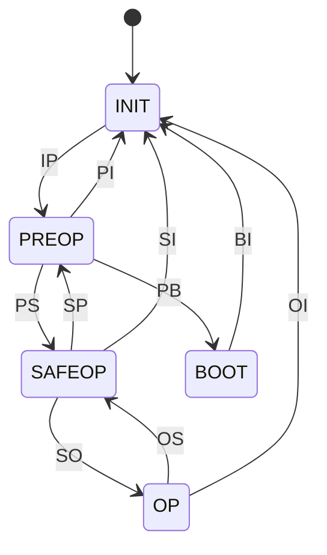
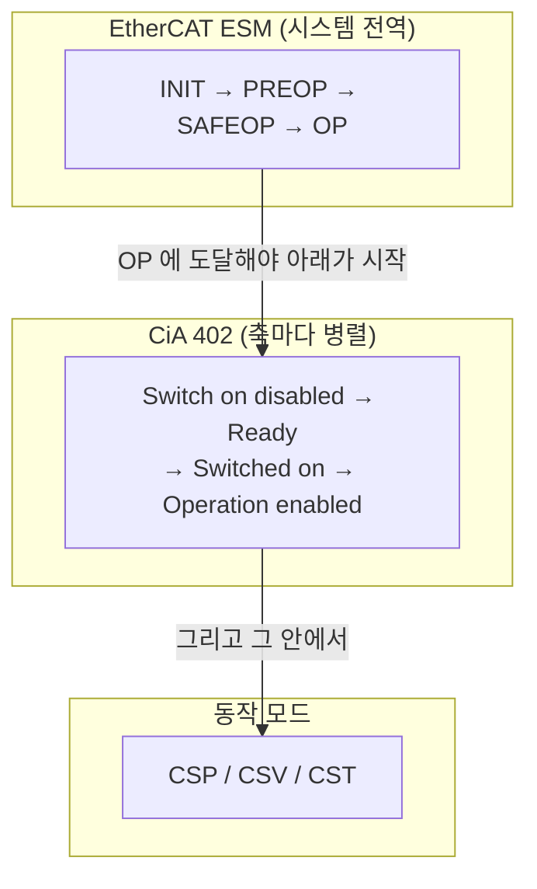

> **기준 출처:** [ETG EtherCAT Technology](https://www.ethercat.org/en/technology.html) · ESC 데이터시트 공개 사양(AL Control 0x0120, AL Status 0x0130, AL Status Code 0x0134) · ETG.1020 · [SOEM](https://github.com/OpenEtherCATsociety/SOEM) `ethercatmain.c` / 확인일 2026-08-03
> **시리즈:** [목차](/posts/00-comm-series/) | 이전 → [07. SyncManager](/posts/07-syncmanager-buffer-mailbox/) | 다음 → [09. 분산 클록(DC)](/posts/09-distributed-clocks/)

## 1. 왜 상태가 필요한가

07편에서 예고한 문제다. PDO 매핑을 바꾸면 SM 크기가 바뀌고 FMMU도 다시 설정해야 한다. 그런데 그 작업 중에 프로세스 데이터가 흐르고 있으면 슬레이브가 절반만 바뀐 설정으로 데이터를 해석한다. 위치 명령이 엉뚱하게 읽히고 모터가 튄다.

ESM(EtherCAT State Machine)이 순서를 강제한다. [CAN 11편](/posts/11-canopen-od-nmt/)의 CANopen NMT와 같은 발상이다. 설정은 Pre-op에서, 운전은 Operational에서. 다만 EtherCAT는 여기에 한 단계를 더 넣었다.

## 2. 네 개 더하기 하나의 상태



| 상태 | 메일박스 | 프로세스 데이터 입력 | 프로세스 데이터 출력 |
| --- | --- | --- | --- |
| INIT | 불가 | 불가 | 불가 |
| PREOP | 가능 | 불가 | 불가 |
| SAFEOP | 가능 | 유효 | 무시된다 |
| OP | 가능 | 유효 | 유효 |
| BOOT | FoE만 | 불가 | 불가 |

## 3. SAFEOP이 존재하는 이유

이게 EtherCAT ESM의 가장 중요한 설계다. CANopen NMT에는 없는 단계다.

**SAFEOP은 입력은 읽히지만 출력은 무시되는 상태다.**

이 중간 단계에서 마스터가 할 수 있는 일이 다섯 가지다.

1. 프로세스 데이터가 제대로 오는지 확인한다 (WKC, 값의 타당성)
2. 현재 위치를 읽어서 목표 위치를 그 값으로 초기화한다
3. 슬레이브가 폴트 상태는 아닌지 확인한다
4. 사이클이 안정적으로 도는지 확인한다 (지터 측정)
5. DC 동기가 잡혔는지 확인한다

2번이 결정적이다. [CAN 13편](/posts/13-cia402-drive-state-machine/)에서 본 "CSP 진입 전 Target position을 현재 위치로" 문제를 여기서 해결한다.

SAFEOP에서 출력이 무시되므로 목표 위치가 0이어도 축이 움직이지 않는다. 그동안 현재 위치를 읽어 목표를 맞춰놓고 그다음에 OP로 올린다. 축이 급이동하지 않는다. SAFEOP 없이 바로 OP로 가면 첫 프레임의 목표 위치(초기값 0)를 슬레이브가 즉시 반영한다.

### 되돌아올 때도 중요하다

슬레이브가 문제를 감지하면 스스로 SAFEOP로 내려간다. SM 워치독 만료, DC 동기 상실, 내부 오류가 트리거다.

OP에서 SAFEOP로 내려가는 것이 안전 동작이다. 출력이 즉시 무효화되고 슬레이브는 자기 안전 상태로 간다. 그리고 입력은 계속 보내니 마스터가 상황을 볼 수 있다. [CAN 08편](/posts/08-can-error-states-busoff/)의 Error Passive와 같은 발상이다. 의심스러우면 영향력을 줄이되 완전히 죽지는 않는다.

## 4. 전이별로 무슨 일이 일어나나

| 전이 | 이름 | 마스터가 하는 일 |
| --- | --- | --- |
| IP | INIT → PREOP | 메일박스 SM(SM0/SM1) 설정 |
| PS | PREOP → SAFEOP | PDO 매핑 확정, 프로세스 데이터 SM 설정, FMMU 설정, DC 설정 |
| SO | SAFEOP → OP | 프로세스 데이터를 주기적으로 보내기 시작 |
| SP, OS, SI, OI, PI | 역방향 | 상태를 낮춘다 |
| PB | PREOP → BOOT | 펌웨어 업데이트 (FoE) |

PS 전이가 가장 무겁다. 여기서 대부분의 설정 오류가 드러나고 그래서 SAFEOP 전이 실패가 가장 흔한 문제다.

### SO 전이의 조건

SAFEOP에서 OP로 가는 것은 마스터가 명령한다고 되는 게 아니다. 슬레이브가 "유효한 프로세스 데이터 출력을 받고 있다" 고 판단해야 OP로 올라간다.

그래서 순서가 이렇다. 마스터가 프로세스 데이터를 주기적으로 보내기 시작하고, 몇 사이클 실행하고, 그다음에 OP 전이를 명령하고, 계속 프로세스 데이터를 보내면서 상태를 확인한다.

두 번째 단계를 빼먹고 바로 OP를 명령하면 실패한다. SOEM 예제 코드가 이 순서를 지키는 이유다.

## 5. 레지스터와 코드

| 레지스터 | 이름 | 용도 |
| --- | --- | --- |
| `0x0120` | AL Control | 마스터가 원하는 상태를 쓴다 |
| `0x0130` | AL Status | 슬레이브의 현재 상태 |
| `0x0134` | AL Status Code | 실패 이유 |

상태 값은 INIT=1, PREOP=2, BOOT=3, SAFEOP=4, OP=8이다. AL Status의 bit4(`0x10`)가 서면 전이 실패이고 `0x0134` 에 이유가 있다.

```cpp
// comm_ethercat/esm.hpp
enum class EsmState : std::uint8_t {
    Init = 1, PreOp = 2, Boot = 3, SafeOp = 4, Op = 8,
};
inline constexpr std::uint16_t kAlStatusErrorBit = 0x10;

bool go_to_operational(std::uint32_t settle_cycles) {
    // ① SAFEOP 확인
    ec_slave[0].state = static_cast<uint16>(EsmState::SafeOp);
    ec_writestate(0);
    if (ec_statecheck(0, EC_STATE_SAFE_OP, EC_TIMEOUTSTATE * 4)
        != EC_STATE_SAFE_OP) {
        log_esm_failure();
        return false;
    }

    // ② 목표값을 현재값으로 초기화 (축 튐 방지)
    initialize_targets_from_actuals();

    // ③ 프로세스 데이터를 먼저 몇 사이클 실행한다
    for (std::uint32_t i = 0; i < settle_cycles; ++i) {
        ec_send_processdata();
        ec_receive_processdata(EC_TIMEOUTRET);
        wait_next_cycle();
    }

    // ④ OP 전이 명령
    ec_slave[0].state = static_cast<uint16>(EsmState::Op);
    ec_writestate(0);

    // ⑤ 전이하는 동안에도 계속 프로세스 데이터를 보낸다
    for (int retry = 0; retry < 200; ++retry) {
        ec_send_processdata();
        ec_receive_processdata(EC_TIMEOUTRET);
        ec_statecheck(0, EC_STATE_OPERATIONAL, 50000);
        if (ec_slave[0].state == EC_STATE_OPERATIONAL) return true;
        wait_next_cycle();
    }
    log_esm_failure();
    return false;
}
```

③과 ⑤가 초보자가 가장 많이 빼먹는 부분이다. "명령을 보냈는데 왜 OP가 안 되지" 의 답이 대개 여기 있다.

## 6. AL Status Code, 실패 이유를 읽는다

전이가 실패하면 `0x0134` 에 코드가 남는다. 이게 EtherCAT 디버깅의 핵심이다.

| 코드 | 뜻 | 대개의 원인 |
| --- | --- | --- |
| `0x0011` | 잘못된 요청 상태 변경 | 순서를 건너뛰었다 |
| `0x0012` | 알 수 없는 요청 상태 | |
| `0x0014` | 부트스트랩 없음 또는 SII 오류 | ESI나 EEPROM 문제 |
| `0x0016` | 유효하지 않은 메일박스 설정 | SM0/SM1 |
| `0x0017` | 유효하지 않은 SM 설정 | SAFEOP 실패 1순위. SM 크기가 PDO 매핑과 안 맞다 |
| `0x0018` | 유효하지 않은 SM (출력) | |
| `0x0019` | 유효하지 않은 SM (입력) | |
| `0x001A` | 워치독 타임아웃 | 프로세스 데이터가 안 온다 |
| `0x001B` | SM 워치독 | |
| `0x001D` | 유효하지 않은 출력 설정 | |
| `0x001E` | 유효하지 않은 입력 설정 | |
| `0x0024` | PDO 매핑 오류 | 매핑 객체 설정 (10편) |
| `0x0025` | PDO 설정 오류 | |
| `0x0026` | PDO 길이 오류 | 매핑 크기와 SM 크기가 다르다 |
| `0x002C` | DC 무효 동기 설정 | 09편 |
| `0x002D` | DC 동기 설정 안 됨 | |
| `0x0030` | DC 동기 실패 | DC가 안 잡혔다 |
| `0x0035` | DC 동기 상실 | |
| `0x0050` 이상 | 슬레이브 고유 오류 | 매뉴얼 확인 |

`0x0017`(SM 설정)과 `0x0024`(PDO 매핑)가 SAFEOP 실패의 대부분이다. 둘 다 매핑과 SM 크기가 안 맞는다는 같은 뿌리다. `0x001A` 와 `0x001B`(워치독)는 OP 유지 실패의 대부분이고 마스터의 사이클이 불안정하거나 멈춘 것이다.

### 실패를 제대로 로그로

```cpp
void log_esm_failure() {
    ec_readstate();     // 모든 슬레이브의 상태를 읽는다
    for (int i = 1; i <= ec_slavecount; ++i) {
        if (ec_slave[i].state != EC_STATE_OPERATIONAL) {
            log_error("슬레이브 %d (%s): state=0x%02X  "
                      "AL Status Code=0x%04X (%s)",
                      i, ec_slave[i].name,
                      ec_slave[i].state,
                      ec_slave[i].ALstatuscode,
                      ec_ALstatuscode2string(ec_slave[i].ALstatuscode));
        }
    }
}
```

`ec_ALstatuscode2string()` 이 코드를 사람이 읽는 문장으로 바꿔준다. 이걸 안 쓰고 숫자만 로그에 남기면 매번 표를 찾아야 한다.

그리고 "어느 슬레이브가" 를 반드시 같이 남긴다. 04편에서 봤듯 WKC는 개수만 알려준다. `ec_readstate()` 로 개별 상태를 읽어야 범인이 나온다.

## 7. FSM 세 개가 겹친다

이게 이 폴더에서 가장 중요한 구조적 통찰이다.



ESM은 통신이 준비됐는지, CiA 402는 모터가 준비됐는지, 동작 모드는 무슨 명령을 받는지를 나타낸다.

초보자가 가장 많이 막히는 지점이 이 겹침이다. "OP인데 축이 움직이지 않는다" 의 답은 CiA 402가 아직 Switch on disabled에 있다는 것이다. CAN 11편에서 CANopen을 두고 본 것과 같은 문제이고 EtherCAT에서는 층이 하나 더 있다.

Stateflow로 그린다면 이 셋을 계층과 병렬로 표현하는 게 좋은 연습이다. ESM은 시스템 전역이고 CiA 402는 축마다 병렬(AND) 상태다.

### FSM 설계 관점에서

CAN 08편(오류 상태), CAN 13편(CiA 402)에 이어 세 번째 산업 표준 FSM이다. 그리고 이건 앞의 둘과 성격이 또 다르다.

| 특징 | 배울 수 있는 것 |
| --- | --- |
| 상태 5개, 전이가 대부분 양방향 | 대칭 전이의 표현 |
| 전이마다 다른 설정 작업 | transition action (전이 중 동작) |
| 전이가 실패할 수 있다 | 실패 시 되돌아가는 경로 |
| 슬레이브가 스스로 내려온다 | 양쪽에서 트리거되는 전이 |
| 상태별로 허용되는 통신이 다르다 | 상태별 가드 조건 |

## 8. 진단 요약

| 증상 | 확인 |
| --- | --- |
| PREOP에서 안 올라간다 | AL Status Code, 대개 `0x0016`(메일박스 SM) |
| SAFEOP에서 안 올라간다 | 가장 흔하다. `0x0017`, `0x0024`, `0x0026` = SM과 PDO 매핑 |
| OP에서 안 올라간다 | 프로세스 데이터를 안 보내고 있다, 또는 DC(`0x0030`) |
| OP였다가 SAFEOP로 떨어진다 | 워치독(`0x001A`). 마스터 사이클이 불안정 |
| 일부 슬레이브만 안 올라간다 | `ec_readstate()` 로 개별 확인 |
| OP인데 축이 움직이지 않는다 | CiA 402 상태를 확인한다. 다른 FSM이다 |

## 정리

- ESM이 설정 순서를 강제한다. 프로세스 데이터가 흐르는 중에 매핑을 바꾸면 위험하기 때문이다
- CANopen NMT와 같은 발상이지만 EtherCAT는 SAFEOP을 추가했다
- SAFEOP은 입력은 유효하고 출력은 무시된다. 마스터가 데이터를 확인하고 목표값을 현재값으로 초기화할 수 있어 축이 급이동하지 않는다
- 슬레이브가 문제를 감지하면 스스로 SAFEOP로 내려온다. CAN Error Passive와 같은 발상이다
- PS 전이(PREOP에서 SAFEOP)가 가장 무겁고 실패도 여기서 가장 많다
- SO 전이는 프로세스 데이터를 이미 보내고 있어야 성공한다. 명령만 보내면 실패한다
- AL Status Code(`0x0134`)가 실패 이유를 알려준다. `0x0017`, `0x0024`, `0x0026` 이 SAFEOP 실패 1순위이고 `0x001A`, `0x001B` 가 OP 유지 실패 1순위다
- `ec_ALstatuscode2string()` 으로 문자열까지 로그에 남기고 어느 슬레이브인지 반드시 적는다
- FSM 세 개가 겹친다. ESM(통신), CiA 402(모터), 동작 모드(명령)
- "OP인데 축이 움직이지 않는다" 의 답이 여기 있다. 다른 FSM을 봐야 한다

## 참고

- [ETG — EtherCAT Technology](https://www.ethercat.org/en/technology.html)
- [SOEM — Simple Open EtherCAT Master](https://github.com/OpenEtherCATsociety/SOEM)
