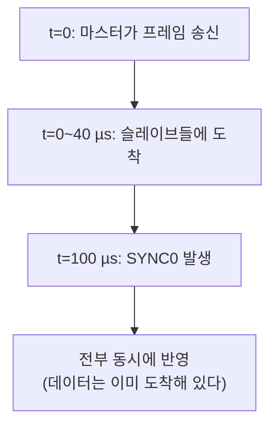

> **기준 출처:** [ETG EtherCAT Technology](https://www.ethercat.org/en/technology.html) · ESC 데이터시트 공개 사양(포트 수신 시각 래치 0x0900, 시스템 시각 오프셋 0x0920, 전파 지연 0x0928, SYNC 설정 0x0980) · [SOEM](https://github.com/OpenEtherCATsociety/SOEM) `ethercatdc.c` / 확인일 2026-08-03
> **시리즈:** [목차](/posts/00-comm-series/) | 이전 → [08. ESM](/posts/08-esm-state-machine/) | 다음 → [10. 프로세스 데이터와 PDO 매핑](/posts/10-process-data-pdo-mapping/)

## 1. 푸는 문제, 도착과 반영은 다르다

02편에서 예고했다. 프레임이 슬레이브들을 순서대로 지나가므로 슬레이브 1은 t=0에, 슬레이브 10은 t=10 µs에, 슬레이브 20은 t=20 µs에 데이터를 받는다. 각자 받자마자 출력에 반영하면 20 µs의 시차가 생긴다.

### 이게 왜 문제인가

6축 로봇이 협조 동작을 한다. 말단이 직선으로 움직이려면 축들이 정해진 관계로 동시에 움직여야 한다.

$$\text{축 1이 } \omega = 100\ \text{rad/s},\ 20\,\mu s \text{ 시차} \Rightarrow 0.002\ \text{rad} = 0.11°$$

링크 길이 0.5 m면 말단에서 약 1 mm다. 그리고 시차가 축마다 다르니 궤적이 왜곡된다.

[SPI 07편](/posts/07-spi-multislave-cs-daisy/)에서 본 문제와 완전히 같다. 6축 엔코더를 개별 CS로 읽으면 33 µs 시차가 생겨 순기구학이 왜곡된다고 했다. 규모만 커진 같은 문제다. SPI 07편의 답이 데이지 체인으로 동시 래치였다면 EtherCAT의 답이 DC다.

## 2. 발상, 데이터 도착과 동작 시점을 분리한다

각 슬레이브는 프레임이 도착하면 DPRAM에 저장만 하고 대기한다. 그리고 약속된 시각(예: t=100 µs)에 모두가 동시에 반영한다.

모든 슬레이브가 같은 시각을 알고 있어야 이게 가능하다. 그래서 분산 클록이다.

DC가 주는 것은 빠름이 아니라 동시성이다. [기초 10편](/posts/10-basics-realtime-jitter/)에서 말한 "제때 도착" 을 넘어 "동시에 반영" 이다.

## 3. 세 단계

기준 시계는 DC를 지원하는 첫 번째 슬레이브가 맡는다. 마스터가 아니다.

왜 마스터가 아닌가. 마스터는 PC이고 OS 지터가 있다. 슬레이브의 ESC는 하드웨어 카운터라 훨씬 안정적이다. 정확한 것을 기준으로 삼는 게 맞다. 시각 형식은 64비트 나노초이고 기준점은 2000-01-01이라 585년쯤 쓸 수 있다.

### 단계 ① 전파 지연 측정

각 슬레이브가 기준 시계에서 얼마나 멀리 있는지를 잰다. ESC의 각 포트는 프레임이 지나갈 때 자기 로컬 시각을 자동으로 래치한다(레지스터 0x0900 이후).

마스터가 브로드캐스트로 시각 래치 명령을 보내면 각 슬레이브가 프레임이 들어올 때와 되돌아 나갈 때의 시각을 기록한다. 마스터가 이 시각들을 전부 읽어오면 각 슬레이브의 왕복 시간이 나온다.

$$\text{RTT}_n = t_{n,\text{out}} - t_{n,\text{in}}$$

그리고 인접 슬레이브의 RTT 차이의 절반이 그 구간의 편도 지연이다.

$$\text{지연}(n \to n{+}1) = \frac{\text{RTT}_n - \text{RTT}_{n+1}}{2}$$

각 슬레이브가 자기 로컬 시계로 잰 시간차만 쓴다. 시계가 서로 안 맞아도 상관없다. 차이만 쓰기 때문이다. 영리한 설계다.

얻어지는 값은 케이블 지연(5 ns/m)과 PHY 지연과 ESC 처리 지연을 합한 것이고 슬레이브당 대략 수백 ns다. 이 값이 각 슬레이브의 전파 지연 레지스터(0x0928)에 기록된다.

### 단계 ② 오프셋 보정

각 슬레이브의 로컬 시계는 전원이 들어온 시각부터 세기 시작한다. 그래서 슬레이브마다 값이 완전히 다르다. 기준 시계가 1,000,000,000 ns일 때 150 ms 늦게 켜진 슬레이브는 850,000,000 ns이고 200 ms 먼저 켜진 슬레이브는 1,200,000,000 ns다.

마스터가 차이를 계산해서 각 슬레이브의 시스템 시각 오프셋 레지스터(0x0920)에 써 넣는다.

$$\text{시스템 시각} = \text{로컬 시계} + \text{오프셋} + \text{전파 지연}$$

전파 지연도 여기서 더한다. 그래야 기준 시계가 t일 때 나도 t가 된다. 멀리 있는 슬레이브는 신호가 늦게 오니 그만큼 미리 앞당겨 놓는 것이다. [시리얼 14편](/posts/14-encoder-biss-c/)의 BiSS-C 지연 보상과 같은 발상이다. 거리를 알면 보상할 수 있다.

### 단계 ③ 드리프트 보정

①②로 한 번 맞춰도 시계가 서로 어긋난다. 각 ESC의 발진자가 조금씩 다르기 때문이다. 크리스탈 ±25 ppm 두 개의 상대 오차가 50 ppm이면 1초에 50 µs, 1분에 3 ms 어긋난다. 보정을 안 하면 금방 무너진다.

그래서 매 사이클 또는 몇 사이클마다 계속 맞춘다. 마스터가 ARMW(Auto-increment Read Multiple Write) Datagram을 보내면, 기준 시계 슬레이브가 자기 시스템 시각을 프레임에 써 넣고(읽기), 나머지 슬레이브들이 그 값을 읽어 자기 시각과 비교한다(쓰기). 그리고 각 ESC가 자기 클럭 속도를 미세 조정한다.

여기가 이 편에서 가장 흥미로운 부분이다. ESC는 시각을 강제로 덮어쓰지 않는다. 그러면 시간이 점프해서 위험하다. 대신 로컬 클럭의 진행 속도를 조금씩 빠르게 하거나 느리게 해서 서서히 수렴시킨다.

이건 제어 루프다. 오차(기준 시각에서 내 시각을 뺀 값)를 입력으로 받아 클럭 속도를 조정하는 피드백 제어기가 ESC 안에 하드웨어로 들어 있다.

그래서 DC가 잡히는 데 시간이 걸린다. 부팅 직후에는 오차가 크고 수백에서 수천 사이클에 걸쳐 수렴한다. 08편에서 SAFEOP에서 DC가 잡혔는지 확인하라고 한 이유다.

## 4. SYNC0과 SYNC1

시각을 맞춘 것만으로는 부족하다. 그 시각에 실제로 무언가가 일어나야 한다. ESC는 정해진 시각에 하드웨어 펄스를 출력한다.

SYNC0에 시작 시각(64비트 절대)과 주기(예: 1,000,000 ns = 1 ms)를 설정하면 ESC가 매 1 ms마다 SYNC0 핀에 펄스를 낸다. 슬레이브 MCU가 이 펄스로 인터럽트를 받아 출력을 반영하고 입력을 래치한다.

| 신호 | 용도 |
| --- | --- |
| SYNC0 | 주 동기 신호, 대개 출력 반영 |
| SYNC1 | 보조, 입력 래치를 SYNC0보다 조금 앞당길 때 |

모든 슬레이브의 SYNC0이 같은 절대 시각에 나온다. 시계가 맞았기 때문이다. 이게 동시성의 실체다. 공개 자료가 밝히는 동기 정확도는 1 µs 이하이고 실제 측정에서는 훨씬 좋은 경우가 많다.

### Shift Time



SYNC0 시각을 프레임 도착보다 충분히 뒤로 잡아야 한다. 이 여유를 shift time이라 한다.

shift가 너무 작으면 프레임이 아직 안 도착한 슬레이브가 옛날 값으로 SYNC0을 처리한다. 한 주기 지연되고 축마다 다르게 지연될 수 있다. shift가 너무 크면 지연이 늘어난다.

적정값은 최악 프레임 도착 시간에 마스터 지터와 여유를 더한 것이다. 02편에서 계산한 네트워크 왕복(예: 41 µs)에 마스터 지터를 더해 정한다.

## 5. SOEM에서

```cpp
// ① 설정 (PREOP 또는 SAFEOP 전에)
ec_configdc();                       // 전파 지연 측정 + 오프셋 계산

// ② 각 슬레이브에 SYNC0 설정 (사이클 1 ms, shift 500 µs)
for (int i = 1; i <= ec_slavecount; ++i) {
    if (ec_slave[i].hasdc)
        ec_dcsync0(i, TRUE, 1'000'000, 500'000);   // 주기 ns, shift ns
}

// ③ 마스터도 DC 에 맞춰야 한다. 사이클을 DC 시각에 정렬
//    ec_DCtime 이 기준 시계의 현재 시각이다
std::int64_t compute_sleep_ns(std::int64_t cycle_ns, std::int64_t shift_ns) {
    std::int64_t delta = (ec_DCtime - shift_ns) % cycle_ns;
    if (delta > cycle_ns / 2) delta -= cycle_ns;
    // 간단한 비례 제어기. 마스터 주기를 DC 에 맞춰 서서히 당기고 민다
    return cycle_ns - delta / 10;
}

void cyclic_loop() {
    while (running_) {
        ec_send_processdata();
        ec_receive_processdata(EC_TIMEOUTRET);
        // ...제어 연산...
        const auto sleep_ns = compute_sleep_ns(1'000'000, 500'000);
        sleep_until_ns(next_wakeup_ += sleep_ns);
    }
}
```

③이 자주 빠뜨리는 부분이다. 슬레이브끼리는 DC로 맞았는데 마스터가 자기 타이머로 돌면 프레임 전송 시각이 DC 기준으로 흔들린다. 그러면 shift 여유를 다 소비한다.

마스터가 DC 시각을 보고 자기 주기를 조정해야 한다. 위 `compute_sleep_ns()` 가 그 역할인데 이것도 제어기다. 오차 `delta` 를 보고 다음 주기 길이를 조정하고 `/10` 이 비례 게인이다. 게인이 크면 빨리 수렴하지만 흔들리고 작으면 느리다. 관측기 대역폭을 고를 때와 같은 맞교환이다.

## 6. DC가 안 잡힐 때

| 증상 | 원인 |
| --- | --- |
| AL Status Code `0x0030` (DC 동기 실패) | DC가 수렴 안 됨 |
| `0x002C` 또는 `0x002D` (DC 설정 무효) | SYNC0 주기나 shift 설정 오류 |
| 부팅 직후에만 실패 | 수렴 시간을 안 준 것. SAFEOP에서 몇백 사이클 실행한 뒤 OP로 |
| 가끔 동기가 깨진다 | 마스터 사이클 지터. shift를 넘었다 |
| 특정 슬레이브만 실패 | 그 슬레이브가 DC 미지원(`hasdc` 확인)이거나 설정 누락 |
| 시간이 지나면 어긋난다 | 드리프트 보정이 안 돌고 있다. ARMW Datagram 확인 |

DC 오차를 직접 볼 수 있다. 각 슬레이브의 시스템 시각 차이 레지스터(0x092C)를 읽으면 기준 시계와의 편차가 나온다. 이걸 주기적으로 로깅하면 수렴 과정과 안정성을 눈으로 확인할 수 있다.

```cpp
std::int32_t read_dc_error_ns(int slave) {
    std::int32_t diff{};
    int size = sizeof(diff);
    ec_FPRD(ec_slave[slave].configadr, 0x092C, size, &diff, EC_TIMEOUTRET);
    return diff;   // 이 값이 작고 안정적이어야 한다
}
```

## 7. DC를 꼭 써야 하나

| 상황 | DC |
| --- | --- |
| 다축 협조 동작 (로봇 궤적) | 필수 |
| 정밀 측정 (여러 지점 동시 샘플링) | 필수 |
| 단순 I/O (디지털 입출력) | 불필요 |
| 축 하나만 | 불필요. 있으면 지터가 줄지만 |
| CSP 모드 다축 | 필수 |

DC는 공짜가 아니다. 설정이 복잡하고 수렴 시간이 필요하고 마스터 사이클을 DC에 맞춰야 하고 실패하면 OP에 못 간다. 필요한 곳에만 켠다. SOEM에서 슬레이브별로 켜고 끌 수 있다.

## 정리

- DC가 푸는 문제는 도착과 반영의 분리다. 프레임은 순서대로 도착하지만 동작은 동시에 한다
- 20 µs 시차는 100 rad/s 축에서 0.11°, 말단에서 약 1 mm다. 축마다 달라 궤적이 왜곡된다
- SPI 데이지 체인 동시 래치와 같은 문제를 큰 규모로 푼 것이다
- 기준 시계는 마스터가 아니라 DC 지원 첫 슬레이브다. 하드웨어 카운터가 PC보다 안정적이다
- 세 단계: 전파 지연 측정(RTT 차이의 절반, 시계가 안 맞아도 차이만 쓰니 문제없다), 오프셋 보정(로컬 시계 + 오프셋 + 전파 지연), 드리프트 보정
- 드리프트 보정은 시각을 덮어쓰지 않고 클럭 속도를 조정하는 하드웨어 피드백 제어기다
- 크리스탈 50 ppm 차이면 1분에 3 ms 어긋나므로 지속적 보정이 필수다
- SYNC0이 동시성의 실체다. 모든 슬레이브가 같은 절대 시각에 하드웨어 펄스를 내고 정확도는 1 µs 이하다
- Shift time은 프레임 도착 여유다. 너무 작으면 옛 값으로 동작하고 너무 크면 지연이 는다
- 마스터도 DC에 맞춰 자기 주기를 조정해야 한다. 이것도 비례 제어기다
- 0x092C(시스템 시각 차이)를 로깅하면 수렴과 안정성이 눈에 보인다
- DC는 공짜가 아니다. 다축 협조와 CSP에는 필수이고 단순 I/O에는 불필요하다

## 참고

- [ETG — EtherCAT Technology](https://www.ethercat.org/en/technology.html)
- [SOEM — Simple Open EtherCAT Master](https://github.com/OpenEtherCATsociety/SOEM)
